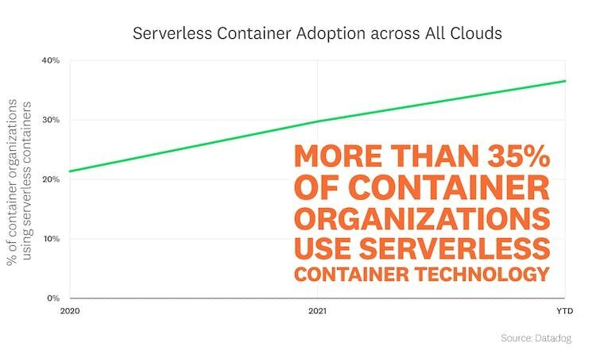
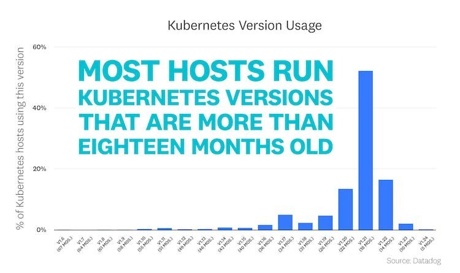
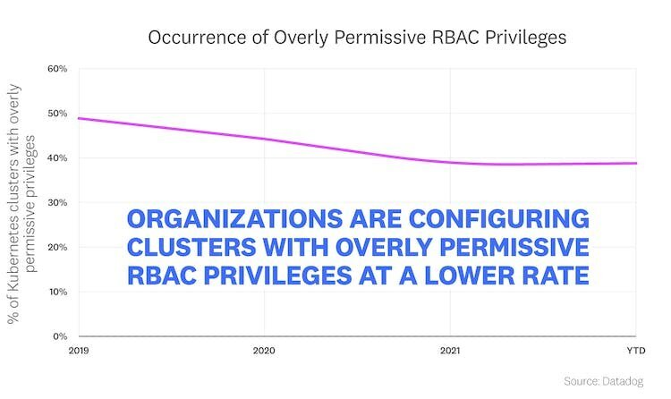
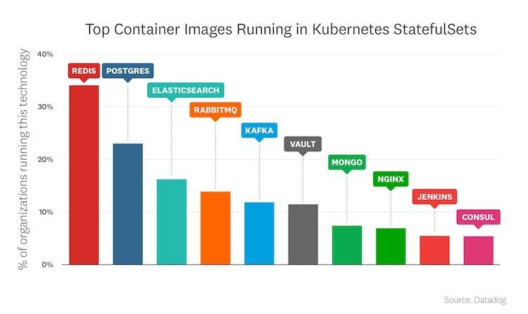

这项研究建立在 Datadog 以前版本的[容器使用报告](https://www.datadoghq.com/container-report-2021/)、[容器编排报告](https://www.datadoghq.com/container-orchestration-2018/)和[Docker 研究报告](https://www.datadoghq.com/docker-adoption/)的基础上。最新更新于 2022 年 11 月。译自：<https://www.datadoghq.com/container-report/>。

现代工程团队继续扩展他们对容器的使用，如今基于容器的微服务应用程序无处不在。不断增长的容器使用正在推动组织采用互补技术来简化他们操作集群的方式，而这种不断扩展的容器环境给组织带来了安全挑战。

**在本报告中，我们检查了数万 Datadog 客户**运行的超过**15 亿个容器**，以了解容器生态系统的状态。继续阅读，了解从最新的实际使用数据中收集的更多见解和趋势。

> “这项调查表明，容器和 Kubernetes 革命正在不断发展壮大。结果揭示了使用容器和 Kubernetes 的云原生组织不仅发展得更快，而且获得了更大的信心——在比以往任何时候都更关键的生产环境中构建和部署更大型的应用程序和工作负载。
>
> 得益于云原生生态系统中超过 175,000 名贡献者所推动的创新，云原生组织已为前进的道路做好了准备。他们正在创造可以让各种规模的工程团队都可以构建和运行应用程序的技术，以满足当今应用程序的需求。”
>
> — Priyanka Sharma，云原生计算基金会执行董事

## 趋势 1：Kubernetes 继续成为最受欢迎的容器管理系统

Kubernetes 比以往任何时候都更受欢迎。如今，近一半的容器组织运行 Kubernetes 来在不断发展的生态系统中部署和管理容器。Amazon Elastic Kubernetes Services (Amazon EKS) Blueprints 和 Amazon EKS Anywhere 等工具以及其他托管 Kubernetes 服务使团队可以轻松地在云中和本地运行 Kubernetes 集群。

> “在 AWS，我们致力于为客户提供简化的 Kubernetes 体验，以便他们可以轻松管理和扩展集群，同时受益于完全托管的 AWS 服务的安全性和弹性。Amazon EKS Blueprints 和 Amazon EKS Anywhere 等新功能使客户能够更快、更轻松地跨 AWS 和本地环境配置和部署 Kubernetes 集群，因此他们可以在任何需要的地方获得相同、一致的 Amazon EKS 体验，以最好地支持他们的应用程序和最终用户。”
>
> — Barry Cooks，Amazon Web Services Kubernetes 副总裁

## 趋势 2：无服务器容器技术在所有主要公共云中继续流行

所有主要云提供商（包括 AWS App Runner、AWS Fargate、Azure Container Apps、Azure Container Instances (ACI) 和 Google Cloud Run）对无服务器容器技术的使用率从 2020 年的 21% 增加到 2022 年的 36%（年初至今）。这与我们在之前的研究中看到的增长相呼应，其中包括 Amazon ECS 用户转向 AWS Fargate。

客户将减少配置和管理底层基础设施的需求列为容器采用无服务器技术的主要原因之一。那些不使用无服务器技术的客户更喜欢从管理自己的基础架构中获得的控制力和灵活性。

## 趋势 3：多个云提供商的使用随着组织规模的增加而增加

我们的数据显示，超过 30% 的使用 1,000 台或更多主机的容器组织在多个云中工作，并且组织运行的容器越少，多云使用率最低。此外，我们发现多云组织平均拥有比单云组织更多的容器。

## 趋势 4：Kubernetes Ingress 使用率正在上升

为了大规模管理来自集群外部的请求，管理员经常使用 Ingress 来配置到集群中多个服务的路由。如今，超过 35% 的组织使用 Ingress，自 2020 年 8 月 Kubernetes 1.19 版本发布以来，Ingress 已经普遍可用。

随着我们的客户操作更多的集群和 Pod，他们在路由和网络管理方面面临着越来越复杂的问题。许多 Kubernetes 的早期采用者使用云提供的负载均衡器将流量路由到他们的服务。但 Ingress 通常更具成本效益，并且自发布以来其采用率稳步提高。

[Kubernetes Gateway API](https://gateway-api.sigs.k8s.io/)（于 2022 年 7 月完成测试版）是容器网络管理发展的下一步。Gateway API 提供高级网络功能，包括使用自定义资源和使用 API 资源对组织角色建模的面向角色的设计。我们期待看到 Gateway API 是否会取代 Ingress，或者这两种技术是否并排使用。

## 趋势 5：服务网格仍处于早期阶段，Istio 主导使用

服务网格提供服务发现、负载均衡、超时和重试，并允许管理员管理集群的安全性并监控其性能。我们之前的研究说明了服务网格的早期采用，我们看到的初始模式基本上没有变化。在我们的客户中，我们主要看到 Istio 和 Linkerd，其中 Istio 的受欢迎程度是 Linkerd 的三倍多。

>  “服务网格已经证明了为企业中的流量提供一致的安全性、可观测性和控制的价值。Istio 已明确将自己确立为领先的网格解决方案，我为社区为实现这一目标所做的工作感到自豪。最近完成的对 CNCF 的 Istio 捐赠将在这一成功的基础上发展壮大我们的社区。”
>
> ——Louis Ryan，Istio 的联合创始人兼谷歌首席工程师

## 趋势 6：大多数主机使用超过 18 个月的 Kubernetes 版本

Kubernetes 每年发布三个新版本，为用户提供新功能、安全改进和错误修复。我们在之前的研究中看到，用户通常更愿意等待一年多才能采用这些新版本。我们从轶事中了解到，一些客户延迟的原因是为了确保他们的集群的稳定性和与 API 版本的兼容性。如今，使用最多的版本是 v1.21，它于 2021 年 4 月发布，并于今年早些时候正式过了生命周期终结日。

## 趋势 7：超过 30% 的运行 containerd 的主机使用不受支持的版本

先前的研究表明 containerd 的使用有所增加，这是组织可以采用的符合 CRI 的运行时之一，因为 Dockershim 正在被弃用。我们发现只有大约 69% 的 containerd 主机使用的是 1.5 或 1.6 版本，这是积极支持的版本。值得注意的是，大约 31% 的 containerd 主机正在使用 1.4 或更早的版本，这些版本已经过了生命周期的终结日。

运行较旧的软件版本会带来有关安全性和合规性的问题，并且在容器运行时的情况下，会带来容器逃逸等漏洞的风险。许多主机使用不受支持的容器运行时版本这一事实凸显了组织在运行适当的工具以维护容器安全性和合规性方面面临的挑战。无服务器容器技术降低了过时运行时的风险和手动更新的负担，这可能是我们看到所有云都转向无服务器容器的原因之一。

## 趋势 8：访问管理正在改进，但仍然是一个挑战

Kubernetes 管理员使用基于角色的访问控制 (RBAC) 来允许主体（用户、组或服务账户）访问或修改集群中的资源。根据安全最佳实践，主体应该只有必要的权限，并且管理员在授予与升级风险相关的 RBAC 权限时必须谨慎。其中包括允许主体列出所有机密或创建工作负载、证书或令牌请求的权限，这些请求可以允许他们修改自己的权限。

好消息是，随着组织部署更多集群，这些集群中使用过度宽松特权的百分比正在下降。我们怀疑随着组织采用权限审计等安全实践和自动化 RBAC 扫描仪等工具，这一数字正在下降。但是，我们发现大约 40% 的集群仍然使用宽松的权限，这会带来安全风险。

## 趋势 9：NGINX、Redis 和 Postgres 再次成为最受欢迎的容器镜像

截至 2022 年 9 月，最流行的现成容器镜像是：

1. NGINX：这又是最流行的容器镜像。NGINX 为近 50% 的使用容器的组织提供缓存、负载平衡和代理功能。
2. Redis：组织可以在容器中部署 Redis，用作键值数据存储、缓存或消息代理。
3. Postgres：这个关系数据库的使用比去年略有增长。
4. Elasticsearch：这个高性能的文档存储和搜索引擎仍然是最流行的镜像之一。
5. Kafka：组织可以通过在容器中部署 Kafka 轻松地将事件流功能添加到应用程序中。
6. RabbitMQ：RabbitMQ 在基于微服务的应用程序中支持解耦架构。
7. MongoDB：MongoDB 仍然是最流行的 NoSQL 数据库之一。
8. MySQL：这个开源数据库的排名比以前低。但是 MySQL 的性能和可扩展性使其在最流行的容器镜像列表中持续占有一席之地。
9. Calico：Calico 是一个网络提供商，让管理员可以管理其 Kubernetes 集群内网络的安全性。
10. GitLab：为了帮助团队采用和维护 DevOps 实践，GitLab 提供了存储库管理、问题跟踪和 CI/CD 管道。
11. Vault：团队可以使用 Vault 来简化机密管理并帮助维护安全的应用程序。

在 Kubernetes StatefulSets 中，我们发现 Redis、Postgres、Elasticsearch、RabbitMQ 和 Kafka 是最常部署的镜像。

