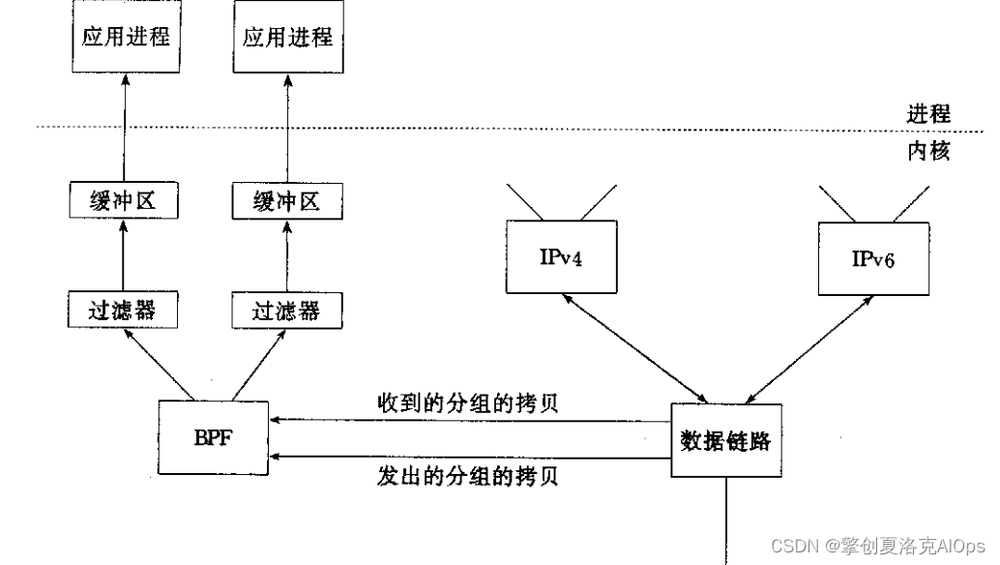
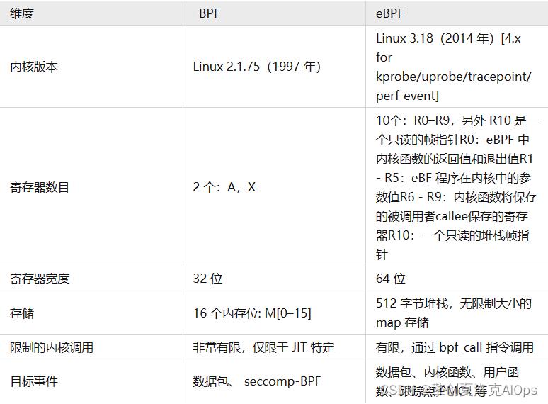
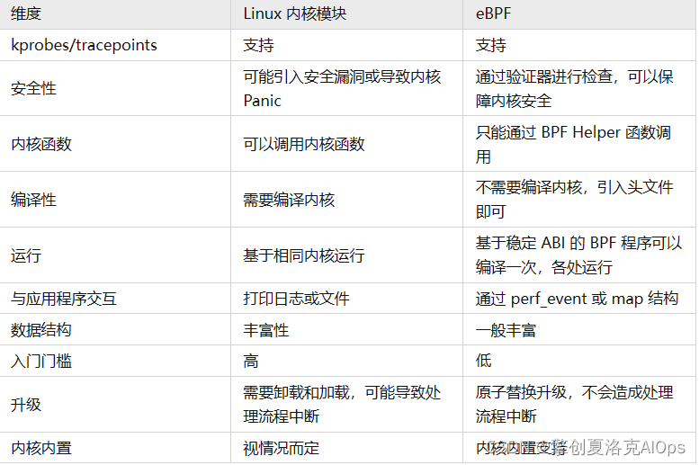
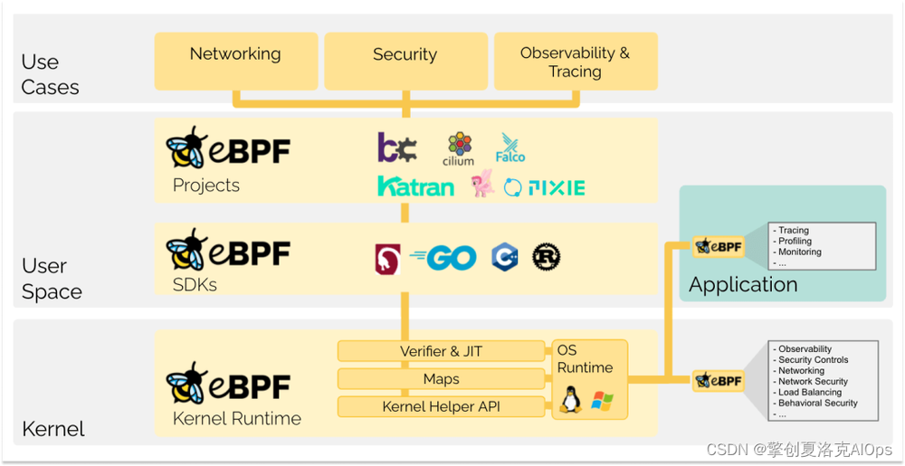
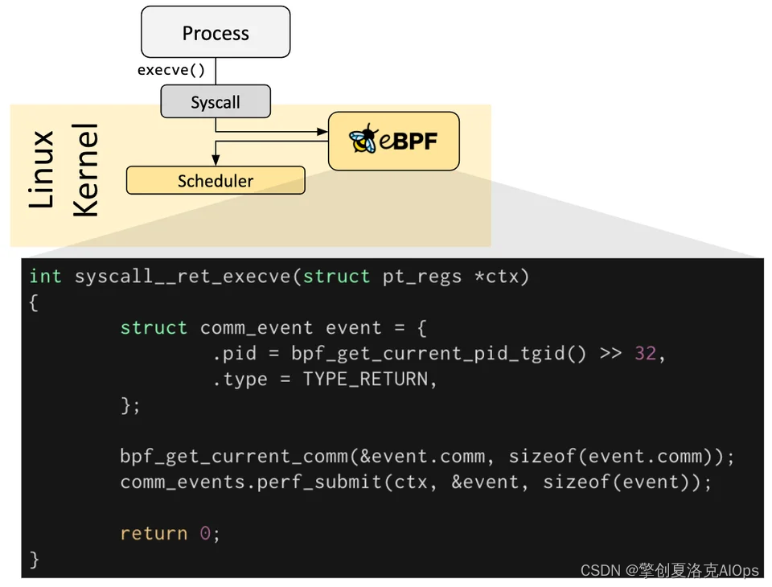
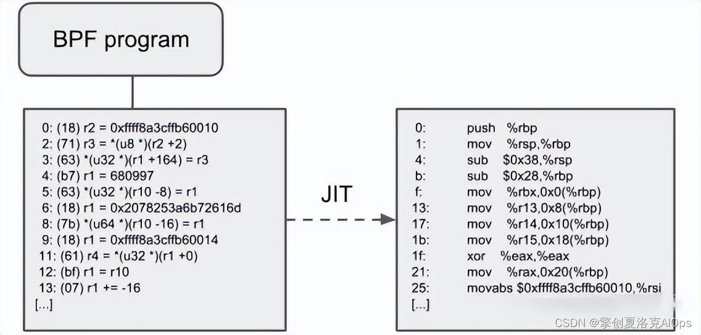

今天跟大家分享的 eBPF（extended Berkeley Packet Filter），相信很多技术人员已经很熟悉了。作为 Linux 社区的新宠，它备受 Goole、Facebook、Twitter 等大公司的青睐。

## eBPF 究竟有什么魔力让大家这么关注

这是因为 eBPF 增加了内核的可扩展性，让内核变得更加灵活和强大。如果大家玩过乐高积木的话就会深有体会，乐高积木就是通过不断向主体添加积木来组合出更庞大的模型。而 eBPF 就像乐高积木一样，可以不断向内核添加 eBPF 模块来增强内核的功能。

## 什么是 eBPF

在介绍 eBPF (Extended Berkeley Packet Filter) 之前，我们先来了解一下它的前身－BPF (Berkeley Packet Filter) 伯克利数据包过滤器。

BPF 最早由 Van Jacobson 在 1992 年开发，用于在 Unix 操作系统中过滤和捕获网络数据包。它运行在内核中，通过提供一个简单而强大的虚拟机，可以在网络协议层上进行高效的数据包处理操作。BPF 通过把过程转换成指令序列来实现，这些指令直接在内核中执行，从而避免了用户空间和内核空间之间频繁的切换。

## 基于 BPF 开发的工具库有 libpcap、tcpdump 等工具。

BPF 在网络性能监测和安全策略实施方面具有广泛的应用。然而，由于其指令集的限制和功能的局限性，它无法支持更加复杂和灵活的数据包处理需求。

正是为了克服 BPF 的限制，eBPF 应运而生。eBPF 于 2014 年（3.18 版本）年首次引入 Linux 内核，并在此后的几年中经历了快速的发展和完善。

eBPF 是一个高度可扩展的、运行在内核中的虚拟机，具备与传统 BPF 相似的指令集，但功能更加强大且更加灵活。eBPF 可以在运行时即时编译，从而能够处理更加复杂和动态的数据包处理任务，如网络流量分析、安全检测和性能优化等。

eBPF 的灵活性和可扩展性体现在它可以与各种用户空间程序（如 tcpdump、Wireshark、Suricata 等）和工具（如网络监控、调试器等) 无缝集成。

eBPF 还可以与系统的其他组件（如网络协议栈、调度器等）交互，从而实现更加细粒度的性能优化和安全策略。

此外，eBPF 的开发和使用也得到了广泛的支持和推动。社区中有许多致力于 eBPF 的开发者和贡献者，他们不断改进和扩展 eBPF 的功能。同时，一些知名的大型技术公司，如 Facebook、Netflix 和 Google 等，也在其产品和基础设施中广泛使用 eBPF。

## eBPF 的发展史

2014 年初，Alexei Starovoitov 实现了 eBPF。新的设计针对现代硬件进行了优化，所以 eBPF 生成的指令集比旧的 BPF 解释器生成的机器码执行得更快。扩展版本也增加了虚拟机中的寄存器数量，将原有的 2 个 32 位寄存器增加到 10 个 64 位寄存器。

由于寄存器数量和宽度的增加，开发人员可以使用函数参数自由交换更多的信息，编写更复杂的程序。总之，这些改进使 eBPF 版本的速度比原来的 BPF 提高了 4 倍。

eBPF 是一项具有革命性的技术，源自于 Linux 内核，可以在特权环境中运行受沙盒保护的程序，例如操作系统内核。它被用于安全有效地扩展内核的功能，而无需更改内核源代码或加载内核模块。

在历史上，操作系统一直是实现可观察性、安全性和网络功能的理想场所，这是因为内核具有特权能力，可以监督和控制整个系统。与此同时，由于内核在系统中的核心地位以及对稳定性和安全性的高要求，操作系统内核的演进往往很困难。因此，与操作系统外部实现的功能相比，操作系统层面的创新速度传统上较低。

eBPF 从根本上改变了这个现象。通过在操作系统内运行受沙盒保护的程序，应用开发人员可以在运行时运行 eBPF 程序，为操作系统添加额外的功能。操作系统会利用即时编译器和验证引擎的帮助来保证安全性和执行效率，就像本地编译一样。这导致了一系列基于 eBPF 的项目的涌现，涵盖了各种用例，包括下一代网络、可观测性和安全功能。

## eBPF 应用场景

如今，eBPF 被广泛应用于驱动各种用例：在现代数据中心和云原生环境中提供高性能的网络和负载均衡；

以低开销提取细粒度的安全可观测性数据，帮助应用开发人员追踪应用程序、提供性能故障排除的见解，进行预防性应用程序和容器运行时安全执行等等。

可能性是无限的，eBPF 正在释放出的创新力量才刚刚开始。

## eBPF 特性

### Hook Overview

eBPF 程序都是事件驱动的，它们会在内核或者应用程序经过某个确定的 Hook 点的时候运行，这些 Hook 点都是提前定义的，包括系统调用、函数进入/退出、内核 tracepoints、网络事件等。

### Verification

With great power there must also come great responsibility.

每一个 eBPF 程序加载到内核都要经过 Verification，用来保证 eBPF 程序的安全性，主要包括：

要保证加载 eBPF 程序的进程有必要的特权级，除非节点开启了 unpriviledged 特性，只有特权级的程序才能够加载 eBPF 程序。

1. 内核提供了一个配置项 /proc/sys/kernel/unprivileged_bpf_disabled 来禁止非特权用户使用 bpf(2) 系统调用，可以通过 sysctl 命令修改
2. 比较特殊的一点是，这个配置项特意设计为一次性开关（one-time kill switch），这意味着一旦将它设为 1，就没有办法再改为 0 了，除非重启内核
3. 一旦设置为 1 之后，只有初始命名空间中有 CAP_SYS_ADMIN 特权的进程才可以调用 bpf(2) 系统调用。Cilium 启动后也会将这个配置项设为 1：

> $ echo 1 > /proc/sys/kernel/unprivileged_bpf_disabled

要保证 eBPF 程序不会崩溃或者使得系统出故障。

要保证 eBPF 程序不能陷入死循环，能够 runs to completion。

要保证 eBPF 程序必须满足系统要求的大小，过大的 eBPF 程序不允许被加载进内核。

要保证 eBPF 程序的复杂度有限，Verifier 将会评估 eBPF 程序所有可能的执行路径，必须能够在有限时间内完成 eBPF 程序复杂度分析。

### JIT Compilation

Just-In-Time（JIT）编译用来将通用的 eBPF 字节码翻译成与机器相关的指令集，从而极大加速 BPF 程序的执行：

 - 与解释器相比，它们可以降低每个指令的开销。通常指令可以 1:1 映射到底层架构的原生指令。
 - 这也会减少生成的可执行镜像的大小，因此对 CPU 的指令缓存更友好。
 - 特别地，对于 CISC 指令集（例如 x86），JIT 做了很多特殊优化，目的是为给定的指令产生可能的最短操作码，以降低程序翻译过程所需的空间。

64 位的 x86_64、arm64、ppc64、s390x、mips64、sparc64 和 32 位的 arm、x86_32 架构都内置了 in-kernel eBPF JIT 编译器，它们的功能都是一样的，可以用如下方式打开：

> $ echo 1 > /proc/sys/net/core/bpf_jit_enable

32 位的 mips、ppc 和 sparc 架构目前内置的是一个 cBPF JIT 编译器。这些只有 cBPF JIT 编译器的架构，以及那些甚至完全没有 BPF JIT 编译器的架构，需要通过内核中的解释器（in-kernel interpreter）执行 eBPF 程序。

要判断哪些平台支持 eBPF JIT，可以在内核源文件中 grep HAVE_EBPF_JIT：

好啦，本期关于运维可观测工具 eBPF 的分享到这里就告一段落了，下期我们再来讲讲 eBPF 在实际使用中遇到的问题。感兴趣的朋友可以关注一下~
