在 Kubernetes 称为容器编排的标准之后，Service Mesh 开始火了起来，但是很多文章讲概念的多，讲技术细节的少，所以专门写一篇文章，来解析 Service Mesh 背后的技术细节。

**一、Service Mesh 是 Kubernetes 支撑微服务能力拼图的最后一块**

在上一篇文章[为什么 kubernetes 天然适合微服务](http://mp.weixin.qq.com/s?__biz=MzI1NzYzODk4OQ==&mid=2247484871&idx=1&sn=4c40df039911e7ef7d355c1435271eb0&chksm=ea1512e5dd629bf368bae145c6c42ad89f260c529d0eb006779768c6f124e0318b653d2d1821&scene=21#wechat_redirect)中我们提到，Kubernetes 是一个奇葩所在，他的组件复杂，概念复杂，在没有实施微服务之前，你可能会觉得为什么 Kubernetes 要设计的这么复杂，但是一旦你要实施微服务，你会发现 Kubernetes 中的所有概念，都是有用的。

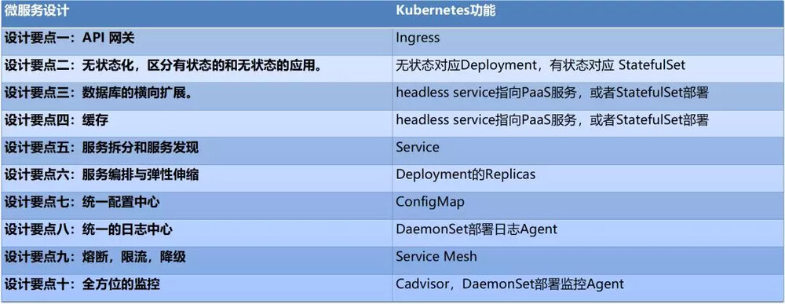

在我们微服务设计的十个要点中，我们会发现 Kubernetes 都能够有相应的组件和概念，提供相应的支持。

其中最后的一块拼图就是服务发现，与熔断限流降级。

众所周知，Kubernetes 的服务发现是通过 Service 来实现的，服务之间的转发是通过 kube-proxy 下发 iptables 规则来实现的，这个只能实现最基本的服务发现和转发能力，不能满足高并发应用下的高级的服务特性，比较 SpringCloud 和 Dubbo 有一定的差距，于是 Service Mesh 诞生了，他期望讲熔断，限流，降级等特性，从应用层，下沉到基础设施层去实现，从而使得 Kubernetes 和容器全面接管微服务。

**二、以 Istio 为例讲述 Service Mesh 中的技术关键点**

就如 SDN 一样，Service Mesh 将服务请求的转发分为控制面和数据面，因而分析他，也是从数据面先分析转发的能力，然后再分析控制面如何下发命令。今天这篇文章重点讲述两个组件 Envoy 和 Pilot

**一切从 Envoy 开始**

我们首先来看，如果没有融入 Service Mesh，Envoy 本身能够做什么事情呢？

Envoy 是一个高性能的 C++写的 proxy 转发器，那 Envoy 如何转发请求呢？需要定一些规则，然后按照这些规则进行转发。

规则可以是静态的，放在配置文件中的，启动的时候加载，要想重新加载，一般需要重新启动，但是 Envoy 支持热加载和热重启，一定程度上缓解了这个问题。

当然最好的方式是规则设置为动态的，放在统一的地方维护，这个统一的地方在 Envoy 眼中看来称为 Discovery Service，过一段时间去这里拿一下配置，就修改了转发策略。

无论是静态的，还是动态的，在配置里面往往会配置四个东西。

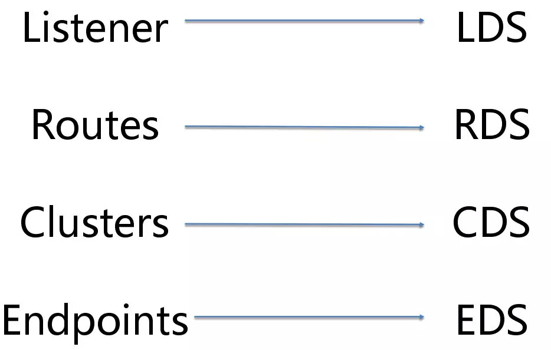

一是 listener，也即 envoy 既然是 proxy，专门做转发，就得监听一个端口，接入请求，然后才能够根据策略转发，这个监听的端口称为 listener

二是 endpoint，是目标的 ip 地址和端口，这个是 proxy 最终将请求转发到的地方。

三是 cluster，一个 cluster 是具有完全相同行为的多个 endpoint，也即如果有三个容器在运行，就会有三个 IP 和端口，但是部署的是完全相同的三个服务，他们组成一个 Cluster，从 cluster 到 endpoint 的过程称为负载均衡，可以轮询等。

四是 route，有时候多个 cluster 具有类似的功能，但是是不同的版本号，可以通过 route 规则，选择将请求路由到某一个版本号，也即某一个 cluster。

这四个的静态配置的例子如下：

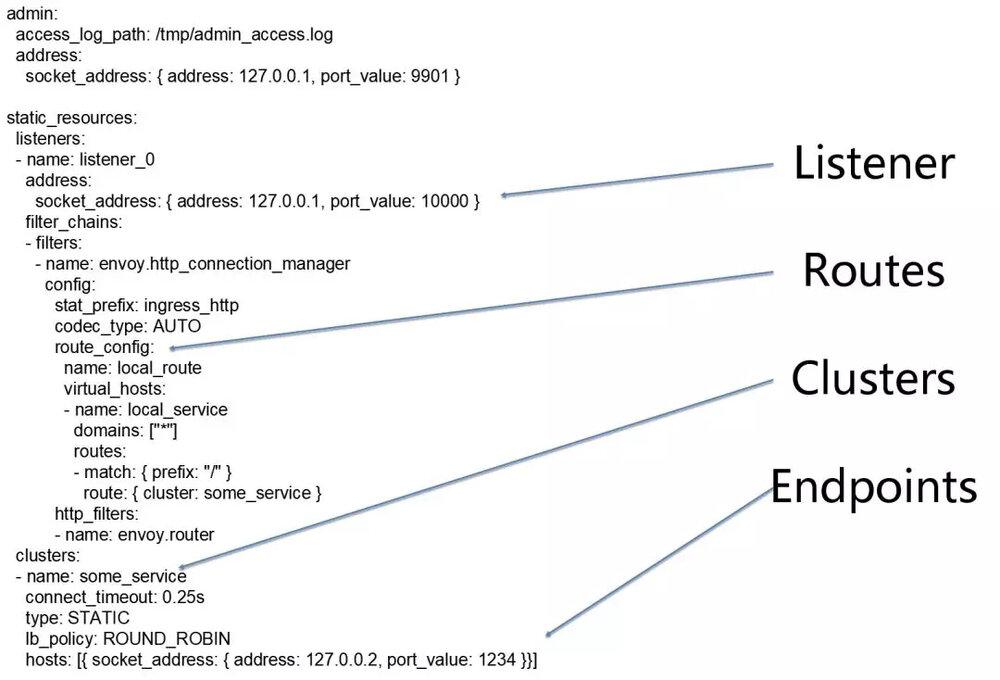

如图所示，listener 被配置为监听本地 127.0.0.1 的 10000 接口，route 配置为某个 url 的前缀转发到哪个 cluster，cluster 里面配置负载均衡策略，hosts 里面是所有的 endpoint。

如果你想简单的将 envoy 使用起来，不用什么 service mesh，一个进程，加上这个配置文件，就可以了，就能够转发请求了。

对于动态配置，也应该配置发现中心，也即 Discovery Service，对于上述四种配置，各对应相应的 DS，所以有 LDS, RDS, CDS, EDS。

动态配置的例子如下：

**控制面 Pilot 的工作模式**

数据面 envoy 可以通过加装静态配置文件的方式运行，而动态信息，需要从 Discovery Service 去拿。

Discovery Service 就是部署在控制面的，在 istio 中，是 Pilot。

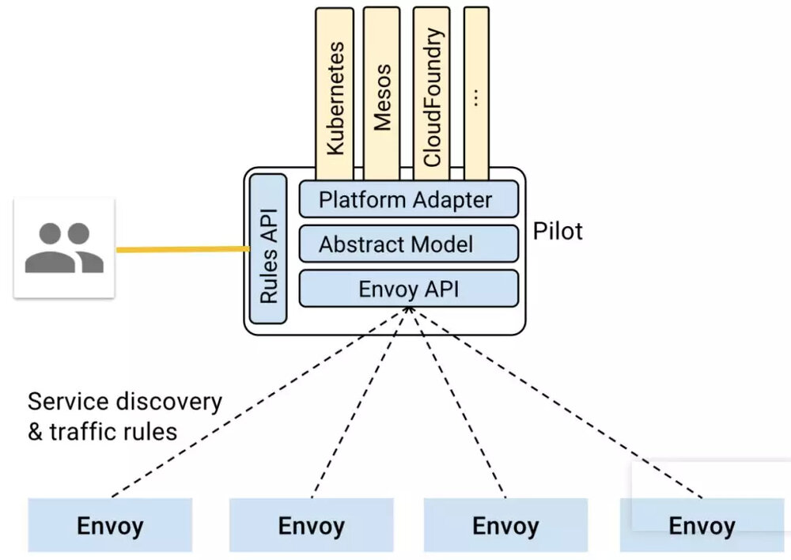

如图为 Pilot 的架构，最下面一层是 envoy 的 API，就是提供 Discovery Service 的 API，这个 API 的规则由 envoy 定，但不是 Pilot 调用 Envoy，而是 Envoy 去主动调用 Pilot 的这个 API。

Pilot 最上面一层称为 Platform Adapter，这一层是干什么的呢？这一层不是 Kubernetes, Mesos 调用 Pilot，而是 Pilot 通过调用 Kubernetes 来发现服务之间的关系。

这是理解 Istio 比较绕的一个点。也即 pilot 使用 Kubernetes 的 Service，仅仅使用它的服务发现功能，而不使用它的转发功能，pilot 通过在 kubernetes 里面注册一个 controller 来监听事件，从而获取 Service 和 Kubernetes 的 Endpoint 以及 Pod 的关系，但是在转发层面，就不会再使用 kube-proxy 根据 service 下发的 iptables 规则进行转发了，而是将这些映射关系转换成为 pilot 自己的转发模型，下发到 envoy 进行转发，envoy 不会使用 kube-proxy 的那些 iptables 规则。这样就把控制面和数据面彻底分离开来，服务之间的相互关系是管理面的事情，不要和真正的转发绑定在一起，而是绕到 pilot 后方。

Pilot 另外一个对外的接口是 Rules API，这是给管理员的接口，管理员通过这个接口设定一些规则，这些规则往往是应用于 Routes, Clusters, Endpoints 的，而都有哪些 Clusters 和 Endpoints，是由 Platform Adapter 这面通过服务发现得到的。

自动发现的这些 Clusters 和 Endpoints，外加管理员设置的规则，形成了 Pilot 的数据模型，其实就是他自己定义的一系列数据结构，然后通过 envoy API 暴露出去，等待 envoy 去拉取这些规则。

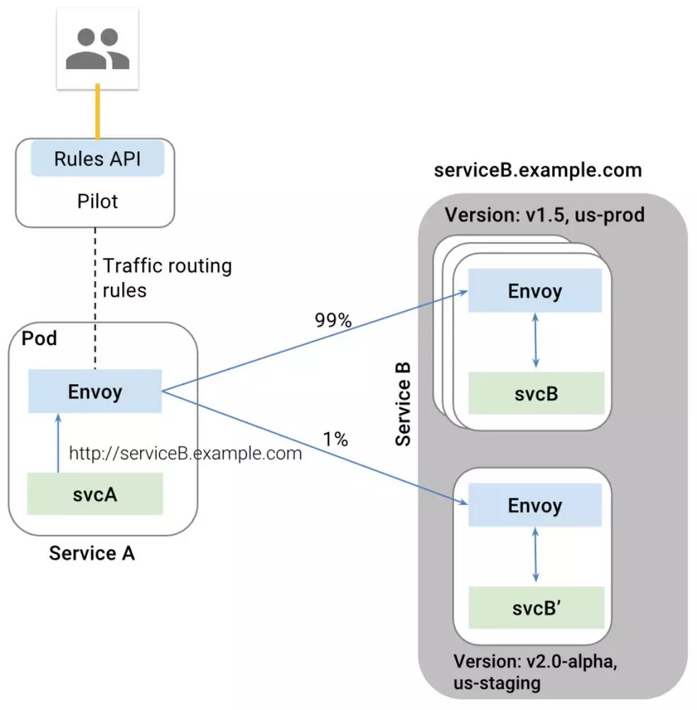

常见的一种人工规则是 Routes，通过服务发现，Pilot 可以从 Kubernetes 那里知道 Service B 有两个版本，一般是两个 Deployment，属于同一个 Service，管理员通过调用 Pilot 的 Rules API，来设置两个版本之间的 Route 规则，一个占 99% 的流量，一个占 1% 的流量，这两方面信息形成 Pilot 的数据结构模型，然后通过 Envoy API 下发，Envoy 就会根据这个规则设置转发策略了。

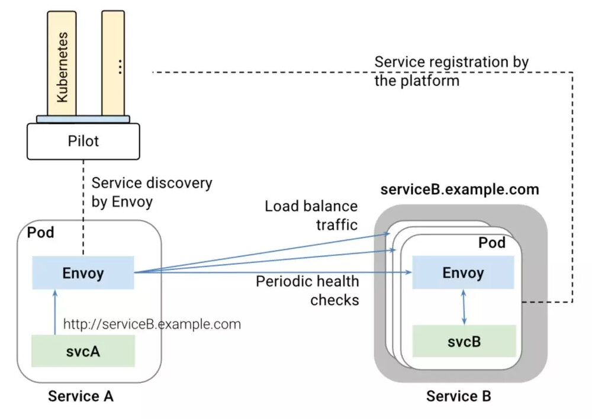

另一个常用的场景就是负载均衡，Pilot 通过 Kubernetes 的 Service 发现 Service B 包含一个 Deployment，但是有三个副本，于是通过 Envoy API 下发规则，使得 Envoy 在这三个副本之间进行负载均衡，而非通过 Kubernetes 本身 Service 的负载均衡机制。

三、以 Istio 为例解析 Service Mesh 的技术细节

了解了 Service Mesh 的大概原理，接下来我们通过一个例子来解析其中的技术细节。

凡是试验过 Istio 的同学都应该尝试过下面这个 BookInfo 的例子，不很复杂，但是麻雀虽小五脏俱全。

在这个例子中，我们重点关注 ProductPage 这个服务，对 Reviews 服务的调用，这里涉及到路由策略和负载均衡。

**Productpage 就是个 Python 程序**

productpage 是一个简单的用 python 写的提供 restful API 的程序。

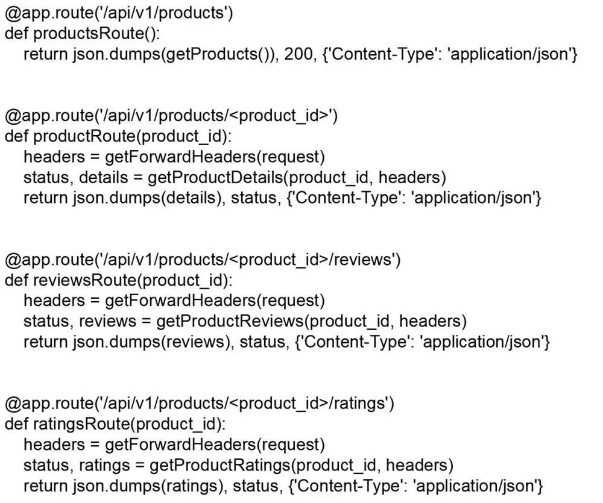

在里面定义了很多的 route，来接收 API 请求，并做相应的操作。

在需要请求其他服务，例如 reviews, ratings 的时候，则需要向后方发起 restful 调用。

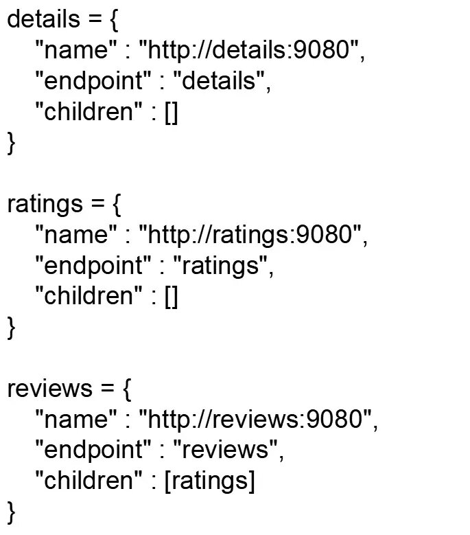

从代码可以看出，productpage 对于后端的调用，都是通过域名来的。

对于 productpage 这个程序来讲，他觉得很简单，通过这个域名就可以调用了，既不需要通过服务发现系统获取这个域名，也不需要关心转发，更意识不到自己是部署在 kubernetes 上的，是否用了 service mesh，所以服务之间的通信完全交给了基础设施层。

通过 Kubernetes 编排 productpage

有了 productpage 程序，接下来就是将他部署到 kubernetes 上，这里没有什么特殊的，用的就是 kubernetes 默认的编排文件。

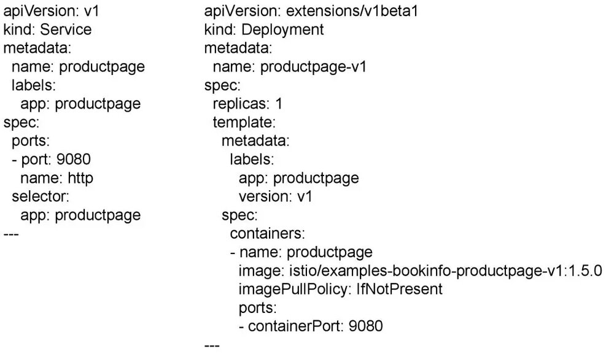

首先定义了一个 Deployment，使用 bookinfo 的容器镜像，然后定义一个 Service，用于这个 Deployment 的服务发现。

**通过 Kubernetes 编排 reviews**

这个稍微有些复杂，定义了三个 Deployment，但是版本号分别为 V1, V2, V3，但是 label 都是 app: reviews。

最后定义了一个 Service，对应的 label 是 app: reviews，作为这三个 Deployment 的服务发现。

**istioctl 对 productpage 进行定制化之一：嵌入 proxy_init 作为 InitContainer**到目前为止，一切正常，接下来就是见证奇迹的时刻，也即 istio 有个工具 istioctl 可以对于 yaml 文件进行定制化

定制化的第一项就是添加了一个 initContainer，这种类型的 container 可以做一些初始化的工作后，成功退出，kubernetes 不会保持他长期运行。

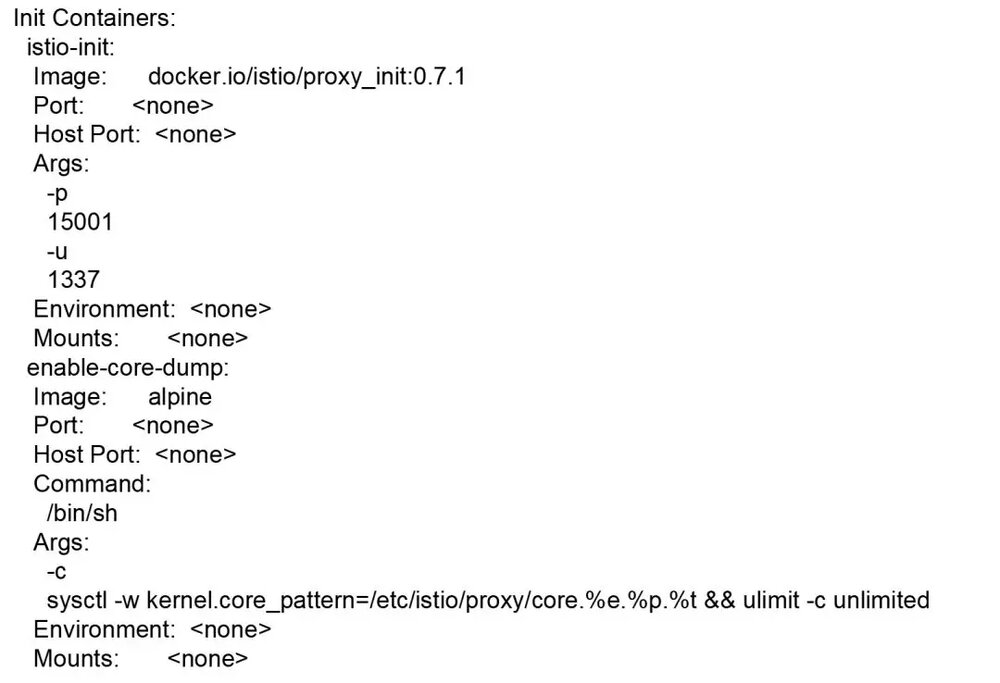

在这个 InitContainer 里面做什么事情呢？

我们登录进去发现，在这个 InitContainer 里面运行了一个 shell 脚本。

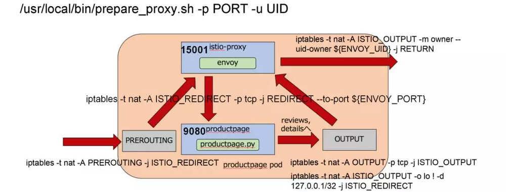

就是这个 shell 脚本在容器里面写入了大量的 iptables 规则。

首先定义的一条规则是 ISTIO_REDIRECT 转发链，这条链不分三七二十一，都将网络包转发给 envoy 的 15000 端口。

但是一开始这条链没有被挂到 iptables 默认的几条链中，所以不起作用。

接下来就是在 PREROUTING 规则中，使用这个转发链，从而进入容器的所有流量，都被先转发到 envoy 的 15000 端口。

envoy 作为一个代理，已经被配置好了，将请求转发给 productpage 程序。

productpage 程序接受到请求，会转向调用外部的 reviews 或者 ratings，从上面的分析我们知道，productpage 只是做普通的域名调用。

当 productpage 往后端进行调用的时候，就碰到了 output 链，这个链会使用转发链，将所有出容器的请求都转发到 envoy 的 15000 端口。

这样无论是入口的流量，还是出口的流量，全部用 envoy 做成了汉堡包。

envoy 根据服务发现的配置，知道 reviews 或者 ratings 如何访问，于是做最终的对外调用。

这个时候 iptables 规则会对从 envoy 出去的流量做一个特殊处理，允许他发出去，不再使用上面的 output 规则。

**istioctl 对 productpage 进行定制化之二：嵌入 proxy 容器作为 sidecar**

istioctl 做的第二项定制化是，嵌入 proxy 容器作为 sidecar。

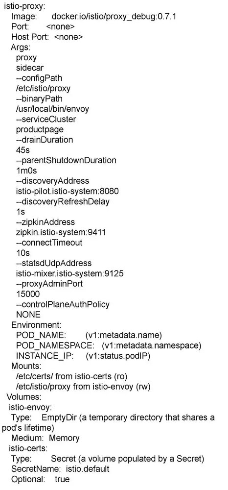

这个似乎看起来更加复杂，但是进入容器我们可以看到，启动了两个进程。

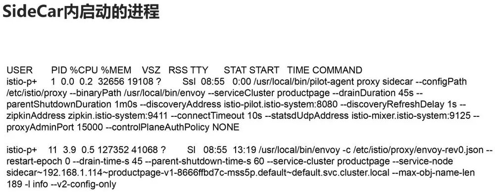

一个是我们熟悉的 envoy，他有一个配置文件是/etc/istio/proxy/envoy-rev0.json

我们再前面讲述 envoy 的时候说过，有了配置文件，envoy 就能够转发了，我们先来看看配置文件里面都有啥。

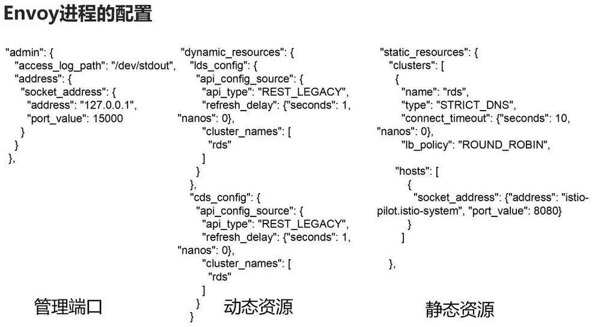

在这里面配置了 envoy 的管理端口，等一下我们会通过这个端口查看 envoy 被 pilot 下发了哪些转发策略。

然后就是动态资源，也即从各种 discovery service 去拿转发策略。

还有就是静态资源，也即静态配置的，需要重启才能加载的。

这就是 pilot-agent 的作用，他是 envoy 的一个简单的管理器，因为有些静态资源，如果 TLS 的证书，envoy 还不支持动态下发，因而需要重新静态配置，然后 pilot-agent 负责将 envoy 进行热重启加载。

好在 envoy 有良好的热重启机制，重启的时候，会先启动一个备用进程，将转发的统计数据通过 shared memory 在两个进程间共享。

**深入解析 pilot 的工作机制**

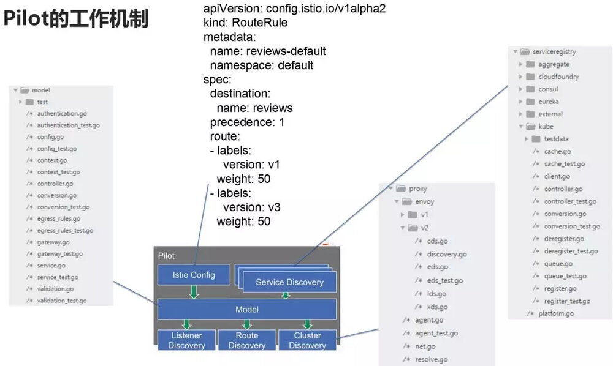

Pilot 的工作机制展开后如图所示。

istio config 是管理员通过管理接口下发的转发规则。

Service Discovery 模块对于 Kubernetes 来讲，就是创建了一个 controller 来监听 Service 创建和删除的事件，当 service 有变化时，会通知 pilot，pilot 会根据变化更新下发给 envoy 的规则。

pilot 将管理员输入的转发策略配置和服务发现的当前状态，变成 pilot 自己的数据结构模型，然后暴露成 envoy 的 api，由于是 envoy 来调用，因而要实现一个服务端，这里有 lds, rds, cds, eds。

接下来我们看，在 pilot 上配置 route 之后会发生什么？

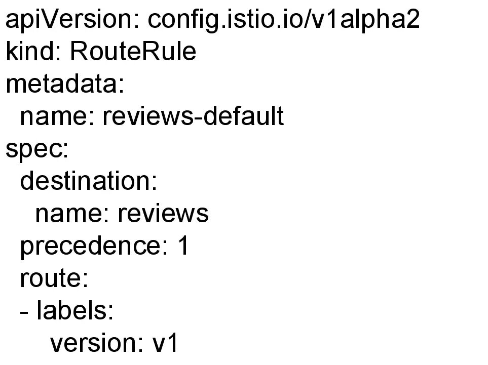

如图，我们将所有的流量都发给版本 1。

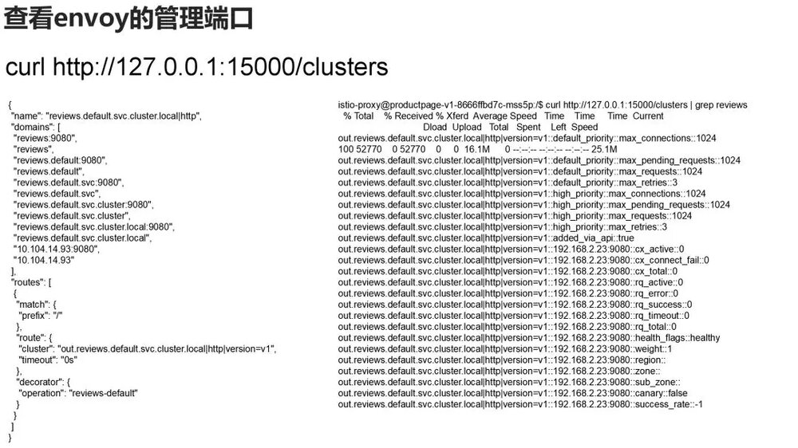

我们查看 envoy 的管理端口，可以看到只配置了 reviews 的 v1。

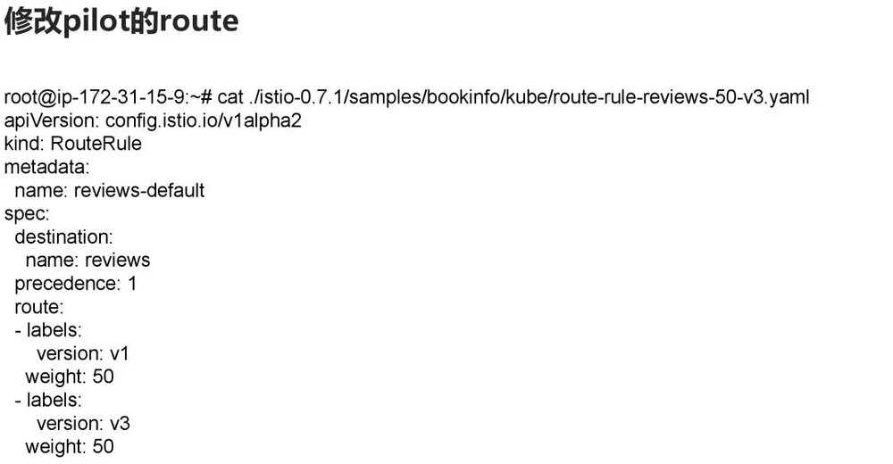

当我们修改路由为 v1 和 v3 比例是五十比五十。

可以看到 envoy 的管理端口，路由有了两个版本的配置，也对应后端的两个 ip 地址。
