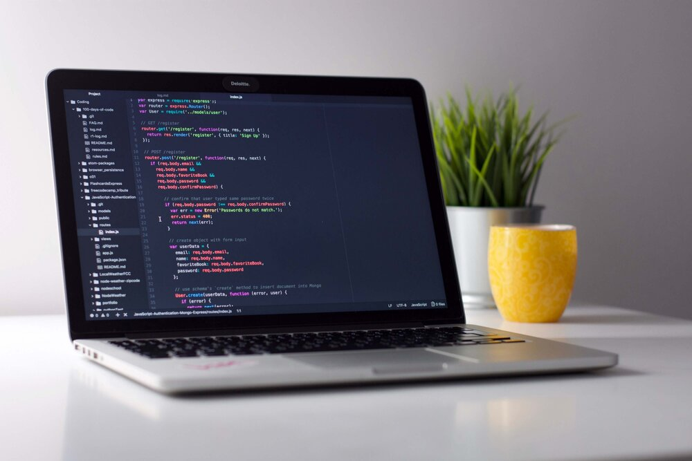
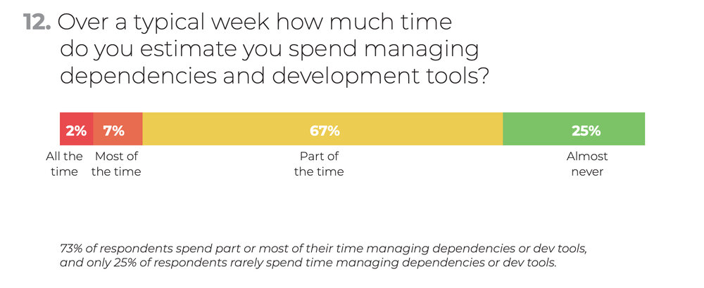

本文翻译自 [gitpod](https://www.gitpod.io/blog/) 的 blog 文章 [Dev environments as code](https://www.gitpod.io/blog/dev-env-as-code)。

想象一下，仅在十年前，运维人员还在手动部署、配置和维护软件系统，这大大消耗了他们宝贵的生命和精力。

而在今天，微服务架构时代，软件系统变得更加复杂，尝试手动维护操作和部署都变的不再可能。在我们进行 “DevOps” 或 “基础设施即代码” 的实践时，发现声明式的描述软件系统对于自动和持续地部署应用程序是必不可少的。


## 那我们的开发环境呢？

虽然我们已经自动部署了应用程序，但我们中的大多数人还没有将相同的技术应用于开发环境。相反，在项目中招募新团队成员往往需要几个小时来配置他们的开发环境。

这种情况通常是这样的：

1. 新的开发人员接收到项目文档链接
2. 阅读冗长且过时的 setup 说明
3. 在开发终端上安装依赖、更新/降级版本等
4. 尝试运行构建……等待 20 分钟
5. 构建失败，尝试寻找哪里出了问题
6. 询问同事。“哦是的，你还需要做 X 和 Y”
7. 转回步骤 3

经过多次尝试，构建突然起作用了。您不知道为什么，但这现在不重要了。当然，您无法更新文档，因为您也不确定是如何完成设置的，甚至不确定现在的状态是否可以重现。因此如果更新文档，最好只添加您发现的内容，不敢删除您不理解或跳过的部分，因为它们对您不起作用。

在接下来的几周里，您将不得不解决这里和那里的小问题，并添加一些没有列出的工具。获取是因为 debug 无法工作，或者您没有看到上游依赖的源。最终，这一切都会平息下来。但当一个同事改变了依赖中的某些内容，整个团队都注意到并相应地改变他们的环境，通常需要两天时间。

不幸的是，痛苦并不止于此。

### 在我的机器是正常的

您是否时常会听到 “这个程序在我机器上是正常的，怎么到你机器上就不正常了” 这句话？以及一个 bug 只出现在一台机器上，很难在其他机器上重现？在生产中发生了事故，却无法在本地重现？只要您在使用不同的配置在不同平台上运行代码，发生这些问题都不奇怪。


### 修复旧分支上的问题

另一个令人讨厌的事情是当您需要在维护分支上修复某些旧代码引起的 bug 时，需要修复的 bug 可能非常简单，但在您完成之前，需要能够构建和测试这个“古老的野兽”，这会花费您无穷无尽的时间。

修复六个月前的技术栈可是很烦人的，必须处理所有旧的依赖库及其版本，且您仍然必须以某种方式使其可以工作。


如果我们也将 “基础设施即代码” 理念应用到我们的开发环境中，所有的痛苦都可以结束。通过将开发环境设置以可执行格式写下来并将其与项目源码一起存入源码存储库，实现开发环境设置的自动化、可复用和版本化。

## 开发环境即代码

毕竟，开发环境通常比运行时的应用程序更加复杂，通常需要在满足运行时要求的同时添加所有开发工具，例如构建工具、编译器、linter 与合适的编辑器/IDE。

如果您想确保更改不会破坏任何内容，那么每个人都要使用与 CI 构建相同环境，并在其中进行编码、运行和测试。

因此，让我们停止污染我们的 readme 文件，并正式开始编写开发环境配置命令，以便它们可以执行。

### Dockerfiles

Dockerfiles 是描述开发环境的一种非常简洁的方式。想象一下，您想在项目的工具链中添加诸如 *“asciidoctor”* 之类的工具。您只需将以下行添加到您的开发环境的 Dockerfile 中：

```docker
RUN apt-get install -y asciidoctor
```

一旦您将更改 push 到代码仓库并且自动更新 docker 镜像，所有团队成员都可以在他们的开发环境中使用新工具。



### IDE 自动设置

如果您的开发工具具有诸如桌面 IDE 之类的 UI，那么使用 Docker 的方法会变得有点笨拙。您可以将它们打包到 Docker 中，但是您必须通过 [X11](https://zh.wikipedia.org/wiki/X%E8%A6%96%E7%AA%97%E7%B3%BB%E7%B5%B1)(X Window System) 公开 IDE 的 UI。另一种选择是使用像 vim 这样的终端编辑器，但这对我们大多数人来说并不是一个很好选择。

一些桌面 IDE 具有允许使用自动设置的工具设置。例如，Eclipse 有一个名为 Oomph 的工具，其允许您以声明方式描述 Eclipse IDE，包括插件、配置甚至工作区设置（即 git 信息）。

到目前为止，最好的选择是在浏览器中运行的 IDE，例如 [Theia IDE](https://theia-ide.org/)。Theia 是 Eclipse 基金会旗下的开源项目，它被看作是在浏览器和桌面上运行的 VS Code，且更具可定制性。

对于简单的基于 Docker 的开发环境，您可以将 Theia 添加到您的 Docker 镜像中，它提供了包含终端的完整 IDE。

下一步是将您的开发环境视为某种 serverless function，您只在需要时生成并启开发环境，并在完成时进行销毁，[Gitpod](https://www.gitpod.io/) 正是这样做的。

它与 GitHub、GitLab、Bitbucket 等代码托管平台集成，通过自动化消除所有繁琐的步骤。并允许您提供自定义 Dockerfiles 或 Docker 镜像来运行 Theia IDE。

## 总结

将 DevOps 的经验应用在开发环境的设置中，可以为我们节省大量宝贵的时间和精力。[ActiveState 的 2018 年开发者调查](https://www.activestate.com/developer-survey-2018-open-source-runtime-pains/) 通过一些数据强调了这一点：



我们真的需要用痛苦的入职经历来欢迎新同事或贡献者吗？让我们跳过繁琐的环境配置，让开发环境设置变的**自动化**、**可复用**且**版本化**吧！
