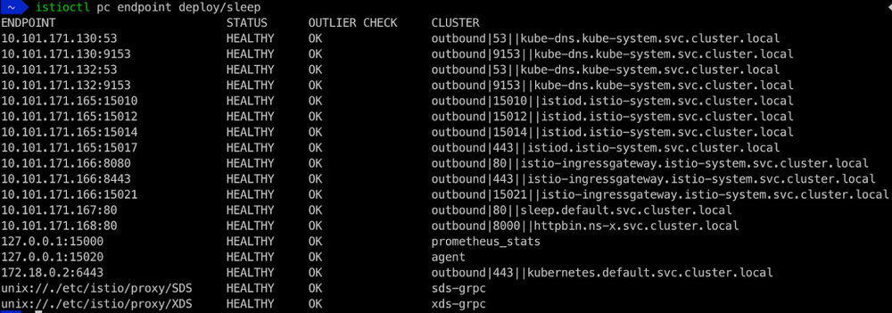
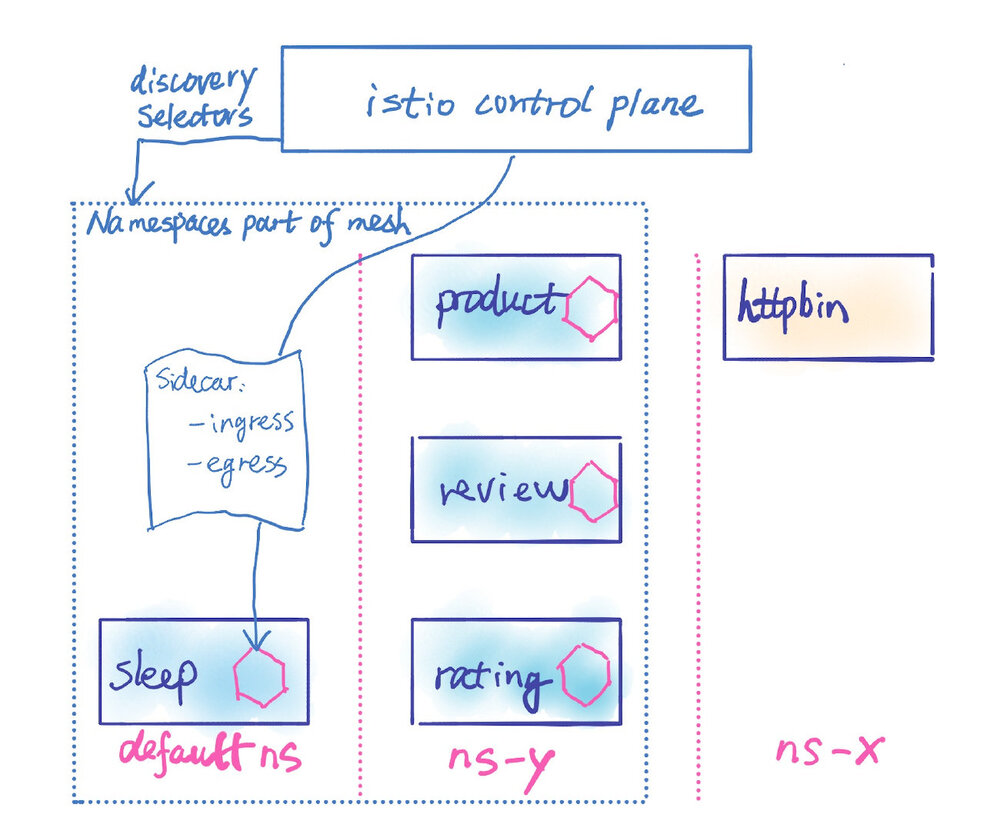

本文译自 [Istio 官网](https://istio.io/latest/blog/2021/discovery-selectors/)。

当用户将他们的服务转移到 Istio 服务网格中运行时，他们通常会惊讶地发现，控制平面默认会观察和处理集群中所有命名空间中的所有 Kubernetes 资源。这对于拥有大量命名空间和部署的大型集群，甚至对于拥有快速流动资源（例如 Spark 作业）的中等规模的集群来说，都可能是一个问题。

我们需要一种方法来动态地限制作为网格一部分的命名空间集，以便 Istio 控制平面只处理这些命名空间的资源。限制命名空间的能力使 Istiod 能够观察和推送更少的资源和相关的变化到 sidecar，从而提高控制平面和数据平面的整体性能。

## 背景

默认情况下，Istio 监视集群中的所有命名空间、服务、端点和 Pod。例如，在我的 Kubernetes 集群中，我把 sleep 服务部署在默认命名空间，把 httpbin 服务部署在 ns-x 命名空间。我已经把 sleep 服务添加到网格中，但我没有计划把 httpbin 服务添加到网格中，或者让网格中的任何服务与 httpbin 服务交互。

使用 `istioctl proxy-config endpoint` 命令来显示 sleep 部署的所有端点。



请注意，`ns-x` 命名空间中的 httpbin 服务端点在已发现的端点列表中。当你只有几个服务时，这可能不是一个问题。然而，当你有成百上千的服务不与 Istio 服务网中运行的任何服务交互时，你可能不希望你的 Istio 控制平面观察这些服务并将它们的信息发送到网格中服务的 sidecar。

## 引入发现选择器

从 Istio 1.10 开始，我们在[MeshConfig](https://istio.io/latest/docs/reference/config/istio.mesh.v1alpha1/#MeshConfig)中引入了新的`discoverySelectors`选项，它是一个 Kubernetes[选择器](https://kubernetes.io/docs/concepts/overview/working-with-objects/labels/#resources-that-support-set-based-requirements)的数组。确切的类型是 `[]LabelSelector`，如这里定义的，允许简单的选择器和基于集合的选择器。这些选择器适用于命名空间的标签。

你可以配置每个标签选择器来表达各种使用情况，包括但不限于：

- 任意的标签名称/值，例如，所有具有标签`istio-discovery=enabled`的命名空间
- 使用带有 OR 语义的基于集合的选择器的命名空间标签列表，例如，所有带有`istio-discovery=enabled`标签的命名空间或 `region=us-east1`
- 包含和/或排除命名空间，例如，所有具有标签`istio-discovery=enabled`和标签 key `app`等于`helloworld`的名称空间。

注意：`discoverySelectors`不是一个安全边界。即使你配置了`discoverySelectors`，Istiod 将继续访问所有命名空间。

## 发现选择器示例

假设你知道哪些命名空间要作为服务网格的一部分，作为网格管理员，你可以在安装时或安装后通过在 Istio 的`MeshConfig`资源中添加你想要的发现选择器。例如，你可以将 Istio 配置为只发现那些有`istio-discovery=enabled`标签的命名空间。

1. 使用我们前面的例子，让我们给默认命名空间贴上标签`istio-discovery=enabled`。

```yaml
kubectl label namespace default istio-discovery=enabled
```

2. 使用 `istioctl` 应用带有 `discoverySelectors` 的 yaml 来更新你的 Istio 安装。注意，为了避免对你的稳定环境产生任何影响，我们建议你对你的 Istio 安装使用不同的版本。

```yaml
istioctl install --skip-confirmation -f - <<EOF
apiVersion: install.istio.io/v1alpha1
kind: IstioOperator
metadata:
namespace: istio-system
spec:
# You may override parts of meshconfig by uncommenting the following lines.
meshConfig:
  discoverySelectors:
    - matchLabels:
        istio-discovery: enabled
EOF
```

3. 显示 sleep 部署的端点配置。


注意这次 `ns-x` 命名空间中的`httpbin`服务不在发现的端点列表中，还有许多其他不在默认命名空间中的服务。如果你显示 sleep 部署的路由（或集群或监听器）信息，你也会注意到返回的配置少了很多。


你可以使用`matchLabels`来配置具有 AND 语义的多个标签，或者使用`matchLabels`集来配置多个标签间的 OR 语义。无论你是将服务或 pod 部署到具有不同标签集的命名空间，还是你的组织中的多个应用团队使用不同的标签惯例，`discoverySelectors`都能提供你需要的灵活性。此外，你可以根据我们的[文档](https://github.com/istio/api/blob/master/mesh/v1alpha1/config.proto#L792)一起使用`matchLabels`和`matchExpressions`。关于选择器语义的其他细节，请参考[Kubernetes 选择器](https://kubernetes.io/docs/concepts/overview/working-with-objects/labels/#label-selectors)文档。

## 发现选择器与 Sidecar 资源

`discoverySelectors`配置使用户能够动态地限制作为网格一部分的命名空间的集合。Sidecar 资源也可以控制 sidecar 配置的可见性，以及什么被推送到 sidecar 代理。它们之间有什么区别？

- `discoverySelectors`配置声明了 Istio 控制平面观察和处理的内容。如果没有`discoverySelectors`配置，Istio 控制平面会观察和处理集群中的所有命名空间/服务/端点/pod，而不管你有哪些 sidecar 资源。
- `discoverySelectors`是由网格管理员为网格全局配置的。虽然 Sidecar 资源也可以由 Mesh 管理员在`MeshConfig`根命名空间中为 Mesh 进行全局配置，但它们通常是由服务所有者为其命名空间进行配置。

你可以在 Sidecar 资源中使用`discoverySelectors`。你可以使用`discoverySelectors`在 Mesh 范围内配置 Istio 控制平面应该观察和处理哪些命名空间。对于 Istio 服务网格中的这些命名空间，你可以在全局或每个命名空间创建 Sidecar 资源，以进一步控制什么被推送到 sidecar 代理。让我们把 Bookinfo 服务添加到网格中的`ns-y`命名空间，如下图所示。 



## 总结

发现选择器是强大的配置，可以将 Istio 控制平面调整为只观察和处理特定的命名空间。如果你不希望你的 Kubernetes 集群中的所有命名空间成为服务网格的一部分，或者你的 Kubernetes 集群中有多个 Istio 服务网格，我们强烈建议你探索这种配置，并在 Istio slack 或 GitHub 上与我们联系以获得反馈。
