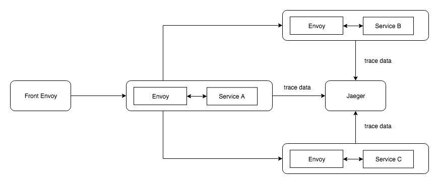

如果你是初次接触服务网格和 Envoy，我[这里](https://medium.com/@dnivra26/service-mesh-with-envoy-101-e6b2131ee30b)有一篇文章可以帮助你入门。

在微服务架构中，可观测性变得越加重要。我认为这是选择微服务这条路的必要条件之一。我的一位前同事列出了一份非常棒的[需求清单](https://news.ycombinator.com/item?id=12509533)，如果你想做微服务，那么你需要满足提到的这些要求。

可观测性有许多事要做：

- 监控
- 报警
- 日志集中化
- 分布式追踪

本文只讨论 Envoy 下的分布式追踪，我尽量给出一个全貌来描述分布式追踪、OpenTracing、Envoy 和 Jaeger 是如何整合在一起工作的。在[下一篇文章](https://medium.com/@dnivra26/microservices-monitoring-with-envoy-service-mesh-prometheus-grafana-a1c26a8595fc)中，我们将讨论使用 Envoy、prometheus 和 grafana 做监控。

## 分布式追踪

随着大量的服务和请求的流转，你需要能够快速发现哪里出了问题。分布式追踪最早由[谷歌的 Dapper](https://ai.google/research/pubs/pub36356)普及开来，它本质上具有在微服务的整个生命周期中追踪请求的能力。

最简单的实现方法是在前端代理生成一个唯一的请求 id（x-request-id），并将该请求 id 传递给与其交互的所有服务。基本上可以向所有的日志追加这一请求 id。因此，如果你在 kibana 这样的系统中搜索唯一 id，你会看到针对该特定请求的所有相关的日志。

这非常有用，但是它不能告诉你每个服务中请求完成的顺序、是否是并行完成的或者花费了多少时间。

让我们看看 OpenTracing 和 Envoy 如何帮助我们解决这一问题。

## OpenTracing

与其只传递一个 id（x-request-id），不如传递更多的数据，比如哪个服务位于请求的根级别，哪个服务是哪个服务的子服务等等。这可以帮我们找出所有的答案。标准的做法是使用 OpenTracing，它是分布式追踪的规范，和语言无关。你可以在[这里](https://opentracing.io/speciation/)阅读更多关于此规范的信息。

## Envoy

服务网格就像微服务的通信层，服务之间的所有通信都是通过网格进行的。它可以实现负载均衡、服务发现、流量转移、速率限制、指标（metrics）收集等功能，Envoy 就是这样的一个服务网格。在我们的例子中，Envoy 将帮助我们生成唯一根请求 id（x-request-id），生成子请求 id，并将它们发送到[Jaeger](https://www.jaegertracing.io/)或[Zipkin](https://zipkin.io/)这样的追踪系统，这些系统存储、聚合追踪数据并为其提供可视化的能力。

这篇文章中我们会使用 Jaeger 作为追踪系统，Envoy 用来生成基于 zipkin 或 lighstep 格式的追踪数据。我们会使用 zipkin 的标准来兼容 Jaeger。

## 只要给我看代码就好

下面的图展示了我们尝试构建的系统全貌：



服务安装

我们将使用 docker-compose 来部署 Envoy。你需要向 Envoy 提供一份配置文件。这里我不打算解释如何配置 Envoy，只集中讨论与追踪相关的部分。。你可以在[这里](https://www.envoyproxy.io/docs/envoy/latest/configuration/overview/v2_overview)找到更多关于配置 Envoy 的信息。

## 前端 Envoy

前端 Envoy 的作用是生成根请求 id，你可以通过配置去实现。下面是它的配置文件：

```yaml
---
tracing:
  http:
    name: envoy.zipkin
    config:
      collector_cluster: jaeger
      collector_endpoint: "/api/v1/spans"
admin:
  access_log_path: "/tmp/admin_access.log"
  address:
    socket_address:
      address: "127.0.0.1"
      port_value: 9901
static_resources:
  listeners:
    -
      name: "http_listener"
      address:
        socket_address:
          address: "0.0.0.0"
          port_value: 80
      filter_chains:
          filters:
            -
              name: "envoy.http_connection_manager"
              config:
                tracing:
                  operation_name: egress
                use_remote_address: true
                add_user_agent: true
                access_log:
                - name: envoy.file_access_log
                  config:
                    path: /dev/stdout
                    format: "[ACCESS_LOG][%START_TIME%] \"%REQ(:METHOD)% %REQ(X-ENVOY-ORIGINAL-PATH?:PATH)% %PROTOCOL%\" %RESPONSE_CODE% %RESPONSE_FLAGS% %BYTES_RECEIVED% %BYTES_SENT% %DURATION% %RESP(X-ENVOY-UPSTREAM-SERVICE-TIME)% \"%REQ(X-FORWARDED-FOR)%\" \"%REQ(USER-AGENT)%\" \"%REQ(X-REQUEST-ID)%\" \"%REQ(:AUTHORITY)%\" \"%UPSTREAM_HOST%\" \"%DOWNSTREAM_REMOTE_ADDRESS_WITHOUT_PORT%\"\n"
                stat_prefix: "ingress_443"
                codec_type: "AUTO"
                generate_request_id: true
                route_config:
                  name: "local_route"
                  virtual_hosts:
                    -
                      name: "http-route"
                      domains:
                        - "*"
                      routes:
                        -
                          match:
                            prefix: "/"
                          route:
                            cluster: "service_a"
                http_filters:
                  -
                    name: "envoy.router"
  clusters:
    -
      name: "service_a"
      connect_timeout: "0.25s"
      type: "strict_dns"
      lb_policy: "ROUND_ROBIN"
      hosts:
        -
          socket_address:
            address: "service_a_envoy"
            port_value: 8786
    - name: jaeger
      connect_timeout: 0.25s
      type: strict_dns
      lb_policy: round_robin
      hosts:
      - socket_address:
          address: jaeger
          port_value: 9411
```

第 1-8 行启用追踪并配置追踪系统和它所在的位置。

第 27-28 行指定流量进出的位置。

第 38 行指出 Envoy 必须生成根请求 id。

第 66-73 行配置 Jaeger 追踪系统。

所有 Envoy 的配置中（前端，服务 a，b 和 c）都需要启用追踪和配置 Jaeger 地址

## Service A

在我们的例子中服务 A 将调用服务 B 和服务 C。关于分布式追踪非常重要的一点是，尽管 Envoy 支持进行分布式追踪，但也**依赖于服务把生成的 Header 传递给流出的请求**。因此，服务 A 将在调用服务 B 和 C 时转发请求头。服务 A 是一个只有一个端点（endpoint）的简单的 go 服务，内部调用服务 B 和服务 C。下面是我们需要传递的头信息：

```go
req, err := http.NewRequest("GET", "http://service_a_envoy:8788/", nil)
if err != nil {
	fmt.Printf("%s", err)
}

req.Header.Add("x-request-id", r.Header.Get("x-request-id"))
req.Header.Add("x-b3-traceid", r.Header.Get("x-b3-traceid"))
req.Header.Add("x-b3-spanid", r.Header.Get("x-b3-spanid"))
req.Header.Add("x-b3-parentspanid", r.Header.Get("x-b3-parentspanid"))
req.Header.Add("x-b3-sampled", r.Header.Get("x-b3-sampled"))
req.Header.Add("x-b3-flags", r.Header.Get("x-b3-flags"))
req.Header.Add("x-ot-span-context", r.Header.Get("x-ot-span-context"))

client := &http.Client{}
resp, err := client.Do(req)
```

您可能惊讶为什么调用服务 B 时 URL 是`service_a_envoy`。如果你还记得我们已经讨论过服务之间的所有通信都需要通过 envoy 代理的话，类似的，可以在调用服务 C 时传递 Header。

## 服务 B 和服务 C

剩下的两个服务不需要对代码进行任何更改，因为它们处于叶子级别。一旦这两个服务要调用其他端点，则必须转发请求追踪头，除此之外不需要对 Envoy 进行任何特殊配置。服务 B 和 C 代码如下：

```go
package main

import (
	"fmt"
	"log"

	"net/http"
)

func handler(w http.ResponseWriter, r *http.Request) {

	fmt.Fprintf(w, "Hello from service B")
}

func main() {
	http.HandleFunc("/", handler)
	log.Fatal(http.ListenAndServe(":8082", nil))
}
```

```go
package main

import (
  "fmt"
  "log"

  "net/http"
)

func handler(w http.ResponseWriter, r *http.Request) {

  fmt.Fprintf(w, "Hello from service C")
}

func main() {
  http.HandleFunc("/", handler)
  log.Fatal(http.ListenAndServe(":8083", nil))
}
```

所有这些完成后，如果您运行`docker-compose up`并访问前端 Envoy 端点，就会生成追踪信息并推送到 Jaeger。Jaeger 有一个非常友好的 UI 界面来展示追踪信息，我们的信息看上去像这样：


正如你看到的，它提供了总体的时间损耗，系统各部分是时间损耗，哪个服务调用哪个服务，服务和服务的关系（服务 b 和服务 c 是兄弟关系）。Jaeger 的进一步使用留待你自己去探索。

你可以在[这里](https://github.com/dnivra26/envoy_distributed_tracing)找到所有的 Envoy 配置、代码和 Docker compose 文件。

就是这些，谢谢，让我知道你的反馈。

如果你在寻找 Envoy 的 xDS 服务端的话，我的同事已经搭建了[一个](https://github.com/tak2siva/Envoy-Pilot)。可以直接获取（check out）。

[这里](https://medium.com/@dnivra26/microservices-monitoring-with-envoy-service-mesh-prometheus-grafana-a1c26a8595fc) 是这一系列文章中的下一篇（使用 Envoy，Prometheus 和 Grafana 进行监控）。
