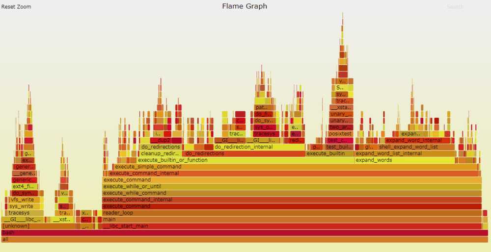
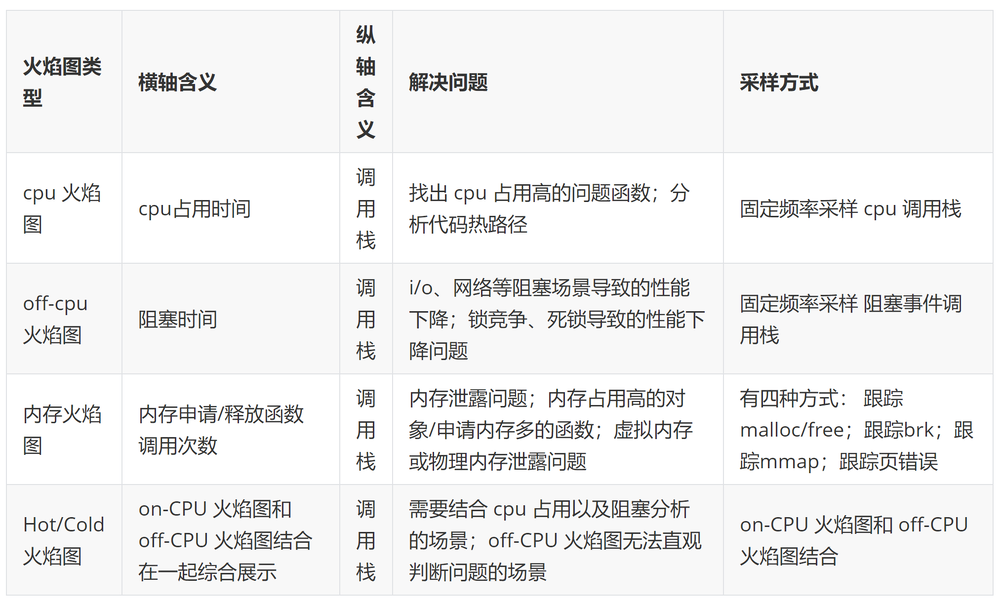
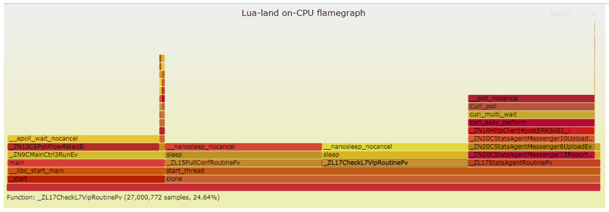

> 本文主要分享火焰图使用技巧，介绍 systemtap 的原理机制，如何使用火焰图快速定位性能问题原因，同时加深对 systemtap 的理解。

让我们回想一下，曾经作为编程新手的我们是如何调优程序的？通常是在没有数据的情况下依靠主观臆断来瞎蒙，稍微有些经验的同学则会对差异代码进行二分或者逐段调试。这种定位问题的方式不仅耗时耗力，而且还不具有通用性，当遇到其他类似的性能问题时，需要重复踩坑、填坑，那么如何避免这种情况呢？

俗语有云：“工欲善其事，必先利其器。”个人认为，程序员定位性能问题也需要一件“利器”。如同医生给病人看病，需要依靠专业的医学工具（比如 X 光片、听诊器等）进行诊断，最后依据医学工具的检验结果快速精准地定位出病因所在。性能调优工具（比如 perf / gprof 等）之于性能调优就像 X 光之于病人一样，它可以一针见血地指出程序的性能瓶颈。

但是常用的性能调优工具 perf 等，在呈现内容上只能单一地列出调用栈或者非层次化的时间分布，不够直观。这里我推荐大家配合使用火焰图，它将 perf 等工具采集的数据呈现得更为直观。


## **初识火焰图**

火焰图（Flame Graph）是由 Linux 性能优化大师 Brendan Gregg 发明的，和所有其他的 profiling 方法不同的是，火焰图以一个全局的视野来看待时间分布，它从底部往顶部，列出所有可能导致性能瓶颈的调用栈。



火焰图整个图形看起来就像一个跳动的火焰，这就是它名字的由来。

火焰图有以下特征（这里以 on-cpu 火焰图为例）：

* 每一列代表一个调用栈，每一个格子代表一个函数；
* 纵轴展示了栈的深度，按照调用关系从下到上排列，最顶上格子代表采样时，正在占用 cpu 的函数；
* 横轴的意义是指：火焰图将采集的多个调用栈信息，通过按字母横向排序的方式将众多信息聚合在一起。需要注意的是它并不代表时间；
* 横轴格子的宽度代表其在采样中出现频率，所以一个格子的宽度越大，说明它是瓶颈原因的可能性就越大；
* 火焰图格子的颜色是随机的暖色调，方便区分各个调用信息；
* 其他的采样方式也可以使用火焰图，on-cpu 火焰图横轴是指 cpu 占用时间，off-cpu 火焰图横轴则代表阻塞时间；
* 采样可以是单线程、多线程、多进程甚至是多 host，进阶用法可以参考附录[进阶阅读](#进阶阅读)；

### **火焰图类型**

常见的火焰图类型有 On-CPU，Off-CPU，还有 Memory，Hot/Cold，Differential 等等。他们分别适合处理什么样的问题呢？

这里笔者主要使用到的是 On-CPU、Off-CPU 以及 Memory 火焰图，所以这里仅仅对这三种火焰图作比较，也欢迎大家补充和斧正。



### **火焰图分析技巧**

1. 纵轴代表调用栈的深度（栈桢数），用于表示函数间调用关系：下面的函数是上面函数的父函数；
2. 横轴代表调用频次，一个格子的宽度越大，越说明其可能是瓶颈原因；
3. 不同类型火焰图适合优化的场景不同，比如 on-cpu 火焰图适合分析 cpu 占用高的问题函数，off-cpu 火焰图适合解决阻塞和锁抢占问题；
4. 无意义的事情：横向先后顺序是为了聚合，跟函数间依赖或调用关系无关；火焰图各种颜色是为方便区分，本身不具有特殊含义；
5. 多练习：进行性能优化有意识的使用火焰图的方式进行性能调优（如果时间充裕）；

## **如何绘制火焰图？**

要生成火焰图，必须要有一个顺手的动态追踪工具，如果操作系统是 Linux 的话，那么通常通常是 perf 或者 systemtap 中的一种。其中 perf 相对更常用，多数 Linux 都包含了 perf 这个工具，可以直接使用；SystemTap 则功能更为强大，监控也更为灵活。网上关于如何使用 perf 绘制火焰图的文章非常多而且丰富，所以本文将以 SystemTap 为例。

SystemTap 是动态追踪工具，它通过探针机制，来采集内核或者应用程序的运行信息，从而可以不用修改内核和应用程序的代码，就获得丰富的信息，帮你分析、定位想要排查的问题。SystemTap 定义了一种类似的 DSL 脚本语言，方便用户根据需要自由扩展。不过，不同于动态追踪的鼻祖 DTrace，SystemTap 并没有常驻内核的运行时，它需要先把脚本编译为内核模块，然后再插入到内核中执行。这也导致 SystemTap 启动比较缓慢，并且依赖于完整的调试符号表。

使用 SystemTap 绘制火焰图的主要流程如下：

* 安装 SystemTap 以及 操作系统符号调试表
* 根据自己所需绘制的火焰图类型以及进程类型选择合适的脚本
* 生成内核模块
* 运行 SystemTap 或者运行生成的内核模块统计数据
* 将统计数据转换成火焰图

本文演示步骤将会基于操作系统 Tlinux 2.2 ( Linux 内核版本 3.10.107)

### **安装 SystemTap 以及 操作系统符号调试表**

使用 yum 工具安装 systemtap:

```plain
yum install systemtap systemtap-runtime
```

由于 systemtap 工具依赖于完整的调试符号表，而且生产环境不同机器的内核版本不同（虽然都是 Tlinux 2.2 版本，但是内核版本后面的小版本不一样，可以通过 `uname -a` 命令查看）所以我们还需要安装 kernel-debuginfo 包、kernel-devel 包
我这里是安装了这两个依赖包

```plain
kernel-devel-3.10.107-1-tlinux2-0046.x86_64
kernel-debuginfo-3.10.107-1-tlinux2-0046.x86_64
```

### **根据自己所需绘制的火焰图类型以及进程类型选择合适的脚本**

使用 SystemTap 统计相关数据往往需要自己依照它的语法，编写脚本，具有一定门槛。幸运的是，github 上春哥（agentzh）开源了两组他常用的 SystemTap 脚本：[openresty-systemtap-toolkit](https://github.com/openresty/openresty-systemtap-toolkit) 和 [stapxx](https://github.com/openresty/stapxx)，这两个工具集能够覆盖大部分 C 进程、nginx 进程以及 Openresty 进程的性能问题场景。

我们这里需要绘制 off-cpu 火焰图，所以使用 sample-bt-off-cpu 脚本即可

### **生成内核模块**

现在我们有了统计脚本，也安装好了 systemtap，正常来说就可以使用了，但由于 systemtap 是通过生成内核模块的方式统计相关探针的统计数据，而 tlinux 要求所有运行的内核模块需要先到 tlinux 平台签名才可以运行，所以：

故需要先修改 off-cpu 脚本，让其先生成内核模块；之后对该内核模块作签名；最后使用 systemtap 命令手工运行该脚本，统计监控数据。

Systemtap 执行流程如下：


* parse：分析脚本语法
* elaborate：展开脚本 中定义的探针和连接预定义脚本库，分析内核和内核模块的调试信息
* translate：.将脚本编译成 c 语言内核模块文件放 在$HOME/xxx.c 缓存起来，避免同一脚本多次编译
* build：将 c 语言模块文件编译成.ko 的内核模块，也缓存起来。
* 把模块交给 staprun，staprun 加载内核模块到内核空间，stapio 连接内核模块和用户空间，提供交互 IO 通道，采集数据。

所以我们这里修改下 off-cpu 的 stap 脚本，让其只运行完第四阶段，只生成一个内核模块

```plain
// 在 stap 命令后增加 -p4 参数，告诉 systemtap，当前只需要执行到第四阶段
open my $in, "|stap -p4 --skip-badvars --all-modules -x $pid -d '$exec_path' --ldd $d_so_args $stap_args -"
or die "Cannot run stap: $!\n";
```
修改好之后运行脚本，会生成一个内核模块
```plain
// -p 8682 是需要监控的进程的进程号
// -t 30 是指会采样 30 秒
./sample-bt-off-cpu -p 8692 -t 30
```
生成的内核模块名称形如 `stap_xxxxx.ko`模块名称
由于读者并不需要关心内核模块签名，故章节略过

### **运行内核模块统计数据**

内核模块签名完成后，便可以使用 staprun 命令手工运行相关内核模块了

命令：

```plain
// 注意：签名脚本会将生产的内核模块重命名，需要将名字改回去……（脚本 bug）
staprun -x {进程号} {内核模块名} > demo.bt
```
值得注意的是，监控的进程要有一定负载 systemtap 才可以采集到相关数据，即在采集时，同时需要要有一定请求量（通常是自己构造请求，压测进程）
### **将统计数据转换成火焰图**

获得了统计数据 `demo.bt` 后，便可以使用火焰图工具绘制火焰图了

下载 FlameGraph，链接：[https://github.com/brendangregg/FlameGraph](https://github.com/brendangregg/FlameGraph)

命令：

```plain
./stackcollapse-stap.pl demo.bt > demo.folded
./flamegraph.pl demo.folded > demo.svg
```
这样便获得了 off-cpu 火焰图：


## **看图说话**

趁热打铁，通过几张火焰图熟悉下如何使用火焰图

图片源于春哥微博或者本人近期绘制的性能火焰图

### **on-cpu 火焰图**

#### **Apache APISIX QPS 急剧下降问题**


Apache APISIX 是一个开源国产的高性能 API 网关，之前在进行选型压测时，发现当 Route 匹配不中场景下，QPS 急剧下降，在其 CPU（四十八核）占用率几乎达到 100% 的情况下只有几千 QPS，通过绘制火焰图发现，其主要耗时在一个 table 插入阶段 (`lj_cf_table_insert`)，分析代码发现是该 table 一直没有释放，每次匹配不中时，路由会向一张用于统计的表中插入一条数据，导致该表越来越大，后续插入耗时过长导致 QPS 下降。

### **off-cpu 火焰图**

#### **nginx 互斥锁问题**


这是一张 nginx 的 off-cpu 火焰图，我们可以很快锁定到 `ngx_common_set_cache_fs_size -> ngx_shmtx_lock -> sem_wait` 这段逻辑使用到了互斥锁，它让 nginx 进程绝大部分阻塞等待时间花费在获取该锁。

#### **agent 监控上报断点问题**



这是一张 agent 的 off-cpu 火焰图，它是一个多线程异步事件模型，主线程处理各个消息，多个线程分别负责配置下发或者监控上报。当前问题出现在监控上报性能差，无法在周期（一分钟）内完成监控数据上报，导致监控断点，通过 off-cpu 火焰图我们可以分析出，该上报线程花费了大量的时间使用 curl_easy_perform 接口收发 http 监控数据消息。

依据火焰图将发送 http 消息的逻辑改为异步非阻塞后，该问题解决。

## **附录**

### **进阶阅读**

* 谷歌搜索演讲：Blazing Performance with Flame Graphs
* 演讲 ppt：[https://www.slideshare.net/brendangregg/blazing-performance-with-flame-graphs](https://www.slideshare.net/brendangregg/blazing-performance-with-flame-graphs)
* 《SystemTap 新手指南》：[https://spacewander.gitbooks.io/systemtapbeginnersguide_zh/content/index.html](https://spacewander.gitbooks.io/systemtapbeginnersguide_zh/content/index.html)
* 极客时间《Linux 性能优化实战》--倪朋飞

### **FAQ**

**使用 perf 或者 systemtap 的方式采集数据，会对后台服务有性能影响吗？**

有，但是很小，可以基本忽略不计。

它们使用系统的探针或者使用一些自定义的动态探针进行数据采集，第一对代码无侵入性，它既不需要停止服务，也不需要修改应用程序的代码；第二，它们是以内核模块/内核原生的方式跟踪用户态和内核态的所有事件，并通过一系列优化措施，进行采样统计，对目标服务性能影响极小，大概在 5% 左右或者更低的性能损耗。相较于将进程运行在沙箱的 valgrind 工具或静态调试工具 gdb 来说，动态追踪 perf 或者 systemtap 或者 ebpf 的性能损耗基本可以忽略不计。

**目标进程重启后，systemtap 是否需要重新生成内核模块？**

不需要。甚至同一个 linux 内核版本下的同一个二进制进程（md5 值一致），在安装 kernel 调试符号表后，便可以在生成采集指标的内核模块，并且可以多次使用。

当 linux 内核版本不一致，符号表有变化，需要重新生成内核模块；当目标进程二进制文件重新编译后，也需要重新生成统计用的 systemtap 内核模块。


