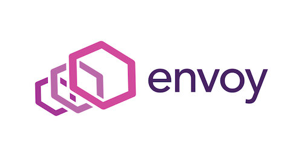
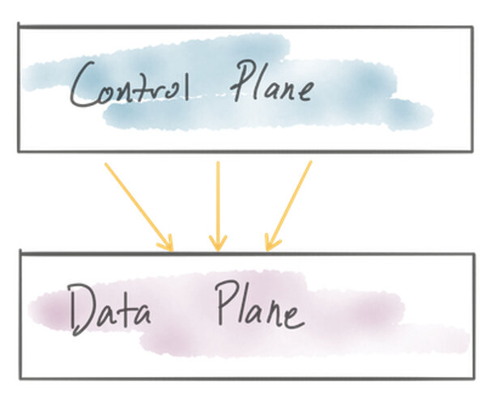
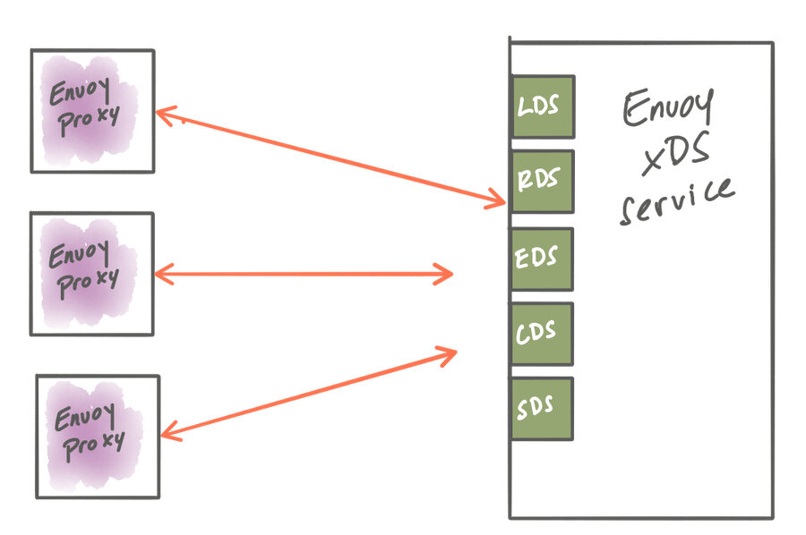

本文为翻译文章，[点击查看原文](https://medium.com/solo-io/guidance-for-building-a-control-plane-to-manage-envoy-proxy-at-the-edge-as-a-gateway-or-in-a-mesh-badb6c36a2af)。

## 编者案

> Envoy 作为最受欢迎的早期网络组件，现在已经可以说是云原生架构中的通用数据平面。本文作者指引我们更方便的使用 Envoy，及其定制控制平面，作者通过收集到的数据给出定制控制平面不同的意见，非常中肯，后续系列会更深入，欢迎关注该系列文章。

[Envoy](https://www.envoyproxy.io/) 最近成为一个受欢迎的网络组件。几年前 Matt Klein [写了一篇博客](https://blog.envoyproxy.io/the-universal-data-plane-api-d15cec7a) ，讨论了 Envoy 的动态配置 API，以及 Envoy 发展的历史和动机。他称该博客为“通用数据平面 API”。由于许多其他项目采用[Envoy](https://www.envoyproxy.io/community) 作为其产品的核心组件，因此对于应用程序/L7 网络解决方案而言，毫不夸张地说，“Envoy 已成为云原生架构中的通用数据平面”，而不仅仅是简单建立了 API 标准。

此外，由于 [Envoy 的通用数据平面 API](https://blog.envoyproxy.io/the-universal-data-plane-api-d15cec7a) ，我们已经看到了许多 *管理层* 的实现，用于配置和驱动基于 Envoy 的基础架构。我们将深入探讨为 Envoy 构建控制平面所需的内容，以便您可以使用此信息来评估哪种类型的基础架构最适合您的组织和使用情况。因为这是一个广泛的主题，我们将在未来几天发布的多部系列博客中解决它。

在EnvoyCon/KubeCon上 有一些 [精彩的演讲](https://blog.envoyproxy.io/envoycon-recap-579d53576511) ，一些组织分享了他们采用 Envoy 的经验，包括他们如何构建自己的控制平面。人们选择自己建立控制平面的一些原因：

- 现有的解决方案，建立在已有不同数据平面的控制平面，需要改造 Envoy（与已有方案且冲突）
- 为没有任何现有开源或其他 Envoy 控制平面（即 VM，AWS ECS 等）的基础架构构建（商业公司必须重新建方案）
- 不需要使用 Envoy 的所有功能; 只是一个子集（功能太多，需要精简）
- 首选适用于Envoy配置的特定于域的API/对象模型，以更好地适应其工作流程/世界观（与已有方案冲突）
- 当其组织准备部署时，暂时没有成熟的控制平面（走的太快）

若是因为一些早期采用者建立了他们自己的定制控制平面，并不意味着你现在也要自己重新开发控制平面。因为 Envoy 构建控制平面的项目在去年已经成熟了很多，若你决定重新开发另一个控制平面前你应该探索使用它们。其次，正如 Datawire 的人们发现的那样，[丹尼尔·布莱恩特](https://twitter.com/danielbryantuk) 最近明确表示， [为 Envoy 建造一个控制平面并不适合胆小的人](https://www.infoq.com/articles/ambassador-api-gateway-kubernetes) 。

[我参与](https://www.solo.io/) 了 [几个](https://github.com/istio/istio)为 Envoy 构建控制平面的[开源项目](https://github.com/solo-io/gloo) 。例如， [Gloo](https://gloo.solo.io/) 是 [一个功能网关](https://medium.com/solo-io/announcing-gloo-the-function-gateway-3f0860ef6600) ，可以充当非常强大的 Kubernetes 入口，API 网关或功能网关，以简化单体应用到微服务的过渡。Gloo [有一个 Envoy 的控制平面](https://gloo.solo.io/introduction/architecture/) ，我们可以在这一系列的帖子中作为一个例子来说明如何构建一个简单的抽象，允许在你需要的控制点上实现可插拔性和可扩展性。您可以用作参考的其他可靠的控制平面实现是 [Istio](https://istio.io/) 和 [Heptio Contour](https://github.com/heptio/contour) 我们将在整个系列博客中使用这些作为很好的例子。如果不出意外，您可以了解 Envoy 控制平面存在哪些选项，并使用它来指导您的实施，如果您必须走这条路。

在这个博客系列中，我们将看看以下几个方面：

- 采用动态更新机制的 Envoy 路由、服务发现和其他配置
- 确定构成控制平面的组件，包括后端存储、服务发现 API、安全组件等。
- 为您和组织最适合的用例，建立任何特定于域的配置对象和 API
- 考虑如何最好地将控制平面插入您需要的地方
- 部署各种控制平面组件的选项
- 通过控制平面的测试工具进行思考

为了开始这个系列，我们来看看使用 Envoy 的动态配置 API 在运行时更新 Envoy 以处理拓扑和部署的变化。

## 使用 xDS API 动态配置 Envoy

构建在 Envoy 之上的主要优势之一是它的数据平面 API。使用数据平面 API，我们可以 [动态配置 Envoy 的大部分重要运行时设置](https://www.envoyproxy.io/docs/envoy/v1.9.0/intro/arch_overview/dynamic_configuration) 。Envoy 通过其 xDS API 的配置 [最终一致的](https://blog.envoyproxy.io/embracing-eventual-consistency-in-soa-networking-32a5ee5d443d)  \- 即无法影响集群中所有代理的“原子更新”。当控制平面具有配置更新时，它通过 xDS API 使它们可用于数据平面代理，并且每个代理将彼此独立地应用这些更新。

以下是我们可以通过 xDS 动态配置的 Envoy 运行时模型的部分：

- [监听器发现服务 API \-](https://www.envoyproxy.io/docs/envoy/v1.9.0/configuration/listeners/lds#config-listeners-lds) 用于发布监听流量的端口的 [LDS](https://www.envoyproxy.io/docs/envoy/v1.9.0/configuration/listeners/lds#config-listeners-lds)
- [端点发现服务 API\-](https://www.envoyproxy.io/docs/envoy/v1.9.0/api-v2/api/v2/eds.proto#envoy-api-file-envoy-api-v2-eds-proto) 用于服务发现的 [EDS](https://www.envoyproxy.io/docs/envoy/v1.9.0/api-v2/api/v2/eds.proto#envoy-api-file-envoy-api-v2-eds-proto) ，
- [路由发现服务 API\-RDS](https://www.envoyproxy.io/docs/envoy/v1.9.0/configuration/http_conn_man/rds#config-http-conn-man-rds) 用于流量路由决策
- [集群发现服务 \-](https://www.envoyproxy.io/docs/envoy/v1.9.0/configuration/cluster_manager/cds#config-cluster-manager-cds) 用于后端服务的 [CDS](https://www.envoyproxy.io/docs/envoy/v1.9.0/configuration/cluster_manager/cds#config-cluster-manager-cds) ，我们可以将流量路由到该服务
- [secret 发现服务 \-](https://www.envoyproxy.io/docs/envoy/v1.9.0/configuration/secret) 用于分发 Secret 的 [SDS](https://www.envoyproxy.io/docs/envoy/v1.9.0/configuration/secret) （证书和密钥）

API 使用 [proto3 Protocol Buffers](https://www.envoyproxy.io/docs/envoy/v1.9.0/configuration/overview/v2_overview#config-overview-v2) 定义，甚至还有一些参考实现可用于引导您自己的控制平面：

- [go 控制平面](https://github.com/envoyproxy/go-control-plane)
- [java 的控制平面](https://github.com/envoyproxy/java-control-plane)

虽然这些领域（LDS/EDS/RDS/CDS/SDS，一起“xDS”）中的每一个都是动态可配置的，但这并不意味着您必须动态配置所有内容。您可以拥有静态定义的部分组合以及动态更新的部分组合。例如，要实现一种 `endpoints` 预期为动态但 `clusters` 在部署时众所周知 的服务发现类型，您可以静态定义 `clusters` 并使用 Envoy 中 的 [端点发现服务](https://www.envoyproxy.io/docs/envoy/v1.9.0/api-v2/api/v2/eds.proto#envoy-api-file-envoy-api-v2-eds-proto) 。如果您不确定在部署时将使用哪些 [上游集群，](https://www.envoyproxy.io/docs/envoy/v1.9.0/intro/arch_overview/terminology) 则可以使用 [集群发现服务](https://www.envoyproxy.io/docs/envoy/v1.9.0/configuration/cluster_manager/cds#config-cluster-manager-cds) 动态地找到那些。关键是，您可以构建一个工作流程和流程，静态配置您需要的部分，同时使用动态 xDS 服务来发现运行时所需的部分。您看到不同的控制平面实现的原因之一并不是每个人都有一个完全动态和可互换的环境，其中所有部分都应该是动态的。在给定现有约束和可用工作流程的情况下，采用最适合您系统的动态级别。

在 Gloo 的情况下，我们使用[基于 go\-control\-plane 的控制平面](https://github.com/solo-io/gloo/blob/ac3bddf202423b297fb909eb6eff498745a8c015/projects/gloo/pkg/xds/envoy.go#L76) 来实现 xDS API 以服务 Envoy 的动态配置。与 Heptio Contour 一样，Istio 也使用此实现。此控制平面 API 利用 [gRPC 流](https://grpc.io/docs/guides/concepts.html#server-streaming-rpc) 调用和存根 API，因此您可以使用实现填充它。 [ Turbine Labs’Rotor 项目](https://github.com/turbinelabs/rotor) 是另一个不幸被弃用但可以用来学习的[项目](https://github.com/turbinelabs/rotor) 。这是将 Envoy 的数据平面 API 与控制平面集成的高效方法。

gRPC 流不是更新 Envoy 配置的唯一方式。在[以前版本的 Envoy xDS API 中](https://www.envoyproxy.io/docs/envoy/v1.5.0/api-v1/api) ，轮询是确定新配置是否可用的唯一选项。虽然这是可以接受的，并且符合“最终一致”配置更新的标准，但它在网络和计算使用方面效率都较低。也可能难以适当地调整轮询配置以减少浪费的资源。

最后，一些 Envoy 管理实施选择生成 [静态 Envoy 配置文件，](https://www.envoyproxy.io/docs/envoy/latest/configuration/overview/v2_overview#static) 并定期替换 Envoy 磁盘上的配置文件，然后执行 [Envoy 进程](https://blog.envoyproxy.io/envoy-hot-restart-1d16b14555b5) 的 [热重新加载](https://blog.envoyproxy.io/envoy-hot-restart-1d16b14555b5) 。在高度动态的环境中（如 Kubernetes，但实际上是任何基于 ephemeral\-compute 的平台），此文件生成，交付，热重启等的管理可能变得难以处理。Envoy 最初是在一个执行此类更新的环境中运行的（Lyft，它是在哪里创建的），但它们逐渐转向使用 xDS API。

## Takeaway

[Gloo 团队](https://github.com/solo-io/gloo/graphs/contributors) 认为使用 gRPC 流和 xDS API 是实现 Envoy 动态配置和控制的理想方式。同样，如果您不需要，并非所有 Envoy 配置都应动态提供，但是如果您在高度动态的环境中运行（例如，Kubernetes），则动态配置 Envoy 的选项至关重要。其他环境可能没有这种需求。无论哪种方式，动态的 g​​RPC 流 API 都是理想的选择。这种方法的一些好处：

- 事件驱动的配置更新; 当配置在控制平面中可用时，配置被推送到 Envoy
- 无需轮询更改
- 没有必要热加载 Envoy
- 没有中断流量

## 下一步是什么

在第一部分中，我们通过介绍 xDS API 以及为 Envoy 提供动态配置的不同选项，为如何为 Envoy 构建控制平面建立了一些基本背景。在接下来的部分中，将在几天内发布，将涵盖将您的控制平面分解为可部署组件，确定您需要哪些部分，特定于域的配置对象模型，以及如何考虑控件的可插拔性平面。关注 twitter（ [@christianposta](https://twitter.com/christianposta) ， [@ solio\_in](https://twitter.com/soloio_inc) ）或博客（ [https://medium.com/solo\-io](https://medium.com/solo-io) ）
