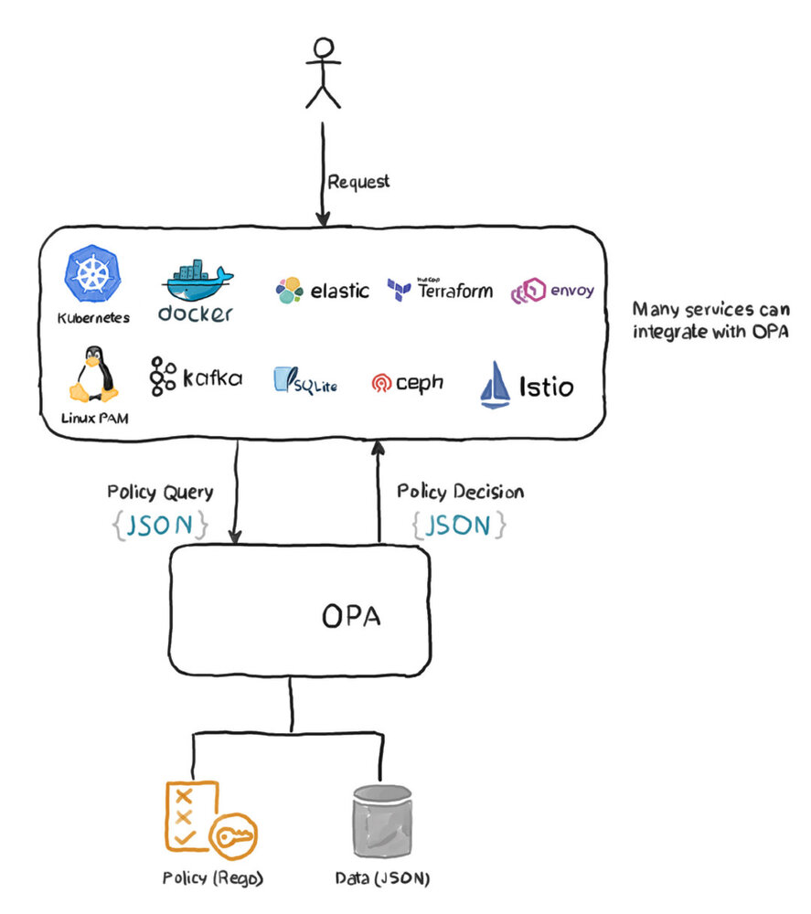

## 什么是 OPA？

这是一个始于 2016 年的项目，旨在统一不同技术和系统的策略执行。今天，OPA 被科技行业内的巨头们所使用。例如，Netflix 使用 OPA 来控制对其内部 API 资源的访问。Chef 用它来为他们的终端用户产品提供 IAM 功能。此外，许多其他公司，如 Cloudflare、Pinterest 等，都使用 OPA 在他们的平台上执行策略（如 Kubernetes 集群）。目前，OPA 已从 CNCF 中毕业。

## OPA 有什么用？

你可能想知道 OPA 是怎样诞生的？它试图解决什么问题？事实上，API 和微服务的策略执行就如同微服务本身一样古老。没有一个生产级别的应用程序不执行访问控制、授权和策略。为了理解 OPA 的作用，考虑以下用例：你的公司通过一个在线门户销售笔记本电脑。像所有其他类似的应用程序一样，该门户由一个首页组成，客户在这里看到最新的产品，也许还有一些限时促销活动。如果客户想买东西，他们需要登录或创建一个账户。接下来，使用信用卡或其他方法付款。为了确保客户会反复访问，需要支持客户订阅，其中可能包含特别折扣信息。另外，他们可以选择在新产品公布后立即接收浏览器通知。一个非常典型的网上购物应用程序，对吗？现在，让我们用一张图来描述一下这个工作流程是什么样子的，以使这个过程可视化。


上图显示了我们系统内部可能的样子。我们有一些微服务，它们相互沟通，为我们的客户提供服务。现在，显然，Bob 不应该看到系统的任何内部运作。例如，他不能查看（或甚至不知道）归档付款的 S3 Bucket，或通知 API 可以与哪些服务联络。但是，John 呢？他是应用开发者，他需要访问所有的微服务，以便在问题发生时能够进行故障排除和调试。要是他不小心（或故意）对数据库服务进行了一个 API 调用，把客户的送货地址改到了别的地方，怎么办？更糟糕的是，如果他对客户的信用卡号码有读取权限怎么办？为了解决这些风险，我们在每个微服务的之前放置了一个授权控制。该控件检查认证用户是否有必要的权限来执行请求的操作。这样的授权系统可以是内部的、自制的程序，也可以是 AWS IAM 提供的外部程序。这就是一个典型的微服务应用程序的构建和安全。但是，看看使用几种不同的授权系统的缺点，特别是随着应用程序的增长而带来的麻烦。

- 修改现有的策略，或引入新的策略，是一场噩梦。试想一下，你需要访问多少地方才能让 Alice 拥有对所有存储相关系统的读取权限。这意味着 S3、MySQL、MongoDB，也许还有一个外部 API，仅此而已。
- 开发者没有办法在他们自己的系统上执行策略。他们显然可以在应用程序中硬编码他们的授权逻辑，但这使事情变得错综复杂：试图在不同的微服务中统一策略是非常复杂的。
- 补充前一点，为本地服务引入一个新的策略可能需要改变代码，从而引入所有微服务的新版本。
- 如果你想将策略与现有的用户数据库集成，该怎么办？例如，与人力资源数据库整合。
- 我们需要将策略可视化，以确保它正在做它应该做的事情。随着你的策略变得越来越复杂，这一点变得越来越重要。
- 现代系统由多种技术和服务组成，这些技术和服务是用不同的语言编写的。例如，你可能有运行在 Kubernetes 上的系统核心，以及一堆不属于集群的用 Java、Ruby 和 PHP 编写的传统 API。每个平台都有自己的授权机制。

让我们以 Kubernetes 为例来看看。如果所有用户都被授权访问整个集群，很多讨厌的事情就会发生，比如：

- 给所有的 pod 提供无限的请求和限制，可能会导致随机的 pod 被从节点上驱逐。
- 拉取和使用未经测试的、杂乱无章的镜像，可能包含安全漏洞或恶意内容。
- 使用没有 TLS 的 Ingress 控制器，允许未加密的、不安全的流量进入应用程序。
- 由于整体的复杂性，还有许多其他不可预见的风险。
- 你肯定可以使用 RBAC 和 Pod 安全策略来对集群进行细粒度的控制。但同样，这只适用于集群。在 Kubernetes 集群之外，Kubernetes RBAC 是没有用的。

这就是开放策略代理（OPA）发挥作用的地方。引入 OPA 是为了创建一个统一的方法来执行堆栈中的安全策略。

## OPA 如何工作？

上文中，我们探讨了策略执行和 OPA 试图解决的问题，现在，让我们来看看它是如何工作的。

假设你正在实现我们示例应用程序的支付服务。这个服务负责处理客户的付款。它暴露了一个 API，接受客户的付款。它还允许用户查询特定客户的付款情况。因此，为了获得一个包含 Jane 所做购买的数组，她是公司的一个客户，你向 API 发送一个 GET 请求，路径为 `/payment/jane`。你在授权头中提供你的证书信息并发送请求。响应将是一个 JSON 数组，包含你所要求的数据。然而，由于你不希望所有有网络访问权限的人都能够访问支付 API，看到这样的敏感数据，你需要执行一个授权策略。OPA 以如下方式解决这个问题：

1. 支付 API 向 OPA 查询一个 decision。它伴随着这个查询的一些属性，如请求中使用的 HTTP 方法，路径，用户，等等。
2. OPA 根据已经提供给它的数据来验证这些属性。
3. 在验证之后，OPA 向请求的 API 发送一个 decision，要么允许，要么拒绝。

这里需要注意的是，OPA 将我们的策略决策与执行解耦。OPA 的工作流程可以用下面的图来描述。



OPA 是一个通用的、与领域无关的策略执行工具。它可以与 API、Linux SSH 守护程序、像 CEPH 这样的对象存储等集成。OPA 的设计者有意避免将其建立在任何其他项目的基础上。因此，策略查询和决定不遵循特定的格式。也就是说，你可以使用任何有效的 JSON 数据作为请求属性，只要它提供所需的数据。同样地，来自 OPA 的策略决策也可以是任何有效的 JSON 数据。你选择什么被输入，什么被输出。例如，你可以选择让 OPA 返回一个 TRUE 或 FALSE 的 JSON 对象，一个数字，一个字符串，甚至是一个复杂的数据对象。

## OPA 内部

为了充分理解 OPA 并开始在自己的项目中实施它，你必须熟悉它的功能和组件。让我们从如何定义你的策略开始。

### 策略语言 Rego

Rego 是一种高级的声明性语言，是专门为 OPA 建立的。它使定义策略和解决以下问题变得非常容易：Bob 是否被允许对 `/api/v1/products` 执行 GET 请求？他实际上被允许查看哪些记录？

### 部署

当涉及到部署 OPA 时，你有多个选择，这取决于你的具体场景。

- **作为 Go 库**：如果你的应用程序是用 Golang 写的，你可以把 OPA 作为应用程序中的第三方库来实现。
- **作为守护程序**：如果你不使用 Go，那么你可以像其他服务一样，把 OPA 作为一个守护程序来部署。在这种情况下，建议你使用一个 sidecar 容器或在主机上运行。原因是，这种设计可以提高性能和可用性。想象一下，你把 OPA 部署在 Kubernetes 的一个单独的 pod 中，而这个 pod 恰好位于一个单独的节点上，而你的应用 pod 正在那里运行。现在，每当你的服务需要咨询 OPA 的策略决策时，它必须通过网络进行调用，以达到 OPA 运行的 pod。这引入了不必要的延迟，并可能在高峰期导致应用程序的迟滞。


### 如何管理和控制 OPA？

为了进一步减少延迟，设计者决定 OPA 应该把所有的策略数据保存在内存中。这确保了 OPA 不会去查询另一个服务来请求数据。为了处理 OPA，你有一组 API，用于不同的目的。

- **捆绑服务 API**：用于向 OPA 发送策略数据。OPA 不断轮询 Bundle 服务 API，搜索新版本的策略。一旦发现，它就拉取并应用新的版本。
- **状态服务 API**：用于确定服务的状态。它告诉你当前在 OPA 上激活的策略版本。
- **决策日志服务 API**：每当 OPA 做出一个策略决策，它都会记录下来。后来，它把这些日志的批次发送到日志服务 API。这对于审计和故障排除特别有用。
- **构建、测试和调试策略的工具** ：一组命令行工具，你可以使用，如 opa test、opa run、opa check 等。还有一个 [VS Code 插件](https://marketplace.visualstudio.com/items?itemName=tsandall.opa)，可以方便开发。

## 初试 OPA 策略

到现在为止，你应该对 OPA 诞生的原因，它试图解决的问题，以及它的设计和管理方式有了相当清晰的认识。现在是试水的时候了，看看用 Rego 语言创建一个策略是什么样子。第一步是用简单的英语定义你的策略。比如说：“客户应该能够查看自己的付款。财务部门的工作人员应该能够查看任何客户的付款。”

下一步是将策略转换为 Rego 代码。我们可以使用 [Rego playground](https://play.openpolicyagent.org/) 来做这件事。因此，在主面板中，清除那里已经添加的代码，并添加以下内容。

```
package play

# Customers should be able to view their own payments
allow = true {
	input.method = "GET"
      input.path = ["payments", customer_id]
      input.user = customer_id
}
```

让我们逐行回顾这个片段。

1. 任何以哈希符号（#）开头的行都是注释。把你的策略应该做的事情写成连贯的、可供人类阅读的注释，总是一个好的做法。
2. allow = true 意味着如果以下的 “评估 “为真，决策将被允许。
3. 输入方法是 GET。任何其他 HTTP 方法（POST、PUT 等）都会违反策略。
4. 路径是 `/payments/customer_id`。注意，customer_id 没有加引号，这意味着它是一个变量，需要在调用时被替换。
5. 用户也应该是 customer_id。

如果我们把这段代码翻译成普通英语，它看起来就像这样。

“如果请求使用的方法是 GET，路径是 `/payments/customer_id`，并且用户是同一个 customer_id，则允许该请求。这实际上允许客户查看自己的支付数据。”

Rego playground 还允许你评估你的代码，并确保该策略将按预期工作。在 INPUT 面板中，我们可以通过添加以下代码来伪造一个合法请求。

```json
{
    "method": "GET",
    "path": ["payments","bob"],
    "user": "bob"
}
```

注意，INPUT 使用的是任意的 JSON。在提供请求时，没有特定的规则可以遵循。现在，让我们看看 OPA 将如何通过按下 Evaluate 按钮来响应这个决策请求。OUTPUT 面板应该显示如下内容。

```json
{
    "allow": true
}
```

下面是执行上述步骤后的 playground 截图。


现在，让我们试着把请求中的用户改为 alice，这意味着一个客户正试图查看另一个客户的付款。如果我们按 Evaluate 键，你会发现输出显示一个空的 JSON 对象 {}。原因是，OPA 不知道当策略不匹配时应该发送什么。要改变这种行为，在策略的主体前添加以下语句。

```
default allow = false
```

因此，整个策略应该是这样的。

```
package play

# Customers should be able to view their own payments
default allow = false
allow = true {
	input.method = "GET"
      input.path = ["payments", customer_id]
      input.user = customer_id
}
```

现在，如果你按下 Evaluate，你会看到预期的输出。

```json
{
    "allow": false
}
```

请注意，这个 playground 非常强大，你可以选择策略的一部分，并独立于策略的其他部分进行评估。当你有一个复杂的策略，当它不应该被评估为假时，这可能是超级有用的。在这种情况下，你可以选择策略的部分内容，看看到底哪里出现了缺陷。

好了，现在我们已经执行了策略的第一部分，让我们继续第二部分：财务部门的工作人员应该能够查看任何客户的付款。

在我们之前定义的策略后面添加以下几行。

财务部门的工作人员可以查看任何客户的付款。

```
allow = true {
    input.method = "GET"
    input.path = ["payments", customer_id]
    finance[input.user]
}

finance = {"john","mary","peter","vivian"}
```

这个策略的大部分内容与之前的相似，除了第 4 行。我们不是评估用户 ID 是否与客户 ID 相同，而是评估用户是否是财务 JSON 对象的一部分。Rego 有很多内置结构，允许你做很多有用的事情，包括查找。最后，我们定义财务对象并添加在该组中工作的员工的用户名。在现实世界中，这个 JSON 对象将作为 INPUT 请求的一部分或作为一个标记传递。现在，让我们通过将用户和客户设置为相同的名字（例如，Bob）来测试该策略。该策略应该返回 true。将用户改为 john（他是财务部门的一部分），并测试该策略。同样，它应该返回真。最后，将用户改为不在财务部门工作的任何名字（比方说，jane），该策略应该返回错误。

你可以参考[官方文档](https://www.openpolicyagent.org/docs/latest/policy-language/)，阅读更多关于 Rego 语言和你能用它做什么。

## 将 OPA 与其他系统集成

如前所述，OPA 可以与当今的许多平台集成。让我们来看看 OPA 可以为你做什么的几个例子。

**Kubernetes**

- 确保入口主机名只由前端团队改变。
- 拒绝拉取任何镜像，除了来自企业 Docker 注册中心的镜像。
- 对集群上创建的任何 pod 强制使用请求和限制。

**API 授权**

你可以将 OPA 与 Envoy、Istio 和其他平台一起使用，强制执行 IAM 控制。例如，你可以轻松控制安全人员对敏感数据的访问。

**Linux PAM**

可插拔认证模块（PAM）长期以来一直被用于 Linux，为包括 SSH 和 sudo 在内的多种服务提供细粒度的控制。OPA 有一个 PAM 插件，使其能够与 PAM 集成并执行策略。例如，你可以限制 SSH 对你的生产机器的访问，除非在非工作时间，或者除非用户有一个支持工单。

还有许多其他产品可以与 OPA 集成，提供无穷的可能性。例如，Kafka、ElasticSearch、SQLite 和 CEPH，仅举几例。

## 概要总结

- 对授权的需求和软件本身一样古老。
- 由于缺乏一个可以在不同系统和平台之间使用的中央授权系统，导致了许多问题。例如，API 可能有自己的授权逻辑内置于代码中，其他微服务可能依赖于一个或多个外部授权系统。这使得推出新的策略，检查现有策略的版本，甚至引入小的变化都是非常具有挑战性的操作。
- OPA 就像一个服务顾问，为需要的服务做出授权决策。服务向 OPA 提出决策查询，然后 OPA 根据已经存储在其中的策略审查查询，并作出决策回应。
- OPA 的设计是通用的，与平台无关。因此，在发送查询或定义输出的样子时，你不需要遵循任何规则。请求和响应是以 JSON 格式发送的。
- 策略可以用 Rego 编写，这是一种专门为 OPA 设计的语言。类似于 JavaScript，OPA 使其非常容易将纯英语规则转换为有效的 OPA 策略。
- Rego playground 工具是一个很好的方法，可以在实施策略之前尝试你的策略。
- OPA 可以作为 Go 库部署，成为应用程序二进制的一部分，也可以作为独立的守护程序。
- 由于策略决策发生在每个 API 请求中，强烈建议将 OPA 守护程序尽可能紧密地放在应用程序中。例如，作为 Kubernetes pod 中的一个 sidecar 容器，或者作为一个运行在节点上的守护程序。这种做法有助于减少延迟和减少网络流量。
- OPA 使用了许多 API，可以很容易地注入新策略，检查现有策略的版本和状态，或收集审计和日志数据。
- 在这篇文章中，我们看了一个简单的演示，即如何使用 Rego 语言来执行一个策略。在这个例子中，我们展示了通过 Rego 语言和 playground 工具来执行一个复杂的策略并对其进行测试是多么容易。
- OPA 可以与许多现代的系统和平台集成，如 Kubernetes、Kafka、SQLite、CEPH 和 Terraform。通过 PAM 插件，它还可以与 Linux PAM 集成，对使用 PAM 的 Linux 守护进程（如 sshd 和 sudo）实施高级策略控制。
