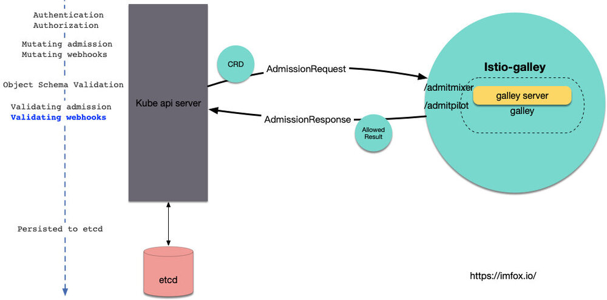
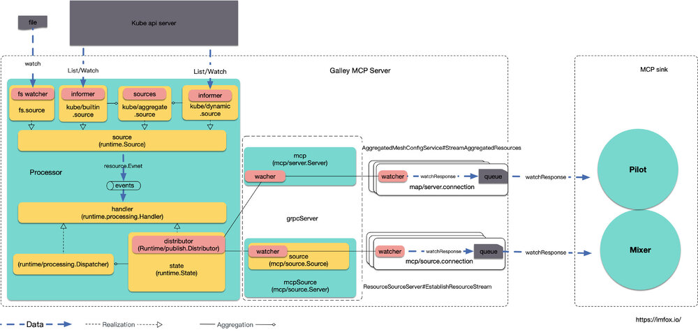

> 作者：钟华，腾讯云容器产品中心高级工程师，热衷于容器、微服务、service mesh、istio、devops 等领域技术。

今天我们来解析 istio 控制面组件 Galley。Galley Pod 是一个单容器单进程组件，没有 sidecar, 结构独立，职责明确。


[查看高清原图](006tKfTcgy1g187dn7s1tj315m0u0x6t.jpg)

前不久 istio 1.1 版本正式发布，其中 istio 的配置管理机制有较大的改进，以下是[1.1 release note](https://istio.io/about/notes/1.1/) 中部分说明：

> Added [Galley](https://istio.io/docs/concepts/what-is-istio/#galley) as the primary configuration ingestion and distribution mechanism within Istio. It provides a robust model to validate, transform, and distribute configuration states to Istio components insulating the Istio components from Kubernetes details. Galley uses the [Mesh Configuration Protocol (MCP)](https://github.com/istio/api/tree/release-1.1/mcp) to interact with components

Galley 原来仅负责进行配置验证，1.1 后升级为整个控制面的配置管理中心，除了继续提供配置验证功能外，Galley 还负责配置的管理和分发，Galley 使用 **网格配置协议**(Mesh Configuration Protocol) 和其他组件进行配置的交互。

今天对 Galley 的剖析大概有以下方面：

- Galley 演进的背景
- Galley 配置验证功能
- MCP 协议
- Galley 配置管理实现浅析

## Galley 演进的背景

在 k8s 场景下，「配置 (Configuration)」一词主要指 yaml 编写的 Resource Definition, 如 service、pod, 以及扩展的 CRD( Custom Resource Definition), 如 istio 的 VirtualService、DestinationRule 等。

**本文中「配置」一词可以等同于 k8s Resource Definition + istio CRD**

声明式 API 是 Kubernetes 项目编排能力“赖以生存”的核心所在，而「配置」是声明式 API 的承载方式。

> Istio 项目的设计与实现，其实都依托于 Kubernetes 的声明式 API 和它所提供的各种编排能力。可以说，Istio 是在 Kubernetes 项目使用上的一位“集大成者”
>
> Istio 项目有多火热，就说明 Kubernetes 这套“声明式 API”有多成功

k8s 内置了几十个 Resources, istio 创造了 50 多个 CRD, 其复杂度可见一斑，所以有人说面向 k8s 编程近似于面向 yaml 编程。

早期的 Galley 仅仅负责对「配置」进行运行时验证，istio 控制面各个组件各自去list/watch 各自关注的「配置」, 以下是 istio 早期的 Configuration flow:


越来越多且复杂的「配置」给 istio 用户带来了诸多不便，主要体现在：

- 「配置」的缺乏统一管理，组件各自订阅，缺乏统一回滚机制，配置问题难以定位
- 「配置」可复用度低，比如在 1.1 之前，每个 mixer adpater 就需要定义个新的 CRD.
- 另外「配置」的隔离，ACL 控制，一致性，抽象程度，序列化等等问题都还不太令人满意。

随着 istio 功能的演进，可预见的 istio CRD 数量还会继续增加，社区计划将 Galley 强化为 istio「配置」控制层，Galley 除了继续提供「配置」验证功能外，还将提供配置管理流水线，包括输入，转换，分发，以及适合 istio 控制面的「配置」分发协议 (MCP).

本文对 Galley 的分析基于 istio tag 1.1.1 (commit 2b13318)

## Galley 配置验证功能

在[istio 庖丁解牛 (二) sidecar injector](https://imfox.io/2019/03/19/istio-analysis-2/)中我分析了 istio-sidecar-injector 如何利用 MutatingWebhook 来实现 sidecar 注入，Galley 使用了 k8s 提供的另一个 Admission Webhooks: ValidatingWebhook, 来做配置的验证：



istio 需要一个关于 ValidatingWebhook 的配置项，用于告诉 k8s api server, 哪些 CRD 应该发往哪个服务的哪个接口去做验证，该配置名为 istio-galley, 简化的内容如下：

```go
%kubectl get ValidatingWebhookConfiguration istio-galley -oyaml

apiVersion: admissionregistration.k8s.io/v1beta1
kind: ValidatingWebhookConfiguration
metadata:
  name: istio-galley
webhooks:
- clientConfig:
  ......
    service:
      name: istio-galley
      namespace: istio-system
      path: /admitpilot
  failurePolicy: Fail
  name: pilot.validation.istio.io
  rules:
  ...pilot关注的CRD...
    - gateways
    - virtualservices
  ......
- clientConfig:
  ......
    service:
      name: istio-galley
      namespace: istio-system
      path: /admitmixer
  name: mixer.validation.istio.io
  rules:
  ...mixer关注的CRD...
    - rules
    - metrics
  ......
```

可以看到，该配置将 pilot 和 mixer 关注的 CRD, 分别发到了服务 istio-galley 的`/admitpilot`和`/admitmixer`, 在 Galley 源码中可以很容易找到这 2 个 path Handler 的入口：

```go
h.HandleFunc("/admitpilot", wh.serveAdmitPilot)
h.HandleFunc("/admitmixer", wh.serveAdmitMixer)
```

## MCP 协议

MCP 提供了一套配置订阅和分发的 API, 在 MCP 中，可以抽象为以下模型：

- source: 「配置」的提供端，在 Istio 中 Galley 即是 source
- sink: 「配置」的消费端，在 istio 中典型的 sink 包括 Pilot 和 Mixer 组件
- resource: source 和 sink 关注的资源体，也就是 istio 中的「配置」

当 sink 和 source 之间建立了对某些 resource 的订阅和分发关系后，source 会将指定 resource 的变化信息推送给 sink, sink 端可以选择接受或者不接受 resource 更新 (比如格式错误的情况), 并对应返回ACK/NACK 给 source 端。

MCP 提供了 gRPC 的实现，实现代码参见：<https://github.com/istio/api/tree/master/mcp/v1alpha1>,

其中包括 2 个 services: `ResourceSource` 和 `ResourceSink`, 通常情况下，source 会作为 gRPC 的 server 端，提供`ResourceSource`服务，sink 作为 gRPC 的客户端，sink 主动发起请求连接 source; 不过有的场景下，source 会作为 gRPC 的 client 端，sink 作为 gRPC 的 server 端提供`ResourceSink`服务，source 主动发起请求连接 sink.

以上 2 个服务，内部功能逻辑都是一致的，都是 sink 需要订阅 source 管理的 resource, 区别仅仅是哪端主动发起的连接请求。

具体到 istio 的场景中：

- 在单 k8s 集群的 istio mesh 中，Galley 默认实现了`ResourceSource` service, Pilot 和 Mixer 会作为该 service 的 client 主动连接 Galley 进行配置订阅。
- Galley 可以配置去主动连接远程的其他 sink, 比如说在多 k8s 集群的 mesh 中，主集群中的Galley可以为多个集群的Pilot/Mixer提供配置管理, 跨集群的Pilot/Mixer无法主动连接主集群Galley, 这时候 Galley 就可以作为 gRPC 的 client 主动发起连接，跨集群的Pilot/Mixer作为gRPC server 实现`ResourceSink`服务，

两种模式的示意图如下：


## Galley 配置管理实现浅析

galley 进程对外暴露了若干服务，最重要的就是基于 gRPC 的 mcp 服务，以及 http 的验证服务，除此之外还提供了 prometheus exporter 接口以及 Profiling 接口：

```go
if serverArgs.EnableServer { // 配置管理服务
	go server.RunServer(serverArgs, livenessProbeController, readinessProbeController)
}
if validationArgs.EnableValidation { // 验证服务
	go validation.RunValidation(validationArgs, kubeConfig, livenessProbeController, readinessProbeController)
}

// 提供 prometheus exporter
go server.StartSelfMonitoring(galleyStop, monitoringPort)

if enableProfiling {
    // 使用包net/http/pprof
    // 通过 http server 提供 runtime profiling 数据
	go server.StartProfiling(galleyStop, pprofPort)
}
// 开始探针更新
go server.StartProbeCheck(livenessProbeController, readinessProbeController, galleyStop)
```

接下来主要分析下「配置」管理服务的实现：

```go
go server.RunServer(serverArgs, livenessProbeController, readinessProbeController)
```

下面是 Galley 配置服务结构示意图：



[查看高清原图](006tKfTcgy1g1n8o76s8yj31r10u0trx.jpg)

从上图可以看到，Galley 配置服务主要包括 Processor 和 负责 mcp 通信的 grpc Server.

其中 Processor 又由以下部分组成：

- Source: 代表 Galley 管理的配置的来源
- Handler: 对「配置」事件的处理器
- State: Galley 管理的「配置」在内存中状态

### Source

interface Source 代表 istio 关注的配置的来源，其`Start`方法需要实现对特定资源的变化监听。

```go
// Source to be implemented by a source configuration provider.
type Source interface {
	// Start the source interface, provided the EventHandler. The initial state of the underlying
	// config store should be reflected as a series of Added events, followed by a FullSync event.
	Start(handler resource.EventHandler) error

	// Stop the source interface. Upon return from this method, the channel should not be accumulating any
	// more events.
	Stop()
}
```

在 Galley 中，有多个 Source 的实现，主要包括

- `source/fs.source`
- `source/kube/builtin.source`
- `source/kube/dynamic.source`
- `source/kube.aggregate`

其中`source/fs`代表从文件系统中获取配置，这种形式常用于开发和测试过程中，不需要创建实际的 k8s CRD, 只需要 CRD 文件即可，同时`source/fs`也是实现了更新 watch(使用<https://github.com/howeyc/fsnotify>)

`source/kube/builtin.source`处理 k8s 内置的配置来源，包括`Service`, `Node`, `Pod`, `Endpoints`等，`source/kube/dynamic.source`处理其他的 istio 关注的 CRD, `source/kube.aggregate`是多个 Source 的聚合，其本身也实现了 Source interface:

```go
type aggregate struct {
	mu      sync.Mutex
	sources []runtime.Source
}

func (s *aggregate) Start(handler resource.EventHandler) error {
	......
	for _, source := range s.sources {
		if err := source.Start(syncHandler); err != nil {
			return err
		}
	}
	......
```

`source/kube/builtin.source`、`source/kube/dynamic.source`本身都包含一个 k8s SharedIndexInformer:

```go
// source is a simplified client interface for listening/getting Kubernetes resources in an unstructured way.
type source struct {
	......
	// SharedIndexInformer for watching/caching resources
	informer cache.SharedIndexInformer

	handler resource.EventHandler
}
```

二者的`Start`方法的实现，正是用到了 k8s 典型的 Informer+list/watch 模式，获取关注「配置」的变化事件，在此不再赘述。

Source 获得「配置」更新事件后，会将其推送到 Processor 的 events chan 中，events 长度为 1024, 通过`go p.process()`, `Proccesor`的`handler`会对事件进行异步处理。

```go
func (p *Processor) Start() error {
	......
    events := make(chan resource.Event, 1024)
	err := p.source.Start(func(e resource.Event) {
		events <- e
	})
    ......
	p.events = events

	go p.process()
	return nil
}

func (p *Processor) process() {
loop:
	for {
		select {
		// Incoming events are received through p.events
		case e := <-p.events:
			p.processEvent(e)

		case <-p.state.strategy.Publish:
			scope.Debug("Processor.process: publish")
			p.state.publish()

		// p.done signals the graceful Shutdown of the processor.
		case <-p.done:
			scope.Debug("Processor.process: done")
			break loop
		}

		if p.postProcessHook != nil {
			p.postProcessHook()
		}
	}
    ......
}
```

### Handler 和 State

interface Handler 代表对「配置」变化事件的处理器：

```go
// Handler handles an incoming resource event.
type Handler interface {
	Handle(e resource.Event)
}
```

在 istio 中有多个 Handler 的实现，典型的有：

- Dispatcher
- State

Dispatcher 是多个 Handler 的集合：

```go
type Dispatcher struct {
	handlers map[resource.Collection][]Handler
}
```

State 是对 Galley 的内存中的状态，包括了 Galley 当前持有「配置」的 schema、发布策略以及内容快照等：

```go
// State is the in-memory state of Galley.
type State struct {
	name   string
	schema *resource.Schema

	distribute  bool
	strategy    *publish.Strategy
	distributor publish.Distributor

	config *Config

	// version counter is a nonce that generates unique ids for each updated view of State.
	versionCounter int64

	// entries for per-message-type State.
	entriesLock sync.Mutex
	entries     map[resource.Collection]*resourceTypeState

	// Virtual version numbers for Gateways & VirtualServices for Ingress projected ones
	ingressGWVersion   int64
	ingressVSVersion   int64
	lastIngressVersion int64

	// pendingEvents counts the number of events awaiting publishing.
	pendingEvents int64

	// lastSnapshotTime records the last time a snapshot was published.
	lastSnapshotTime time.Time
}
```

同时 State 也实现了 interface `Handler`, 最终「配置」资源将会作为快照存储到 State 的`distributor`中，`distributor`实际的实现是 mcp 包中的`Cache`, 实际会调用 mcp 中的`Cache#SetSnapshot`.

### Distributor、Watcher 和 Cache

在 mcp 包中，有 2 个 interface 值得特别关注：Distributor 和 Watcher

interface Distributor 定义了「配置」快照存储需要实现的接口，State 最终会调用`SetSnapshot`将配置存储到快照中。

```go
// Distributor interface allows processor to distribute snapshots of configuration.
type Distributor interface {
	SetSnapshot(name string, snapshot sn.Snapshot)

	ClearSnapshot(name string)
}
```

interface Watcher 功能有点类似 k8s 的 list/watch, Watch 方法会注册 mcp sink 的 watch 请求和处理函数：

```go
// Watcher requests watches for configuration resources by node, last
// applied version, and type. The watch should send the responses when
// they are ready. The watch can be canceled by the consumer.
type Watcher interface {
	// Watch returns a new open watch for a non-empty request.
	//
	// Cancel is an optional function to release resources in the
	// producer. It can be called idempotently to cancel and release resources.
	Watch(*Request, PushResponseFunc) CancelWatchFunc
}
```

struct `mcp/snapshot.Cache` 同时实现了 Distributor 和 Watcher interface:

```go
type Cache struct {
	mu         sync.RWMutex
	snapshots  map[string]Snapshot
	status     map[string]*StatusInfo
	watchCount int64

	groupIndex GroupIndexFn
}
```

mcp 服务端在接口 `StreamAggregatedResources`和`EstablishResourceStream`中，会调用 Watch 方法，注册 sink 连接的 watch 请求：

```go
sr := &source.Request{
	SinkNode:    req.SinkNode,
	Collection:  collection,
	VersionInfo: req.VersionInfo,
}
w.cancel = con.watcher.Watch(sr, con.queueResponse)
```

`mcp/snapshot.Cache` 实现了 interface Distributor 的`SetSnapshot`方法，该方法在 State 状态变化后会被调用，该方法会遍历之前 watch 注册的 responseWatch, 并将 WatchResponse 传递给各个处理方法。

```go
// SetSnapshot updates a snapshot for a group.
func (c *Cache) SetSnapshot(group string, snapshot Snapshot) {
	c.mu.Lock()
	defer c.mu.Unlock()

	// update the existing entry
	c.snapshots[group] = snapshot

	// trigger existing watches for which version changed
	if info, ok := c.status[group]; ok {
		info.mu.Lock()
		defer info.mu.Unlock()

		for id, watch := range info.watches {
			version := snapshot.Version(watch.request.Collection)
			if version != watch.request.VersionInfo {
				scope.Infof("SetSnapshot(): respond to watch %d for %v @ version %q",
					id, watch.request.Collection, version)

				response := &source.WatchResponse{
					Collection: watch.request.Collection,
					Version:    version,
					Resources:  snapshot.Resources(watch.request.Collection),
					Request:    watch.request,
				}
				watch.pushResponse(response)

				// discard the responseWatch
				delete(info.watches, id)

				scope.Debugf("SetSnapshot(): watch %d for %v @ version %q complete",
					id, watch.request.Collection, version)
			}
		}
	}
}
```

提供给 Watch 的处理函数`queueResponse`会将 WatchResponse 放入连接的响应队列，最终会推送给 mcp sink 端。

```go
// Queue the response for sending in the dispatch loop. The caller may provide
// a nil response to indicate that the watch should be closed.
func (con *connection) queueResponse(resp *WatchResponse) {
	if resp == nil {
		con.queue.Close()
	} else {
		con.queue.Enqueue(resp.Collection, resp)
	}
}
```

最后上一张 Galley mcp 服务相关模型 UML:


[查看高清原图](https://imfox.io/assets/images/istio-a/galley_uml.png)

Galley 源代码展示了面向抽象 (interface) 编程的好处，Source 是对「配置」数据源的抽象，Distributor 是「配置」快照存储的抽象，Watcher 是对「配置」订阅端的抽象。抽象的具体实现可以组合起来使用。另外 Galley 组件之间也充分解耦，组件之间的数据通过chan/watcher等流转.

关于早期 istio 配置管理的演进计划，可以参考 2018 年 5 月 CNCF KubeCon talk [Introduction to Istio Configuration - Joy Zhang](https://www.youtube.com/watch?v=x1Tyw8dFKjI&index=2&t=0s&list=LLQ2StCCdx81xHxHxBO0foGA) (需。翻.墙), 1.1 版本中 Galley 也还未完全实现该文中的 roadmap, 如 configuration pipeline 等。未来 Galley 还会继续演进。

## 参考资料

- [Introduction to Istio Configuration](https://www.youtube.com/watch?v=x1Tyw8dFKjI&index=2&t=0s&list=LLQ2StCCdx81xHxHxBO0foGA)
- [google doc Mesh Configuration Protocol (MCP)](https://docs.google.com/document/d/1o2-V4TLJ8fJACXdlsnxKxDv2Luryo48bAhR8ShxE5-k/edit#heading=h.qex63c29z2to)
- [github Mesh Configuration Protocol (MCP)](https://github.com/istio/api/tree/master/mcp)
