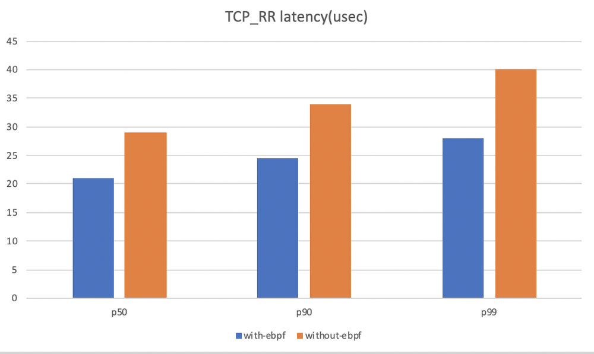
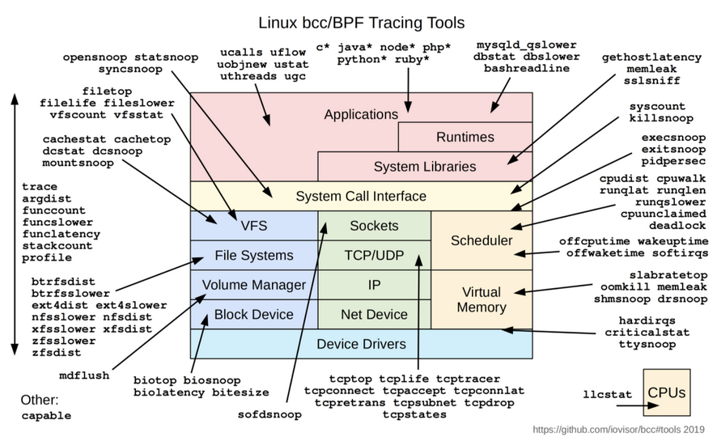
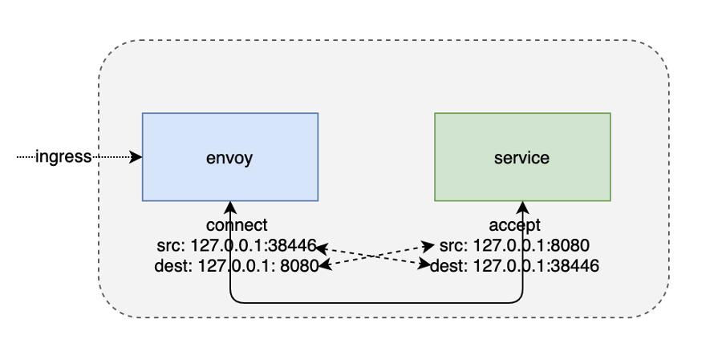
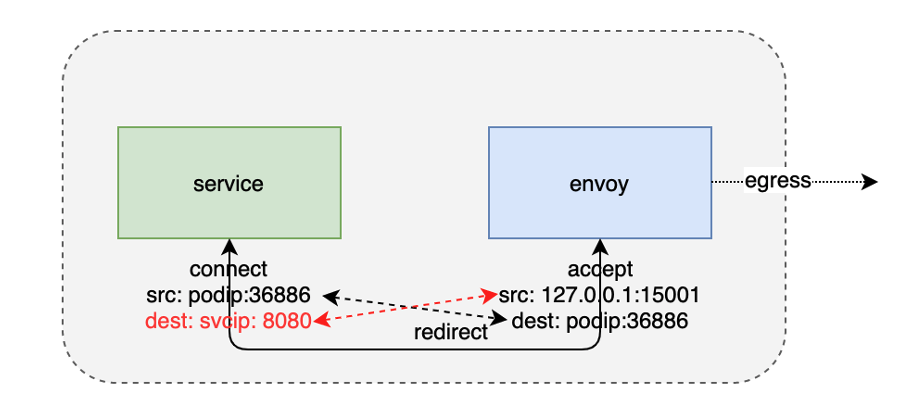
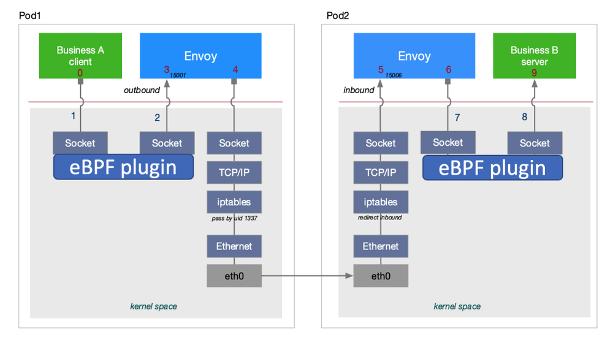
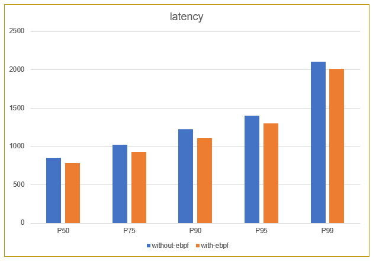
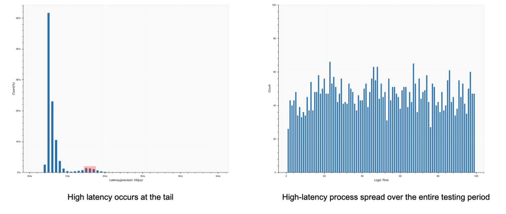
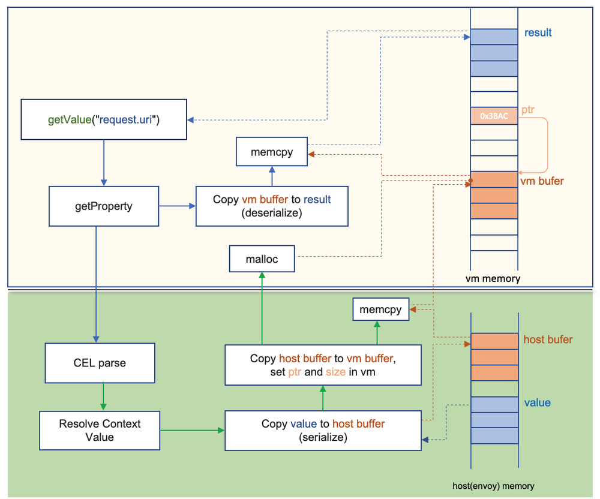
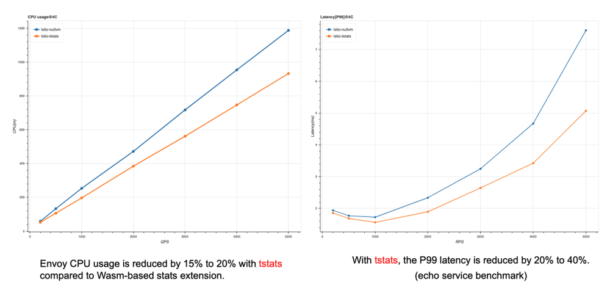
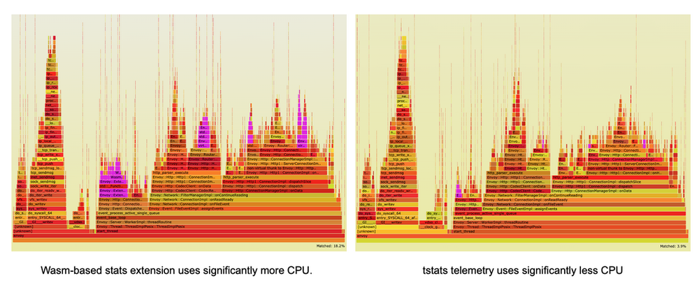

彭磊，陈凌鹏，腾讯云高级软件工程师，目前负责 TCM 服务网格产品，致力于打造云原生服务网格。本文首发于[腾讯云+社区](https://cloud.tencent.com/developer/article/1685873)。

在腾讯，已经有很多产品已使用或者正在尝试使用 istio 来作为其微服务治理的基础平台。不过在使用 istio 时，也有一些对通信性能要求较高的业务会对 istio 的性能有一些担忧。由于 envoy sidecar 的引入，使两个微服务之间的通信路径变长，导致服务延时受到了一些影响，istio 社区一直以来也有这方面的声音。基于这类抱怨，我们希望能够对这一通信过程进行优化，以更好的满足更多客户的需求。

首先，我们看一下 istio 数据面的通信模型，来分析一下为什么会对延时有这么大的影响。可以看到，相比于服务之间直接通信，在引入 istio 之后，通信路径会有明显增加，主要包括多出了两次本地进程之间的 tcp 连接通信和用户态网络代理 envoy 对数据的处理。所以我们的优化也分为了两部分进行。

## 内核态转发优化

那么对于本地进程之间的通信优化，我们能做些什么呢？其实在开源社区已经有了这方面的探索了。istio 官方社区在 2019 年 1 月的时候已经有了这方面讨论，在文档里面提到了使用 ebpf 的技术来做 socket 转发的数据代理，使数据在 socket 层进行转发，而不需要再往下经过更底层的 TCP/IP 协议栈的一个处理，从而减少它在数据链路上的通信链路长度。

另外，网络开源项目 cilium 也在这方面有一个比较深入的实践，同样也是使用了 ebpf 的技术。不过在 cilium 中本地[网络加速](https://cloud.tencent.com/product/dsa?from=10680)只是其中的一个模块，没有作为一个独立的服务进行开发实践，在腾讯云内部没法直接使用，这也促使了我们开发一个无依赖的解决方案。

当然在初期的时候，我们也对 ebpf 的技术进行了一个验证，从验证结果中可以看到，在使用了 ebpf 的技术之后，它的延时大概有 20% 到 30% 的提升，说明 ebpf 的技术应用在本地通讯上还是有一定优化能力的。

简单介绍一下 ebpf，看一下它是怎么做到加速本地通讯的。首先 ebpf 可以看作是一个运行在内核里面的虚拟机，用户编写的 ebpf 程序可以被加载到内核里面进行执行。内核的一个 verify 组件会保证用户的 ebpf 程序不会引发内核的 crash，也就是可以保证用户的 ebpf 程序是安全的。目前 ebpf 程序主要用来追踪内核的函数调用以及安全等方面。下图可以看到，ebpf 可以用在很多内核子系统当中做很多的调用追踪。

另外一个比较重要的功能，就是我们在性能优化的时候使用到的在网络上的一个能力，也就是下面提到的 sockhash。sockhash 本身是一个 ebpf 特殊的一个 kv 存储结构，主要被用作内核的一个 socket 层的代理。它的 key 是用户自定义的，而 value 是比较特殊的，它存储的 value 是内核里面一个 socket 对象。存储在 sockhash 中的 socket 在发送数据的时候，如果能够通过我们挂在 sockhash 当中的一个 ebpf 当中的程序找到接收方的 socket，那么内核就可以帮助我们把发送端的数据直接拷贝到接收端 socket 的一个接收队列当中，从而可以跳过数据在更底层的处理，比如 TCP/IP 协议栈的处理。

在 sidecar 中，socket 是怎样被识别并存储在 sockhash 当中来完成一个数据拷贝的呢？我们需要分析一下数据链的本地通讯的流量特征。

首先从 ingress 来讲，ingress 端的通信会比较简单一点，都是一个本地地址的通信。ingress 端的 envoy 进程和用户服务进程之间通信，它的原地址和目的地址刚好是一一对应的。所以我们可以利用这个地址的四元组构造它的 key，把它存储到 sockhash 当中。在发送数据的时候，根据这个地址信息反向构造这个 key，从 sockhash 当中拿到接收端的 socket 返回给内核，这样内核就可以帮我们将这个数据直接拷贝给接收端的 socket。

egress 会稍微复杂一点，在一个 egress 端服务程序对外发出的请求被 iptables 规则重定向到了 envoy 监听的一个 15001 的端口。在这里，发起方的源地址和接收方的目的地址是一一对应的，但是发起方的目的地址和接收端的源地址有了一个变化，主要是由于 iptables 对地址有一个重写。所以我们在存储到 sockhash 中的时候，需要对这部分信息进行一个处理。由于 istio 的特殊性，直接可以把它改写成 envoy 所监听的一个本地服务地址。这样再存储到 sockhash 当中，它们的地址信息还是可以反向一一对应的。所以在查找的时候，还是可以根据一端的 socket 地址信息查找到另一端的 socket，达到数据拷贝的目的。

经过对 ebpf 加速原理的分析，我们开发出来一个 ebpf 的插件，这个插件可以不依赖于集群本身的网络模式，使用 daemonset 方式部署到 k8s 集群的各个节点上。其中的通信效果如下图所示，本地进程的一个通信在 socket 层直接被 ebpf 拦截以后，就不会再往下发送到 TCPIP 协议栈了，直接在 socket 层就进行了一个数据拷贝，减少了数据链路上的一个处理流程。

下面是对效果的一个测试，从整体来看，它的延时有大概 5% 到 8% 的延时提升，其实提升的幅度不是很大，主要原因其实在整个通信的流程当中，内核态的一个处理占整个通信处理的时间，延时其实是比较少的一部分，所以它的提升不是特别明显。

另外 ebpf 还有一些缺陷，比如它对内核版本的要求是在 4.18 版本之后才有 sockhash 这个特性。另外 sockhash 本身还有一些 bug，我们在测试当中也发现了一些 bug，并且把它提交到社区进行解决。

## Envoy 性能研究与优化

前面介绍了对 istio 数据面对流量在内核的处理所进行的一些优化。在 istio 数据面的性能问题上，社区注意到比较多的是在内核态有一个明显的转发流程比较长的问题，因此提出了使用 eBPF 进行优化的方案，但是在 Envoy 上面没有太多的声音。虽然 Envoy 本身是一个高性能的网络代理，但我们还是无法确认 Envoy 本身的损耗是否对性能造成了影响，所以我们就兵分两路，同时在 Envoy 上面进行了一些研究。

首先什么是 Envoy？Envoy 是为分布式环境而生的高性能网络代理，可以说基本上是作为服务网格的通用数据平面被设计出来的。Envoy 提供不同层级的 filter 架构，如 listenerFilter、networkFilter 以及 HTTPFilter，这使 envoy 具有非常好的可扩展性。Envoy 还具有很好的可观察性，内置有 stats、tracing、logging 这些子系统，可以让我们更容易地对系统进行监控。

进行 istio 数据面优化的时候，我们面对的第一个问题是 Envoy 在 istio 数据面中给消息转发增加了多少延时？Envoy 本身提供的内置指标是很难反映 Envoy 本身的性能。因此，我们通过修改 Envoy 源码，在 Envoy 处理消息的开始与结束的位置进行打点，记录时间戳，可以获得 Envoy 处理消息的延时数据。Envoy 是多线程架构，在打点时我们考虑了性能和线程安全问题：如何高效而又准确地记录所有消息的处理延时，以方便后续的进行分析？这是通过如下方法做到的：

a. 给压测消息分配唯一数字 ID;

b. 在 Envoy 中预分配一块内存用于保存打点数据，其数据类型是一个结构体数组，每个元素都是同一条消息的打点数据；

c. 提取消息中的数字 ID 当作时间戳记录的下标，将时间戳记录到预分配的内存的固定位置。通过这种方式，我们安全高效地实现了 Envoy 内的打点记录（缺点是需要修改 Envoy 以及压测工具）。

经过离线分析，我们发现了 Envoy 内消息处理延时的一些分布特征。左图是对 Envoy 处理延时与消息数量分布图，横轴是延时，纵轴是消息数量。可以看到在高延时部份，消息数量有异常增加的现象，这不是典型的幂率分布。进一步对高延时部份进行分析后发现，这些高延时消息均匀地分布于整个测试期间（如上图右所示）。根据我们的经验，这通常是 Envoy 内部转发消息的 worker 在周期性的执行一些消耗 CPU 的任务，导致有一部分消息没办法及时转发而引起的。

深入研究 Envoy 在 istio 数据面的功能实现后，我们发现 mixer 遥测可能是导致这个问题的根本原因。Mixer 是 istio 老版本 (1.4 及以前) 实现遥测和策略检查功能的一个组件。在数据面的 Envoy 中，Mixer 会提取所有消息的属性，然后批量压缩上报到 mixer server，而属性的提取和压缩是一个高 CPU 的消耗的操作，这会引起延时数据分析中得到的结果：高延时消息转发异常增多。

在确定了原因之后，我们对 Envoy 的架构作了一些改进，给它增加了执行非关键任务的 AsyncWorker 线程，称为异步任务线程。通过把遥测的逻辑拆分出来放到了 AsyncWorker 线程中去执行，就解决了 worker 线程被阻塞的问题，进而可以降低 envoy 转发消息的延时。

进行架构优化之后，我们也做了对比测试，上图左测是延时与消息数量图，可以看到它高延时部分得到明显的改善。上图右可以看出 Envoy 整体的延时降低了 40% 以上。

优化 Envoy 架构给我们带来了第一手的经验，首先 CPU 是影响 Istio 数据面性能的关键资源，它的瓶颈主要出现在 CPU 上面，而不是网络 IO 操作。第二，我们对 Envoy 进行架构优化，可以降低延时，但是没有解决根本问题，因为 CPU 的使用没有降低，只是遥测逻辑转移到另外的线程中执行，降低 Envoy 转发消息的延时。优化 CPU 使用率才是数据面优化的核心。第三点，Envoy 的不同组件当中，mixer 消化掉了 30% 左右的 CPU，而遥测是 mixer 的核心功能，因此后续遥测优化就变成了优化的重要方向。

怎么进行遥测优化呢？其实 mixer 实现遥测是非常复杂的一套架构，使用 Istio mixer 遥测的人都深有体会，幸好 istio 新版本中，不止对 istio 的控制面作了大的调整，在数据面 mixer 也同样被移除了，意味着 Envoy 中高消耗的遥测就不会存在了，我们是基于 istio 在做内部的 service mesh，从社区得到这个消息之后，我们也快速跟进，引入适配新的架构。

没有 Mixer 之后，遥测是如何实现的。Envoy 提供了使用 wasm 对其进行扩展的方式，以保持架构的灵活性。而 istio 社区基于 Wasm 的扩展开发了一个 stats extension 扩展，实现了一个新的遥测方案。与 mixer 遥测相比，这个 stats extension 不再上报全量数据到 mixer server，只是在 Envoy 内的 stats 子系统中生成遥测指标。遥测系统拉取 Envoy 的指标，就可以获得整个遥测数据，会大大降低遥测在数据面的性能消耗。

然后我们对 istio 1.5 使用 Wasm 的遥测，做了一个性能的测试。发现整个 Envoy 代理在同样测试条件下，它的 CPU 降低 10%，而使用 mixer 的遥测其实占用了 30% 的 CPU，里面大部分逻辑是在执行遥测。按我们的理解，Envoy 至少应该有 20% 的 CPU 下降，但是实际效果只有 10% 左右，这是为什么呢？

新架构下我们遇到了新的问题。我们对新架构进行了一些实现原理和技术细节上的分析，发现 Envoy 使用 Wasm 的扩展方式，虽然带来了灵活性和可扩展性，但是对性能有一定的影响。

首先，Wasm 扩展机制跟 Envoy host 环境是通过内存拷贝的方式进行通信，这是 Wasm 虚拟机的隔离性机制决定的。Envoy 为了保持架构灵活性的同时保证性能，使设计了一个非 Wasm 虚拟机运行扩展（如 stats extension）的模式，即 NullVM 模式，它是一个假的 Wasm 虚拟机，实际上运行的扩展还是被编译在 Envoy 内部，但它也逃离不掉 Wasm 架构带来的内存拷贝影响。

其次，在实现 extension 与 Envoy 的通信时，一个属性的获取要经过多次的内存拷贝，是一个非常复杂的过程。如上图所示，获取 request.url 这个属性需要在 Envoy 的内存和 Wasm 虚拟机内存之间进行一个复杂的拷贝操作，这种方式的消耗远大于通过引用或指针提取属性。

第三，在实现遥测的时候，有大量的属性需要获取，通常有十几二十个属性，因此 Wasm 扩展带来的总体额外损耗非常可观。

另外，Wasm 实现的遥测功能还需要另外一个叫做 metadata_exchange 扩展的支持。metadata_exchange 用来获得调用对端的一些节点信息，而 metadata_exchange 扩展运行在另外一个虚拟机当中，通过 Envoy 的 Filter state 机制与 stats 扩展进行通信，进一步增加了遥测的额外消耗。

那么如何去优化呢？简单对 Wasm 插件优化是没有太大帮助，因为它的底层 Wasm 机制已经决定了它有不少的性能损耗，所以我们就开发了一个新的遥测插件 tstats。tstats 使用 Envoy 原生的扩展方式开发。在 tstats 扩展内部，实现了遥测和 metadata_exchange 的结合，消除了 Wasm 带来的性能弊端。Tstats 遥测与社区遥测兼容，生成相同的指标，tstats 基于 istio 控制面的 EnvoyFilter CRD 进行部署，用户可以平滑升级，当用户发现 tstats 的功能没有满足需求或者出现一些问题时，也可以切换使用到社区提供的遥测扩展。

在 tstats 扩展还优化了遥测指标的计算过程。在计算指标的时候有许多维度信息需要填充，（目前大指标有二十几个维度的填充），这其实是一个比较复杂的操作，其实，有很多指标的维度都是节点信息，就是发起服务调用的客户端和服务端的一些信息，如服务名、版本等等。其实我们可以将它进行一些缓存，加速这些指标的计算。

经过优化之后，对比 tstats 遥测和官方的基于 Wasm 的遥测的性能，我们发现 CPU 降低了 10 到 20%，相对于老版本的 mixer 来说降低了 20% 以上，符合了我们对 envoy 性能调研的一个预期。上图右可以看到在延时上有一个明显的降低，即使在 P99 在不同的 QPS 下，也会有 20% 到 40% 的总体降低 (这个延时是使用 echo service 做 End-to-End 压测得到的)。

使用火焰图重新观察一下 Envoy 内部的 CPU 使用分布，我们发现 tstats 遥测插件占用 CPU 的比例明显更少，而使用 wasm 的遥测插件有一个明显的 CPU 占用来实现遥测，这也证明了 tstats 优化是有效果的。

## 总结

前面我们分享了在优化 istio 数据面过程当中，在内核态和 Envoy 内探索的一些经验。这是我们优化的主要内容，当然还有一些其它的优化点，例如:

- 使用 XDP 进行加速，因为由于 istio proxy 的引入，Pod 和 Pod 之间的访问实际上是不需要经过主机上的 iptables 规则处理。基于这一点，我们可以利用 XDP 的快速转发能力直接将包发送到对应的网卡，完成快速转发。
- 链路跟踪在 Envoy 中消耗的 CPU 也比较可观，即使在 1% 的采样率下也消耗了 8% 的 CPU，是可以进行优化的，所以我们也在做这部分的工作。
- Envoy 内部有非常多的内置统计，Istio 的一些指标与 Envoy 内置的指标有一部分重复，可以考虑进行一些裁剪优化，或者增加一些特性开关，当不需要使用的时候对它进行关闭。

总体来说，Istio 数据面性能的损耗分布在各个环节，并不是单独的内核态消息转发或者用户态 Envoy 就消耗特别多。在使用 Mixer 架构的 Istio 版本中，Envoy 内一个明显的性能热点， mixer 遥测，这也在版本迭代中逐步解决了。

最后，在进行 Istio 数据面优化的时候需要综合考虑各个环节，这也是我们目前总体上对 Istio 数据面性能的一个认识，通过这次分享，希望社区和大家都会在更注重 Istio 数据面的性能，帮助 ServiceMesh 更好地落地。腾讯云基于 Istio 提供了云上 Service Mesh 产品 TCM，大家有兴趣可以来体验。

## 问题

- **怎么判断项目需要使用服务网格？** 服务网格解决的最直接的场景就是你的服务需要进行微服务治理，但是你们之前可能有多个技术栈，没有一个统一的技术框架，比如没有使用 SpringCloud 等。缺少微服务治理能力，但是又想最低成本获得链路跟踪、监控、流量管理、熔断等这样的能力，这个时候可以使用服务网格实现。
- **这次优化有没有考虑到回归到社区？** 其实我们也考虑过这个问题，我们在进行 mixer 优化的时候，当时考虑到需要对 Envoy 做比较多的改动，并且了解到社区规划从架构中去掉 mixer，所以这个并没有回归到社区，异步任务线程架构的方案目前保留在内部。对于第二点开发的 tstats 扩展，它的功能和社区的遥测是一样的，如果提交到社区我们觉得功能会有重叠，所以没有提交给社区。
- **服务网格数据调优给现在腾讯的业务带来了哪些改变？** 我想这里主要还是可观测性上面吧，之前很多的服务和开发，他们的监控和调用面的上面做得都是差强人意的，但是他们在业务的压力之下，其实是没有很完善的方式、没有很大的动力快速实现这些服务治理的功能，使用 istio 之后，有不少团队都获得了这样的能力，他们给我们的反馈都是比较好的。
- **在减少延迟方面，腾讯做了哪些调整，服务网格现在是否已经成熟，对开发者是否友好？** 在延迟方面，我们对性能的主要探索就是今天分享的内容，我们最开始就注意到延时比较高，然后在内核做了相应的优化，并且研究了在 Envoy 内为什么会有这些延迟。所以我们得出的结论，CPU 是核心的资源，需要尽量降低数据面 Proxy 代理对 CPU 的使用，这是我们做所有优化最核心的出发点，当 CPU 降下来，延时就会降低。服务网格现在是否已经成熟。我觉得不同的人有不同答案，因为对一些团队，目前他们使用服务网格使用得很好的，因为他们有多个技术栈，没有统一的框架。他们用了之后，获得这些流量的管理和监控等等能力，其实已经满足了他们的需求。但是对一些成熟的比较大的服务，数据面性能上面可能会有一些影响，这个需要相应的团队进行仔细的评估才能决定，并没办法说它一定就是能在任何场景下可以直接替换现有的各个团队的服务治理的方式。
- **为什么不直接考虑 1.6？** 因为我们做产品化的时候，周期还是比较长的。istio 社区发版本的速度还是比较快的，我们还在做 1.5 产品化的时候，可能做着做着，istio1.6 版本就发出来了，所以我们也在不停更新跟迭代，一直在跟随社区，目前主要还是在 1.5 版本上。其实我们在 1.4 的时候就开始做现在的产品了。
- **公司在引入多种云原生架构，包括 SpringCloud 和 Dubbo，作为运维，有必要用 Istio 做服务治理吗？另外 SpringCloud 和 Dubbo 这种架构迁移到 Istio，如何调整？** 目前 SpringCloud 和 Dubbo 都有不错的服务治理功能，如果没有非常紧迫的需求，比如你们又需要引入新的服务并且用别的语言实现，我觉得继续使用这样的框架，可能引入 istio 没有太大的优势。但是如果考虑进行更大规模的服务治理，包括融合 SpringCloud 和 Dubbo, 则可以考虑使用 istio 进行一个合并的，但是这个落地会比较复杂。那么 SpringCloud 和 Dubbo 迁移到 Istio 如何调整？目前最复杂的就是他们的服务注册机制不一样，服务注册模型不一样。我们之前内部也有在预研如何提供一个统一的服务注册模型，以综合 Istio 和其它技术框架如 SpringCloud 的服务注册和服务发现，以及 SpringCloud 如何迁移进来。这个比较复杂，需要对 SDK 做一些改动，我觉得可以下来再进行交流。
