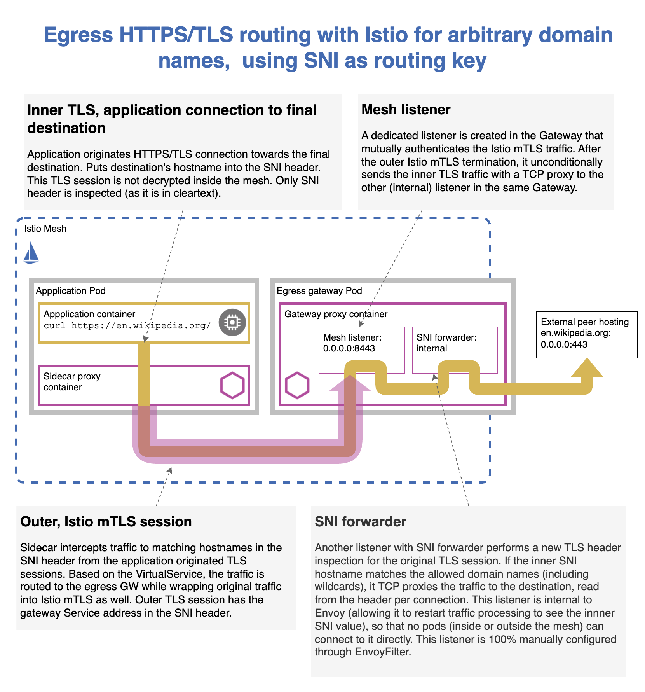

本文译自：<https://istio.io/latest/blog/2023/egress-sni/>

摘要：一种通用方法，用于动态设置出口网关，可以将流量路由到一组受限制的目标远程主机，包括通配符域名。

---

如果您正在使用 Istio 处理来自网格外部目标的应用程序发起的流量，那么您可能熟悉出口网关的概念。出口网关可用于监控并转发来自网格内应用程序的流量到网格外的位置。如果您的系统在受限环境中运行，并且希望控制从网格到公共互联网上可以访问什么，那么这是一个有用的功能。

在[官方 Istio 文档](https://archive.istio.io/v1.13/docs/tasks/traffic-management/egress/wildcard-egress-hosts/#wildcard-configuration-for-arbitrary-domains)中，直到版本1.13，包括配置出口网关以处理任意通配符域名的用例，但随后被移除，因为文档中的解决方案没有得到官方支持或推荐，而且可能在将来的 Istio 版本中失效。尽管如此，旧的解决方案仍然可以在1.20之前的 Istio 版本中使用。然而，Istio 1.20 放弃了一些对该方法工作所需的 Envoy 功能。

本文试图描述我们如何解决了这个问题，并通过使用与 Istio 版本无关的组件和 Envoy 功能以及无需单独的 Nginx SNI 代理来填补这个空白。我们的方法允许旧解决方案的用户在系统面临 Istio 1.20 的重大变化之前无缝迁移配置。

## 需要解决的问题

当前文档记录的出口网关用例依赖于流量的目标（主机名）在 `VirtualService` 中静态配置，告诉出口网关 pod 中的 Envoy 在哪里 TCP 代理匹配的出站连接。您可以使用多个，甚至是通配符的 DNS 名称来匹配路由条件，但是您无法将流量路由到应用程序请求中指定的确切位置。例如，您可以匹配 `*.wikipedia.org` 的目标流量，但然后您需要将流量转发到单个最终目标，例如 `en.wikipedia.org`。如果有另一个服务，例如 `anyservice.wikipedia.org`，它不是由与 `en.wikipedia.org` 相同的服务器托管的，那么对该主机的流量将失败。这是因为尽管 HTTP 负载的 TLS 握手中的目标主机名包含 `anyservice.wikipedia.org`，但 `en.wikipedia.org` 服务器将无法为该请求提供服务。

在高层次上，解决这个问题的方法是在每个新的网关连接中检查应用程序 TLS 握手中的原始服务器名称（SNI 扩展），并将其用作动态 TCP 代理离开网关的目标。

在通过出口网关限制出口流量时，我们需要锁定出口网关，以便只能由网格内的客户端使用。这通过在应用程序 sidecar 和网关之间强制执行 `ISTIO_MUTUAL`（mTLS 对等身份验证）来实现。这意味着应用程序 L7 负载上将有两层 TLS。一层是应用程序发起的端到端 TLS 会话，由最终的远程目标终止，另一层是 Istio mTLS 会话。

还要记住的一件事是，为了减轻任何潜在的应用程序 pod 损坏，应用程序 sidecar 和网关都应执行主机名列表检查。这样，任何被入侵的应用程序 pod 仍然只能访问允许的目标，而不能访问更多内容。

## 低级别的 Envoy 编程拯救

最近的 Envoy 版本包括一种动态 TCP 转发代理解决方案，它使用每个连接的 SNI 头来确定应用程序请求的目标。虽然 Istio `VirtualService` 不能配置像这样的目标，但我们可以使用 `EnvoyFilter` 来更改 Istio 生成的路由指令，以便使用 SNI 头来确定目标。

要使所有这些工作，我们首先配置一个自定义的出口网关来监听出站流量。

使用 `DestinationRule` 和 `VirtualService`，我们指示应用程序 sidecar 将流量（针对一组选定的主机名）路由到该网关，使用 Istio mTLS。在网关 pod 的一侧，我们使用上面提到的 `EnvoyFilter` 来构建 SNI 转发器，引入了内部 Envoy 监听器和集群，以使其全部工作。最后，我们将网关实现的 TCP 代理的内部目标补丁到内部 SNI 转发器。

以下图表显示了端到端请求流程：



## 部署示例

要部署示例配置，首先创建 `istio-egress` 命名空间，然后使用以下 YAML 部署一个出口网关，以及一些 RBAC 和其 `Service`。在此示例中，我们使用网关注入方法创建网关。根据您的安装方法，您可能希望以不同的方式部署它（例如，使用 `IstioOperator` CR 或使用 Helm）。

```yaml
# 将 egressgateway 放入 Service 注册中的新 k8s 集群服务，以便应用程序 sidecar 可以在网格内将流量路由到它。
apiVersion: v1
kind: Service
metadata:
  name: egressgateway
  namespace: istio-egress
spec:
  type: ClusterIP
  selector:
    istio: egressgateway
  ports:
  - port: 443
    name: tls-egress
    targetPort: 8443

---
# 使用注入方法部署网关
apiVersion: apps/v1
kind: Deployment
metadata:
  name: istio-egressgateway
  namespace: istio-egress
spec:
  selector:
    matchLabels:
      istio: egressgateway
  template:
    metadata:
      annotations:
        inject.istio.io/templates: gateway
      labels:
        istio: egressgateway
        sidecar.istio.io/inject: "true"
    spec:
      containers:
      - name: istio-proxy
        image: auto # 每次 pod 启动时都会自动更新镜像。
        securityContext:
          capabilities:
            drop:
            - ALL
          runAsUser: 1337
          runAsGroup: 1337

---
# 设置角色以允许读取 TLS 凭据
apiVersion: rbac.authorization.k8s.io/v1
kind: Role
metadata:
  name: istio-egressgateway-sds
  namespace: istio-egress
rules:
- apiGroups: [""]
  resources: ["secrets"]
  verbs: ["get", "watch", "list"]
- apiGroups:
  - security.openshift.io
  resourceNames:
  - anyuid
  resources:
  - securitycontextconstraints
  verbs:
  - use

---
apiVersion: rbac.authorization.k8s.io/v1
kind: RoleBinding
metadata:
  name: istio-egressgateway-sds
  namespace: istio-egress
roleRef:
  apiGroup: rbac.authorization.k8s.io
  kind: Role
  name: istio-egressgateway-sds
subjects:
- kind: ServiceAccount
  name: default
```

验证 `istiod` 和网关日志是否存在任何错误或警告。如果一切顺利，您的网格 sidecar 现在正在将 `*.wikipedia.org` 请求路由到您的网关 pod，而网关 pod 然后将它们转发到应用程序请求中指定的确切远程主机。

## 试一下

与其他 Istio 出口示例一样，我们将使用 [sleep](https://github.com/istio/istio/tree/release-1.20/samples/sleep) pod 作为发送请求的测试源。假设在您的默认命名空间中启用了自动 sidecar 注入，请使用以下命令部署测试应用程序：

```shell
$ kubectl apply -f https://raw.githubusercontent.com/istio/istio/release-1.20/samples/sleep/sleep.yaml
```

获取您的 sleep 和网关 pods：

```shell
$ export SOURCE_POD=$(kubectl get pod -l app=sleep -o jsonpath={.items..metadata.name})
$ export GATEWAY_POD=$(kubectl get pod -n istio-egress -l istio=egressgateway -o jsonpath={.items..metadata.name})
```

运行以下命令以确认您能够连接到 `wikipedia.org` 网站：

```shell
$ kubectl exec "$SOURCE_POD" -c sleep -- sh -c 'curl -s https://en.wikipedia.org/wiki/Main_Page | grep -o "<title>.*</title>"; curl -s https://de.wikipedia.org/wiki/Wikipedia:Hauptseite | grep -o "<title>.*</title>"'

<title>Wikipedia, the free encyclopedia</title>
<title>Wikipedia – Die freie Enzyklopädie</title>
```

我们可以访问英语和德语的 `wikipedia.org` 子域名，非常棒！

通常，在生产环境中，我们会[阻止未经配置的外部请求](https://istio.io/latest/docs/tasks/traffic-management/egress/egress-control/#change-to-the-blocking-by-default-policy)，这些请求未经过出口网关重定向。但由于我们在测试环境中没有这样做，让我们访问另一个外部站点进行比较：

```shell
$ kubectl exec "$SOURCE_POD" -c sleep -- sh -c 'curl -s https://cloud.ibm.com/login | grep -o "<title>.*</title>"'

<title>IBM Cloud</title>
```

由于我们在清单中全局启用了访问日志记录（使用 `Telemetry` CR），我们现在可以检查日志以查看代理如何处理上述请求。

首先，检查网关日志：

```shell
$ kubectl logs -n istio-egress $GATEWAY_POD

[...]
[2023-11-24T13:21:52.798Z] "- - -" 0 - - - "-" 813 111152 55 - "-" "-" "-" "-" "185.15.59.224:443" dynamic_forward_proxy_cluster 172.17.5.170:48262 envoy://sni_listener/ envoy://internal_client_address/ en.wikipedia.org -
[2023-11-24T13:21:52.798Z] "- - -" 0 - - - "-" 1531 111950 55 - "-" "-" "-" "-" "envoy://sni_listener/" sni_cluster envoy://internal_client_address/ 172.17.5.170:8443 172.17.34.35:55102 outbound_.443_.wildcard_.egressgateway.istio-egress.svc.cluster.local -
[2023-11-24T13:21:53.000Z] "- - -" 0 - - - "-" 821 92848 49 - "-" "-" "-" "-" "185.15.59.224:443" dynamic_forward_proxy_cluster 172.17.5.170:48278 envoy://sni_listener/ envoy://internal_client_address/ de.wikipedia.org -
[2023-11-24T13:21:53.000Z] "- - -" 0 - - - "-" 1539 93646 50 - "-" "-" "-" "-" "envoy://sni_listener/" sni_cluster envoy://internal_client_address/ 172.17.5.170:8443 172.17.34.35:55108 outbound_.443_.wildcard_.egressgateway.istio-egress.svc.cluster.local -
```

这里有四条日志条目，代表我们三个 curl 请求中的两个。每一对显示了单个请求如何通过 envoy 流量处理管道流动。它们以相反的顺序打印，但我们可以看到第2和第4行显示请求到达了网关服务，并通过内部的 `sni_cluster` 目标。第1和第3行显示最终目标是从内部 SNI 头中确定的，即应用程序设置的目标主机。请求将转发到 `dynamic_forward_proxy_cluster`，最终从 Envoy 发送到远程目标。

很好，但是第三个请求到 IBM Cloud 在哪里？让我们检查 sidecar 的日志：

```shell
$ kubectl logs $SOURCE_POD -c istio-proxy

[...]
[2023-11-24T13:21:52.793Z] "- - -" 0 - - - "-" 813 111152 61 - "-" "-" "-" "-" "172.17.5.170:8443" outbound|443|wildcard|egressgateway.istio-egress.svc.cluster.local 172.17.34.35:55102 208.80.153.224:443 172.17.34.35:37020 en.wikipedia.org -
[2023-11-24T13:21:52.994Z] "- - -" 0 - - - "-" 821 92848 55 - "-" "-" "-" "-" "172.17.5.170:8443" outbound|443|wildcard|egressgateway.istio-egress.svc.cluster.local 172.17.34.35:55108 208.80.153.224:443 172.17.34.35:37030 de.wikipedia.org -
[2023-11-24T13:21:55.197Z] "- - -" 0 - - - "-" 805 15199 158 - "-" "-" "-" "-" "104.102.54.251:443" PassthroughCluster 172.17.34.35:45584 104.102.54.251:443 172.17.34.35:45582 cloud.ibm.com -
```

正如您所看到的，Wikipedia 请求通过网关发送，而对 IBM Cloud 的请求直接从应用程序 pod 发送到互联网，如 `PassthroughCluster` 日志所示。

## 结论

我们使用出口网关实现了对 egress HTTPS/TLS 流量的受控路由，支持任意和通配符

域名。在生产环境中，本文中显示的示例将扩展以支持高可用性要求（例如，添加区域感知网关 `Deployment` 等），并限制您的应用程序直接访问外部网络，以便应用程序只能通过网关访问公共网络，而该网关仅限于一组预定义的远程主机名。

这个解决方案很容易扩展。您可以在配置中包含多个域名，并且一旦部署，它们将被列入允许列表！无需为每个域名配置 `VirtualService` 或其他路由详细信息。但是，请注意，域名在配置中的多个地方列出。如果使用 CI/CD 工具（例如 Kustomize），最好将域名列表提取到一个地方，以从中呈现所需的配置资源。

就是这样了！希望这对您有所帮助。如果您是之前使用 Nginx 的解决方案的现有用户，现在可以在升级到 Istio 1.20 之前迁移到此方法，否则会影响您当前的设置。

祝您愉快的 SNI 路由！

## 参考资料

- [Envoy 对于 SNI 转发器的文档](https://www.envoyproxy.io/docs/envoy/latest/configuration/listeners/network_filters/sni_dynamic_forward_proxy_filter)
- [先前的解决方案，使用 Nginx 作为网关中的 SNI 代理容器](https://archive.istio.io/v1.13/docs/tasks/traffic-management/egress/wildcard-egress-hosts/#wildcard-configuration-for-arbitrary-domains)
