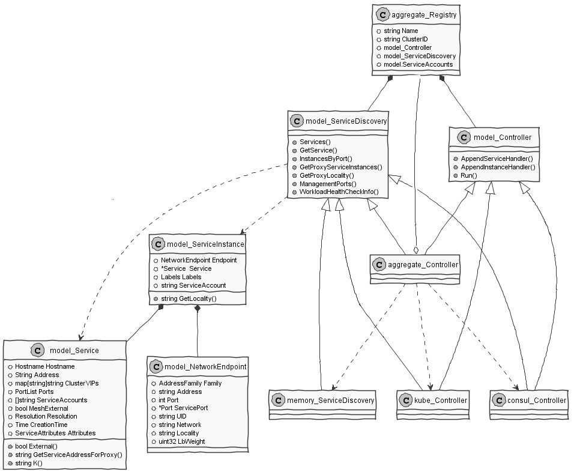
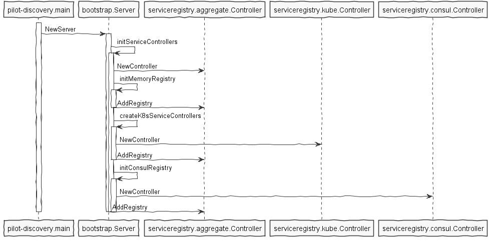

> 本文转载自[赵化冰的博客](https://zhaohuabing.com)。

在 Istio 架构中，Pilot 组件负责维护网格中的标准服务模型，该标准服务模型独立于各种底层平台，Pilot 通过适配器和各底层平台对接，以使用底层平台中的服务数据填充此标准模型。

例如 Pilot 中的 Kubernetes 适配器通过 Kubernetes API Server 到 Kubernetes 中的 Service 以及对应的 Pod 实例，将该数据被翻译为标准模型提供给 Pilot 使用。通过适配器模式，Pilot 还可以从 Cloud Foundry、Consul 中获取服务信息，也可以开发适配器将其他提供服务发现的组件集成到 Pilot 中。

本文将从代码出发，对 Pilot 的服务注册机制进行分析。

备注：本文分析的代码对应 Istio commit 58186e1dc3392de842bc2b2c788f993878e0f123 

## 服务注册相关的对象

首先我们来了解一下 Pilot 中关于服务注册的一些基本概念和相关数据结构。

Istio 源码中，和服务注册相关的对象如下面的 UML 类图所示。



## Service

源码文件：pilot/pkg/model/service.go

Service 用于表示 Istio 服务网格中的一个服务（例如 catalog.mystore.com:8080）。每一个服务有一个全限定域名（FQDN）和一个或者多个接收客户端请求的监听端口。

一个服务可以有一个可选的 负载均衡器/虚拟IP，DNS解析会对应到该虚拟IP（负载均衡器的IP）上。一般来说，不管后端的服务实例如何变化，VIP 是不会变化的，Istio 会维护 VIP 和后端实例真实 IP 的对应关系。

例如在 Kubernetes 中，服务 foo 的 FQDN 为`foo.default.svc.cluster.local`，拥有一个虚拟 IP 10.0.1.1，在端口 80 和 8080 上监听客户端请求。


```go
type Service struct {
        // Hostn/服务器名
        Hostname Hostname `json:"hostname"`

        // 虚拟 IP / 负载均衡器 IP
        Address string `json:"address,omitempty"`

        // 如果服务部署在多个集群中，ClusterVIPs 会保存不同集群中该服务对应的 VIP
        ClusterVIPs map[string]string `json:"cluster-vips,omitempty"`

        // 服务端口列表
        Ports PortList `json:"ports,omitempty"`

        // 运行该服务的服务账号
        ServiceAccounts []string `json:"serviceaccounts,omitempty"`

        // 该服务是否为一个“外部服务”，采用 ServiceEntry 定义的服务该标志为 true
        MeshExternal bool

        // 服务解析规则：包括 
        // ClientSideLB: 由 Envoy 代理根据其本地的 LB pool 进行请求路由
        // DNSLB: 查询 DNS 服务器得到 IP 地址，并将请求发到该 IP
        // Passthrough：将请求发转发到其原始目的地
        Resolution Resolution

        // 服务创建时间
        CreationTime time.Time `json:"creationTime,omitempty"`

        // 服务的一些附加属性
        Attributes ServiceAttributes
}
```

## ServiceInstance

源码文件：pilot/pkg/model/service.go

SercieInstance 中存放了服务实例相关的信息，一个 Service 可以对应到一到多个 Service Instance，Istio 在收到客户端请求时，会根据该 Service 配置的 LB 策略和路由规则从可用的 Service Instance 中选择一个来提供服务。

```go
type ServiceInstance struct {
        // Endpoint 中包括服务实例的 IP：Port，UID 等
        Endpoint       NetworkEndpoint `json:"endpoint,omitempty"`
        // 对应的服务
        Service        *Service        `json:"service,omitempty"`
        // 该实例上的标签，例如版本号
        Labels         Labels          `json:"labels,omitempty"`
        // 运行该服务的服务账号
        ServiceAccount string          `json:"serviceaccount,omitempty"`
}
```


## Registry

源码文件：pilot/pkg/serviceregistry/aggregate/controller.go

Registry 代表一个通过适配器插入到 Pilot 中的服务注册表，即 Kubernetes，Cloud Foundry 或者 Consul 等具体后端的服务部署/服务注册发现平台。

Registry 结构体中包含了 Service Registry 相关的一些接口和属性。
```go
type Registry struct {
        // 注册表的类型，例如 Kubernetes, Consul, 等等。
        Name serviceregistry.ServiceRegistry
        // 某些类型的服务注册表支持多集群，例如 Kubernetes，在这种情况下需要用 CluterID 来区分同一类型下不同集群的服务注册表
        ClusterID string
        // 控制器，负责向外发送该 Registry 相关的 Service 变化消息
        model.Controller
        // 服务发现接口，用于获取注册表中的服务信息
        model.ServiceDiscovery
}
```

Istio 支持以下几种服务注册表类型：

源码文件：pilot/pkg/serviceregistry/platform.go

```go
// ServiceRegistry defines underlying platform supporting service registry
type ServiceRegistry string

const (
        // MockRegistry，用于测试的服务注册表，包含两个硬编码的 test services
        MockRegistry ServiceRegistry = "Mock"
        // ConfigRegistry，可以从 Configstore 中获取定义的 service registry，加入到 Istio 的服务列表中
        KubernetesRegistry ServiceRegistry = "Kubernetes"
        // 从 Consul 获取服务数据的服务注册表
        ConsulRegistry ServiceRegistry = "Consul"
        // 采用“Mesh Configuration Protocol”的服务注册表
        MCPRegistry ServiceRegistry = "MCP"
)
```

其中支持最完善的就是 Kubernetes 了，我在项目中使用了 Consul，填坑的经验证明对 Consul 的支持只是原型验证级别的，要在产品中使用的话还需要对其进行较多的改进和优化。

注册表中最后一个类型是 MCP，MCP 是“Mesh Configuration Protocol" 的缩写。Istio 使用了 MCP 实现了一个服务注册和路由配置的标准接口，MCP Server 可以从 Kubernetes、Cloud Foundry、Consul 等获取服务信息和配置数据，并将这些信息通过 MCP 提供给 MCP Client，即 Pilot，通过这种方式，将目前特定平台的相关的代码从 Pilot 中剥离到独立的 MCP 服务器中，使 Pilot 的架构和代码更为清晰。MCP 将逐渐替换目前的各种 Adapter。更多关于 MCP 的内容参见：

* https://docs.google.com/document/d/1o2-V4TLJ8fJACXdlsnxKxDv2Luryo48bAhR8ShxE5-k/edit
* https://docs.google.com/document/d/1S5ygkxR1alNI8cWGG4O4iV8zp8dA6Oc23zQCvFxr83U/edit

## Controller

源码文件：pilot/pkg/model/controller.go

Controller 抽象了一个 Service Registry 变化通知的接口，该接口会将 Service 及 Service Instance 的增加，删除，变化等消息通知给 ServiceHandler。

调用 Controller 的 Run 方法后，Controller 会一直执行，将监控 Service Registry 的变化，并将通知注册到 Controller 中的 ServiceHandler 中。

```go
type Controller interface {
        // 添加一个 Service Handler，服务的变化会通知到该 Handler
        AppendServiceHandler(f func(*Service, Event)) error

        // 添加一个 Service Instance Handler，服务实例的变化会通知到该 Handler
        AppendInstanceHandler(f func(*ServiceInstance, Event)) error

        // 启动 Controller 的主循环，对 Service Catalog 的变化进行分发
        Run(stop <-chan struct{})
}
```
## ServiceDiscovery

源码文件：pilot/pkg/model/service.go

ServiceDiscovery 抽象了一个服务发现的接口，可以通过该接口获取到 Service Registry 中的 Service 和 Service Instance。
```go
type ServiceDiscovery interface {
        // 列出该 Service Registry 中的所有服务
        Services() ([]*Service, error)

        // 根据主机名查询服务
        // 该接口已废弃
        GetService(hostname Hostname) (*Service, error)

        // 根据主机名，服务端点和标签查询服务实例
        InstancesByPort(hostname Hostname, servicePort int, labels LabelsCollection) ([]*ServiceInstance, error)
		
		// 查询边车代理所在节点上的服务实例 
		GetProxyServiceInstances(*Proxy) ([]*ServiceInstance, error)
		
		// 获取边车代理所在的 Region,Zone 和 SubZone
        GetProxyLocality(*Proxy) string
        
		// 管理端口，Istio 生成的配置会将管理端口的流量排除，不进行路由处理
        ManagementPorts(addr string) PortList

        // 列出用于监控检查的探针
        WorkloadHealthCheckInfo(addr string) ProbeList
}
```

## Service Registry 初始化流程

Service Registry 初始化的主要逻辑在 Pilot-discovery 程序的主函数中，对应的源码为：`pilot/cmd/pilot-discovery/main.go`和`pilot/pkg/bootstrap/server.go`。

在`pilot/pkg/bootstrap/server.go`中，初始化了各种 Service Registry，其流程如下图所示：
（备注：MCP Registry 尚在开发过程中）



Pilot 将各个 Service Registry(Memory, Kube, Consul) 保存在 serviceregistry.aggreagete.Controller 中进行统一管理，Pilot 会从所有类型的 Registry 中查询服务和服务实例，并监控所有 Registry 的数据变化，当 Registry 数据变化后，Pilot 会清空其内部的缓存并通过 ADS 接口向 Envoy 推送更新。


> 备注：上图中的 controller 实际上是 Service Registry，aggregate controller 和具体的各个类型的 controller 同时实现了 Registry 要求的 controller 和 discovery interface。

Registry 的业务逻辑在 Kube Controller 和 Consul controller 中，我们主要使用了 Consul Controller，其主要方法如下：

源码文件：pilot/pkg/serviceregistry/consul/controller.go

```go
▼+Controller : struct
    [fields]
   -client : *api.Client
   -monitor : Monitor
    [methods]
   +AppendInstanceHandler(f func(*model.ServiceInstance, model.Event)) : error
   +AppendServiceHandler(f func(*model.Service, model.Event)) : error
   +GetIstioServiceAccounts(hostname model.Hostname, ports []int) : []string
   +GetProxyServiceInstances(node *model.Proxy) : []*model.ServiceInstance, error
   +GetService(hostname model.Hostname) : *model.Service, error
   +InstancesByPort(hostname model.Hostname, port int, labels model.LabelsCollection) : []*model.ServiceInstance, error
   +ManagementPorts(addr string) : model.PortList
   +Run(stop chan )
   +Services() : []*model.Service, error
   +WorkloadHealthCheckInfo(addr string) : model.ProbeList
   -getCatalogService(name string, q *api.QueryOptions) : []*api.CatalogService, error
   -getServices() : map[string][]string, error
    [functions]
   +NewController(addr string, interval time.Duration) : *Controller, error
```
可以看到 Consul Controller 对象同时实现了 Registry 要求的 Controller 和 ServiceDiscovery 接口，可以提供 Registry 的变化通知和服务查询相关功能。

目前 Consul Controller 的实现比较简单粗暴，定时通过 Consul 的 Rest API 获取服务数据并和上一次的查询结果进行对比，如果数据发生了变化则通知 Pilot discovery 进行更新。该方式发起了大量对 Consul Server 的 HTTP 请求，会导致 Consul Server CPU 占用率高和大量 TCP Socket 处于 TIME_WAIT 状态，不能直接在产品环境下使用。

源码文件：pilot/pkg/serviceregistry/consul/monitor.go

```go
//定时轮询 Consul Server Rest 接口，以获取服务数据变化
func (m *consulMonitor) run(stop <-chan struct{}) {
        ticker := time.NewTicker(m.period)
        for {
                select {
                case <-stop:
                        ticker.Stop()
                        return
                case <-ticker.C:
                        m.updateServiceRecord()
                        m.updateInstanceRecord()
                }
        }
}

//比较这一次和上一次的服务数据，如有变化则回调 ServiceHandler 进行通知
func (m *consulMonitor) updateServiceRecord() {
        svcs, _, err := m.discovery.Catalog().Services(nil)
        if err != nil {
                log.Warnf("Could not fetch services: %v", err)
                return
        }
        newRecord := consulServices(svcs)
        
        if !reflect.DeepEqual(newRecord, m.serviceCachedRecord) {
                // This is only a work-around solution currently
                // Since Handler functions generally act as a refresher
                // regardless of the input, thus passing in meaningless
                // input should make functionalities work
                //TODO
                obj := []*api.CatalogService{}
                var event model.Event
                for _, f := range m.serviceHandlers {
                        go func(handler ServiceHandler) {
                                if err := handler(obj, event); err != nil {
                                        log.Warnf("Error executing service handler function: %v", err)
                                }
                        }(f)
                }
                m.serviceCachedRecord = newRecord
        }
}
```

我们在 Consul Registry 中增加了缓存，并降低了 Pilot 轮询 Consul server 的频率，以减少 Pilot 频繁调用给 Consul server 带来的大量压力，下一步打算采用 Consul watch 来代替轮询，优化 Consul Registry 的服务变化通知机制。
