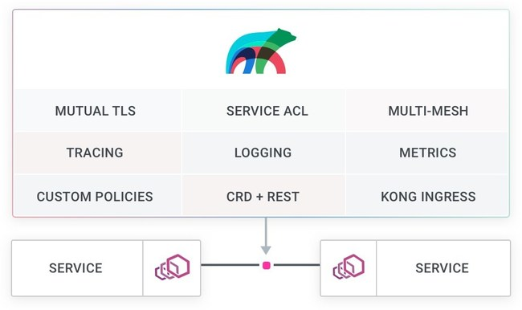

本文为翻译文章，[点击查看原文](https://www.sdxcentral.com/articles/news/kongs-kuma-service-mesh-climbs-the-kubernetes-wall/2019/09/)。

## 编者按

2019年9月10日，Kong正式宣布开源一款Service Mesh：Kuma。此消息一出，立即在云原生社区引起反响，各大媒体争相报道。让我们跟随SDxCentral的总编辑，一起来看看Kong的CTO如何介绍Kuma这款Service Mesh产品以及对于SMI的看法。关于Kuma的具体功能介绍可以阅读[官网博客](https://konghq.com/blog/introducing-kuma-universal-service-mesh/)以及[Github](https://github.com/Kong/kuma)。

翻译一下其Github关于Kuma功能特性的简介如下，方便读者了解：

- **通用的控制平面**: 易于使用，分布式，可以在任何平台运行。
- **轻量的数据平面**: 基于Envoy，可处理任意类型流量。
- **自动化**: 在K8s平台上部署无需任何代码改动，也可在虚拟机上灵活部署。
- **多租户**: 可在一个集群与同一个控制平面上部署多套服务网格。
- **网络安全**: 自动mTLS加密。
- **流量分割**: 灵活的ACL规则。
- **流量追踪**: 与Zipkin和Jaeger自动集成。
- **流量指标**: 与Prometheus/Splunk/ELK自动集成。
- **代理配置模版**: 方便进阶(收费)用户配置Envoy。
- **标签选择器**: 可应用不同地域的、特定于云的和面向团队的策略。
- **平台中立**: 支持K8s, 虚拟机和裸机。
- **强大的APIM Ingress**: 与Kong网关集成。

## 简介

Kong正在将其服务网格平台Kuma打造成一个日益复杂的生态系统，在过去几个月里，许多新加入者和选择涌现出来。

该公司声称Kuma是“一个通用的服务网格”。Kong CTO和联合创始人Marco Palladino解释说，这意味着Kuma不同于市场上的大多数服务网格项目，它的设计初衷是在[Kubernetes](https://www.sdxcentral.com/monitoring/definitions/kubernets-monitoring/)生态系统内部和外部都能工作，这包括虚拟机(VMs)、[容器](https://www.sdxcentral.com/containers/)、legacy环境以及Kubernetes。

Kuma包括一个基于Envoy服务代理的通用控制平面。它结合了数据平面和进阶的控制平面，允许用户使用本地自定义资源定义(CRDs)或RESTful API设置权限、获取指标和设置路由规则。Palladino解释说，早期第一代的服务网格产品大多缺乏成熟的控制平面，需要大量的二次开发或手工定制。

他解释说：“我们希望90%的[用例](https://www.sdxcentral.com/cloud/definitions/software-defined-everything-part-5-sdx-use-cases/)都易于使用，并且能够快速升级。对于另外10%用例的用户，我们有一个允许用户深入使用的策略，”他补充说，尽管Kuma的设计是为了方便使用，“但Kuma是为企业设计的，而不是业余爱好者。”

Kuma的特性包括[software-defined security](https://www.sdxcentral.com/security/)，它支持所有四层通信流的[mTLS](https://www.sdxcentral.com/security/definitions/what-is-software-defined-security/)身份验证；能够实现追踪(trace)和日志(log)记录，从而更好地分析指标；提供流量控制能力，如断路器和健康检查，以增强四层路由。

Palladino说，Kuma保护底层网络的能力提供了可靠性和更深层次的可观察性，并且无需修改任何代码。

Palladino说：“我们努力为Kuma构建一个非常平滑渐进的学习曲线。它的复杂度不会在早期压垮开发人员，并且也不会阻止开发人员走得更远。我们确实为高级用户提供了一个策略来配置底层代理数据平面。”

Kuma还利用了Kong同名的[开源API网关](https://www.sdxcentral.com/articles/news/kong-crushes-api-orchestration-challenges/2018/09/)。该网关管理组织与部署现代[微服务](https://www.sdxcentral.com/networking/nfv/definitions/microservices-architecture-telco-cloud/)的各种方法之间的信息流。

## Kuma加入服务网格竞争行列

Kuma加入了服务网格竞争行列，这个群体与日俱增，声称可以更容易地支持微服务的部署。

Palladino说：“每个人都告诉我们，他们想要使用服务网格，但实际上没有一种服务网格易于使用，而且真正适用企业生产环境。许多企业专注于Kubernetes，但对他们来说，这成为了云原生探索之旅的终点。我们提供了一个产品，允许他们拥有一个可以更早实现并支持他们迁移的服务网格。”

一个已经引起广泛注意的服务网格平台是[Istio](https://www.sdxcentral.com/articles/news/google-drives-direct-istio-access-into-google-kubernetes-engine/2018/11/)。它定位于网络层，使用底层进行微服务开发和维护。这允许将管理运维与应用程序开发分离开来。

Palladino说，Istio帮助照亮了这片天空，但它仍然“非常复杂，有很多活跃的部件”。它在Kubernetes上运行得很好，但并不是所有人都在运行Kubernetes。”

他说，这种关注还会影响Linkerd和Containous等其他服务网格的选择，比如最近推出的[Maesh平台](https://www.sdxcentral.com/articles/news/containous-maesh-barges-into-the-service-mesh-morass/2019/09/)。

“Maesh、Linkerd和其它控制平面网格都高度关注Kubernetes，”Palladino解释说。“只有当企业采用Kubernetes时，它们才会被采用。我们通过在这一过程的早期建立安全和可观察性，实现了向Kubernetes的过渡。”

还需要努力协调服务网格平台之间的互操作性。其中之一由微软牵头，它在今年早些时候率先推出了服务网格接口[SMI](https://www.sdxcentral.com/articles/news/microsoft-spearheads-service-mesh-interoperability-push/2019/05/)规范。它的目标是为开发人员提供运行在Kubernetes上的不同服务网格技术的互操作性。

Palladino将这种努力淡化为边缘化服务网格功能。

“我们根本不相信SMI，”他说。“这是将接口标准化的另一种尝试，让它变得平庸而不优秀。它采用整个社区所有服务网格的公分母，从而降低了它们对最终用户的价值。它界限很宽，但并不深入。”

Palladino认为Kuma才真正实现了可以在所有平台进行互操作。

Kong以Mashape的名字成立于2009年。2015年，它将Kong平台发布到[开源](https://konghq.com/blog/ing-inc/)社区，并于去年对旗下所有业务产品[正式启用](https://konghq.com/blog/introducing-kong-inc/)了该平台的名称。该公司已通过5轮融资[筹集](https://www.crunchbase.com/organization/konghq#section-funding-rounds)了6,910万美元资金，最近一次是在3月份的C轮融资，总额4,300万美元。

## 编者后记

当Istio因其性能表现疲软之际，会涌现一个又一个的新玩家，给市场带来竞争与多样性，这也是用户喜闻乐见的。Kong涉足服务网格并不算太意外，我们可以了解到除了市面上的传统云厂商打造的和开源的各项服务网格产品，Consul Service Mesh的出现也让人眼前一亮。Consul Service Mesh与Kuma背后的厂商均有其成熟的开源产品做强力支撑：Consul的服务发现与注册产品，Kong的网关产品。他们各自在开源社区拥有一片天下，此时推出服务网格产品自然会有一大批“拥趸”。

Kuma的性能较之Istio以及其它服务网格产品的优劣尚未可知，但是其平台中立的思想还是值得借鉴。当前市场上，K8s并未完全普及，很多公司的产品都是部署在虚机甚至裸机上，如果此时又想尝试下服务网格技术，Kuma的出现不失为一种惊喜。
