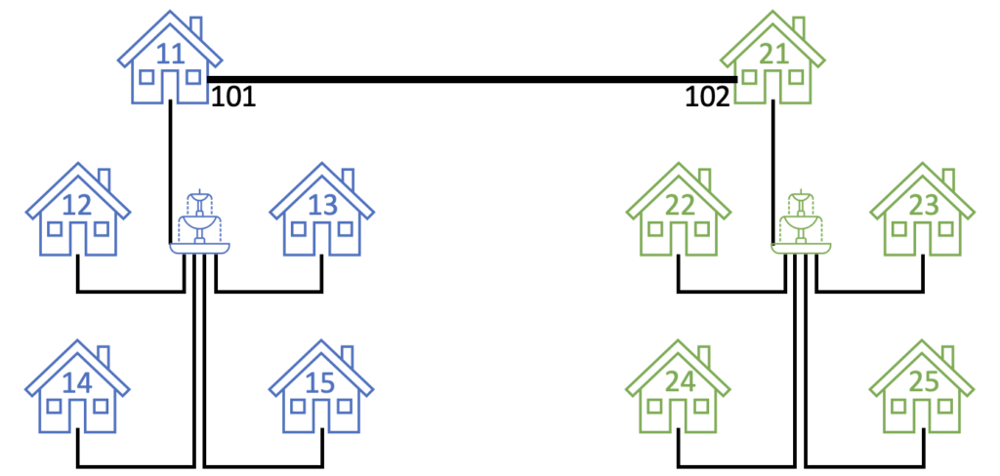

最近对于理解 Kubernetes 中的网络有很大的兴趣。本文是我对这个话题的贡献。我会尽力用直观的方式解释，并将技术部分翻译成易懂的语言，以便任何人都能理解。

最好的学习网络的方式是通过“追踪数据包”或“数据包的生命周期”。基本上，你要跟随数据包从发送者到接收者的旅程，并在每一步停下来。我以前就用 [Calico 实现的 Pod 到另一个 Pod 的通信](https://www.dbi-services.com/blog/exploration-of-calico-in-minikube/) 进行了这样的操作。这次我将使用另一个容器网络接口 (CNI) 叫做 [Cilium](https://cilium.io/)，它基于 eBPF（了解快速和灵活的路由），并带有许多强大的功能和工具。让我们开始吧！

## Kubernetes 中的传统网络

我们将从头开始。我会假设你对网络一无所知。也许你已经知道 IP 地址是什么？IP 地址是计算机网络接口的数字地址。这就是你的计算机可以连接到你的 Wi-Fi 网络并让你访问互联网的方式。如果你使用的是笔记本电脑，你的 Wi-Fi 网络接口有一个 IP 地址。这个网络接口还有另一个由硬件提供商烧录的唯一地址。这个地址称为介质访问控制 (MAC) 地址。

IP 地址属于一个组（IP 子网）。为了知道它属于哪个组，它使用一种称为子网掩码的东西。当子网掩码应用到 IP 地址时，会得到一个结果，对于属于同一组的每个 IP 地址来说，这个结果都是相同的。这就像你所在的社区一样。

让我们用下面的图来做类比：

房子是一台计算机、服务器或虚拟机。它的大小可以不同，根据它的 CPU 和内存，但为了简单起见，我们使用相同的大小。一栋房子有一扇门，这就是你的网络接口。门上的序列号是你的 MAC 地址，房子上的数字（通常是钉在门上的）是你的 IP 地址。只有在你换门时，你的序列号才会改变。然而，你的房子号码是由你的社区的建筑师分配的，如果有重新分配或设计更改，它可能会改变。

蓝色的第 10 个社区（使用从 10 到 19 的数字）属于同一组（同一 IP 子网），而绿色的第 20 个社区是另一组。在每个社区中，有五栋房子，所以有空间让社区成长。在每个社区里，门直接连接到一个喷泉，代表一个交换机。在喷泉处，有一个指示每条路径的标志，指示你可以到达哪扇门。是的，喷泉不知道房子号码，只知道门的序列号。对于人类来说，这不是很方便，所以我们使用一张地图（称为 ARP 表），它提供了房子号码与门的序列号之间的转换。

如果你住在 14 号房子，想拜访 15 号房子，你会使用这条路（只有一条，而且是你的，所以不会有交通堵塞！）先到达喷泉，然后看看标志。你从地图上知道哪个序列号对应哪个房子，所以你可以沿着通往 15 号房子的路线前往。在这种星形拓扑中，你总是先去喷泉，而不是直接去你想要拜访的房子，因为没有直接的路径。社区内的路径代表了第 2 层链接。你无法通过这些路径到达另一个社区。

### 在社区之间旅行

现在，如果从你的 14 号房子，你想要去拜访 24 号房子怎么办？这是另一个社区，这意味着 14 号的 IP 地址/子网掩码与 24 号不同。实际上，第 10 和第 20 社区是不同的。所以你知道目的地是另一个社区，这种情况下，你必须首先去找你的门卫（但总是通过喷泉，正如我们所见）。他是你社区的默认网关，他住在 11 号房子。规则是去找他，对于任何目的地在你社区之外的地方。

只有他有地图（路由表）能够到达第 20 号社区，并且知道应该走哪条路（这被称为第 3 层路由，因为你正在离开你的社区）。这张地图显示了到达 20 号社区的正确门。等一下，如果一扇门是一个网络接口，那么门卫房子是不是还有另一扇门？完全正确！11 号房子有另一扇门，门上有另一个号码（101），当然这扇门上有另一个序列号（MAC 地址）。

通过这扇门出去，你现在可以沿着路径到达第 20 号社区，这个社区有自己的门卫在 21 号房子。这个门卫的地图（路由表）指导你到达目的地的正确门。这扇门让你进入了第 20 号社区，因为你的目的地 24 属于它。门卫还给了你地图（ARP 表），所以你可以在喷泉上找到方向。现在，你可以沿着通往绿色喷泉的路径走了。从那里，你只需跟着标志和路径到达 24 号房子。当你想回家时，你沿着相反的方向走同样的路径回去。

## Kubernetes 中的网络

现在你了解了网络的基础知识，让我们来看看在 Kubernetes 中它是如何工作的。是的，它稍微复杂一些，但让我们一步一步来，使用下面的图片来更好地理解：

我们现在没有房子，而是建筑。建筑之间的网络与传统网络仍然相同，中间有一个交换机/喷泉。建筑的入口有一扇门，上面有建筑的号码（它的 IP 地址），它是 1000 个社区的一份子。一个建筑将代表我们 Kubernetes 集群的一个节点。

你知道 Kubernetes 是一个容器编排器。一个容器包装成一个 pod。为了简单起见，让我们假设一个 pod 只有一个容器，因此这两个术语在这里是等价的。这个 pod 就像我们建筑中的一个私人部分。公寓的大小可以不同，因为它可能有 2、3 或 4 个卧室，这将是你的容器在节点上需要的 CPU 和内存容量。有些公寓是空的，所以建筑仍然有一些容量。然而，在 Kubernetes 中，pod 是根据需要创建和删除的。所以在我们的建筑中，这意味着有时会创建一个 2 卧室的公寓，当不再使用时，它可能会被从建筑物中移除。然后，如果建筑有足够的空间，可能会创建一个 5 卧室的公寓。然后想象一下，这是一座乐高建筑，里面你可以根据需要建造和拆除不同大小的公寓！这不是很棒吗？

在每个建筑物中，容器/pod 有自己的社区（IP 子网）。在 Kubernetes 中，CNI 的功能基本上是为 pod 分配号码（IP 地址），以便它们可以彼此通信。默认情况下，Cilium 为每个建筑使用不同的社区。当创建一个公寓时，Cilium 会为其分配一个号码。当删除并重新创建一个公寓时，它将获得另一个号码，因此它是临时的。这里蓝色的社区使用 10 号范围，绿色的社区使用 20 号。你可以注意到蓝色和绿色社区的数字范围与建筑物的范围不同。只是为了让你知道，这种设计被称为叠加网络。还有其他可能的，但这是常用的一种。这是一个在节点网络之上的 pod 网络。

### 在同一建筑中的公寓之间旅行

现在，你住在 12 号公寓，你要怎么去拜访 14 号公寓？就像我们在传统网络示例中所做的那样，你是我们要追踪的数据包！当然，你通过它的门（它的网络接口）离开公寓。与我们之前的示例不同之处在于，你现在不是离开房子，而是离开了你的公寓，但仍然在建筑物内部。然后你走过一个私人走廊，到达另一扇门（这是 LXC 接口）。

这扇门给了你进入建筑的公共空间的访问，这里进行了路由和派发。我们称之为 Cilium 大厅（蓝色矩形）。当选择 Cilium 为这个 Kubernetes 集群提供通信时，每个建筑物都安装了这个大厅的 Cilium 代理。大厅里有一个门卫，他不住在公寓里，而是在大厅的一个甲板上等待。他有一个服务人员团队，在建筑物的不同门处等候提供指导。这是因为 Cilium 使用一个叫做 eBPF 的魔法路由地图，有效地帮助旅行者。

当你到达走廊尽头的门时，你向等在这里的服务人员表示你要去 14 号。他在他的魔法 eBPF 地图中找到了一个与 14 号相匹配的项目，并直接向你展示了右上角的走廊门。你不必去大厅，他向你展示了一条秘密通道，直接到达那里。然后你打开那扇门，跟着走廊，到达了 14 号公寓。你回去到 12 号公寓，沿着相同的路径和过程，但是方向相反。

因此，这种调度与传统的交换方式不同，并且非常快速，这要归功于魔法 eBPF 地图！

### 在不同建筑物的公寓之间旅行

现在，从 12 号公寓，你想去拜访另一个建筑物里的 22 号公寓。你的旅行开始和以前一样，你离开你的公寓，沿着走廊，询问等待在这里的服务人员的方向。由于目的地是另一个社区的 22 号，这次他把你引导到了大厅。在这里，与传统网络一样，你需要大厅中的门卫的帮助。门卫查看他的地图（路由表），指引你去 22 号的方向，并向你展示要使用的门号码 11（cilium_host）。

当你打开那扇门时，你会看到后面有另一扇门：那就是蓝色的三角形，称为 VXLAN 接口。这扇门通向一个漂亮的透明隧道，穿过建筑物的主门。你受到雨水的保护，可以欣赏到另一个建筑物的景色。你甚至可以看到室外的喷泉！当你到达绿色建筑物时，你离开隧道，去见在绿色三角形（VXLAN 接口）处等待你的服务人员。你告诉他你的目的地，他在他的魔法 eBPF 地图中找到了与 22 号相匹配的项目，并向你展示了一条通往左上角走廊门的秘密通道。然后你跟着走廊，到达了你的目的地。和以前一样，你回去的路线将沿着相同的路径，但方向相反。

这就是第 3 层路由，因为目的社区与你的不同。你可以看到在 Kubernetes 中比传统路由稍微复杂一些。

## 总结

希望这有助于你理解传统网络和 Kubernetes 网络之间的区别，也希望后者现在对你来说更清晰了。如果这就是你所需要的，那么我很高兴你阅读了这篇博文，希望你喜欢它。如果你现在想了解更多关于 Kubernetes 网络的内容，请保持关注，因为我将写一篇 [中级篇](https://www.dbi-services.com/blog/kubernetes-networking-by-using-cilium-intermediate-level-part-1/)，你将在其中看到一个真实集群上建筑物的样子！
