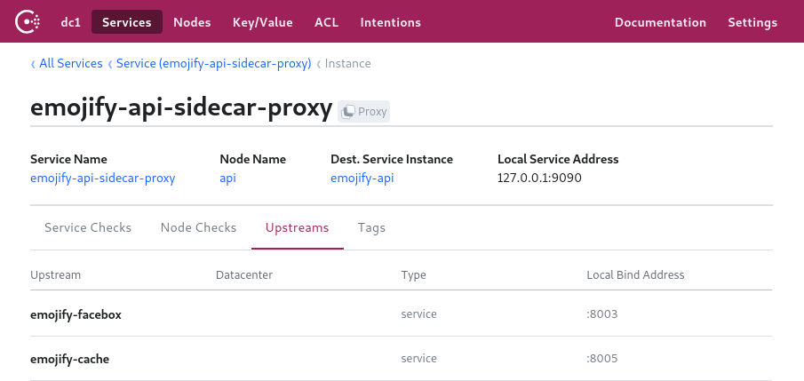
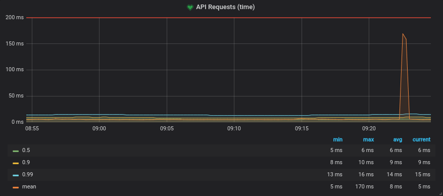

*编者按：Consul团队写了一篇易懂、又有实操的如何在Service Mesh中，实现服务的可观察性的文章。即使没有太多基础，也能比较容易的看懂并了解service mesh中，如何实现服务的度量。*

这是系列博客的第二篇文章，重点介绍Consul服务网格中的新功能。

## 简介

您之前可能已经听过“可观察性”一词，但它实际上意味着什么？ 它只是监控重新品牌，还是更多的可观察性？ 我们正在发布一系列博客文章，讨论服务网格的核心用例。 在本博客中，我们将详细介绍可观察性以及如何启用最近[Consul 1.5发布](https://www.hashicorp.com/blog/hashicorp-consul-1-5)中包含的Consul Connect的新L7可观察性功能。

首先，让我们重新审视一个熟悉的概念：监控。

### 监控

监控意味着使用内部或外部工具检测应用程序和系统，以确定其状态。

例如，您可能有一个外部运行状况检查，用于探测应用程序的状态或确定其当前的资源消耗。 您可能还有内部统计信息，用于报告特定代码块的性能，或执行某个数据库事务所需的时间。

### 可观察性

可观察性来自工程和控制理论的世界。控制理论[指出](https://en.wikipedia.org/wiki/Observability)可观察性本身就是一种描述“从外部产出的知识中推断出系统内部状态的程度”的措施。与监视哪些是你所做的相比，可观察性是系统的属性。如果外部输出，日志记录，度量，跟踪，健康检查等允许您了解其内部状态，则可以观察系统。

可观察性对于频繁发布的现代分布式应用程序尤其重要。与通过进程内调用进行通信的单片体系结构相比，微服务体系结构在服务交互期间会出现更多故障，因为这些调用发生在可能不可靠的网络上。随着为测试创建逼真的类似生产的环境变得越来越困难，在客户开始之前检测生产中的问题变得更加重要。这些服务调用的视图可帮助团队及早发现故障，跟踪故障并设计弹性。

借助模块化和可独立部署的（微）服务，很难实现对这些服务的可视性。单个用户请求可以流经多个服务，每个服务由不同的团队独立开发和部署。由于无法预测系统中可能发生的每个潜在故障或问题，因此您需要构建一旦部署后易于调试的系统。对网络的了解对于了解这些高度分布式系统的流量和性能至关重要。

## 服务网格

服务网格是一种网络基础设施，它利用“边车”代理进行微服务部署。 由于边车代理存在于每个网络跃点，因此它捕获上游和下游通信。 因此，服务网格提供了对所有服务的外部性能的完全可见性。

采用服务网格的一个主要好处是，边车代理队伍可以完全了解所有服务流量，并且可以以一致的方式公开指标，而不管不同的编程语言和框架。 应用程序仍需要进行检测，以便深入了解内部应用程序性能。

### 控制平面

服务网格传统上由两个主要组件构成：控制平面和数据平面。 控制平面为网格中的所有正在运行的数据平面提供策略和配置。 数据平面通常是本地代理，作为应用程序的边车运行。 数据平面根据控制平面中的策略和服务图终止所有TLS连接和托管授权。 Consul构成服务网格的控制平面，简化了边车代理的配置，以实现安全的流量通信和度量收集。 Consul旨在支持各种代理作为sidecars，并且目前已经为Envoy提供了一流的支持，因为它具有轻量级的占用空间和可观察性支持。



*Consul UI showing the Envoy sidecar proxy and its upstream services*

Consul 1.5引入了使用`consul connect envoy`命令立即为Consul Connect中的所有Envoy代理配置度量集合的功能。 在新的发现阶段，此命令从本地Consul代理获取集中存储的代理配置，并使用其值来引导Envoy代理。

通过Consul Connect配置Envoy引导程序时，可以支持几种不同级别的自定义。 更高级别的配置是最简单的配置，涵盖了从Envoy获取指标所需的一切。

可以通过创建配置文件来创建集中配置。

``` bash
kind = "proxy-defaults"
name = "global"

config {
  # (dog)statsd listener on either UDP or Unix socket. 
  # envoy_statsd_url = "udp://127.0.0.1:9125"
  envoy_dogstatsd_url = "udp://127.0.0.1:9125"

  # IP:port to expose the /metrics endpoint on for scraping.
  # prometheus_bind_addr = "0.0.0.0:9102"

  # The flush interval in seconds.
  envoy_stats_flush_interval = 10
}
```

可以使用`consul config write <filename>`命令将此配置写入Consul。

上述文件中的配置部分通过告知Envoy将指标发送到何处来启用指标收集。目前，Consul Connect通过集中配置支持以下度量标准输出格式：

- **StatsD**：允许客户报告指标的网络协议，如计数器和计时器
- **DogStatsD**：StatsD协议的扩展，支持直方图和指标标记
- **Prometheus**：暴露出Prometheus可以抓取指标的终点

DogStatsD接收器优于statsd，因为它允许标记指标，这对于能够在Grafana中正确过滤它们至关重要。一旦支持Envoy 1.10并发出直方图，prometheus端点对大多数用户来说都是一个不错的选择。

Consul将使用该配置生成Envoy设置代理并配置相应统计信息接收器所需的引导配置。一旦Envoy代理被引导，它将开始发出指标。您可以在Prometheus等时间序列存储中捕获这些指标，并在Grafana等工具中查询它们，或将它们发送到托管监控解决方案。下面是一个Prometheus查询示例，您可以根据生成的指标编写，该查询将所有请求时间记录到上游“emojify-api”集群，然后按分位数对它们进行分组

```bash
# The response times of the emojify-api upstream, 
# categorized by quantile 
sum(envoy_cluster_upstream_rq_time{envoy_cluster_name="emojify-api"} > 0) by (quantile)
```

*Resulting graph showing the request time quantiles*

Envoy根据其配置方式发出[大量](https://docs.datadoghq.com/integrations/envoy/#data-collected)统计信息。 一般来说，有三类统计数据：

- **Downstream** 与传入连接/请求相关的**下游**统计信息。
- **Upstream** 与传出连接/请求相关的**上游**统计信息。
- **Server** 描述Envoy服务器实例如何执行的**服务器**统计信息。

统计信息的格式类似于``envoy.<category>(.<subcategory>).metric`，我们感兴趣的一些类别是：

- **Cluster**：Envoy连接的一组逻辑上相似的上游主机。
- **Listener**：一个命名的网络位置，如端口或unix套接字，可由下游客户端连接。
- **TCP**：连接，吞吐量等指标
- **HTTP**：有关HTTP和HTTP/2连接和请求的指标。


*Grafana dashboard containing Envoy metrics*

## L7可观察性

默认情况下，Envoy代理L4或TCP层的连接。虽然这可能有用，但它不包括重要的协议特定信息，如请求率和指示错误所需的响应代码。

例如，使用L4，您将看到发送和接收的连接数和字节数，但只有在连接意外终止时才会报告故障。当您的API或网站报告失败时，它们通常会响应特定于协议的错误消息，同时保持TCP连接处于活动状态或正常关闭它。例如，HTTP服务的响应带有状态代码，该状态代码指示响应的性质。当请求成功时，您将返回状态200，如果找不到，则返回404，当服务出现意外错误时，返回5xx。特使可以配置为记录每个响应的状态属于哪个类，以允许监视错误率。

用于服务之间通信的另一个新兴协议是gRPC，它使用HTTP/2进行传输，使用Protocol Buffers作为接口定义和序列化格式，以执行远程过程调用。在为GRPC配置Envoy时，发出的指标将为您提供所调用的函数以及这些调用的结果状态。

监控这些代码对于理解您的应用程序至关重要，但是，您需要在Envoy中启用一些其他配置，以便它了解您的应用正在使用L7。

您可以通过在配置文件中设置服务默认值来指定服务的协议（请参阅下面的示例）。

``` yaml
kind: "service-defaults"
name: "emojify-api"
protocol = "http"
```

然后使用`consul write <filename>`命令将其写入集中式配置。

如果协议是“http”，“http2”或“grpc”，它将使侦听器发出L7指标。 在引导Envoy代理时，Consul将尝试从其引用的服务中解析上游协议。 如果已定义，则无需在上游指定协议。

一旦通过Consul指定或发现代理和上游的协议字段，Envoy将配置集群以发出额外的L7指标，HTTP类别和指标的HTTP/GRPC子类别。


*The emojify-cache and emojify-facebox clusters are emitting response codes with their metrics*

一旦您在Grafana中获得L7指标，您就可以开始更精确地关联事件，并了解系统中的故障是如何冒泡的。

例如，如果emojify-api上游开始返回5xx响应代码，您可以查看对emojify-cache服务的调用，并查看Get调用是否也失败。

``` bash
# Number of requests to the emojify-upstream, 
# categorized by resulting response code
sum(increase(envoy_cluster_upstream_rq_xx{envoy_cluster_name="emojify-api"}[30s])) by (envoy_response_code_class)

# Number of retry attempts to the emojify-api upstream
sum(increase(envoy_cluster_upstream_rq_retry{envoy_cluster_name="emojify-api"}[30s]))
```


*Resulting graph showing the number of requests and retries*

``` bash
# Number of GRPC calls to the emojify-cache upstream, 
# categorized by function called
sum(increase(envoy_cluster_grpc_0{envoy_cluster_name="emojify-cache"}[30s])) by (envoy_grpc_bridge_method)
```


*Resulting graph showing the GRPC functions and their call count*

通过使用分布式跟踪，您可以在系统上获得更好的可观察性。 这需要应用程序的一些合作来通过服务调用来发起跟踪和传播跟踪上下文。 可以将服务网格配置为集成并向跟踪添加跨度，以深入了解在代理中花费的时间。 这可以通过`envoy_tracing_json`字段提供，该字段接受JSON格式的Envoy跟踪配置。

## 总结

通过使用集中式配置，您可以同时在中央位置为所有服务配置度量标准收集。 L7指标可让您更深入地了解服务的行为和性能。

此处描述的L7可观察性功能已在[Consul 1.5](https://hashicorp.com/blog/hashicorp-consul-1-5)中发布。 如果您想亲自试用新功能，这个[演示](https://instruqt.com/hashicorp/tracks/consul-l7-可观察性)提供了一个无需安装的实践操场。 如果您想了解更多关于Kulnetes上Consul Connect的L7可观察性的信息，请查看HashiCorp关于此主题的学习[指南](https://learn.hashicorp.com/consul/getting-started-k8s/l7-observability-k8s) 。
