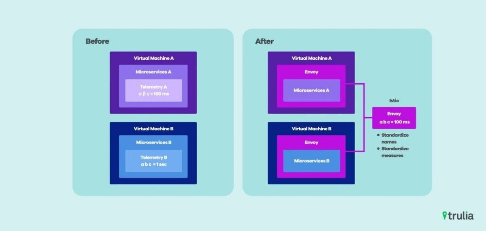
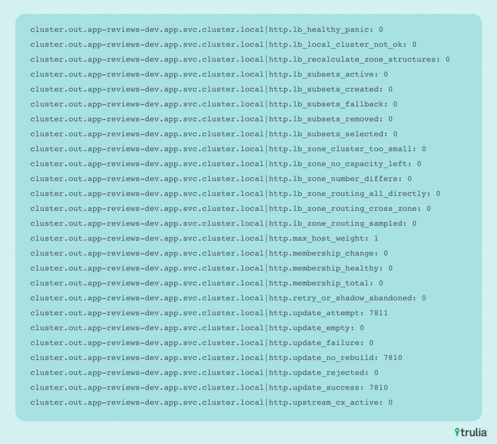

本文为翻译文章，[点击查看原文](https://www.trulia.com/blog/tech/microservice-observability-with-istio/)。

> [Trulia](https://www.trulia.com)是一个多功能的房地产网站，为您提供有关待售房屋、出租公寓、邻里洞察、市场和趋势的本地独家新闻，以帮助您确切了解房屋购买、出售或出租的内容、地点和时间。您还可以找到房地产经纪人，查看最近售出的房屋的价格，并查看您所在社区的房屋价值。

Kubernetes 和 Istio 如何帮助 Trulia 消除 PHP 单体架构，并用可持续的微服务架构取代。这篇博文是我们关于偿还欠下的技术债和重新构建我们平台的系列文章的延续。您可以阅读这篇介绍性文章：[聚焦未来的技术债](https://www.trulia.com/blog/tech/paying-off-tech-debt/)。

## 引言

Trulia 致力于将 <https://www.trulia.com> 单体应用分解成面向服务（SOA）的架构。所有支持的 APIs 和服务都将替换成工程部门 AWS 账号下拥有的各种功能单元。许多遗留 AWS 服务都是通过 AMI 映像 promotion 进行部署的，并使用各种不同的方法实现可观测性。将测量工具添加到代码库和基础架构所需的手动操作一直是个传统痛点。此外，这种用于构建可观测性的手动、个性化方法意味着没有单一的代码库可以在增强和工具上进行协作。

在 2017 年。我们就决定在同一的编排平台[kubernetes](https://kubernetes.io/)上构建我们所有的微服务。我们希望标准化微服务的指标、监控、流控等技术。

SOA 架构没有提供统一的可观测方法。了解微服务生态系统中有关请求率、错误率和延迟的情况被留给各个团队进行管理。这导致每个团队使用包含多个供应商和其他 snowflake 解决方案的不同工具集。所有这些工具的访问和授权也由各个微服务所有者自己管理，这样导致了没有一个地方可以把系统作为整体来管理，这样加大了管理的难度。许多不同 AWS 账户、仪表板和工具集之间错误诊断反复出现。

此外，由于每个 EC2 实例的生命周期不同、自动缩放和微服务代码库也是单独管理的，整个工程组无法共同改善这种状况。如果您设法改进了一个基于 Java 的微服务中聚合 HTTP 响应码为 500，则无法与另一个尝试执行相同操作的团队一起传播或共享此更改。我们正在寻找其他解决方案。

我们希望构建一个平台，将基本可观测性问题与构建微服务的用户分开，允许在使用该平台的所有微服务之间实现连接和可观察性的独立和共享创新。我们选择的技术是容器和 kubernetes 的补充 istio。

## 解决途径

我们使用 Istio 透明代理我们的 Kubernetes 工作负载中的所有通信。将所有遥测集合移出进程，将其与单个微服务的代码库分离。

Istio 由三个部分组成：Pilot、Mixer 和 Citadel。Pilot 管理 Envoy 实例间的策略，Mixer 管理配置每个 Envoy 代理，Citadel 管理双向 TLS 和其他安全相关功能。我们遇到了使用该工具的一些直接挑战，包括打包和安装问题，自动 pod 注入功能以及作为独立 Ingress 的 Istio 的 SNI/供应商支持。

作为早期采用者为了克服这些挑战，我们与 Google 和[Tetrate.io](https://www.tetrate.io/)的核心 Istio 团队密切合作。这种关系帮助我们避免了常见的陷阱，并为 istio 核心团队提供了直接的反馈，验证了他们的路线图，并促进了我们在易用性改进方面的合作。

我们不期望我们的用户能够完全了解服务中的 Istio，只需与本地 Kubernetes 服务发现机制进行交互以查找其他服务。Istio 支持透明代理，因此微服务仅使用 Kubernetes 的本地服务发现机制。使用单一技术进行检测还为我们提供了一组标准的度量标准名称、单位以及对集群内流量的推倒。

## Envoy 提供的示例指标：

上述在 Prometheus 中收集的指标，用于报警和 Grafana 绘图。Envoy 被注入到每个工作负载中，并采集有关请求率、延迟和响应代码等信息。

## 结论

随着[Trulia Neighborhoods](https://www.trulia.com/blog/tech/trulia-neighborhoods/)社区即将启动，Istio 的可观测性变得显而易见。社区团队的开发人员与性能工程师友好合作，能够识别导致极大的关键性能指标延迟的多个问题。

使用 Jaeger 发现驻留在 Kubernetes 集群之外的多个慢速遗留服务。基于 SLA 针对未来需求的性能指标，我们很容易联系服务开发人员优化和扩缩容新接口的开发设计。运维工程师不需要对此进行修复，而这之前需要多个团队和多个系统浪费很大的精力。

在 kubernetes 和 istio 的帮助下，Trulia 能够分解 PHP 单体架构替换成可持续交付的微服务架构。团队不再被迫手动将工具添加到单个代码库或基础架构自动化中。我们的工程师有权部署具有开箱即用的可观测性和单一指标来源的新的微服务。我们对新架构的自由选择以及学习、改进和创造的机会感到非常兴奋。

请继续关注未来的文章，这些文章涉及微服务策略、可观测性和测试等相关主题！
