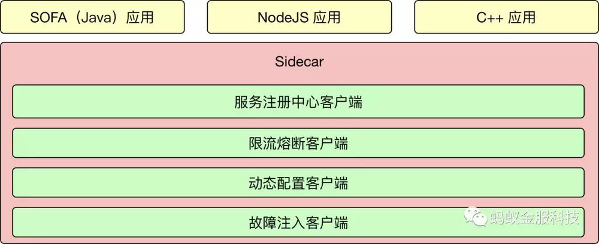
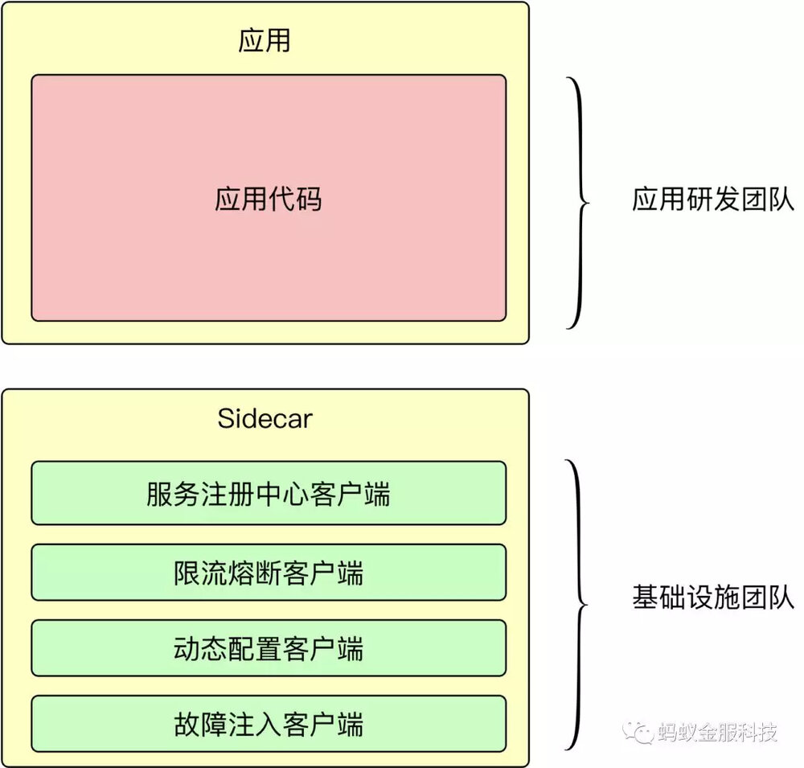
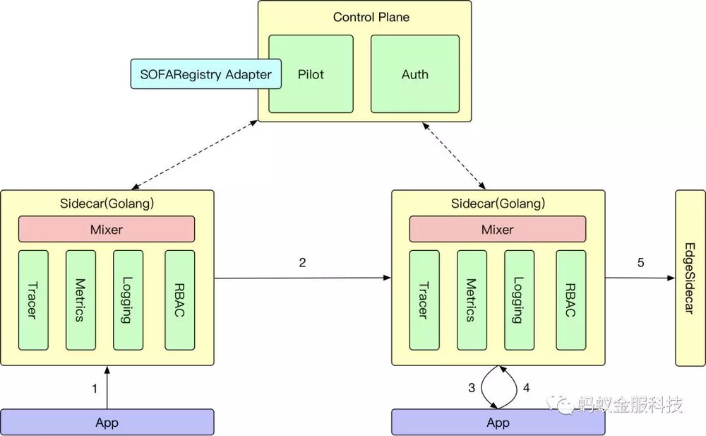
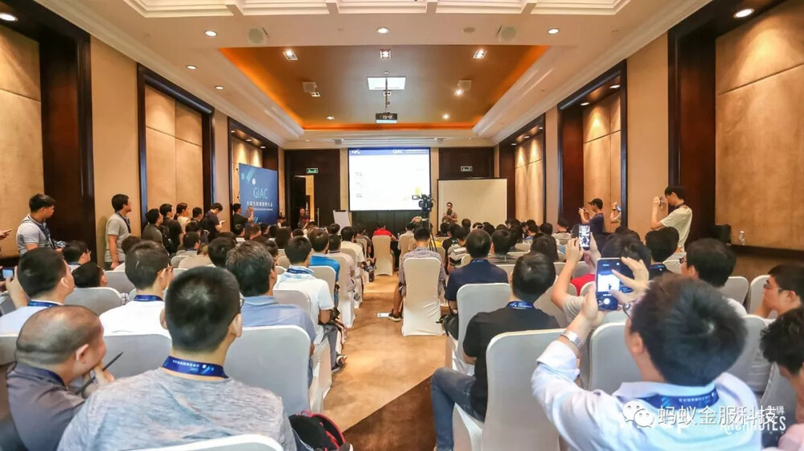

>蚂蚁金服在服务化上面已经经过多年的沉淀，支撑了每年双十一的高峰峰值。Service Mesh 作为微服务的一个新方向，在最近两年成为领域的一个大热点，但是如何从经典服务化架构往 Service Mesh 的方向上演进，中间可能会遇到什么样的问题，几乎没有可以借鉴的经验。
>
>本文会给大家分享 Service Mesh 在蚂蚁金服的演进历程和在2018年6月举办的 GIAC 全球互联网架构大会中蚂蚁金服高级技术专家与现场人员关于Service Mesh的热门QA互动。

## 前言

在过去的一段时间中蚂蚁金服已经开始采用 Service Mesh 来帮助解决一些架构上的问题，并且在 Service Mesh 如何更好地与经典的服务化架构结合上有一定的经验，希望借此分享和大家交流我们这部分的实践。使大家对蚂蚁金服当前的服务化架构有更多了解，并对 Service Mesh 如何解决经典服务化架构中的问题以及蚂蚁金服实际在落地Service Mesh 中的时候的一些设计考虑和未来展望有更进一步的了解，也希望能与行业分享蚂蚁金服服务化架构现状。

蚂蚁金服从单体应用转移到服务化的架构下已经经过了差不多 10 年的时间，在整个过程中，为了满足蚂蚁金服金融级的要求，我们也构建了一整套地面向金融级的分布式架构的解决方案，也就是 SOFA。

**SOFA 其实包含了金融级分布式中间件，CICD 以及 PAAS 平台**。SOFA中间件部分包含的内容包括 SOFABoot 研发框架、SOFA微服务相关的框架（RPC，服务注册中心，批处理框架，动态配置等等）、消息中间件、分布式事务和分布式数据访问等等中间件。

以上的这些中间件都是基于 Java 技术栈的，目前 SOFA 在蚂蚁金服内部大概超过 90% 的系统在使用，除了这些系统之外，还有剩下的 10% 的系统，采用 NodeJS，C++，Python 等等技术栈研发的。这剩下的 10% 的系统想要融入到 SOFA 的整个体系中，一种办法是用对应的语言再去写一遍 SOFA 中间件的各个部分对应的客户端。

事实上，之前我们正是这么干的，蚂蚁金服内部之前就有一套用 NodeJS 搞的 SOFA 各个组件的客户端，但是最近几年随着 AI 等领域的兴起，C++ 也在蚂蚁金服内部也在被应用到越来越多的地方，那么我们是否也要用 C++ 再来写一遍 SOFA 中间件的各个客户端？如果我们继续采用这种方式去支持 C++ 的系统，首先会遇到成本上的问题，每个语言一套中间件的客户端，这些中间件的客户端就像一个个烟囱，都需要独立地去维护，去升级。另一方面，从稳定性上来讲，之前 Java 的客户端踩过的一些坑，可能其他的语言又得重新再踩一遍坑。

对于多语言的问题来说，Service Mesh 其实就很好地解决了这部分的问题，通过 Service Mesh的方案，我们可以尽量把最多的功能从中间件的客户端中移到 Sidecar 中，这样就可以做到一次实现，就搞定掉所有语言，这个对于基础设施团队来说，在成本和稳定性上都是一个提升。

另外的一个问题其实是所有在往云原生架构中转型的公司都会遇到的问题，云原生看起来非常美好，但是我们怎么渐进式的演进到云原生的架构下？特别是对于遗留系统，到底怎么做比较好。当然，一种简单粗暴的方式就是直接用云原生的设施和架构重新写一套，但是这样，投入的成本就非常高，而且重写就意味着可能会引入 Bug，导致线上的稳定性的问题。那么有没有一种方式可以让这些遗留系统非常便捷地享受到云原生带来的好处呢？Service Mesh 其实为我们指明了一个方向，**通过 Service Mesh，我们为遗留系统安上一个 Sidecar，少量地修改遗留系统的配置甚至不用修改遗留系统的配置就可以让遗留系统享受到服务发现，限流熔断，故障注入等等能力。**

最后我们在蚂蚁金服的服务化的过程中遇到的问题是中间件升级的问题，蚂蚁金融从单体应用演进到服务化的架构，再演进到单元化的架构，再演进到弹性架构，其实伴随了大量中间件升级，每次升级，中间件不用说要出新的版本去提供新的能力，业务系统也需要升级依赖的中间件，这中间再出个 Bug，又得重新升级一遍，不光是中间件研发同学痛苦，应用的研发同学也非常痛苦。

我们从单体应用演进到了服务化的架构，从原来好几个团队维护同一个应用，到各个团队去维护各自领域的应用，团队之间通过接口去沟通，已经将各个业务团队之间做到了最大程度的解耦，但是对于基础设施团队来说，还是和每一个业务团队耦合在一起。

我们中间尝试过用各种方法去解决升级过程中的耦合的问题，一种是通过我们自己研发的应用服务器 CloudEngine 来管理所有的基础类库，尽量地去减少给用户带来的升级成本，不用让用户一个个升级依赖，一次升级就可以。

但是随着蚂蚁的业务的不断发展，规模地不断扩大，团队的数量，业务的规模和我们交付的效率已经成为了主要的矛盾，所以我们期望以更高的效率去研发基础设施，而不希望基础设施的迭代受制于这个规模。

后来蚂蚁自己研发的数据库 OceanBase 也在用一个 Proxy 的方式来屏蔽掉 OceanBase 本身的集群负载，FailOver切换等方面的逻辑，而刚好 Service Mesh 的这种 Sidecar 的模式也是这样的一个思路，这让我们看到将基础设施的能力从应用中下移到 Sidecar 这件事情是一个业界的整体的趋势和方向，通过这种方式应用和中间件的基础设施从此成了两个进程，我们可以针对中间件的基础设施进行单独的升级，而不用和应用的发布升级绑定在一起，这不仅解放了应用研发和基础设施团队，也让基础设施团队的交付能力变地更强，以前可能需要通过半年或者一年甚至更长时间的折腾，才能够将基础设施团队提供的新的能力铺到所有的业务系统中去，现在我们通过一个月的时间，就可以将新能力让所有的业务系统享受到。这也让基础设施团队的中台能力变得更强了。这样我们就可以把我们还是把一些架构当中非常关键的支撑点以及一些逻辑下沉到 Sidecar上面去，因为整个蚂蚁金服的整体架构有非常多的逻辑和能力承载在这一套架构上面的。这些东西我们有一个最大的职责是要支撑它快速向前演进和灵活。

## Service Mesh 的选型

前面讲到了蚂蚁金服当前服务化架构下遇到的问题以及我们希望能够通过 Service Mesh 能够去解决的一些问题，接下来就面临一个很现实的问题，Service Mesh 的框架我们到底应该怎么选，我们应该用什么样的标准去衡量，那接下来，我就给大家分享一下蚂蚁金服在Service Mesh 的框架上的选型上的一些思考。 

首先，所有的架构的演进都不是一蹴而就的，都是一个渐进式地演进的一个过程，越大的公司在架构演进的过程中其实越需要考虑这一点。所以我们在选型的时候就需要去考虑这一点，考虑目标框架能否很好地和当前的架构融合在一起。另一个点，作为一个和钱打交道的公司，我们需要特别地去关注目标框架是否在生产环境经过大规模的验证，在场景上，是否经过了各类场景的验证。

目前，业界主流的 Service Mesh 相关的框架有三个，分别是 Google，IBM，Lyft都参与其中的 Istio，以及 Bouyant 公司下的两个开源的 Service Mesh 的框架 Linkerd 以及 Conduit。

首先我们来看下 Istio，Istio 应该是目前被关注最高的一个 ServiceMesh 框架，本身又有顶尖公司的光环加持，比如 Google，IBM 等等，他也完整地包含了一个 Data Plane 以及 Control Plane，但是Istio 一直以来被挑战的地方其实在于他的 Control Plane 的 Mixer 的部分，Istio 的 Mixer 承担了服务鉴权，Quota 控制，Tracing，Metrics等等能力，它是一个中央的节点，如果不开启缓存的情况下，所有的调用都需要从 Mixer 中去过，即使开启了缓存的情况，也不可避免的有请求一定要从 Mixer 中去过，而在全蚂蚁，有20000 多的服务，服务之间的调用是非常频繁的，如果都需要过 Mixer，那 Mixer 就成了一个单点，这个单点的运维和高可用又成了一个问题。

另外，Istio 的性能是我们一直以来比较担心的问题，虽然 Istio 每个版本的发布，性能都有了一定程度的提升。但是我们来看下 Istio 的性能数据，0.5.1 的时候是 700 的 TPS，0.6.0 的时候是 1000 个 TPS，0.7.1 的时候是 1700 个 TPS，相对于一般的RPC 通信框架，最低最低都是万级别的 TPS，Istio 的这个性能数据的确是有点儿惨淡，完全无法满足蚂蚁这边的性能要求。 

接下来我们来看 Linkerd，Linkerd 算是业界几个 Service Mesh的框架里面最成熟的一个了，但是他也有一个问题，首先就是他脱胎于 Twitter 的 Finagle，架构上其实不够开放，没法很好的适配到蚂蚁的环境里面去，另外Linkerd 也没有 Control Plane 这一层，只有 Sidecar，再者 Linkerd 的路由规则 DTab 其实是挺难理解的。最后，其实也是我们当时选型的时候最关心的一个问题，Linkerd是用 Scala 写的，跑在 JVM 上面，我从 Linkerd 的一篇博客上摘录出了一张图片，这篇博客主要讲的是如何优化 JVM 的内存使用，这种文章一般上是的确有这个问题，才会去写这样的文章，从这张图片中我们可以看到 Linkerd 所需要的内存至少都需要 100M，这也是 Bouyant 官方不推荐 Linkerd 和应用做一对一的部署，而是采用 DaemonSet 的方式进行部署。而我们期望的一个部署方式是和应用做一对一的部署，这样的内存占用对于我们来说成本太过，我们期望将 Sidecar 的内存占用控制在 10M 左右。

最后，我们来看下 Conduit，首先 Conduit 也是 Linkerd 不久之前推出的一个Service Mesh 的框架，其实不太成熟，其次，Conduit 选择的语言是 Rust，我们来看下 Rust 在 Tiebo 上的排名，Java 长时间高居第一位，C++在第三位，Golang 经过这几年云基础设施的蓬勃发展，到了 14 位，而 Rust，和一众语言的占用率没有太大的差别，排在了 50 位往后。

所以，我们最后选择了自研 Service Mesh，一方面当然是我们基于前面的两个准则去衡量目前业界流行的Service Mesh 框架，没有能够完全满足我们的要求的，另一方面蚂蚁金服服务化上有长期以及深厚的积累，这部分的一些经验也可以支持我们能够更好地去自研我们自己的Service Mesh 的框架。 

当然，我们也不是说完全从零开始搞 Service Mesh 框架，对于业界的Service Mesh 的框架中的优秀理念，我们是希望能够吸收过来的，另一方面，我们也希望能够尽量地去 Follow Service Mesh 目前社区中的一些规范。

## SOFA Mesh 的设计

首先，SOFA Mesh 其实直接采用了 Istio 的 Control Plane 的Pilot 和 Auth，因为我们觉得 Istio 在这块上没有太大的问题甚至里面也有一些非常不错的设计，比如Pilot 这部分的 Universal Data API 就是非常不错的设计。Istio 的 Auth 这部分也充分地利用了 Kubernetes 的安全机制。 

而Mixer 这部分，其实我之前就提到我们是觉得有设计上问题的，所以我们的想法是直接把 Mixer 搬到 Sidecar 中实现。

再者，大家都知道 Istio 的 Sidecar 是 Envoy，它是一个用 C++ 写的，那么我们怎么把Mixer 移入到 Sidecar 中去呢，其实我们的 SOFA Mesh 的 Sidecar 是采用了 Golang 来写的，所以才给把 Mixer 移入Sidecar 提供了可能性，当然，我们选择用 Golang 来研发 Sidecar 不仅仅是为了把 Mixer 移入到 Sidecar 而已，其实也有其他的考虑，一方面，在云计算的时代，Golang以及成为构建基础设施的首选语言，我们看到大量的基础设施都是用 Golang 写的，包括 Docker，Kubernetes 等等，选择 Golang，其实也是希望能够更好地和云原生时代的这些基础设施贴合。

另外，相比于 Envoy 采用的 C++，Golang 显然更加容易上手，也更加容易找到这方面的人才，另外，Golang相对于 JVM 来说，Memory Footprint 低了非常多，我们用 Golang 写的 Sidecar，目前的峰值  TPS 下的内存在用在 11M，虽然还有一定的优化空间，但是相比于 JVM 来说，已经降低了10 倍。

另外，虽然我们采用了 Istio 的 Pilot，但是在内部使用的时候，直接使用Pilot 并不能满足我们的诉求。首先，Pilot 在 Kubernetes 上是直接对接到 Kubernetes 的服务发现机制上的，无论是 SOFARPC，还是微博的Motan 等等国内的服务框架，其实都是单个应用多个服务这样的模型，而 Kubernetes 的服务发现机制实际上针对的是单个应用单个服务的模型，在模型上就不太一致。另外，SOFA的服务注册中心 SOFARegistry 在蚂蚁金服内部经过了多年的实践，面对内部大规模的服务化的场景，SOFARegistry 的扩展能力以及可靠性已经经过了大量的实践证明，这里说一下SOFARegistry 上的一些数据，上面大约注册了 2W 多个服务，一个机房里面的 Pub 和 Sub 的加起来在千万级别。基于以上的考虑，我们选择了用Pilot 上增加 SOFARegistry 的 Adapter，使之能够拿到 SOFARegistry 上的服务注册信息。

然后，Pilot 还有一个问题，就是原来 Pilot 会把所有的服务注册相关的数据都同步到Pilot 上，这个对于 Pilot 的集群的压力是非常大的，所以我们选择了只同步必要的数据到一个 Pilot 的节点上，介绍 Pilot 本身的内存压力。

最后，我再分享一个蚂蚁金服的场景，在蚂蚁金服，因为事业部众多以及监管的问题，不用的事业部之间的一些机器可能是网络不通的，那么他们要做服务访问，就必须有一个角色来做跨环境之间的服务访问，所以我们基于 Sidecar 的概念，提出了 EdgeSidecar 的角色，他在技术的实现细节上其实和和应用部署在一起的 Sidecar 是非常类似的，只是这个 Sidecar 作为一个“边缘”的角色，来负责跨环境的服务通信问题。

所以，SOFA Mesh 在整体的大图上大概是这样的，我们自研了一个 Golang 的Sidecar，并且把 Mixer 纳入到 Sidecar 中，来防止出现类似于 Istio 那样的性能问题，在 Pilot 和 Auth 这两个角色了，我们选择直接使用Istio 的，然后在上面做一定程度的适配，适配到蚂蚁内部的环境中，然后我们在整个部署上，新增了一个 EdgeSidecar 的角色，来解决跨环境的服务调用的问题。 

我知道大家一定对 SOFA Mesh 在蚂蚁内部的落地情况非常感兴趣，目前我们已经落地的场景主要是多语言的场景，解决其他的语言和 SOFA 的通信问题，大约上了二三十个系统。然后我们正在尝试用 SOFA Mesh 去更好地解决服务间调用的安全，以及蓝绿发布的问题，在异构系统通信的这件事情上，我们也在不久的将来会尝试用 SOFA Mesh 去解决。

当然，SOFA Mesh 在蚂蚁内部的落地其实离不开开源社区，**所以在未来的两三个月内，我们也会将 SOFA Mesh 开源出来，将蚂蚁内部实践 Service Mesh 的成果开源出来**，给大家更多在这方面的参考。

对于未来，其实我觉得中间件作为基础设施未来和云平台融合是一个不可阻挡地趋势，除了 Service Mesh，未来还可能会出现 Message Mesh，DB Mesh 等等产品，我知道业界有些同学已经开始做这方面的努力了。最后总结一下我今天演讲的内容，一个是 Service Mesh 给蚂蚁金服解决的问题，包括多语言，遗留系统以及基础设施团队和业务团队耦合的问题。在 ServiceMesh 的选型上，我们主要考量和当前架构的可融合性，以及框架的高可用，稳定性。未来除了 ServiceMesh，可能还会出现其他的 Mesh，中间件和底层云平台进一步融合的趋势不可挡。多谢大家！

下面带来的是GIAC大会中蚂蚁金服高级技术专家与现场参会人员进行关于Service Mesh的问答互动，我们精选了几个比较热门的问答分享给大家。

### 一、Mesh的高可用和安全，能否详细说明一下？

答：我们最近正在做安全这件事情，安全涉及到两个方面，一个方面是 RPC 的整个服务调用健全的问题，这个是可以直接在 Mesh 中去做的，可以直接利用 Istio 的 RBAC 来实现，另外是 Mesh 和 Mesh 之间的 TLS双向认证的事情。这个其实 Istio 里面会有一些现成的方案，它与 K8S 融合的也非常好，这些东西是可以直接拿过来去用的。

### 二、如何解决服务的多版本路由和数据单元的多版本路由的问题？

答：ServiceMesh 主要关注的是服务调用这一块，我来解释一下多版本的路由，其实我们在内部的话，服务版本这件事情用得会比较少，用得更多的是同一服务不同的实现。但是其实多版本路由这一块，如果说大家知道 K8S 的 Label 的话，可以把它的这种设计来借鉴到整个Mesh当中，然后通过不同的标签来做区分，后面也会有一些这方面的分享出来。

### 三、Service Mesh 主要是解决了请求的可靠传输和服务治理的问题吗？

答：应该是说Service Mesh提出了更好的方式去解决请求的可靠传输和服务治理的问题。其实想像一下，如果说你要上一整套的服务治理的架构的话，在原来的方式下可能需要你们所有的上层业务系统都接入你们对应的服务治理的组件，现在的话，只要有一个Service Mesh，在这个 Sidecar 当中就可以把服务治理的这件事情做掉。它没有去解决新的问题，只是把一些老的问题用更好的方式去解决。

### 四、为什么Control Plane对于Mesh来说很重要？

答：其实这个就涉及到整个云平台和我们整个服务化体系的融合的问题。其实目前大家可以看到，Pilot 这部分的东西，在原来 Istio 设计当中是非常强的和 K8S 这个东西融合在一起的，如果说你没有这套东西存在的话，对于 Mesh 来说还是一个非常上层的中间件这样的东西。当然你可以说不用 Control Plane 这一层，只有 Sidecar，对接到原来的一整套的服务治理体系当中去，这样做也是可以的，没有太大的问题。但是有了 Control Plane 这一层东西，它定义了非常通用的 API，本身这个架构又是和云平台整个架构是绑定得比较紧的，有更好的融合度。所以我们觉得整个Control Plane这一层是非常重要的。

另外，Istio 提出 Control Plane，其实是在往微服务标准化方面迈进了很大一层。它里面有非常多的服务发现的标准，治理的标准，虽然说他大胆提出了这样的概念和假设，我们也看到了它的一些不足，所以我们希望和社区一起推进这一层的标准化。就像我一开始分享的，基础设施一层一层的向上包。像我们觉得越来越多的中间件的部分，其实是会被沉淀到基础设施当中的。现在也有云原生语言，我们编译了一下，发现很慢，问题也很多，但是我们觉得这是一个方向。大家在写的时候，可能就用这样的语言去写，很多能力就提升上去了。我们希望把基础设施向上再推一下，去扮演这样一个角色。这也是我们认为 Control Plane 的最大的价值。

