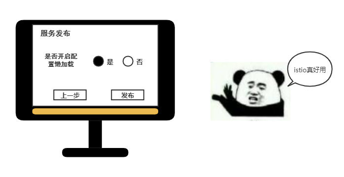
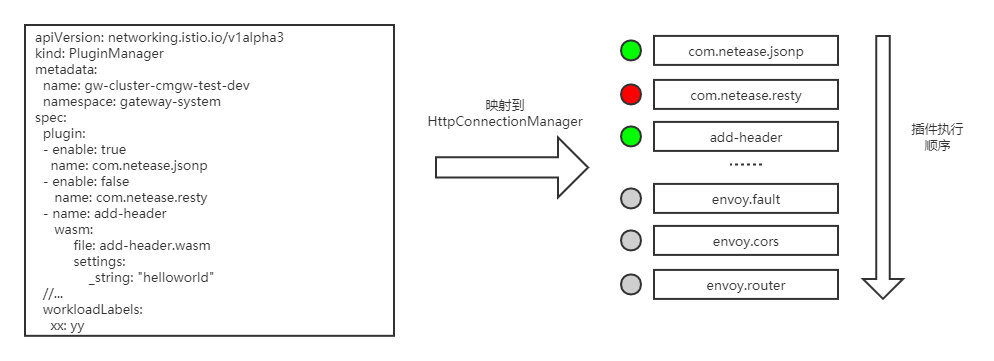
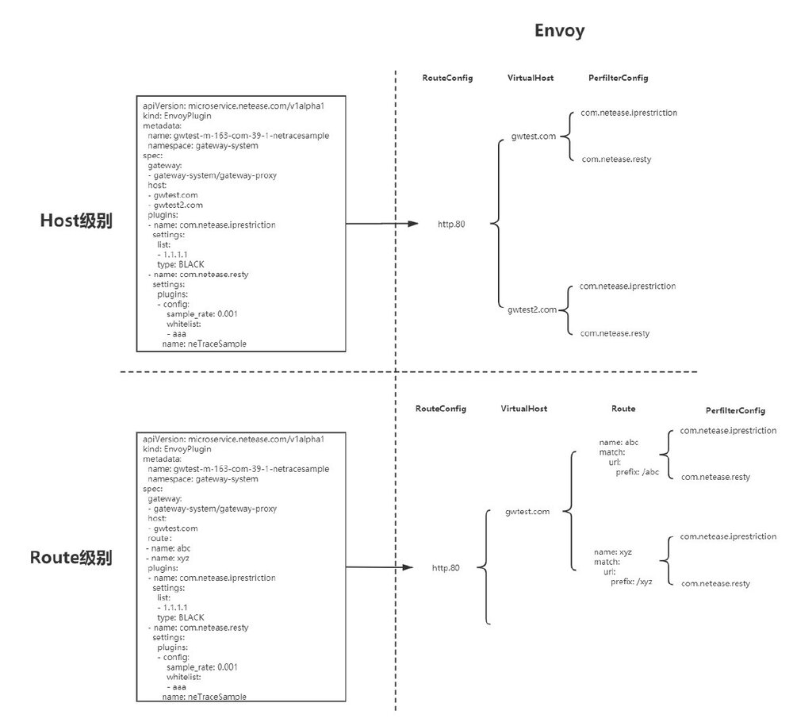
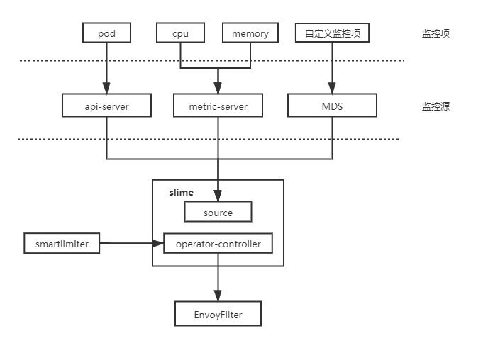

注：本文是本人在云原生社区直播分享的内容整理，视频见 [B 站](https://www.bilibili.com/video/BV18o4y1y75e/)，PPT 可以在 [GitHub](https://github.com/tetratelabs/istio-weekly/tree/main/istio-big-talk/003) 下载。

Slime是网易数帆微服务团队开源的服务网格组件，它可以作为Istio的CRD管理器，旨在通过更为简单的配置实现Istio/Envoy的高阶功能。目前slime包含三个非常实用的子模块：

1. 配置懒加载: 无须手动配置SidecarScope，按需加载配置和服务发现信息 
2. Http插件管理: 使用新的的CRD pluginmanager/envoyplugin包装了可读性，摒弃了可维护性较差的envoyfilter，使得插件扩展更为便捷
3. 自适应限流: 结合监控信息自动调整限流策略 后续我们团队会开放更多实用功能在slime中，希望slime能帮助使用者更好的驾驭Istio这艘小帆船

## 1. 背景

服务网格作为新一代微服务架构，采用sidecar模式，实现了业务逻辑和微服务治理逻辑的物理解耦，降低微服务框架的开发与运维成本。权责清晰，易维护，可观测，多语言支持等一些列优势使其逐渐成为微服务话题中的焦点。而Istio+Envoy作为其使用最为广泛的实现一直占据着C位，背靠Google的大树，Istio已隐隐具备了成为业界标准的趋势。

欲戴皇冠，必承其重。站在风口浪尖的Istio，获得赞誉的同时也引来了不少非议。项目的优势自不必说，Istio有着一套行之有效的上层抽象，通过配置VirtualService，DestinationRule等CR可以实现版本分流，灰度发布，负载均衡等功能，但是在面对本地限流，黑白名单，降级等微服务治理的高阶功能时，这套抽象显得力有不逮，起初Istio给出的解决方案是Mixer，将这些原本属于数据面的功能上升到Mixer Adapter中，虽然解决了功能扩展的问题，但其集中式的架构遭到了不少关注者对其性能的质疑。最终，Istio在新版本中自断其臂，弃用了Mixer，这就使得高阶功能的扩展成为目前版本的一块空白。另一方面Istio配置是全量推送的，这就意味着在大规模的网格场景下需推送海量配置，为了减少推送配置量，用户不得不事先搞清楚服务间的依赖关系，配置SidecarScope做配置隔离，而这无疑增加了运维人员的心智负担，易用性和性能成为不可兼得的鱼和熊掌。

针对Istio目前的一些弊端，我们团队开启了slime项目。该项目是基于k8s-operator实现的，作为Istio的CRD管理器，**可以无缝对接Istio，无需任何的定制化改造**。slime内部采用了模块化的架构，目前包含了三个非常实用的子模块：

1. 配置懒加载：无须手动配置SidecarScope，按需加载配置信息和服务发现信息，解决了全量推送的问题。
2. Http插件管理：使用新的的CRD pluginmanager/envoyplugin包装了可读性，可维护性较差的envoyfilter，使得插件扩展更为便捷。
3. 自适应限流：可结合监控信息自动调整限流策略，填补了Istio限流功能的短板。

## 2. 配置懒加载

随着服务网格上业务规模的逐步变大，我们遇到的第一个问题就是配置全量下发导致的性能问题，它对数据面和控制面都有较为严重的性能影响：

1. 使数据面收到大量冗余配置
   a) Envoy启动时间变长
   b) Envoy内存开销增加
   c) 占据Envoy主线程，阻塞Pilot事件推送
2. 增加控制面处理推送事件复杂度
   a) Pilot推送时内存增加，易引发OOM
   b) 配置下发时延增加
   为了使Istio能支持一定量级的集群，我们不得不事先要求业务方在服务发布时，告知该服务所依赖的服务，并以此设置SidecarScope屏蔽无关服务的配置和服务发现信息。但是在推行过程中却遇到了阻力，一方面是依赖服务的信息不好获取，另一方面一旦业务方配置有误，会导致调用出现问题。这个规定使得原本想要上网格的业务变得望而却步。
   

有什么办法可以使服务按需获取配置呢？最容易想到的是从服务调用关系中获取该信息，但是在缺失被调用方服务发现信息的情况下，是无法成功访问的，这就会导致一些容错率低的服务不能接受这种方案，另一方面访问不成功时获得的服务调用关系也并不可靠。换而言之，如果有办法使服务在不具备被调用方配置信息和服务发现信息的情况下能够成功调用，就可以通过自动生成SidecarScope的方式实现配置懒加载（按需加载）。

我们想到的办法是构建一条兜底路由，这条兜底路由的backend是一个全局共享的sidecar，我们称之为global-sidecar，它拥有全量的配置和服务发现信息。缺失服务发现信息的调用，都会被兜底路由劫持到global-sidecar，global-sidecar为其做二次代理，转发到对应的后端服务。

global-sidecar在完成代理后会将服务调用信息上报给slime，slime根据调用信息更新Scope，首次调用后，服务便可感知到被调用方的信息，不再需要global-sidecar转发，如下图所示。


在实现配置懒加载的过程中，我们也遇到了另外一个问题，当被调用服务服务名被vs中的路由规则导向另一个服务时，slime只能将被调用服务添加到Scope中，被导向服务的服务发现信息依然缺失，导致再次调用时出现503。为了解决这个问题，我们引入了自研CRD——ServiceFence，通过它可以构建起服务名和后端服务的映射关系。slime根据其对应服务的VirtualService，找到服务名和真实后端的映射关系，将两者的都加入scope中，将可避免上述问题。

ServiceFence也可以对生成的SidecarScope的生命周期做管理，可以自动清理长时间不用的调用关系。
当然上述这些CRD的生成和维护都是自动的，用户即不需要关心ServiceFence资源也不需要关心SidecarScope资源，只需要在Service上打上`istio.dependency.servicefence/status: "true"`的标签，表明该服务需要开启配置懒加载即可。



## 3. Http插件管理

在网关场景下，流量管理比较复杂，需要使用定制化插件来处理流量，在开发slime的插件模块之前，插件扩展只能通过EnvoyFilter来实现，EnvoyFilter是xDS层面的配置，管理和维护这样的配置需要耗费大量的精力，同时出错率也极高。

为了简化插件管理的难度，我们决定在EnvoyFilter上层做一层面向插件管理的抽象。xDS中关于HTTP插件的配置有两段，一部分在LDS中，作为`HttpConnectionManager`的SubFilter，它决定了哪些插件将被加载以及插件的执行顺序。另一部分在RDS中，并且有两个粒度，分别是VirtualHost粒度的`perFilterConfig`以及route粒度的`perFilterConfig`，这部分决定了当前Host或者是路由需要进行的插件行为。

LDS中的部分被我们抽象为PluginManager，我们可以通过enable选项启停插件。通过PluginManager也可以管理插件的执行优先级，其中的插件顺序和LDS插件链中的顺序是一致的，越靠前的插件执行优先级越高，如下图所示：



RDS中的部分被抽象为EnvoyPlugin，通过EnvoyPlugin的Host/Route字段可以设置插件配置的生效范围。EnvoyPlugin更加贴合网关的配置模型，在网关的控制台上，后端服务往往被映射为某个Host下的某几个API接口，例如我们需要为服务A配置自研的黑白名单插件以及trace采样插件，A服务在网关上的接口为`/abc`和`/xyz`，针对该服务的插件配置就会被映射为：

```yaml
apiVersion: microservice.netease.com/v1alpha1
kind: EnvoyPlugin
metadata:
  name: gateway-proxy-svc-a 
  namespace: gateway-system
spec:
  gateway:
  - gateway-system/gateway-proxy
  host:
  - gwtest.com
  route：
 - name: abc
 - name: xyz
  plugins:
  - name: com.netease.iprestriction
    inline
      settings:
        list:
        - 1.1.1.1
        type: BLACK 
  - name: com.netease.resty
    inline
      settings:
        plugins:
        - config:
            sample_rate: 0.001
            whitelist:
            - aaa
          name: neTraceSample 
```

EnvoyPlugin不关心每个插件的具体配置（具体配置会被放在type.struct结构中透传处理），它更关心的是插件生效范围，使用者可以将插件配置在需要的维度中做聚合，这样做一方面更加贴合插件使用者的习惯，另一方面也降低了上层配置的冗余，下图展示了EnvoyPlugin在xDS层面的映射关系，虽然xDS层面仍旧会展开，但至少在管理它们的时候，我们面对的是一个有序聚合的数组，而非一颗庞大的插件树。



## 4. 自适应限流

随着Mixer的移除，要实现服务网格中的限流变得非常复杂。全局限流需要配置额外部署 RLS (Ratelimit Server)，即使是本地限流也需要借助Envoy内建插件——`envoy.local.ratelimit`，为此使用者不得不再次面对复杂的EnvoyFilter配置。相较于二代微服务框架中成熟的限流组件而言，Envoy的本地限流组件功能也略显简单，例如，无法做到自适应限流，只能以实例维度配置限流值等。

为了解决Istio中服务限流的短板，我们开发了自适应限流模块，在易用性方面，我们也为其设计了一套新的API——SmartLimiter。自适应限流的主体架构分为两部分，一部分为SmartLimiter到EnvoyFilter的转换逻辑，另一部分为监控数据获取。目前slime支持从K8S metric-server获取服务的CPU，Memory，副本数等数据，当然我们也对外提供了一套监控数据对接接口（Metric Discovery Server），通过MDS，可以将自定义的监控指标同步给限流组件。



SmartLimiter的配置是比较接近自然语义的，例如希望在CPU超过80%时触发服务A的访问限制，限额为30QPS，对应的SmartLimiter定义如下：

```yaml
apiVersion: microservice.netease.com/v1alpha1
kind: SmartLimiter
metadata:
  name: a
  namespace: default
spec:
  descriptors:
  - action:
      fill_interval:
        seconds: 1
      quota: "30/{pod}"    # 30为该服务的额度，将其均分给每个pod
    condition: "{cpu}>0.8" # 根据监控项{cpu}的值自动填充该模板
```

最终产生的限流行为，如下图所示：


## 5. 如何获取和使用slime

slime的源码已经开放，你可以在[这里](https://github.com/slime-io/slime)获得slime的最新动态，后续我们团队会开放更多实用功能在slime中。你也可以阅读[使用指引](https://github.com/slime-io/slime/blob/master/README_ZH.md)快速上手slime。在使用指引中，我们基于bookinfo为slime编写了简单的例子，希望能帮助到你们。

**最后，slime仍处于早期阶段，希望有更多的mesher加入我们或为我们提出建议，帮助我们完善它。**

希望slime能帮助使用者更好的驾驭Istio这艘帆船！

**作者简介**

杨笛航，Istio社区成员，网易数帆架构师，负责轻舟Service Mesh配置管理，并主导slime组件设计与研发，参与网易严选和网易传媒的Service Mesh建设。具有三年Istio控制面功能拓展和性能优化经验。

