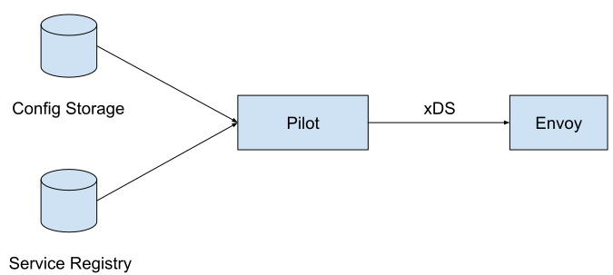
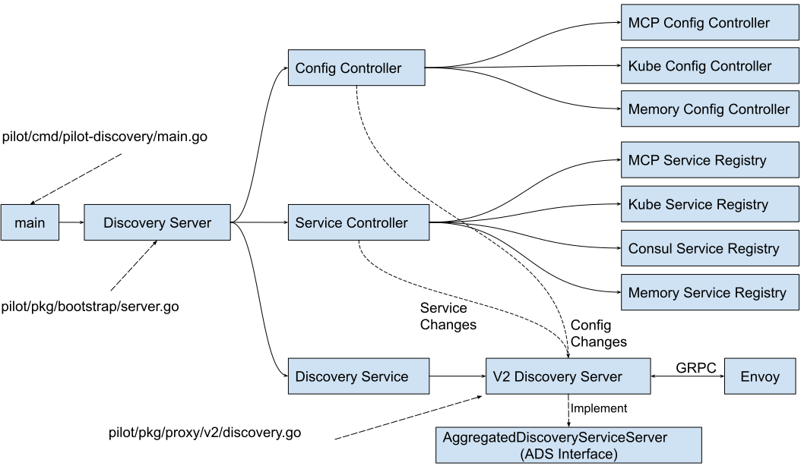
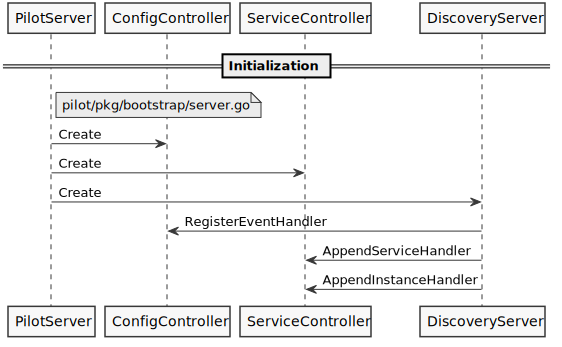
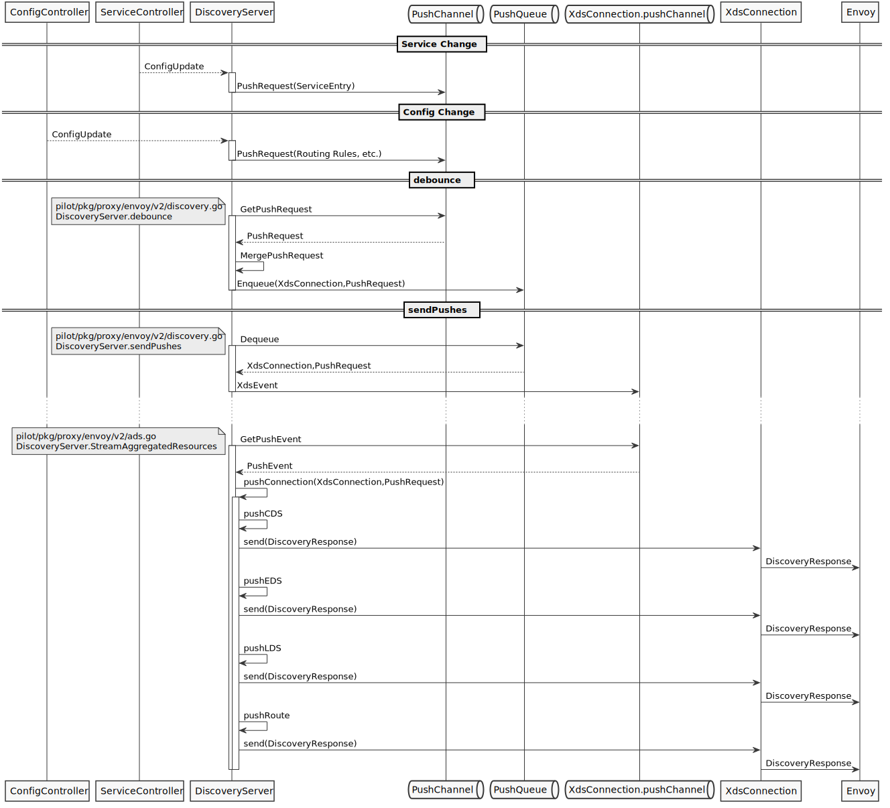

## Istio Pilot 组件介绍

在 Istio 架构中，Pilot 组件属于最核心的组件，负责了服务网格中的流量管理以及控制面和数据面之间的配置下发。Pilot 内部的代码结构比较复杂，本文中我们将通过对 Pilot 的代码的深入分析来了解 Pilot 实现原理。

首先我们来看一下 Pilot 在 Istio 中的功能定位，Pilot 将服务信息和配置数据转换为 xDS 接口的标准数据结构，通过 gRPC 下发到数据面的 Envoy。如果把 Pilot 看成一个处理数据的黑盒，则其有两个输入，一个输出：



目前 Pilot 的输入包括两部分数据来源：

* 服务数据：来源于各个服务注册表 (Service Registry)，例如 Kubernetes 中注册的 Service，Consul Catalog 中的服务等。
* 配置规则：各种配置规则，包括路由规则及流量管理规则等，通过 Kubernetes CRD(Custom Resources Definition) 形式定义并存储在 Kubernetes 中。

Pilot 的输出为符合 xDS 接口的数据面配置数据，并通过 gRPC Streaming 接口将配置数据推送到数据面的 Envoy 中。

备注：Istio 代码库在不停变化更新中，本文分析所基于的代码 commit 为：d539abe00c2599d80c6d64296f78d3bb8ab4b033

## Pilot-Discovery 代码结构

Istio Pilot 的代码分为 Pilot-Discovery 和 Pilot-Agent，其中 Pilot-Agent 用于在数据面负责 Envoy 的生命周期管理，Pilot-Discovery 才是控制面进行流量管理的组件，本文将重点分析控制面部分，即 Pilot-Discovery 的代码。

下图是 Pilot-Discovery 组件代码的主要结构：


Pilot-Discovery 的入口函数为：pilot/cmd/pilot-discovery/main.go 中的 main 方法。main 方法中创建了 Discovery Server，Discovery Server 中主要包含三部分逻辑：

### Config Controller

Config Controller 用于管理各种配置数据，包括用户创建的流量管理规则和策略。Istio 目前支持三种类型的 Config Controller：

* Kubernetes：使用 Kubernetes 来作为配置数据的存储，该方式直接依附于 Kubernetes 强大的 CRD 机制来存储配置数据，简单方便，是 Istio 最开始使用的配置存储方案。
* MCP (Mesh Configuration Protocol)：使用 Kubernetes 来存储配置数据导致了 Istio 和 Kubernetes 的耦合，限制了 Istio 在非 Kubernetes 环境下的运用。为了解决该耦合，Istio 社区提出了 MCP，MCP 定义了一个向 Istio 控制面下发配置数据的标准协议，Istio Pilot 作为 MCP Client，任何实现了 MCP 协议的 Server 都可以通过 MCP 协议向 Pilot 下发配置，从而解除了 Istio 和 Kubernetes 的耦合。如果想要了解更多关于 MCP 的内容，请参考文后的链接。
* Memory：一个在内存中的 Config Controller 实现，主要用于测试。

目前 Istio 的配置包括：

* Virtual Service: 定义流量路由规则。
* Destination Rule: 定义和一个服务或者 subset 相关的流量处理规则，包括负载均衡策略，连接池大小，断路器设置，subset 定义等等。
* Gateway: 定义入口网关上对外暴露的服务。
* Service Entry: 通过定义一个 Service Entry 可以将一个外部服务手动添加到服务网格中。
* Envoy Filter: 通过 Pilot 在 Envoy 的配置中添加一个自定义的 Filter。

### Service Controller

Service Controller 用于管理各种 Service Registry，提出服务发现数据，目前 Istio 支持的 Service Registry 包括：

* Kubernetes：对接 Kubernetes Registry，可以将 Kubernetes 中定义的 Service 和 Instance 采集到 Istio 中。
* Consul：对接 Consul Catalog，将 Consul 中定义的 Service 采集到 Istio 中。
* MCP：和 MCP config controller 类似，从 MCP Server 中获取 Service 和 Service Instance。
* Memory：一个内存中的 Service Controller 实现，主要用于测试。

### Discovery Service

Discovery Service 中主要包含下述逻辑：

* 启动 gRPC Server 并接收来自 Envoy 端的连接请求。
* 接收 Envoy 端的 xDS 请求，从 Config Controller 和 Service Controller 中获取配置和服务信息，生成响应消息发送给 Envoy。
* 监听来自 Config Controller 的配置变化消息和来自 Service Controller 的服务变化消息，并将配置和服务变化内容通过 xDS 接口推送到 Envoy。（备注：目前 Pilot 未实现增量变化推送，每次变化推送的是全量配置，在网格中服务较多的情况下可能会有性能问题）。

## Pilot-Discovery 业务流程

Pilot-Disocvery 包括以下主要的几个业务流程：

### 初始化 Pilot-Discovery 的各个主要组件

Pilot-Discovery命令的入口为pilot/cmd/pilot-discovery/main.go中的main方法，在该方法中创建Pilot Server,Server 代码位于文件 pilot/pkg/bootstrap/server.go 中。Server 主要做了下面一些初始化工作：

* 创建并初始化 Config Controller。
* 创建并初始化 Service Controller。
* 创建并初始化 Discovery Server，Pilot 中创建了基于 Envoy V1 API 的 HTTP Discovery Server 和基于 Envoy V2 API 的 GPRC Discovery Server。由于 V1 已经被废弃，本文将主要分析 V2 API 的 gRPC Discovery Server。
* 将 Discovery Server 注册为 Config Controller 和 Service Controller 的 Event Handler，监听配置和服务变化消息。



### 创建 gRPC Server 并接收 Envoy 的连接请求

Pilot Server 创建了一个 gRPC Server，用于监听和接收来自 Envoy 的 xDS 请求。pilot/pkg/proxy/envoy/v2/ads.go 中的 DiscoveryServer.StreamAggregatedResources 方法被注册为 gRPC Server 的服务处理方法。

当 gRPC Server 收到来自 Envoy 的连接时，会调用 DiscoveryServer.StreamAggregatedResources 方法，在该方法中创建一个 XdsConnection 对象，并开启一个 goroutine 从该 connection 中接收客户端的 xDS 请求并进行处理；如果控制面的配置发生变化，Pilot 也会通过该 connection 把配置变化主动推送到 Envoy 端。


### 配置变化后向 Envoy 推送更新

这是 Pilot 中最复杂的一个业务流程，主要是因为代码中采用了多个 channel 和 queue 对变化消息进行合并和转发。该业务流程如下：

1. Config Controller 或者 Service Controller 在配置或服务发生变化时通过回调方法通知 Discovery Server，Discovery Server 将变化消息放入到 Push Channel 中。
1. Discovery Server 通过一个 goroutine 从 Push Channel 中接收变化消息，将一段时间内连续发生的变化消息进行合并。如果超过指定时间没有新的变化消息，则将合并后的消息加入到一个队列 Push Queue 中。
1. 另一个 goroutine 从 Push Queue 中取出变化消息，生成 XdsEvent，发送到每个客户端连接的 Push Channel 中。
1. 在 DiscoveryServer.StreamAggregatedResources 方法中从 Push Channel 中取出 XdsEvent，然后根据上下文生成符合 xDS 接口规范的 DiscoveryResponse，通过 gRPC 推送给 Envoy 端。（gRPC 会为每个 client 连接单独分配一个 goroutine 来进行处理，因此不同客户端连接的 StreamAggregatedResources 处理方法是在不同 goroutine 中处理的）



### 响应 Envoy 主动发起的 xDS 请求

Pilot 和 Envoy 之间建立的是一个双向的 Streaming gRPC 服务调用，因此 Pilot 可以在配置变化时向 Envoy 推送，Envoy 也可以主动发起 xDS 调用请求获取配置。Envoy 主动发起 xDS 请求的流程如下：

1. Envoy 通过创建好的 gRPC 连接发送一个 DiscoveryRequest
1. Discovery Server 通过一个 goroutine 从 XdsConnection 中接收来自 Envoy 的 DiscoveryRequest，并将请求发送到 ReqChannel 中
1. Discovery Server 的另一个 goroutine 从 ReqChannel 中接收 DiscoveryRequest，根据上下文生成符合 xDS 接口规范的 DiscoveryResponse，然后返回给 Envoy。


### Discovery Server 业务处理关键代码片段

下面是 Discovery Server 的关键代码片段和对应的业务逻辑注解，为方便阅读，代码中只保留了逻辑主干，去掉了一些不重要的细节。

#### 处理 xDS 请求和推送的关键代码

该部分关键代码位于 `istio.io/istio/pilot/pkg/proxy/envoy/v2/ads.go` 文件的 StreamAggregatedResources 方法中。StreamAggregatedResources 方法被注册为 gRPC Server 的 handler，对于每一个客户端连接，gRPC Server 会启动一个 goroutine 来进行处理。

代码中主要包含以下业务逻辑：

* 从 gRPC 连接中接收来自 Envoy 的 xDS 请求，并放到一个 channel reqChannel 中。
* 从 reqChannel 中接收 xDS 请求，根据 xDS 请求的类型构造响应并发送给 Envoy。
* 从 connection 的 pushChannel 中接收 Service 或者 Config 变化后的通知，构造 xDS 响应消息，将变化内容推送到 Envoy 端。

```go
// StreamAggregatedResources implements the ADS interface.
func (s *DiscoveryServer) StreamAggregatedResources(stream ads.AggregatedDiscoveryService_StreamAggregatedResourcesServer) error {
        
    ......

    //创建一个 goroutine 来接收来自 Envoy 的 xDS 请求，并将请求放到 reqChannel 中
    con := newXdsConnection(peerAddr, stream)
    reqChannel := make(chan *xdsapi.DiscoveryRequest, 1)
    go receiveThread(con, reqChannel, &receiveError)

     ......
    
    for {
        select{
        //从 reqChannel 接收 Envoy 端主动发起的 xDS 请求
        case discReq, ok := <-reqChannel:        
            //根据请求的类型构造相应的 xDS Response 并发送到 Envoy 端
            switch discReq.TypeUrl {
            case ClusterType:
                err := s.pushCds(con, s.globalPushContext(), versionInfo())
            case ListenerType:
                err := s.pushLds(con, s.globalPushContext(), versionInfo())
            case RouteType:
                err := s.pushRoute(con, s.globalPushContext(), versionInfo())
            case EndpointType:
                err := s.pushEds(s.globalPushContext(), con, versionInfo(), nil)
            }

        //从 PushChannel 接收 Service 或者 Config 变化后的通知
        case pushEv := <-con.pushChannel:
            //将变化内容推送到 Envoy 端
            err := s.pushConnection(con, pushEv)   
        }            
    }
}
```

#### 处理服务和配置变化的关键代码

该部分关键代码位于 `istio.io/istio/pilot/pkg/proxy/envoy/v2/discovery.go` 文件中，用于监听服务和配置变化消息，并将变化消息合并后通过 Channel 发送给前面提到的 StreamAggregatedResources 方法进行处理。

ConfigUpdate 是处理服务和配置变化的回调函数，service controller 和 config controller 在发生变化时会调用该方法通知 Discovery Server。

```go
func (s *DiscoveryServer) ConfigUpdate(req *model.PushRequest) {
  inboundConfigUpdates.Increment()

  //服务或配置变化后，将一个 PushRequest 发送到 pushChannel 中
  s.pushChannel <- req
}
```

在 debounce 方法中将连续发生的 PushRequest 进行合并，如果一段时间内没有收到新的 PushRequest，再发起推送；以避免由于服务和配置频繁变化给系统带来较大压力。

```go
// The debounce helper function is implemented to enable mocking
func debounce(ch chan *model.PushRequest, stopCh <-chan struct{}, pushFn func(req *model.PushRequest)) {

    ......

    pushWorker := func() {
        eventDelay := time.Since(startDebounce)
        quietTime := time.Since(lastConfigUpdateTime)

        // it has been too long or quiet enough
        //一段时间内没有收到新的 PushRequest，再发起推送
        if eventDelay >= DebounceMax || quietTime >= DebounceAfter {
            if req != nil {
                pushCounter++
                adsLog.Infof("Push debounce stable[%d] %d: %v since last change, %v since last push, full=%v",
                pushCounter, debouncedEvents,
                quietTime, eventDelay, req.Full)

                free = false
                go push(req)
                req = nil
                debouncedEvents = 0
            }
        } else {
           timeChan = time.After(DebounceAfter - quietTime)
        }
    }
    for {
        select {
        ......

        case r := <-ch:
            lastConfigUpdateTime = time.Now()
            if debouncedEvents == 0 {
                timeChan = time.After(DebounceAfter)
                startDebounce = lastConfigUpdateTime
            }
            debouncedEvents++
            //合并连续发生的多个 PushRequest
            req = req.Merge(r)
        case <-timeChan:
           if free {
               pushWorker()
            }
        case <-stopCh:
            return
    }
  }
}
```

### 完整的业务流程


## 参考阅读

* [Mesh Configuration Protocol (MCP)](https://docs.google.com/document/d/1o2-V4TLJ8fJACXdlsnxKxDv2Luryo48bAhR8ShxE5-k/)
* [Pilot Decomposition](https://docs.google.com/document/d/1S5ygkxR1alNI8cWGG4O4iV8zp8dA6Oc23zQCvFxr83U/)
* [Istio 服务注册插件机制代码解析](https://zhaohuabing.com/post/2019-02-18-pilot-service-registry-code-analysis/)
