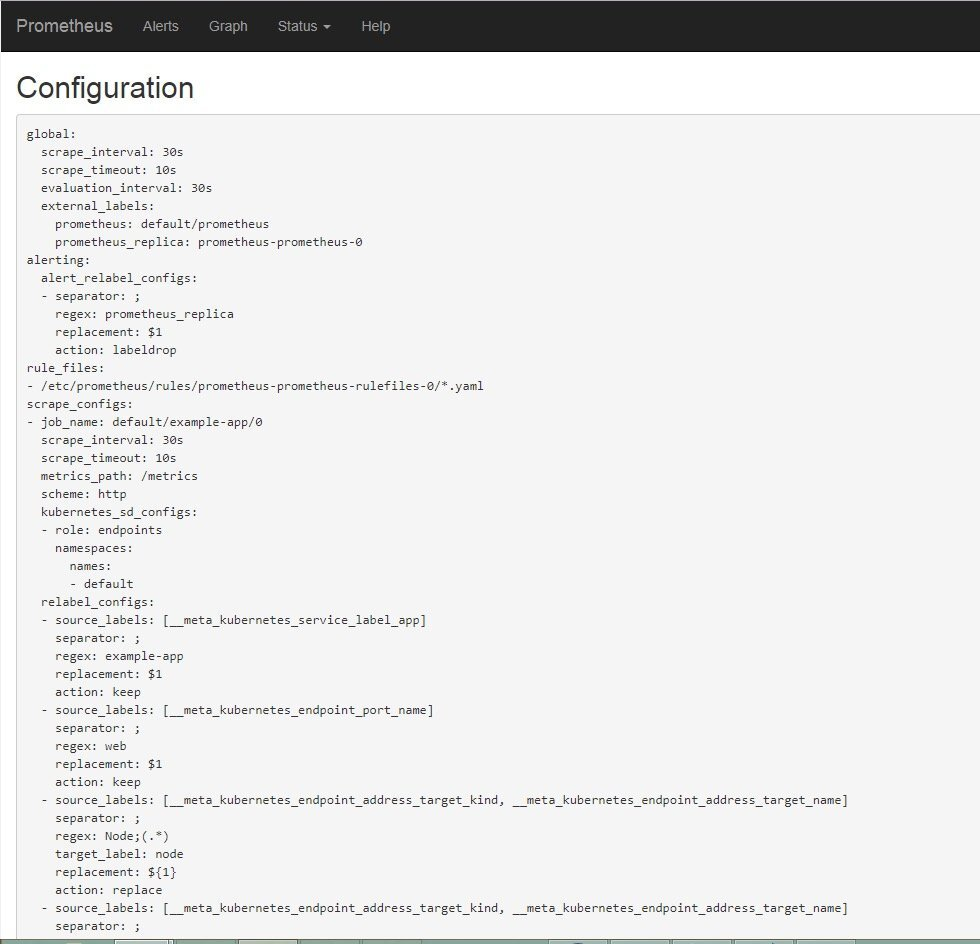
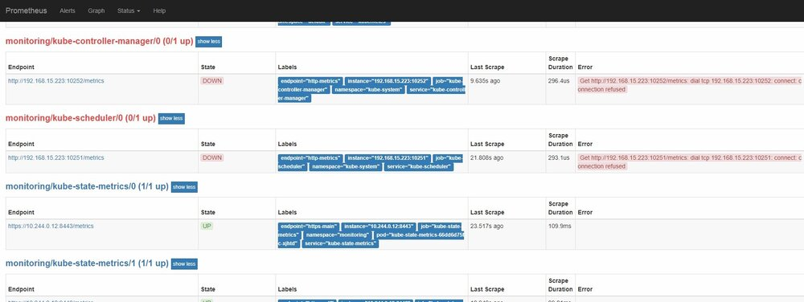

## 写这篇文章原因

所有监控的agent底层最终都是查询的/proc和/sys里的信息推送(如果错了轻喷)，因为在Kubernetes中收集宿主机信息方面也想用pod跑，会面临到问题。

常见的zabbix_agent默认读取fs的/proc和/sys，容器跑agent会导致读取的不是宿主机的/proc和/sys。

而prometheus的`node-exporter`有选项`--path.procfs`和`--path.sysfs`来指定从这俩选项的值的proc和sys读取，容器跑`node-exporter`只需要挂载宿主机的/proc和/sys到容器fs的某个路径挂载属性设置为readonly后用这两个选项指定即可，zabbix4.0看了文档和容器都找不到类似选项应该不支持。

虽说上prometheus但是Kubernetes监控这方面，经常看到如下问题:

- 如何部署
- 用prometheus的话pod ip会变咋整之类的
- 我的target怎么是0/0
- 官方yaml怎么用
- operator和传统的prometheus有啥差异
- operator相对手动部署的prometheus有啥优秀之处
- .....

上面问题里大多都是对prometheus-operator不了解的，也就是说大多不看官方文档的，这里我几个例子加介绍说说怎样部署`prometheus-operator`，和一些常见的坑。
另外网上大多是helm部署的以及管理组件是二进制下有几个target是0/0发现不了的解决办法。

需要看懂本文要具备一下知识点：

- svc实现原理和会应用以及svc和endpoint关系
- 了解prometheus(不是operator的)工作机制
- 知道什么是metrics(不过有了prometheus-operator似乎不是必须)

## 速补基础

### 什么是metrics

前面知识点第一条都考虑到Kubernetes集群监控了想必都会了，第二条因为有operator的存在不太关心底层可能不太急需可以后面去稍微学学，第三条无论etcd还是k8s的管理组件基本都有metrics端口。

这里来介绍啥什么是metrics：

例如我们要查看etcd的metrics，先查看etcd的运行参数找到相关的值，这里我是所有参数写在一个yml文件里，非yml自行查看systemd文件或者运行参数找到相关参数和值即可。

```bash
[root@k8s-m1 ~]# ps aux | grep -P '/etc[d] '
root      13531  2.8  0.8 10631072 140788 ?     Ssl   2018 472:58 /usr/local/bin/etcd --config-file=/etc/etcd/etcd.config.yml
[root@k8s-m1 ~]# cat /etc/etcd/etcd.config.yml
...
listen-client-urls: 'https://172.16.0.2:2379'
...
client-transport-security:
  ca-file: '/etc/etcd/ssl/etcd-ca.pem'
  cert-file: '/etc/etcd/ssl/etcd.pem'
  key-file: '/etc/etcd/ssl/etcd-key.pem'
...
```

我们需要两部分信息：

- listen-client-urls的httpsurl，我这里是`https://172.16.0.2:2379`
- 允许客户端证书信息

然后使用下面的curl，带上各自证书路径访问https的url执行

```bash
curl --cacert /etc/etcd/ssl/etcd-ca.pem --cert /etc/etcd/ssl/etcd.pem --key /etc/etcd/ssl/etcd-key.pem https://172.16.0.2:2379/metrics
```

也可以etcd用选项和值`--listen-metrics-urls http://interface_IP:port`设置成非https的metrics端口可以不用证书即可访问，我们会看到etcd的metrics输出信息如下：

```bash
....
grpc_server_started_total{grpc_method="RoleList"，grpc_service="etcdserverpb.Auth"，grpc_type="unary"} 0
grpc_server_started_total{grpc_method="RoleRevokePermission"，grpc_service="etcdserverpb.Auth"，grpc_type="unary"} 0
grpc_server_started_total{grpc_method="Snapshot"，grpc_service="etcdserverpb.Maintenance"，grpc_type="server_stream"} 0
grpc_server_started_total{grpc_method="Status"，grpc_service="etcdserverpb.Maintenance"，grpc_type="unary"} 0
grpc_server_started_total{grpc_method="Txn"，grpc_service="etcdserverpb.KV"，grpc_type="unary"} 259160
grpc_server_started_total{grpc_method="UserAdd"，grpc_service="etcdserverpb.Auth"，grpc_type="unary"} 0
grpc_server_started_total{grpc_method="UserChangePassword"，grpc_service="etcdserverpb.Auth"，grpc_type="unary"} 0
grpc_server_started_total{grpc_method="UserDelete"，grpc_service="etcdserverpb.Auth"，grpc_type="unary"} 0
grpc_server_started_total{grpc_method="UserGet"，grpc_service="etcdserverpb.Auth"，grpc_type="unary"} 0
grpc_server_started_total{grpc_method="UserGrantRole"，grpc_service="etcdserverpb.Auth"，grpc_type="unary"} 0
grpc_server_started_total{grpc_method="UserList"，grpc_service="etcdserverpb.Auth"，grpc_type="unary"} 0
grpc_server_started_total{grpc_method="UserRevokeRole"，grpc_service="etcdserverpb.Auth"，grpc_type="unary"} 0
grpc_server_started_total{grpc_method="Watch"，grpc_service="etcdserverpb.Watch"，grpc_type="bidi_stream"} 86
# HELP process_cpu_seconds_total Total user and system CPU time spent in seconds.
# TYPE process_cpu_seconds_total counter
process_cpu_seconds_total 28145.45
# HELP process_max_fds Maximum number of open file descriptors.
# TYPE process_max_fds gauge
process_max_fds 65536
# HELP process_open_fds Number of open file descriptors.
# TYPE process_open_fds gauge
process_open_fds 121
# HELP process_resident_memory_bytes Resident memory size in bytes.
# TYPE process_resident_memory_bytes gauge
process_resident_memory_bytes 1.46509824e+08
# HELP process_start_time_seconds Start time of the process since unix epoch in seconds.
# TYPE process_start_time_seconds gauge
process_start_time_seconds 1.54557786888e+09
# HELP process_virtual_memory_bytes Virtual memory size in bytes.
# TYPE process_virtual_memory_bytes gauge
process_virtual_memory_bytes 1.0886217728e+10
```

同理kube-apiserver也有metrics信息

```bash
$ kubectl get --raw /metrics
...
rest_client_request_latency_seconds_bucket{url="https://[::1]:6443/apis?timeout=32s"，verb="GET"，le="0.512"} 39423
rest_client_request_latency_seconds_bucket{url="https://[::1]:6443/apis?timeout=32s"，verb="GET"，le="+Inf"} 39423
rest_client_request_latency_seconds_sum{url="https://[::1]:6443/apis?timeout=32s"，verb="GET"} 24.781942557999795
rest_client_request_latency_seconds_count{url="https://[::1]:6443/apis?timeout=32s"，verb="GET"} 39423
# HELP rest_client_requests_total Number of HTTP requests， partitioned by status code， method， and host.
# TYPE rest_client_requests_total counter
rest_client_requests_total{code="200"，host="[::1]:6443"，method="GET"} 2.032031e+06
rest_client_requests_total{code="200"，host="[::1]:6443"，method="PUT"} 1.106921e+06
rest_client_requests_total{code="201"，host="[::1]:6443"，method="POST"} 38
rest_client_requests_total{code="401"，host="[::1]:6443"，method="GET"} 17378
rest_client_requests_total{code="404"，host="[::1]:6443"，method="GET"} 3.546509e+06
rest_client_requests_total{code="409"，host="[::1]:6443"，method="POST"} 29
rest_client_requests_total{code="409"，host="[::1]:6443"，method="PUT"} 20
rest_client_requests_total{code="422"，host="[::1]:6443"，method="POST"} 1
rest_client_requests_total{code="503"，host="[::1]:6443"，method="GET"} 5
# HELP ssh_tunnel_open_count Counter of ssh tunnel total open attempts
# TYPE ssh_tunnel_open_count counter
ssh_tunnel_open_count 0
# HELP ssh_tunnel_open_fail_count Counter of ssh tunnel failed open attempts
# TYPE ssh_tunnel_open_fail_count counter
ssh_tunnel_open_fail_count 0
```

这种就是prometheus的定义的metrics格式规范，缺省是在http(s)的url的/metrics输出。
而metrics要么程序定义输出(模块或者自定义开发)，要么用官方的各种exporter(node-exporter，mysqld-exporter，memcached_exporter...)采集要监控的信息占用一个web端口然后输出成metrics格式的信息，prometheus server去收集各个target的metrics存储起来(tsdb)。
用户可以在prometheus的http页面上用promQL(prometheus的查询语言)或者(grafana数据来源就是用)api去查询一些信息，也可以利用pushgateway去统一采集然后prometheus从pushgateway采集(所以pushgateway类似于zabbix的proxy)，prometheus的工作架构如下图：


### 为什么需要prometheus-operator

因为是prometheus主动去拉取的，所以在k8s里pod因为调度的原因导致pod的ip会发生变化，人工不可能去维持，自动发现有基于DNS的，但是新增还是有点麻烦。

Prometheus-operator的本职就是一组用户自定义的CRD资源以及Controller的实现，Prometheus Operator这个controller有BRAC权限下去负责监听这些自定义资源的变化，并且根据这些资源的定义自动化的完成如Prometheus Server自身以及配置的自动化管理工作。

在Kubernetes中我们使用Deployment、DamenSet、StatefulSet来管理应用Workload，使用Service、Ingress来管理应用的访问方式，使用ConfigMap和Secret来管理应用配置。我们在集群中对这些资源的创建，更新，删除的动作都会被转换为事件(Event)，Kubernetes的Controller Manager负责监听这些事件并触发相应的任务来满足用户的期望。这种方式我们成为声明式，用户只需要关心应用程序的最终状态，其它的都通过Kubernetes来帮助我们完成，通过这种方式可以大大简化应用的配置管理复杂度。

而除了这些原生的Resource资源以外，Kubernetes还允许用户添加自己的自定义资源(Custom Resource)。并且通过实现自定义Controller来实现对Kubernetes的扩展，不需要用户去二开k8s也能达到给k8s添加功能和对象。

因为svc的负载均衡，所以在K8S里监控metrics基本最小单位都是一个svc背后的pod为target，所以prometheus-operator创建了对应的CRD: `kind: ServiceMonitor` ，创建的`ServiceMonitor`里声明需要监控选中的svc的label以及metrics的url路径的和namespaces即可。

工作架构如下图所示。


## Demo部署学习

### 获取相关文件

先获取相关文件后面跟着文件来讲，直接用git客户端拉取即可，不过文件大概30多M，没梯子基本拉不下来。

```bash
git clone https://github.com/coreos/prometheus-operator.git
```

拉取不下来可以在<a href="https://www.katacoda.com/courses/kubernetes">katacoda的网页</a>上随便一个课程的机器都有docker客户端，可以git clone下来后把文件构建进一个alpine镜像然后推到dockerhub上，再在自己的机器docker run这个镜像的时候docker cp到宿主机上。

Prometheus Operator引入的自定义资源包括：

- Prometheus
- ServiceMonitor
- Alertmanager

用户创建了prometheus-operator(也就是上面监听三个CRD的各种事件的controller)后，用户可以利用`kind: Prometheus`这种声明式创建对应的资源。
下面我们部署简单的例子学习prometheus-operator

### 创建prometheus-operator的pod

拉取到文件后我们先创建prometheus-operator：

```bash
$ cd prometheus-operator
$ kubectl apply -f bundle.yaml
clusterrolebinding.rbac.authorization.k8s.io/prometheus-operator created
clusterrole.rbac.authorization.k8s.io/prometheus-operator created
deployment.apps/prometheus-operator created
serviceaccount/prometheus-operator created
```

确认pod运行，以及我们可以发现operator的pod在有RBAC下创建了一个APIService：

```bash
$ kubectl get pod
NAME                                   READY     STATUS    RESTARTS   AGE
prometheus-operator-6db8dbb7dd-djj6s   1/1       Running   0          1m
$ kubectl get APIService | grep monitor
v1.monitoring.coreos.com               2018-10-09T10:49:47Z
```

查看这个APISerivce

```bash
$ kubectl get --raw /apis/monitoring.coreos.com/v1
{
  "kind": "APIResourceList"，
  "apiVersion": "v1"，
  "groupVersion": "monitoring.coreos.com/v1"，
  "resources": [
    {
      "name": "alertmanagers"，
      "singularName": "alertmanager"，
      "namespaced": true，
      "kind": "Alertmanager"，
      "verbs": [
        "delete"，
        "deletecollection"，
        "get"，
        "list"，
        "patch"，
        "create"，
        "update"，
        "watch"
      ]
    }，
    {
      "name": "prometheuses"，
      "singularName": "prometheus"，
      "namespaced": true，
      "kind": "Prometheus"，
      "verbs": [
        "delete"，
        "deletecollection"，
        "get"，
        "list"，
        "patch"，
        "create"，
        "update"，
        "watch"
      ]
    }，
    {
      "name": "servicemonitors"，
      "singularName": "servicemonitor"，
      "namespaced": true，
      "kind": "ServiceMonitor"，
      "verbs": [
        "delete"，
        "deletecollection"，
        "get"，
        "list"，
        "patch"，
        "create"，
        "update"，
        "watch"
      ]
    }，
    {
      "name": "prometheusrules"，
      "singularName": "prometheusrule"，
      "namespaced": true，
      "kind": "PrometheusRule"，
      "verbs": [
        "delete"，
        "deletecollection"，
        "get"，
        "list"，
        "patch"，
        "create"，
        "update"，
        "watch"
      ]
    }
  ]
}
```

这个是因为bundle.yml里有如下的`CLusterRole`和对应的`ClusterRoleBinding`来让prometheus-operator有权限对`monitoring.coreos.com`这个apiGroup里的这些CRD进行所有操作

```yaml
apiVersion: rbac.authorization.k8s.io/v1
kind: ClusterRole
metadata:
  name: prometheus-operator
rules:
- apiGroups:
  - apiextensions.k8s.io
  resources:
  - customresourcedefinitions
  verbs:
  - '*'
- apiGroups:
  - monitoring.coreos.com
  resources:
  - alertmanagers
  - prometheuses
  - prometheuses/finalizers
  - alertmanagers/finalizers
  - servicemonitors
  - prometheusrules
  verbs:
  - '*'
```

同时我们查看到pod里的log发现operator也在集群里创建了对应的CRD

```bash
$ kubectl logs prometheus-operator-6db8dbb7dd-dkhxc
ts=2018-10-09T11:21:09.389340424Z caller=main.go:165 msg="Starting Prometheus Operator version '0.26.0'."
level=info ts=2018-10-09T11:21:09.491464524Z caller=operator.go:377 component=prometheusoperator msg="connection established" cluster-version=v1.11.3
level=info ts=2018-10-09T11:21:09.492679498Z caller=operator.go:209 component=alertmanageroperator msg="connection established" cluster-version=v1.11.3
level=info ts=2018-10-09T11:21:12.085147219Z caller=operator.go:624 component=alertmanageroperator msg="CRD created" crd=Alertmanager
level=info ts=2018-10-09T11:21:12.085265548Z caller=operator.go:1420 component=prometheusoperator msg="CRD created" crd=Prometheus
level=info ts=2018-10-09T11:21:12.099210714Z caller=operator.go:1420 component=prometheusoperator msg="CRD created" crd=ServiceMonitor
level=info ts=2018-10-09T11:21:12.118721976Z caller=operator.go:1420 component=prometheusoperator msg="CRD created" crd=PrometheusRule
level=info ts=2018-10-09T11:21:15.182780757Z caller=operator.go:225 component=alertmanageroperator msg="CRD API endpoints ready"
level=info ts=2018-10-09T11:21:15.383456425Z caller=operator.go:180 component=alertmanageroperator msg="successfully synced all caches"
$ kubectl get crd
NAME                                    CREATED AT
alertmanagers.monitoring.coreos.com     2018-10-09T11:21:11Z
prometheuses.monitoring.coreos.com      2018-10-09T11:21:11Z
prometheusrules.monitoring.coreos.com   2018-10-09T11:21:12Z
servicemonitors.monitoring.coreos.com   2018-10-09T11:21:12Z
```

### 相关CRD介绍

这四个CRD作用如下

- <span style="font-size: 1.2em;color: #333;font-weight:bold">Prometheus</span>: 由 Operator 依据一个自定义资源`kind: Prometheus`类型中，所描述的内容而部署的 Prometheus Server 集群，可以将这个自定义资源看作是一种特别用来管理Prometheus Server的StatefulSets资源。
- <span style="font-size: 1.2em;color: #333;font-weight:bold">ServiceMonitor</span>: 一个Kubernetes自定义资源(和`kind: Prometheus`一样是CRD)，该资源描述了Prometheus Server的Target列表，Operator 会监听这个资源的变化来动态的更新Prometheus Server的Scrape targets并让prometheus server去reload配置(prometheus有对应reload的http接口`/-/reload`)。而该资源主要通过Selector来依据 Labels 选取对应的Service的endpoints，并让 Prometheus Server 通过 Service 进行拉取（拉）指标资料(也就是metrics信息)，metrics信息要在http的url输出符合metrics格式的信息，ServiceMonitor也可以定义目标的metrics的url。
- <span style="font-size: 1.2em;color: #333;font-weight:bold">Alertmanager</span>：Prometheus Operator 不只是提供 Prometheus Server 管理与部署，也包含了 AlertManager，并且一样通过一个 `kind: Alertmanager` 自定义资源来描述信息，再由 Operator 依据描述内容部署 Alertmanager 集群。
- <span style="font-size: 1.2em;color: #333;font-weight:bold">PrometheusRule</span>:对于Prometheus而言，在原生的管理方式上，我们需要手动创建Prometheus的告警文件，并且通过在Prometheus配置中声明式的加载。而在Prometheus Operator模式中，告警规则也编程一个通过Kubernetes API 声明式创建的一个资源.告警规则创建成功后，通过在Prometheus中使用想servicemonitor那样用`ruleSelector`通过label匹配选择需要关联的PrometheusRule即可。

### 部署kind: Prometheus

现在我们有了prometheus这个CRD，我们部署一个prometheus server只需要如下声明即可。

```bash
$ cat<<EOF | kubectl apply -f -
apiVersion: v1
kind: ServiceAccount
metadata:
  name: prometheus
---
apiVersion: monitoring.coreos.com/v1
kind: Prometheus
metadata:
  name: prometheus
spec:
  serviceMonitorSelector:
    matchLabels:
      team: frontend
  serviceAccountName: prometheus
  resources:
    requests:
      memory: 400Mi
EOF
```

因为负载均衡，一个svc下的一组pod是监控的最小单位，要监控一个svc的metrics就声明创建一个`servicemonitors`即可。

### 部署一组pod及其svc

首先，我们部署一个带metrics输出的简单程序的deploy，该镜像里的主进程会在8080端口上输出metrics信息。

```bash
$ cat<<EOF | kubectl apply -f -
apiVersion: extensions/v1beta1
kind: Deployment
metadata:
  name: example-app
spec:
  replicas: 3
  template:
    metadata:
      labels:
        app: example-app
    spec:
      containers:
      - name: example-app
        image: zhangguanzhang/instrumented_app
        ports:
        - name: web
          containerPort: 8080
EOF
```

创建对应的svc。

```bash
$ cat<<EOF | kubectl apply -f -
kind: Service
apiVersion: v1
metadata:
  name: example-app
  labels:
    app: example-app
spec:
  selector:
    app: example-app
  ports:
  - name: web
    port: 8080
EOF
```

### 部署kind: ServiceMonitor

现在创建一个`ServiceMonitor`来告诉prometheus server需要监控带有label `app: example-app`的svc背后的一组pod的metrics。

```bash
$ cat<<EOF | kubectl apply -f -
apiVersion: monitoring.coreos.com/v1
kind: ServiceMonitor
metadata:
  name: example-app
  labels:
    team: frontend
spec:
  selector:
    matchLabels:
      app: example-app
  endpoints:
  - port: web
EOF
```

默认情况下`ServiceMonitor`和监控对象必须是在相同Namespace下的，如果要关联非同ns下需要下面这样设置值。

```yaml
spec:
  namespaceSelector:
    matchNames:
    - target_ns_name
```

如果希望ServiceMonitor可以关联任意命名空间下的标签，则通过以下方式定义：

```yaml
spec:
  namespaceSelector:
    any: true
```

如果需要监控的Target对象启用了BasicAuth认证，那在定义ServiceMonitor对象时，可以使用endpoints配置中定义basicAuth如下所示basicAuth中的`password`和`username`值来源于同ns下的一个名为`basic-auth`的Secret。

```yaml
spec
  endpoints:
  - basicAuth:
      password:
        name: basic-auth
        key: password
      username:
        name: basic-auth
        key: user
    port: web
---
apiVersion: v1
kind: Secret
metadata:
  name: basic-auth
type: Opaque
data:
  user: dXNlcgo= # base64编码后的用户名
  password: cGFzc3dkCg== # base64编码后的密码
```

上面要注意的是我创建prometheus server的时候有如下值。

```yaml
  serviceMonitorSelector:
    matchLabels:
      team: frontend
```

该值字面意思可以知道就是指定prometheus server去选择哪些`ServiceMonitor`，这个概念和svc去选择pod一样，可能一个集群跑很多prometheus server来监控各自选中的`ServiceMonitor`，如果想一个prometheus server监控所有的则`spec.serviceMonitorSelector: {}`为空即可，而namespaces的范围同样的设置`spec.serviceMonitorSelector: {}`，后面官方的prometheus实例里我们可以看到设置了这两个值。

给prometheus server设置相关的RBAC权限。

```bash
$ cat<<EOF | kubectl apply -f -
apiVersion: rbac.authorization.k8s.io/v1beta1
kind: ClusterRole
metadata:
  name: prometheus
rules:
- apiGroups: [""]
  resources:
  - nodes
  - services
  - endpoints
  - pods
  verbs: ["get"， "list"， "watch"]
- apiGroups: [""]
  resources:
  - configmaps
  verbs: ["get"]
- nonResourceURLs: ["/metrics"]
  verbs: ["get"]
---
apiVersion: rbac.authorization.k8s.io/v1beta1
kind: ClusterRoleBinding
metadata:
  name: prometheus
roleRef:
  apiGroup: rbac.authorization.k8s.io
  kind: ClusterRole
  name: prometheus
subjects:
- kind: ServiceAccount
  name: prometheus
  namespace: default
EOF
```

创建svc使用`NodePort`方便我们访问prometheus的web页面，生产环境不建议使用`NodePort`。

```bash
$ cat<<EOF | kubectl apply -f -
apiVersion: v1
kind: Service
metadata:
  name: prometheus
spec:
  type: NodePort
  ports:
  - name: web
    nodePort: 30900
    port: 9090
    protocol: TCP
    targetPort: web
  selector:
    prometheus: prometheus
EOF
```

打开浏览器访问`ip:30900`进入target发现已经监听起来了，对应的config里也有配置生成和导入。




先清理掉上面的，然后我们使用官方提供的全套yaml正式部署`prometheus-operator`。

```bash
kubectl delete svc prometheus example-app
kubectl delete ClusterRoleBinding prometheus 
kubectl delete ClusterRole prometheus
kubectl delete ServiceMonitor example-app
kubectl delete deploy example-app
kubectl delete  sa prometheus
kubectl delete prometheus prometheus
kubectl delete -f bundle.yaml
```

## 部署官方的prometheus-operator

### 分类文件

官方把所有文件都放在一起，这里我分类下。

```bash
cd contrib/kube-prometheus/manifests/
mkdir -p operator node-exporter alertmanager grafana kube-state-metrics prometheus serviceMonitor adapter
mv *-serviceMonitor* serviceMonitor/
mv 0prometheus-operator* operator/
mv grafana-* grafana/
mv kube-state-metrics-* kube-state-metrics/
mv alertmanager-* alertmanager/
mv node-exporter-* node-exporter/
mv prometheus-adapter* adapter/
mv prometheus-* prometheus/
$ ll
total 40
drwxr-xr-x 9 root root 4096 Jan  6 14:19 ./
drwxr-xr-x 9 root root 4096 Jan  6 14:15 ../
-rw-r--r-- 1 root root   60 Jan  6 14:15 00namespace-namespace.yaml
drwxr-xr-x 3 root root 4096 Jan  6 14:19 adapter/
drwxr-xr-x 3 root root 4096 Jan  6 14:19 alertmanager/
drwxr-xr-x 2 root root 4096 Jan  6 14:17 grafana/
drwxr-xr-x 2 root root 4096 Jan  6 14:17 kube-state-metrics/
drwxr-xr-x 2 root root 4096 Jan  6 14:18 node-exporter/
drwxr-xr-x 2 root root 4096 Jan  6 14:17 operator/
drwxr-xr-x 2 root root 4096 Jan  6 14:19 prometheus/
drwxr-xr-x 2 root root 4096 Jan  6 14:17 serviceMonitor/
```

### 部署operator

先创建ns和operator，quay.io仓库拉取慢，可以使用我脚本拉取，其他镜像也可以这样去拉，不过在apply之前才能拉，一旦被docker接手拉取就只能漫长等。

```bash
kubectl apply -f .
curl -s https://zhangguanzhang.github.io/bash/pull.sh | bash -s -- quay.io/coreos/prometheus-operator:v0.26.0
kubectl apply -f operator/
```

确认状态运行正常再往后执行，这里镜像是quay.io仓库的可能会很慢耐心等待或者自行修改成能拉取到的。

```bash
$ kubectl -n monitoring get pod
NAME                                   READY     STATUS    RESTARTS   AGE
prometheus-operator-56954c76b5-qm9ww   1/1       Running   0          24s
```

### 部署整套CRD

创建相关的CRD，这里镜像可能也要很久。

```bash
kubectl apply -f adapter/
kubectl apply -f alertmanager/
kubectl apply -f node-exporter/
kubectl apply -f kube-state-metrics/
kubectl apply -f grafana/
kubectl apply -f prometheus/
kubectl apply -f serviceMonitor/
```

可以通过get查看整体状态，这里镜像原因会等待很久，我们可以先往后看几个坑的地方。

```bash
kubectl -n monitoring get all
```

### 常见坑的说明和解决方法

#### 坑一


这里要注意有一个坑，二进制部署k8s管理组件和新版本kubeadm部署的都会发现在prometheus server的页面上发现`kube-controller`和`kube-schedule`的target为0/0也就是上图所示。这是因为serviceMonitor是根据label去选取svc的，我们可以看到对应的`serviceMonitor`是选取的ns范围是`kube-system`。

```bash
$ grep -2 selector serviceMonitor/prometheus-serviceMonitorKube*
serviceMonitor/prometheus-serviceMonitorKubeControllerManager.yaml-    matchNames:
serviceMonitor/prometheus-serviceMonitorKubeControllerManager.yaml-    - kube-system
serviceMonitor/prometheus-serviceMonitorKubeControllerManager.yaml:  selector:
serviceMonitor/prometheus-serviceMonitorKubeControllerManager.yaml-    matchLabels:
serviceMonitor/prometheus-serviceMonitorKubeControllerManager.yaml-      k8s-app: kube-controller-manager
--
serviceMonitor/prometheus-serviceMonitorKubelet.yaml-    matchNames:
serviceMonitor/prometheus-serviceMonitorKubelet.yaml-    - kube-system
serviceMonitor/prometheus-serviceMonitorKubelet.yaml:  selector:
serviceMonitor/prometheus-serviceMonitorKubelet.yaml-    matchLabels:
serviceMonitor/prometheus-serviceMonitorKubelet.yaml-      k8s-app: kubelet
--
serviceMonitor/prometheus-serviceMonitorKubeScheduler.yaml-    matchNames:
serviceMonitor/prometheus-serviceMonitorKubeScheduler.yaml-    - kube-system
serviceMonitor/prometheus-serviceMonitorKubeScheduler.yaml:  selector:
serviceMonitor/prometheus-serviceMonitorKubeScheduler.yaml-    matchLabels:
serviceMonitor/prometheus-serviceMonitorKubeScheduler.yaml-      k8s-app: kube-scheduler
```

而kube-system里默认只有这俩svc，且没有符合上面的label。

```bash
$ kubectl -n kube-system get svc
NAME                      TYPE        CLUSTER-IP   EXTERNAL-IP   PORT(S)         AGE
kube-dns                  ClusterIP   10.96.0.10   <none>        53/UDP，53/TCP   139m
kubelet                   ClusterIP   None         <none>        10250/TCP       103m
```

但是却有对应的ep(没有带任何label)被创建，这点想不通官方什么鬼操作，另外这里没有kubelet的ep，我博客部署的二进制的话会有。

```bash
$ kubectl get ep -n kube-system
NAME                      ENDPOINTS                                                AGE
kube-controller-manager   <none>                                                   139m
kube-dns                  10.244.1.2:53，10.244.8.10:53，10.244.1.2:53 + 1 more...   139m
kube-scheduler            <none>                                                   139m
```

#### 解决办法

所以这里我们创建两个管理组建的svc，名字无所谓，关键是svc的label要能被servicemonitor选中，svc的选择器的label是因为kubeadm的staticPod的label是这样，如果是二进制部署的这俩svc的selector部分不能要。

```yaml
apiVersion: v1
kind: Service
metadata:
  namespace: kube-system
  name: kube-controller-manager
  labels:
    k8s-app: kube-controller-manager
spec:
  selector:
    component: kube-controller-manager
  type: ClusterIP
  clusterIP: None
  ports:
  - name: http-metrics
    port: 10252
    targetPort: 10252
    protocol: TCP
---
apiVersion: v1
kind: Service
metadata:
  namespace: kube-system
  name: kube-scheduler
  labels:
    k8s-app: kube-scheduler
spec:
  selector:
    component: kube-scheduler
  type: ClusterIP
  clusterIP: None
  ports:
  - name: http-metrics
    port: 10251
    targetPort: 10251
    protocol: TCP
```

二进制的话需要我们手动填入svc对应的ep的属性，我集群是HA的，所有有三个，仅供参考，别傻傻得照抄，另外这个ep的名字得和上面的svc的名字和属性对应上：

```yaml
apiVersion: v1
kind: Endpoints
metadata:
  labels:
    k8s-app: kube-controller-manager
  name: kube-controller-manager
  namespace: kube-system
subsets:
- addresses:
  - ip: 172.16.0.2
  - ip: 172.16.0.7
  - ip: 172.16.0.8
  ports:
  - name: http-metrics
    port: 10252
    protocol: TCP
---
apiVersion: v1
kind: Endpoints
metadata:
  labels:
    k8s-app: kube-scheduler
  name: kube-scheduler
  namespace: kube-system
subsets:
- addresses:
  - ip: 172.16.0.2
  - ip: 172.16.0.7
  - ip: 172.16.0.8
  ports:
  - name: http-metrics
    port: 10251
    protocol: TCP
```

这里不知道为啥kubeadm部署的没有kubelet这个ep，我博客二进制部署后是会有kubelet这个ep的(好像metrics server创建的)，下面仅供参考，IP根据实际写。另外kubeadm部署下kubelet的readonly的metrics端口(默认是10255)不会开放可以删掉ep的那部分port：

```yaml
apiVersion: v1
kind: Endpoints
metadata:
  labels:
    k8s-app: kubelet
  name: kubelet
  namespace: kube-system
subsets:
- addresses:
  - ip: 172.16.0.14
    targetRef:
      kind: Node
      name: k8s-n2
  - ip: 172.16.0.18
    targetRef:
      kind: Node
      name: k8s-n3
  - ip: 172.16.0.2
    targetRef:
      kind: Node
      name: k8s-m1
  - ip: 172.16.0.20
    targetRef:
      kind: Node
      name: k8s-n4
  - ip: 172.16.0.21
    targetRef:
      kind: Node
      name: k8s-n5
  ports:
  - name: http-metrics
    port: 10255
    protocol: TCP
  - name: cadvisor
    port: 4194
    protocol: TCP
  - name: https-metrics
    port: 10250
    protocol: TCP
```

至于prometheus server的服务访问，别再用效率不行的`NodePort`了，上ingress controller吧，怎么部署参照我博客<a href="https://zhangguanzhang.github.io/2018/10/06/IngressController/">IngressController</a>。

```yaml
apiVersion: extensions/v1beta1
kind: Ingress
metadata:
  name: prometheus-ing
  namespace: monitoring
spec:
  rules:
  - host: prometheus.monitoring.k8s.local
    http:
      paths:
      - backend:
          serviceName: prometheus-k8s
          servicePort: 9090
---
apiVersion: extensions/v1beta1
kind: Ingress
metadata:
  name: grafana-ing
  namespace: monitoring
spec:
  rules:
  - host: grafana.monitoring.k8s.local
    http:
      paths:
      - backend:
          serviceName: grafana
          servicePort: 3000
---
apiVersion: extensions/v1beta1
kind: Ingress
metadata:
  name: alertmanager-ing
  namespace: monitoring
spec:
  rules:
  - host: alertmanager.monitoring.k8s.local
    http:
      paths:
      - backend:
          serviceName: alertmanager-main
          servicePort: 9093
```

#### 坑二

访问prometheus server的web页面我们发现即使创建了svc和注入对应ep的信息在target页面发现prometheus server请求被拒绝。



在宿主机上我们发现127.0.0.1才能访问，网卡ip不能访问(这里是另一个环境找的，所以ip是192不是前面的172)

```bash
$ hostname -i
192.168.15.223
$ curl -I http://192.168.15.223:10251/metrics
curl: (7) Failed connect to 192.168.15.223:10251; Connection refused
$ curl -I http://127.0.0.1:10251/metrics
HTTP/1.1 200 OK
Content-Length: 30349
Content-Type: text/plain; version=0.0.4
Date: Mon， 07 Jan 2019 13:33:50 GMT
```

#### 解决办法

修改管理组件bind的ip。

如果使用kubeadm启动的集群，初始化时的config.yml里可以加入如下参数

```yaml
controllerManagerExtraArgs:
  address: 0.0.0.0
schedulerExtraArgs:
  address: 0.0.0.0
```

已经启动后的使用下面命令更改就会滚动更新

```bash
sed -ri '/--address/s#=.+#=0.0.0.0#' /etc/kubernetes/manifests/kube-*
```

二进制的话查看是不是bind的0.0.0.0如果不是就修改成0.0.0.0，多块网卡如果只想bind一个网卡就写对应的主机上的网卡ip，写0.0.0.0就会监听所有网卡的对应端口。

### 访问相关页面

通过浏览器查看`prometheus.monitoring.k8s.local`与`grafana.monitoring.k8s.local`是否正常，若沒问题就可以看到下图结果，grafana初始用股名和密码是admin。


## 最后

可以多看看官方写的yaml，里面有更多的字段没介绍可以看yaml来了解。

## 参考文档

- https://github.com/coreos/prometheus-operator/tree/master/Documentation
- https://github.com/coreos/prometheus-operator/tree/master/contrib/kube-prometheus
- https://coreos.com/operators/prometheus/docs/latest/user-guides/getting-started.html
