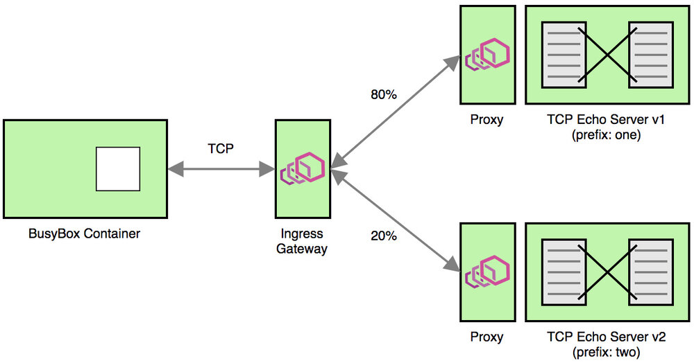

本文为翻译文章，[点击查看原文](https://venilnoronha.io/raw-tcp-traffic-shaping-with-istio-1.1.0)。

[Istio](https://istio.io/)通过[虚拟服务](https://istio.io/docs/reference/config/istio.networking.v1alpha3/#VirtualService), [目标规则](https://istio.io/docs/reference/config/istio.networking.v1alpha3/#DestinationRule), [Gateway](https://istio.io/docs/reference/config/istio.networking.v1alpha3/#Gateway)等概念提供了复杂的路由机制。Istio 1.0通过[加权路由定义](https://istio.io/docs/tasks/traffic-management/traffic-shifting/#apply-weight-based-routing)启用了HTTP流量转移。我提交的[Envoy](https://github.com/envoyproxy/envoy/pull/4430) 和[Istio](https://github.com/istio/istio/pull/9112)的pull request为TCP/TLS服务提供了类似的特性。这一特性已经在Envoy [1.8.0](https://www.envoyproxy.io/docs/envoy/latest/intro/version_history#oct-4-2018)中发布了。Istio中的这一特性也会在即将发布的[1.1.0](https://github.com/istio/istio/releases/)版本中提供使用。


在本文中，我们将用[Go](https://golang.org/)编写的一个简单的TCP Echo服务，用[Docker](https://www.docker.com/)将其容器化并部署到[Kubernetes](https://kubernetes.io/)上，并通过练习Istio的加权TCP路由特性来理解其在生产服务中的行为。

## TCP Echo服务

在本文中，我们将创建一个简单的监听连接的TCP服务，并在客户端的请求数据加上一个简单的前缀，将其作为响应返回。图示如下：


让我们看一下TCP Echo服务端的Go代码：

```go
package main

import (
	"bufio"
	"fmt"
	"io"
	"net"
	"os"
)

// main作为程序入口点
func main() {
	// 通过程序入参获得端口和前缀
	port := fmt.Sprintf(":%s", os.Args[1])
	prefix := os.Args[2]

	// 在给定端口上创建tcp监听
	listener, err := net.Listen("tcp", port)
	if err != nil {
		fmt.Println("failed to create listener, err:", err)
		os.Exit(1)
	}
	fmt.Printf("listening on %s, prefix: %s\n", listener.Addr(), prefix)

	// 监听新的连接
	for {
		conn, err := listener.Accept()
		if err != nil {
			fmt.Println("failed to accept connection, err:", err)
			continue
		}

		// 启用goroutine处理连接
		go handleConnection(conn, prefix)
	}
}

// handleConnection 处理连接的生命周期
func handleConnection(conn net.Conn, prefix string) {
	defer conn.Close()
	reader := bufio.NewReader(conn)
	for {
		// 读取客户端请求数据
		bytes, err := reader.ReadBytes(byte('\n'))
		if err != nil {
			if err != io.EOF {
				fmt.Println("failed to read data, err:", err)
			}
			return
		}
		fmt.Printf("request: %s", bytes)

		// 添加前缀作为response返回
		line := fmt.Sprintf("%s %s", prefix, bytes)
		fmt.Printf("response: %s", line)
		conn.Write([]byte(line))
	}
}
```

要测试这个程序，复制上面代码并命名为`main.go`，执行命令如下：

```bash
$ go run -v main.go 9000 hello
listening on [::]:9000, prefix: hello
```

我们可以通过 `nc` ([Netcat](https://en.wikipedia.org/wiki/Netcat))在TCP层面上和这段程序交互。要发送请求，可以使用BusyBox容器，如下所示：

```bash
$ docker run -it --rm busybox sh -c 'echo world | nc docker.for.mac.localhost 9000'
hello world
```

就像你看到的，在请求“world”前面加上了“hello”，“hello world”作为响应。注意，正在执行的BusyBox容器基于 [Docker for Mac](https://docs.docker.com/docker-for-mac/)，这就是为什么我访问Echo服务端时用`docker.for.mac.localhost`代替了`localhost`。

## 容器化TCP Echo服务

因为我们最终想要在Kubernetes集群上运行TCP Echo服务，现在让我们将它容器化并发布镜像到 [Docker Hub](https://hub.docker.com/)。

首先，用下面的内容创建`Dockerfile`：

```dockerfile
# 使用golang容器构建可执行文件
FROM golang:1.11 as builder
WORKDIR /go/src/github.com/venilnoronha/tcp-echo-server/
COPY main.go .
RUN CGO_ENABLED=0 GOOS=linux go build -a -installsuffix cgo -o main main.go

# 负责bin文件到基于alpine的分离容器
FROM alpine:3.8
RUN apk --no-cache add ca-certificates
WORKDIR /bin/
COPY --from=builder /go/src/github.com/venilnoronha/tcp-echo-server/main .
ENTRYPOINT [ "/bin/main" ]
CMD [ "9000", "hello" ]
EXPOSE 9000
```

构建容器并发布镜像到Docker Hub：

```bash
$ docker build -t vnoronha/tcp-echo-server:latest .
Sending build context to Docker daemon  60.93kB
...
Successfully built d172af115e18
Successfully tagged vnoronha/tcp-echo-server:latest

$ docker push vnoronha/tcp-echo-server:latest
The push refers to repository [docker.io/vnoronha/tcp-echo-server]
b4cc76510de6: Pushed
...
latest: digest: sha256:0a45b5a0d362db6aa9154717ee3f2b... size: 949
```

## 部署TCP Echo服务到Kubernetes

### 服务配置

我们需要部署2个版本的TCP ECHO服务，用不同的前缀展示路由行为。创建`service.yaml`，用Kubernetes [Service](https://kubernetes.io/docs/concepts/services-networking/service/) 和2个 [Deployments](https://kubernetes.io/docs/concepts/workloads/controllers/deployment/) 构建2个版本的TCP ECHO服务。

```yaml
apiVersion: v1
kind: Service
metadata:
  name: tcp-echo-server
  labels:
    app: tcp-echo-server
    istio: ingressgateway # use istio default controller
spec:
  selector:
    app: tcp-echo-server
  ports:
  - port: 9000
    name: tcp
---
apiVersion: extensions/v1beta1
kind: Deployment
metadata:
  name: tcp-echo-server-v1
spec:
  replicas: 1
  template:
    metadata:
      labels:
        app: tcp-echo-server
        version: v1
    spec:
      containers:
      - name: tcp-echo-server
        image: vnoronha/tcp-echo-server:latest
        args: [ "9000", "one" ] # prefix: one
        imagePullPolicy: IfNotPresent
        ports:
        - containerPort: 9000
---
apiVersion: extensions/v1beta1
kind: Deployment
metadata:
  name: tcp-echo-server-v2
spec:
  replicas: 1
  template:
    metadata:
      labels:
        app: tcp-echo-server
        version: v2
    spec:
      containers:
      - name: tcp-echo-server
        image: vnoronha/tcp-echo-server:latest
        args: [ "9000", "two" ] # prefix: two
        imagePullPolicy: IfNotPresent
        ports:
        - containerPort: 9000
```

### 部署Minikube

[Minikube](https://kubernetes.io/docs/setup/minikube/)是Kubernetes本地开发的最佳工具。用下面的命令启动Minikube实例：

```bash
$ minikube start --bootstrapper kubeadm       \
                 --memory=8192                \
                 --cpus=4                     \
                 --kubernetes-version=v1.10.0 \
                 --vm-driver=virtualbox
Starting local Kubernetes v1.10.0 cluster...
...
Kubectl is now configured to use the cluster.
Loading cached images from config file.
```

### 安装 Istio

在撰写本文时，Istio 1.1.0还没有发布。因此我使用了Istio的 [Daily Pre-Release](https://gcsweb.istio.io/gcs/istio-prerelease/daily-build/master-20181017-09-15/)来演示这个新特性。请参考[Istio文档](https://istio.io/docs/setup/kubernetes/download-release/)学习下载和配置Istio。

一旦配置完成，这里有一个完全部署Istio组件的简单方法：

```bash
$ kubectl apply -f install/kubernetes/helm/istio/templates/crds.yaml
customresourcedefinition.apiextensions.k8s.io/virtualservices.networking.istio.io created
...
customresourcedefinition.apiextensions.k8s.io/templates.config.istio.io created
customresourcedefinition.apiextensions.k8s.io/handlers.config.istio.io created

$ kubectl apply -f install/kubernetes/istio-demo.yaml
namespace/istio-system created
...
destinationrule.networking.istio.io/istio-policy created
destinationrule.networking.istio.io/istio-telemetry created 
```

### 使用Istio代理部署TCP Echo服务

为了演示Istio的路由机制，我们以sidecar模式部署`tcp-echo-server` ：

```bash
$ kubectl apply -f <(istioctl kube-inject -f service.yaml)
service/tcp-echo-server created
deployment.extensions/tcp-echo-server-v1 created
deployment.extensions/tcp-echo-server-v2 created
```

通过下面的命令来验证服务运行：

```bash
$ kubectl get pods
NAME                                  READY     STATUS    RESTARTS   AGE
tcp-echo-server-v1-78684f5697-sv5r5   2/2       Running   0          56s
tcp-echo-server-v2-74bf9999c8-hhhf9   2/2       Running   0          56s

$ kubectl logs tcp-echo-server-v1-78684f5697-sv5r5 tcp-echo-server
listening on [::]:9000, prefix: one

$ kubectl logs tcp-echo-server-v2-74bf9999c8-hhhf9 tcp-echo-server
listening on [::]:9000, prefix: two
```

## Istio加权TCP路由

这是本练习的最后一部分，定义`VirtualService`，`DestinationRule`和带有权重路由的 `Gateway`，并验证系统行为。

### 路由配置

创建带有两个`subset`的`DestinationRule`来代表两个版本的 TCP Echo服务。`Gateway` 容许流量通过端口`31400`访问服务。最后，`VirtualService`限定了80%的流量必须被路由到TCP Echo服务的v1版本，20%被路由到v2版本。

```yaml
apiVersion: networking.istio.io/v1alpha3
kind: DestinationRule
metadata:
  name: destination
spec:
  host: tcp-echo-server
  subsets:
  - name: v1
    labels:
      version: v1
  - name: v2
    labels:
      version: v2
---
apiVersion: networking.istio.io/v1alpha3
kind: Gateway
metadata:
  name: gateway
spec:
  selector:
    istio: ingressgateway
  servers:
  - port:
      number: 31400
      name: tcp
      protocol: TCP
    hosts:
    - "*"
---
apiVersion: networking.istio.io/v1alpha3
kind: VirtualService
metadata:
  name: route
spec:
  hosts:
  - "*"
  gateways:
  - gateway
  tcp:
  - match:
    - port: 31400
    route:
    - destination:
        host: tcp-echo-server
        port:
          number: 9000
        subset: v1
      weight: 80
    - destination:
        host: tcp-echo-server
        port:
          number: 9000
        subset: v2
      weight: 20
```

### 部署路由配置

为了让配置生效，复制上面的配置内容并创建文件`route-config.yaml`，用下面的命令进行安装：

```bash
kubectl apply -f route-config.yaml
destinationrule.networking.istio.io/destination created
gateway.networking.istio.io/gateway created
virtualservice.networking.istio.io/route created
```

### 验证Istio的TCP路由行为

先来确定一下[Ingress的IP](https://istio.io/docs/tasks/traffic-management/ingress/#determining-the-ingress-ip-and-ports)：

```bash
$ minikube ip
192.168.99.100
```

现在可以通过Ingress发送一些请求到加权负载均衡的TCP Echo服务：

```bash
$ for i in {1..10}; do
for> docker run -it --rm busybox sh -c '(date; sleep 1) | nc 192.168.99.100 31400'
for> done
one Sat Oct 20 04:38:05 UTC 2018
two Sat Oct 20 04:38:07 UTC 2018
two Sat Oct 20 04:38:09 UTC 2018
one Sat Oct 20 04:38:12 UTC 2018
one Sat Oct 20 04:38:14 UTC 2018
one Sat Oct 20 04:38:17 UTC 2018
one Sat Oct 20 04:38:19 UTC 2018
one Sat Oct 20 04:38:22 UTC 2018
one Sat Oct 20 04:38:24 UTC 2018
two Sat Oct 20 04:38:27 UTC 2018
```

如你所见，大约80%的请求带有“one”前缀，剩下20%带有“two”前缀。这证明了加权TCP路由器确实生效了。

下图能让你很好地了解这个示范的情景：



## 清理

只需要像下面一样删除Minikube的部署：

```bash
$ minikube stop && minikube delete
Stopping local Kubernetes cluster...
Machine stopped.
Deleting local Kubernetes cluster...
Machine deleted.
```

## 总结

如本文所示，即将发布的Istio 1.1.0版本配置加权TCP路由非常容易。本文提供了构建一个加权TCP路由的思路，让你学会如何从头开始控制TCP流量。
