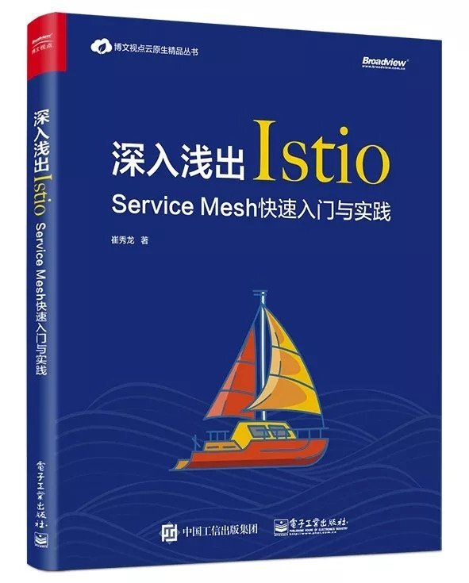

《深入浅出 Istio》这本书这两天开始卖了，我也第一时间入手了以后到现在已经基本上全部翻完了。在这里记录一下看完这本书的读后感。
总体来说，这本书是一本既适合 Istio 本身有一定了解程度的使用者，也适合对 ServiceMesh 初学者的去学习 Istio 的书籍。这本书比较全面的介绍并总结了 Istio 的各个组件及其使用方法，并给出了许多具体的场景。

作为一名接触 ServiceMesh 领域和 Istio 快小半年的我来说，对于书中一些比较基础的章节和内容快速翻了一翻，同时也对部分对我帮助非常大的章节做了一些总结和心得。在这里用一篇读后感记录我读完以后的感受。

## 关于书籍作者

作者在 ServiceMesher 社区里面是一个非常活跃的人，对 istio.io 的中文化工作做了非常大的贡献。作为一个大部分时间在社区内处于一个围观群众，在这里对作者对国内 ServiceMesh 领域做出的贡献表示由衷的感谢。

## 全书结构

整本书分为十章，整本书我重点看了第 1,2,3,5,8,10。第七章重点看了后半部分。

1. 服务网格历史
2. 服务网格的特性
3. 介绍 istio
4. 安装 istio
5. 详解 Helm 部署 istio
6. Istio 插件服务
7. Http 流量管理
8. Mixer 应用
9. Istio 安全
10. 生产环境使用 Istio 的建议

## 正文

作者从微服务的诞生和发展谈起，简略谈了一下在微服务架构为我们解决了许多老问题时，它所给我们带来的一些新的问题。为了解决这些问题，Kubernetes 为代表的容器云系统出现提供了部署、调度、伸缩等功能，,而 ServiceMesh 则应运而生去解决如何管理、控制、保障微服务之间的通信。随后，作者挑了几个重要的产品与事件来梳理了 ServiceMesh 的发展历史。从 SpringCloud 确定微服务治理的标准特性，到 Linkerd 发布后受人关注，再到 Istio 横空出世。ServiceMesh 领域中目前发展的最好的毫无疑问是 Istio。这不仅是因为 Istio 吸取了前面产品的经验，同样也背靠了 Google,IBM 和 Lyft 这三个公司共同组成的开发团队。由于我接触 ServiceMesh 领域时，Istio 都已经发布到 0.7 版本了，所以这块的内容让我了解了整个 ServiceMesh 领域的发展历史。

在第二章，作者着重聊了一下 Istio 官网首页所印着的四个特性：连接、安全、策略、观察，所分别代表的意义和场景。然后在第三章介绍了 Istio 整体架构和每个组件所承载的意义和功能以及一些 Istio 自定义的 CRD。关于 Istio 的架构设计和功能组件 Istio 官网本身就有非常详细的介绍了，直接看官网介绍就行，对于部分 CRD 的介绍挺好的，可以帮助理解每个 Istio 组件对应了哪些 Istio 配置文件。

第四章和第五章这块都是关于安装 Istio 的，这一块我比较熟悉就直接跳过了。同时对于个人开发者学习 Istio 而言，需要的是一个更快的本地搭建 Istio 环境的教程，这里推荐一个更简单的[快速本地搭建 istio 教程](https://github.com/AliyunContainerService/k8s-for-docker-desktop)。

第五章着重介绍了 Istio 安装文件种的 Helm 结构，以及每个参数所代表的意义。这一块我觉得对我的帮助非常大，由于之前我在生产环境安装 istio 都是通过我本地开发机 helm template 一个完整的安装文件，然后一并 apply 到生产环境上。
这给我至少带来了两个大问题：

1. 我的本地开发机拥有一个具有读写权限的生产环境 k8s 账号
2. 修改各个部件相关参数变得十分麻烦

目前在这上周我已经全部回收了我们开发组内所有人的生产环境权限，统一通过 K8S DashBoard 进行操作。当然，这也意味一旦需要更新 istio 就不能再走本地 apply 安装文件的方式。一个更加科学的方法则是通过 CICD 系统，用 helm install/upgrade来管理生产环境的istio配置。所以，掌握istio的helm文件结构就显得非常重要，这块第五章给我的帮助很大。

第六章作者介绍了 Istio 的一些官方推荐的插件服务如 Prometheus,Grafana,Jaeger 这些。我就直接跳了。

第七第八章作者介绍了通过 Istio 进行网格的 Http 管理和 Mixer 应用。这两张是本书的两个大头，当然同样也是 Istio 应用的两个大头。
对于第七章，作者介绍了 VirtualService,HttpRoute，Gateway 这些相关概念，以及通过这些组件进行负载，转发，灰度这些内容，基本上我就快速看了过去。我个人在 istio 的实践上，也已经在生产环境上通过 istio 进行灰度发布，所以对于这块内容我已经比较熟悉了。

> 相关资料：[coohom 在生产环境上使用 istio 的实践与经验](http://www.servicemesher.com/blog/practice-for-coohom-using-istio-in-production/)

第七章的后半段提到了通过 Istio 在生产环境进行故障演练的方案，这一块挺让我耳目一新的。一方面是没想到还能这么玩，一方面是在生产环境的故障演练同样也是我今年上半年将要去做的一个目标之一，这块对于故障注入与故障演练的场景方案对我帮助很大。

第八章作者着重介绍了通过 Mixer 来进行一些黑白名单、限流、自定义监控指标这些操作。在 Istio 官网上关于 Mixer 的大部分内容我也已经全部看完并实践过了，所以这块内容我看的比较快。一个比较遗憾的一点是没有看到关于如何自定义 Adapter 相关的介绍，这一块是 Mixer 有着非常大潜力与价值的一块内容，但同时也有着不小的门槛。这一块我前不久一直在花时间调研并通过自定义 Istio Mixer Adapter 完成了一个比较常见的需求，这次放假有空将会整理一下。

第九章讲了 Istio 安全认证这块，我暂时直接跳过了，在我目前的场景中，生产环境集群内所有服务都将长期处于互相信任的状态，所以我暂且并不关心这方面内容。

第十章作者给了一些在生产环境上使用 Istio 的建议，有大部分内容和我在生产环境上实践所的出来的结论相同，以及 Istio 目前的一些发展问题。

关于生产环境使用 Istio 的建议，这里我摘录几条我深表赞同的：

1. 永远准备一套不用 Istio 的备用环境，（目前我们服务的生产环境长期保留了主备服务，主服务使用 Istio，备用业务则不使用 Istio，每当进行 istio 升级或者是部分参数调整时都会提前进行主备切换，等升级调整验证完毕后才切换回来）
2. 确定使用 Istio 的功能范围（在我们的场景中，只有真正的业务服务才被服务网格管理，其余不需要网格管理的服务绝对不强上网格）
3. 时刻考虑 Istio 功能的性价比（不为了用功能而用功能，Istio Citadel 安全功能对于我们来说目前收益接近于零，但风险极大，所以就坚决不用）

同时对于 Istio 这个产品发展的现状，作者给出了一定的担心，即目前 Istio 团队，发布的产品 API 稳定性太不稳定，不向后兼容，很多 API 全部改写。另一方面在发布质量上也出现过比较大的问题，造成了版本回退，发布延期等问题。同时 Istio 组件目前本身也有着一些瓶颈与问题如 Mixer 的复杂性与高成本学习，Pilot 的性能瓶颈，SideCar 的性能消耗。以上这些都有待 Istio 团队去解决。

最后整体来看，对于 Istio，我个人认为 Istio 目前的发展状况在 ServiceMesh 领域中还并没有像 K8S 取得事实胜利，可能 Istio 也有可能步 Linkerd 的后路，为未来的产品开路和经验，但是 ServiceMesh 这条路无疑是正确的，我也会继续关注 ServiceMesh 和 istio 在 2019 年新的表现。
