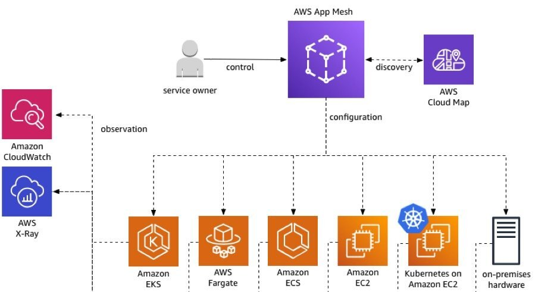

本文为翻译文章，[点击查看原文](https://www.allthingsdistributed.com/2019/03/redefining-application-communications-with-aws-app-mesh.html)。

原文发表于 2019 年 3 月 27 日。

在 re:Invent 2018，AWS 宣布了 AWS App Mesh 的公开预览版，App Mesh 是一个服务网格，可以轻松监视和控制跨应用的通信。今天，我很高兴地宣布 App Mesh 已经可以为用户提供使用了（GA）。

## 新的架构模式

许多客户正在对现有应用进行现代化改造，以求更快更灵活地进行创新。微服务等架构模式使团队能够独立测试服务并不断持续发布应用变更。这种方式可以让开发团队更快地进行实验和迭代，从而提高团队生产力。它还可以让团队快速扩展他们构建和运行应用的方式。

当构建所有需要以一个应用的形式一起工作的新服务时，他们需要一种方式来在整个应用间连接，监控，控制和调试通信。此类功能的示例包括服务发现，应用级度量和日志，帮助调试流量模式的跟踪，流量整形以及保护服务之间通信的能力。

通常需要在 SDK 中构建通信管理逻辑，并要求每个开发团队使用它。但是，随着应用的增长和团队数量的增加，跨服务一致地提供这些功能会变得复杂而耗时。

我们的目标是自动化和抽象通信基础设施，以支撑每个现代应用程序，使团队能够专注于构建业务逻辑并更快地进行创新。

## 重新定义网络

从历史上看，当您必须为应用搭建服务时，首先要做的就是搭建网络，即虚拟私有云（virtual private cloud/VPC）。一切都发生在 VPC 的环境下。我们的目标是，只要您在 AWS 上运行应用，就不必担心管理网络基础设施。它应该由我们的应用感知网络来处理。我们的网络可自动将您对服务需求的输入转换为基础设施所需的配置并管理其生命周期。今天的 App Mesh，是这个旅程的第一步。

## App Mesh 愿景

如果您正在运行由不同团队管理的多个服务，每个团队理想地仅根据其自身服务的特定需求提供输入。他们无需了解为其服务提供支持的基础设施的详细信息。

与我交谈的开发人员并不关心每个应用的连接。他们关心的问题包括，我的服务可以与谁通信？我可以访问哪些 AWS 资源？我如何处理错误和重试？在接受所有流量之前，如何连接和测试新的服务版本？我需要什么身份和授权才能建立连接或接受连接？这是 App Mesh 尝试做的事情。

App Mesh 提供简单的声明式方式来建模服务通信。可以定义服务到服务通信的规则，而其他所有内容将会自动处理。将其用作应用中所有服务间通信的控制单点。

它提供一致的指标，日志和跟踪，并提供跨应用的端到端可见性，以帮助快速识别和调试问题。App Mesh 提供流量路由控制，以支持测试和部署服务的新版本。

我们对 App Mesh 的愿景是一个 AWS 原生服务网格，与 AWS 原语和高级服务完全集成。包括网络原语和高级服务（类似 AWS Cloud Map 的），计算原语（类似 Amazon EC2 和 AWS Fargate），以及编排工具（包括 AWS EKS，Amazon ECS 和 EC2 上的客户管理的 Kubernetes）。通过 App Mesh 本地集成到 AWS Cloud Map，服务网格中的任何服务都会获得到帐户中每个其他 AWS 资源的映射。

## App Mesh 如何运作？

App Mesh 并行运行并管理部署的每一个微服务的通信，为整个应用形成服务网格。App Mesh 提供 AWS 托管的控制平面，您可以使用该平面为服务建模，并提供识别服务实例的声明式配置和每个服务所需的策略。

App Mesh 与一个名为 Envoy 的开源高性能网络代理一起工作，该代理作为应用的 Sidecar 运行。它被认为是管理分布式应用网络流量的标准。最重要的是，我们使用 Envoy 是因为我们的许多客户已经在使用它，这使得 App Mesh 的采用变得非常简单。如果您已经在运行基于 Envoy 的服务网格，那么采用 App Mesh 只需要几个基本步骤。

要开始使用，请使用 App Mesh 控制台，API 或 AWS SDK 来配置服务网格并控制服务之间的流量。接下来，将 Envoy 添加到 EC2 实例，ECS 或 Fargate 任务，或者为部署的每个服务添加 Amazon EKS 或 Kubernetes pod 定义。

App Mesh 根据提供者服务中设置的策略，计算和分发所需的配置到和每个服务一起部署的代理。App Mesh 数据平面是 App Mesh 控制平面配置的代理集合，用于处理服务的所有传入和传出流量。

使用 App Mesh，可以轻松导出服务指标，如延迟，错误率，错误代码，服务通信跟踪和服务级别日志。可以将指标发送到多个 AWS 和第三方工具，包括 Amazon CloudWatch，AWS X-Ray 或与 Envoy 集成的任何第三方监控和跟踪工具。

现在，通过 App Mesh，您可以用加权方式在服务之间路由流量，这样可以轻松实现安全而一致地部署服务。将来，您将能够以一致的方式配置新的流量路由功能，如重试，超时，断电和服务器端限速。

## App Mesh 是如何构建的？

App Mesh 致力于提供高度可扩展而灵活的服务网络，支持任何客户工作负载，这些工作负载可以有数十个到数百个不同服务。我们以同样的高标准来构建 App Mesh 的运维可用性，可扩展性和安全性，我们认为这是所有 AWS 服务的关键原则。

我们的目标是消除运维复杂应用的无差别繁重工作。我们提供工具，服务和可观测性，以确保您可以为自己的架构维护高标准。

App Mesh 支持服务运行于 EKS，ECS，Fargate，EC2 和 EC2 上的 Kubernetes。一些客户已经在 AWS 内的托管平台上运行他们的应用。但是，我们了解许多客户需要能够将跨 AWS 部署的服务连接到单个网格中。他们可能还需要灵活地在异构的计算资源集合中运行服务。

App Mesh 允许跨不同计算环境中的服务运行网格，并提供迁移路径以允许根据需要使用计算资源。它在不同的计算环境中提供一致的可观测性和路由控制。我们希望简化，使连接到网络的任何应用成为网格数据平面中的参与者。

在您的应用通过服务网络进行通信之后，下一个目标是提供明确的所有权和受控的服务资源变更。App Mesh API 旨在为服务提供所有权边界，以及实现它们的网络组件。从拥有整个服务网格的小型团队到拥有许多不同团队的大型公司，App Mesh 可以对服务网格数据平面上的组件进行安全的事务性更改。

例如，服务所有者可以为应用定义流量策略，App Mesh 会自动将这些策略分发给适当的消费者。通过与其他 AWS 产品（如 Amazon CloudWatch Logs，Amazon CloudWatch metrics 和 AWS X-Ray）的集成，我们提供了实现网格应用安全部署和运维所需的可观测性工具。

## 采用 App Mesh 的合作伙伴

我们的合作伙伴生态系统一直与 AWS 密切合作，将产品与 App Mesh 集成，并为您提供可观测性，服务发现和安全性的工具。这些伙伴包括：

Alcide、Aqua、Datadog、Hashicorp、Neuvector、SignalFx、Solarwinds、SpotInst、Sysdig、Tetrate、Twistlock、VMWare、Wavefront 和 Weaveworks。

## 开始使用 App Mesh

从今天开始，您可以将 App Mesh 与管理的服务一起使用，这些服务由 ECS，EKS，Fargate 以及在 EC2 上运行的 AWS 上的任何 Kubernetes 部署管理。您甚至可以将它与直接在 EC2 上运行的应用程序一起使用。

我们将 GA 视为起点，而不是终点。我们希望为您提供与我们一起构建的机会，很快我们将启动 AWS App Mesh Beta Channel。它是一个新的公共服务端点，允许您在新服务功能 GA 之前试用新的服务功能并提供反馈。此新服务端点将与标准生产端点分开。它将与 AWS CLI for App Mesh 的预览版本相结合，允许您在不影响其当前生产基础设施的情况下测试新功能。

要了解更多信息，请参阅 [AWS App Mesh](https://www.allthingsdistributed.com/2019/03/redefining-application-communications-with-aws-app-mesh.html) 详情页面。
