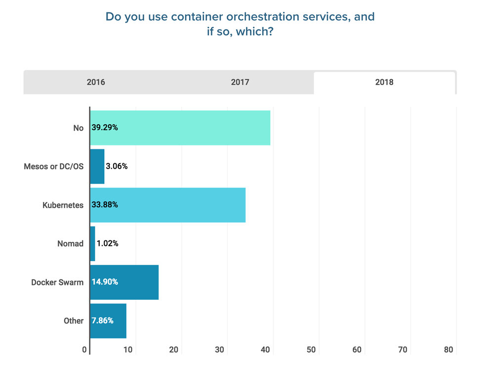
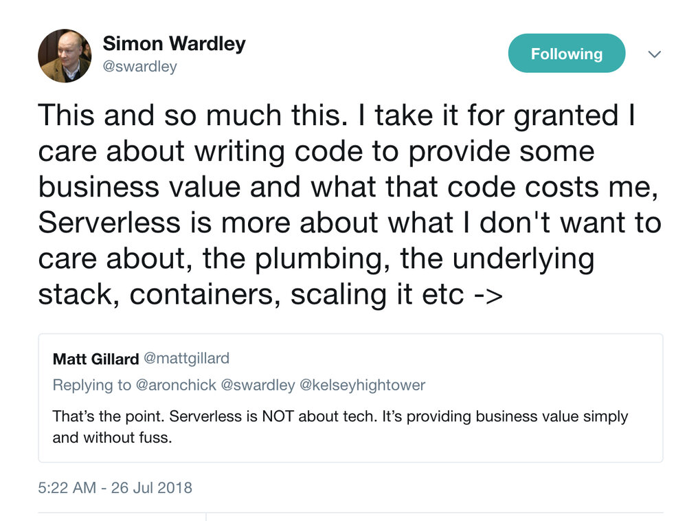
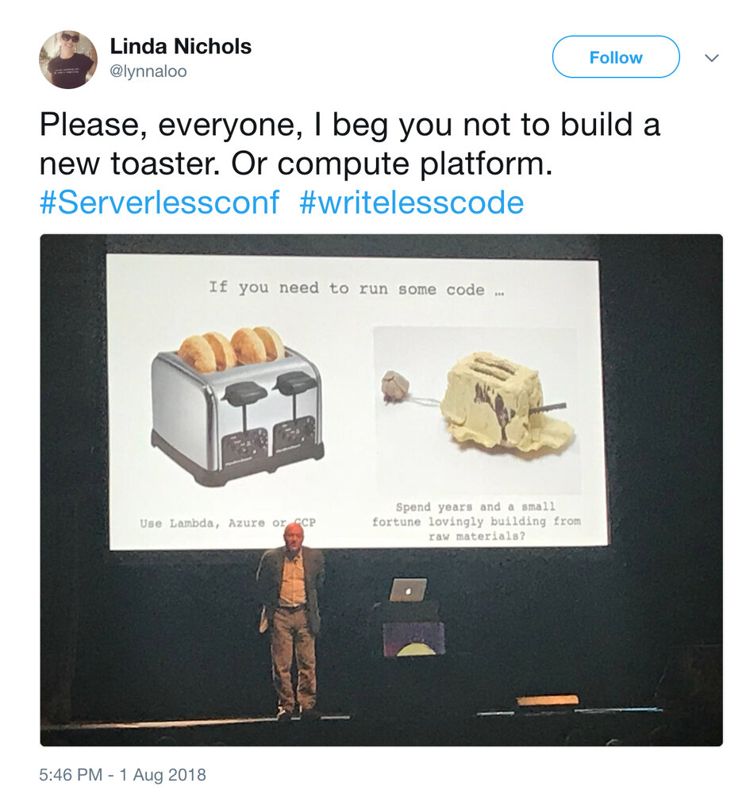
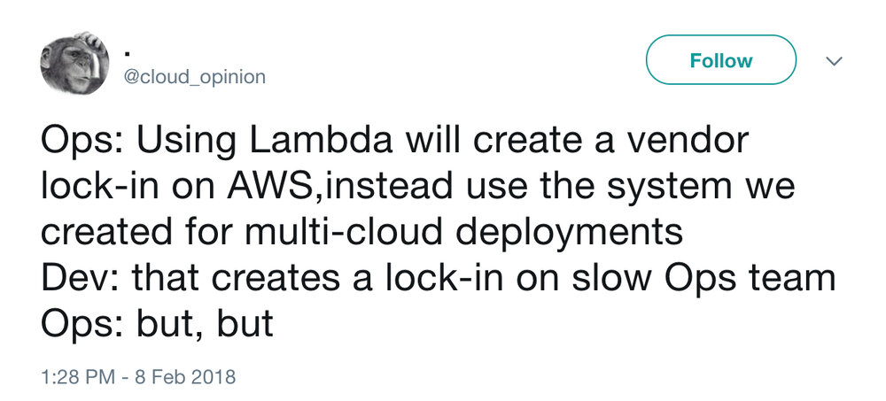

本文为翻译文章，[点击查看原文](https://dzone.com/articles/serverless-vs-containers)。

让我们来看看Serverless与容器的采用率、工具支持以及围绕Serverless和容器化的其他争论。

在Serverless和容器中，我们有两种令人惊叹的技术，可以为工程师提供高效的，与机器无关的抽象。然而，两个阵营之间似乎存在着不可逾越的鸿沟。

如果你读过我在过去两年写的任何内容，你就会知道我坚定地站在Serverless阵营。但我也是容器的早期采用者。在Docker达到1.0里程碑后不久，2015年初我的第一个容器化项目问世。

这篇文章不是为了再次引发阵营战争或宣布某个阵营的胜利。相反，我将尝试客观地看待Serverless和容器的状态，根据它们提供的利弊权衡，并对未来的情况给出诚实的看法。

鉴于Serverless和FaaS函数即服务（FAAS）通常已经可以互换使用，为了本文的目的，我将限制Serverless的定义为FAAS产品，例如AWS Lambda。

## 容器状态

自从Docker早期可用以来已经走过了漫长的道路。随着我们在容器上运行的系统越来越复杂，我们的需求已经催生了丰富的工具生态系统。

AWS还拥有自己的托管容器服务ECS。这提供了与AWS生态系统其他部分更紧密的集成。

如服务网格也正在获得可见性和被采用。它们将常见的交叉问题（例如跟踪和断路器）移出应用层。通过解决基础架构层中的这些问题，它们为这些挑战提供了语言和运行时无关的解决方案。这使它们非常适合现代IT组织，即使用各种不同语言的构建微服务。

## Serverless现状

虽然围绕Serverless的炒作并没有和容器一样长。值得记住的是，在Lamber达到1.0之后仅一个月，AWS Lambda就在 2014年发布了。它随附了CloudWatch的基本日志记录和监视支持，即使我们现在依赖的许多事件源（例如API Gateway）都是在之后引入的。

除了这些托管服务之外，还有一些解决方案可以让您在自己的Kubernetes集群上运行Serverless。其中包括谷歌和合作公司最近宣布的Knative。虽然这些解决方案试图满足许多开发人员的需求，但我感到他们放弃了Serverless的最佳功能——不必担心服务器！

## 采用趋势

根据一些调查和研究，Serverless和容器的采用正在快速增长。以下是我认为的一些亮点。

- A Cloudability发现，2017年第四季度AWS用户的容器采用量增长了246％，高于第三季度的206％。同时，同一项研究发现，2017年第四季度AWS用户Serverless采用量增长了667％，高于第三季度的321％。
- Serverless公司最近发现，2018年有82％的接受调查的人员使用Serverless，高于2017年的45％。超过53.2％的人表示他们使用Serverless技术对他们的工作至关重要。
- Serverless公司的调查还报告说，在采用Serverless之前，24％的接受调查的人员对公共云的使用经验有限或为零。20.2％的为拥有1000多名员工的大型企业工作。
- Logz.io的 [DevOps Pulse](https://logz.io/devops-pulse-insights-2018/#pulse_section_ten) 调查发现，在2018年，60.71％的接受调查的人员采用了容器编排，高于2017年的42.11％。

有趣的是，DevOps Pulse调查显示，Serverless采用率比其他报告小得多。从2018年的30.55％（2017年）上升到42.58％。这可能与其接受调查的人员的分布有关。其中28.54％认为自己是开发者，而44.26％认定为DevOps、DevSecOps、SysAdmin或SRE。

这与我在容器和Serverless阵营之间的上述鸿沟的经验一致。那些认为自己是开发人员的人更倾向于Serverless，而那些被认为是DevOps的人更有可能选择容器。

## 控制与责任

关于Serverless与容器的争论通常始于控制，或者在Serverless的情况下缺乏控制。这不是新的。事实上，我清楚地记得当AWS在2009年开始获得牵引力时围绕控制的相同辩论。现在10年后，尘埃落定于原始辩论，但我们未能吸取教训。

想要控制是人的本性，但你愿意为此付出多少钱？ 您知道您将承担的总体拥有成本（TCO）吗？

控制自己的基础设施的能力带来了很多责任。要承担这些责任，您需要拥有组织中的相关技能。这意味着工资（很容易成为大多数组织的最大开支），代理费以及从工程师和经理那里抽出时间进行招聘和入职。

考虑到所涉及的TCO，具有该控制的目标必须是针对某些事物进行优化（例如，为业务关键工作流程实现可预测的性能），并且不为其自身控制。

构建基于容器的通用计算平台需要大量的工程专业知识和投资，该平台与AWS Lambda等Serverless产品一样高效，可扩展且具有弹性。大多数组织根本没有能力解决这个问题。尽管有大量的时间和金钱投入，但我知道一些大企业在他们的尝试中惨遭失败。

## 工具支持

使用Serverless，您可以从box-logging，指标和跟踪中获得基本的可观察性工具。尽管有这些警告，但一开始它们通常就足够了。

传统上迎合IAAS或容器市场的供应商也开始为Serverless应用程序提供支持。但是，他们需要调整自己的方法，因为Serverless无法再使用基于代理的方法。

还有越来越多的供应商专注于解决Serverless应用程序的可观察性和安全性问题。但是，大多数仍处于开发的早期阶段，尚未准备好进行严肃的生产使用。

与Serverless相比，容器空间具有更成熟和多样化的工具生态系统。事实上，我发现使用容器的挑战之一是处理绝大多数的选择！

有充足的修补机会，我也发现团队可能会忽略奖品（即为我们的客户建立更好的产品），并陷入过度工程的陷阱。

Serverless的工具支持将会越来越好，但至少目前，仍然远远落后于容器。在容器领域工作的人面临的挑战是抵制修补和追求简单的冲动。

## 供应商锁定：风险与奖励

Serverless的批评者通常使用供应商锁定作为他们的论据。与此同时，大多数AWS客户实际上都在要求更紧密的集成，以便他们可以从平台中获取更多价值。

可以肯定的是，供应商锁定是一种风险。但正如任何投资者都会告诉你的那样，如果你不承担风险，你就永远不会赚钱。诀窍是采取能够带来最佳回报的计算风险。

对于它所获得的所有关注，供应商锁定对于少数人来说是一种危险。相反，您更有可能找到过度设计的解决方案来阻止供应商锁定，而不是创建其他形式的锁定，无论是内部团队还是其他私有云供应商。

同样，这不是新的。几年前我们与ORM进行了同样的辩论。我们创建了所有这些抽象来防止供应商锁定，除了风险从未实现为我们大多数人的问题。所发生的一切都是我们花费了大量精力和时间，并推迟了我们的产品上市时间，因为这些产品从未成为问题。

更糟糕的是，ORM引入了他们自己的问题和复杂性，并持续阻碍了发展。它成为开发团队的一项税收，并在可预见的未来减缓了功能交付。

对于那些必须进行数据库迁移的人来说，ORM并没有让事情变得更好。除了其他一切之外，这只是你必须处理的另一个问题。

看到历史重演，这次，甚至更高的层次可能会影响整个组织，这是痛苦的！

公司发现Serverless团队的工作量越来越多，工程师也越来越多。所以，就像一个明智的投资者一样，我们应该问的问题是：“重要的生产力回报是否值得锁定风险，实现问题的可能性很小？”

## 未来是Serverless还是容器？

Serverless为您提供了大量的生产力提升，但却以控制基础架构为代价。

对于我们的许多工作流程 \- 网络API，流处理，cron作业等 \- 实际上我们不需要这些所有的控制，我们应该祝福为我们处理管道的人。

但总会出现这样的情况：我们需要保持对基础架构的控制，以便优化性能，成本或更高的可用性。或者，我们的工作量可能不利于Serverless的当前限制，例如最长执行时间。

我认为Serverless和容器应该混合使用，而不是选择其中一个。实际上，许多公司都成功的采用了混合方法。

- 对Serverless满足其需求的工作负载使用Serverless
- 例如，对于以下工作负载，请使用容器;
  - 长期运行
  - 需要可预测的性能
  - 需要比Serverless更容易实现的弹性
  - 不断地以大规模运行，并且按次付费定价模型变得过于昂贵

这也是Netflix前云架构师兼现任AWS云计算副总裁Adrian Cockcroft的建议。

我相信我们最终会看到这两种范式的趋同。容器技术最终将成为Serverless \- 想想Fargate，加上每次调用定价模型和毫秒计费。同时，Serverless平台将开放并允许您携带自己的容器。高级用户可以通过提供符合API的子组件进行日志记录等来保留对其基础架构的一些控制。

随着容器和Serverless之间的界限被打破，我们终于可以废除派系并停止谈论底层技术。我想谈的是如何构建客户想要使用的产品，以及如何更快地构建它们。
