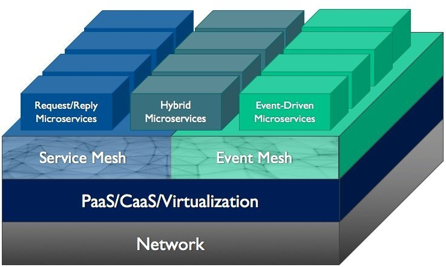

[Service Mesh](https://www.nginx.com/blog/what-is-a-service-mesh/)被用作微服务的基础设施层，使通信变得更加灵活，可靠和快速。它得到了谷歌、微软、IBM、红帽和 Pivotal 等行业巨头的推动，并且正在推出 Kubernetes、OpenShift 和 Pivotal Container Service（PKS）等平台和服务。

虽然 Service Mesh（服务网格）可以很好地支持同步 RESTful 和一般的<请求 - 回复>交互，但它不支持异步、事件驱动的交互，不适合将云原生微服务与遗留应用程序连接，也不适用于 IoT。

现代企业正在将事件驱动架构作为其数字化转型的一部分，每个事件驱动型的企业都需要一个中枢神经系统来快速、可靠和安全地将事件从它们发生的地方发送到它们需要去的地方。

这个中枢神经系统可以被视为 Event Mesh（事件网格） - 您架构中的一个新层。

事件网格作为服务网格的补充，可以做为应用程序的连接层，以提供企业实现其数字化转型目标所需的全套应用程序间通信模式。

## 什么是 Event Mesh？

事件网格对于事件驱动的应用程序，就好比是服务网格对于 RESTful 应用程序：一个架构层，无论在哪里部署这些应用程序（非云、公有云或者私有云），都可以动态路由某个应用程序的事件并使其被其他应用程序所接收。事件网格由内部连通的 Event broker(事件代理) 网络来创建和启用。

## Event Mesh vs. Service Mesh

事件网格可以做为服务网格的补充。事件网格和服务网格类似，它们可以在应用程序之间实现更好的通信，并允许应用程序通过将某些功能放在网络层和应用程序层之间，这样我们可以更多地关注业务逻辑。但是，相比之下，也有一些重要的区别：

- 服务网格连接云环境中的微服务，例如 Kubernetes，Amazon ECS、Google Kubernetes Engine、IBM Cloud 和 Alibaba；
- 事件网格不仅连接微服务（容器化或其他），还连接遗留的应用程序、云原生服务以及可在云和非云环境中运行的各种设备和数据源/接收端。事件网格可以将任何事件源连接到任何事件处理程序，无论它们在何处部署。

## Event Mesh 的特点

事件网格的定义有三个显著特征。事件网格是：

1. 由内部连通的 Event Broker 形成的组合
2. 与环境无关
3. 动态的

事件网格由 Event Broker（1）网络创建和启用的事实意味着其本质上是事件驱动的。

> “我相信事件将成为现代企业的生命线。”

与环境无关（2），我的意思是事件网格可以部署在任何公共云、私有云、PaaS 或非云环境中，并且它将在所有环境中以统一的方式运行。

事件网格的动态特性（3）可能是其最重要的属性。所谓动态，我指的是它能够动态地了解哪些事件将被路由到哪些消费者应用程序，然后在事件发生时实时路由这些事件，无论生产者和消费者在哪里被附加到网格，而且无需配置事件路由。我们应该让事件网格负责这些，而不是开发人员。

## 为什么企业需要 Event Mesh?

简而言之，事件网格支持以下使用场景：

- 连接和编排微服务
- 将事件从内部部署推送到云应用程序或服务（混合云）
- 跨 LOB(line-of-business) 启用“数据即服务”
- 实现与后端系统的物联网连接

这是更长的答案：

事件网格使企业能够支持事件驱动的体系结构，从最小的微服务部署，到以易管理、健壮、安全和架构良好的方式将应用程序扩展到混合云。它提供了动态和全部实时地集成遗留应用程序、数据存储、现代微服务、SaaS、物联网和移动设备的能力。事件网格为应用程序开发人员和架构师提供了构建和部署分布式事件驱动应用程序的基础，无论他们需要在何处构建和部署。

## 结论

事件网格概念旨在实现和支持企业数字化转型。在 2018 年，那些不完全采用事件驱动架构的企业正在向全面拥抱事件驱动架构转型。但根据我的经验，许多人正在针对特定用例进行此操作，并且通常采用零碎的方法，而不是采用企业范围内事件分发的明确愿景。

我相信事件将成为现代企业的生命线。为此，他们需要让事件在数字企业越来越分散的环境和组件中自由轻松地流动。

事件网格就是实现此功能的架构层。
