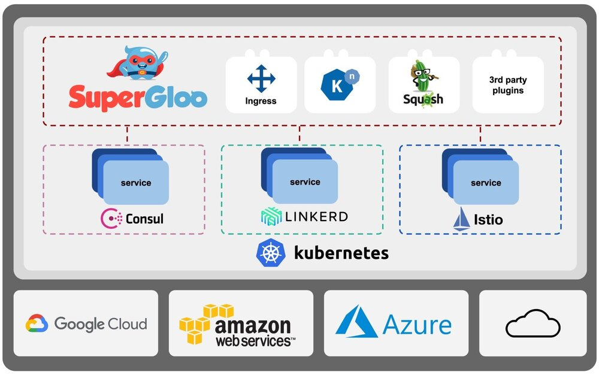

笔者 2017 年就曾注意到 [solo.io](https://solo.io) 这家公司，它的创始人 Idit 曾在 KubeCon 上分享过 Squash，去年 11 月推出了 SuperGloo 服务网格编排器再起吸引了我的注意，但最重要的一件事是，Christian Posta 于 2018 年 1 月 3 号宣布加盟 solo.io，这让我很惊讶，我原以为他会加入 T 公司。

[Idit Levine](https://twitter.com/Idit_Levine) 现为 [solo.io](https://solo.io) 的创始人，这是一个很小的 base 在马塞诸塞州剑桥市的创业公司，这家公司致力于云原生的混合云解决方案。曾是 EMC 云管理部门的 CTO，也是其全球 CTO 办公室的成员，她专注于整个堆栈，微服务，云原生应用和 PaaS 的管理和协调（M＆O）。当她加入 DynamicOps（vCAC，现在是 VMware 的一部分）作为其首批员工之一时，Idit 对云产生了浓厚的兴趣。随后，她参与了 Verizon Terremark 的下一代公有云的开发，并担任 Intigua 的代理 CTO，Intigua 是一家专注于容器和管理技术的创业公司。

[Christian Posta](https://twitter.com/christianposta)，前 Red Hat 架构师今年年初刚刚加入 [solo.io](https://solo.io)，成为 solo.io 的 Filed CTO（负责售前、售后与布道的首席架构师），详见 [New Adventure Starts at solo.io](http://blog.christianposta.com/career/new-adventure-starts-at-solo-io/)。

2018 年 11 月 22 日，Idit Levine 宣布可用于管理和编排大规模服务网格的 SuperGloo 开源。无论是在本地、云上还是在任何拓扑上使用（或计划使用）单个网格或多个网格技术，SuperGloo 都是一个良好的抽象层，它可以简化服务网格的安装、管理和操作。

Solo.io 这家公司有一系列项目，其中有三个都以 Gloo 命名，这些都是与 Service Mesh 相关的。

- [Gloo](https://github.com/solo-io/gloo)：混合云上的 API Gateway，可作为 Kubernetes Ingress controller
- GlooE：Gloo 的商业化版本
- [SuperGloo](https://github.com/solo-io/supergloo)：服务网格编排器

还有一些列开发者工具。

- [Sqoop](https://github.com/solo-io/sqoop)：Gloo 支持的 GraphQL 引擎
- [unik](https://github.com/solo-io/unik)：Unikernel 和 microVM 编译和管理
- [Squash](https://github.com/solo-io/squash)：微服务和 Kubernetes 调试器

关于 Solo 的开源项目请查看 <https://github.com/solo-io>。

## 服务网格是云原生应用的未来

服务网格是处理服务间通信的基础设施层，使应用程序无需了解复杂的通信网络。服务网格提供的高级功能有加密、身份验证和授权、路由、监控和跟踪等。

云原生态系统中服务网格的采用正在迅速增长，有几个令人兴奋的产品。领先的服务网络包括 [Istio](https://istio.io/zh)，由 Google、IBM 和 Lyft 支持；Linkerd 和 Linkerd2（前身为 Conduit），CNCF 项目；以 及 Hashicorp Consul 新的 Connect 功能。每种服务网格技术都有自己的特点和优势。

## SuperGloo 的特点

*图片来自 [medium](https://medium.com/solo-io/https-medium-com-solo-io-supergloo-ff2aae1fb96f)*

根据 Idit 的描述，SuperGloo 可以让你最大化服务网格的优势同时还可以减少其复杂性。

SuperGloo 有以下特点：

- 帮助用户快速获得服务网格的经验
- 接管服务网格中的一些关键功能
- 统一了 Ingress 流量（南北向）和网格流量（东西向）的管理
- 为自由组合任何服务网格和 Ingress 打开了大门

## SuperGloo 的愿景

作为服务网格的编排器，它为用户自由组合任何服务网格开启了方便之门，SuperGloo 也承载着 Solo 这家公司的愿景：

- 使用户可以在不同的服务网格间迁移
- 统一的用户体验，是用户可以使用同样的工具管理不同的网格
- 不同服务网格之间的粘结剂，让它们可以自由与其他网格连接在一起

以上内容部分引用自 Idit Lavine 的博客 [Introducing SuperGloo: The Service Mesh Orchestration Platform](https://medium.com/solo-io/https-medium-com-solo-io-supergloo-ff2aae1fb96f)，关于 SuperGloo 的更多信息请访问 <https://github.com/solo-io/supergloo>。
