本文为翻译文章，[点击查看原文](https://www.knowledgehut.com/blog/cloud-computing/test-drive-your-first-istio-deployment-using-play-with-kubernetes-platform-cloud-computing)。

作为一名全栈开发，假如最近花了不少时间开发应用，肯定已经理解了微服务架构下要面临的一系列全新挑战。尽管应用已经从庞大的单体应用转变成了开发更快、弹性更好、更小也更聚焦的微服务，但现实是，开发者需要开始操心将这些服务集成到分布式系统中的问题了，包括服务发现、负载均衡、注册、容错、监控、路由、兼容和安全等。

让我们更详细的拆解微服务架构下开发和运维面临的挑战吧。先来看看第一代简单的 Service Mesh 场景，如下图所示，服务 A 要和 服务 B 通信，没有采用直接通信的方式，请求是通过 NGINX 路由的。NGINX 从 Consul（服务发现工具）查找路由，并在收到 HTTP 502 响应时，自动重试。

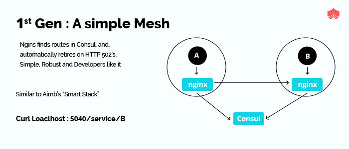

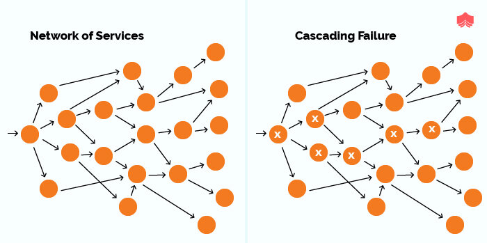

但随着微服务架构的到来，服务数量的增长一发不可收拾，下面列出的是开发和运维团队遇到的问题：

- 如何让日益增长的微服务们互联？
- 如何为微服务提供负载均衡？
- 为微服务提供基于角色的路由；
- 如何控制微服务的出口流量，如何实现灰度发布？
- 如何控制不断增长的微服务的复杂度？
- 如何用富路由规则实现细粒度的流量控制？
- 实现流量加密、服务到服务的鉴权和强身份声明的挑战

简而言之，虽然你可以在应用和网络中间件中开启服务发现和重试机制，但实际上，想让服务发现正常工作是非常困难的。

**初试 Istio Service Mesh**

Service Mesh 是 2018 年度最火热的流行词之一，它是微服务的可配置基础架构层，负责微服务应用间的交互，service mesh 让微服务实例间的交互更灵活、可靠和快速。Mesh 层提供了服务发现、负载均衡、加密、鉴权和验证，支持熔断机制等其他能力。

Istio 是完全开源的，可透明的部署在已有的分布式应用上。Istio 1.0 版本在上个月发布，已经生产环境可用。Istio 完全由 Go 语言编写，提供成熟的 API 接口可以接入到任何日志平台、遥测和策略系统中。Istio 在 GitHub 上发布，对系统的性能影响很小，丰富的特性让你可以顺利、高效的运行分布式微服务架构，并提供统一的保护、连接和监控方法。

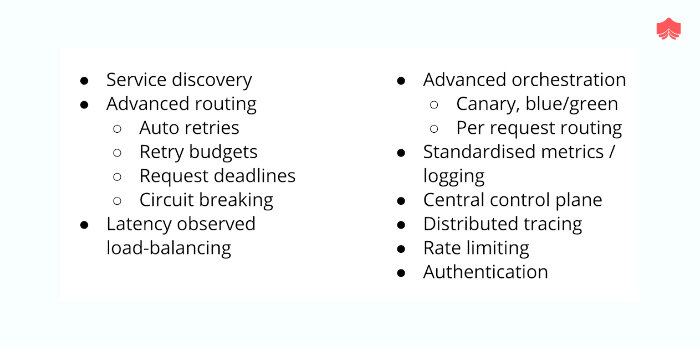

Istio 对系统的影响很小，它在 GitHub 上发布，上个月，Istio 1.0 版本已经发布，并且生产环境可用。

Istio 能带来什么好处呢？

- Istio 提供服务的连接、保护、控制和观测能力。
- 减少服务部署的复杂度，减轻部署团队的压力。
- 在无需修改应用代码的前提下，为开发和开发运维提供了细粒度的流量可视化和控制。
- 为 CIO 提供了帮助全企业安全实施和合规型需求的必要工具。
- 在 service mesh 层提供了统一的行为监测和运营控制。
- Istio 让为服务网络提供 HTTP、gRPC、Web Socket 和 TCP 流量的自动负载均衡变的轻松。
- 提供了细粒度的流量行为控制，包括：富路由规则、重试、故障转移和失败注入。
- 支持插件化的策略控制层和配置 API，支持访问控制、流量限制和配额。
- Istio 为集群内的全部流量提供自动的度量、日志、追踪，包括进群的入口和出口。
- 以强身份验证和鉴权的方式，提供了集群内安全的服务间通信。
- 如何想深入 Istio 架构，我强烈推荐 Istio 官方网站（https://istio.io/zh）。

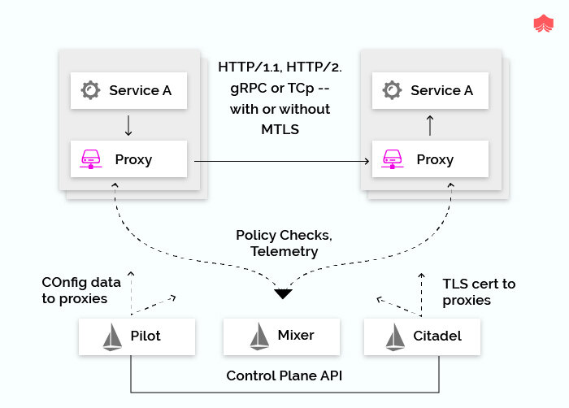

**开始演示！！！**

在这篇文章中，我将展示如何在 Play with Kubernetes（PWK）中免费部署 Istio，这是个由 Docker 提供的实验网站，是让用户在几秒钟内跑起来 Kubernetes 集群的试验环境。PWK 提供了在浏览器中使用免费 CentOS Linux 虚拟机的体验，实际上是 Docker-in-Docker（DinD）技术模拟了多虚拟机/PC 的效果。

打开 https://labs.play-with-k8s.com/，访问 Kubernetes Playground。

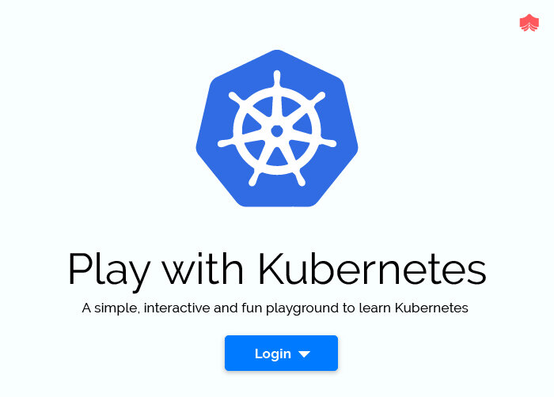

点击 "Login" 按钮，以 Docker Hub 或 GitHub ID 登陆。


完成本教程，你将获得自己的实验环境。

**添加第一个 Kubernetes 节点**

点击左侧的 "Add New Instance" 来构建你的第一个 Kubernetes 集群节点，自动命名为 "node1"，每个节点都预装来 Docker 社区版（CE）和 Kubeadm。这个节点将成为集群的主节点。

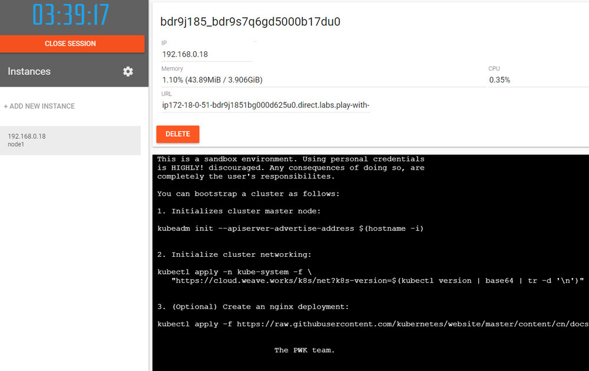

**启动主节点**

用如下脚本初始化主节点（node1）来启动 Kubernetes 集群，复制该脚本内容到文件 bootstrap.sh，并执行命令添加可执行权限：```chmod +x bootstrap.sh```


执行脚本时，作为初始化的一部分，kubeadm 会写入几个必要的配置文件、设置 RBAC 并部署 Kubernetes 控制平面组件（例如 kube-apiserver、kube-dns、kube-proxy、etcd 等）。控制平面组件以 docker 容器形式部署。


复制上面的 kubeadm join token 命令，留作下步使用，此命令用来在集群中加入其他节点。

**添加从节点**

点击 "Add New Node" 添加新的从节点


**验证集群状态**


**验证运行的 Pods**


**安装 Istio 1.0.0**

Istio 部署在单独的 Kubernetes 命名空间里：istio-system，我们过后再来验证。现在，复制如下内容到文件，命名为 install_istio.sh，并保存。添加可执行权限，运行以安装 Istio 和相关工具。


屏幕上应显示如下内容：


如上所示，默认会安装 Prometheus、ServiceGraph、Jaeger、Grafana 和 Zipkin。

请注意：运行该脚本时，可能会报如下错误：

```bash
unable to recognize "install/kubernetes/istio-demo.yaml": no matches for admissionregistration.k8s.io/, Kind=MutatingWebhookConfiguration
```

这是正常的，命令一执行完，可在页面的中央看到一长串展示的端口。

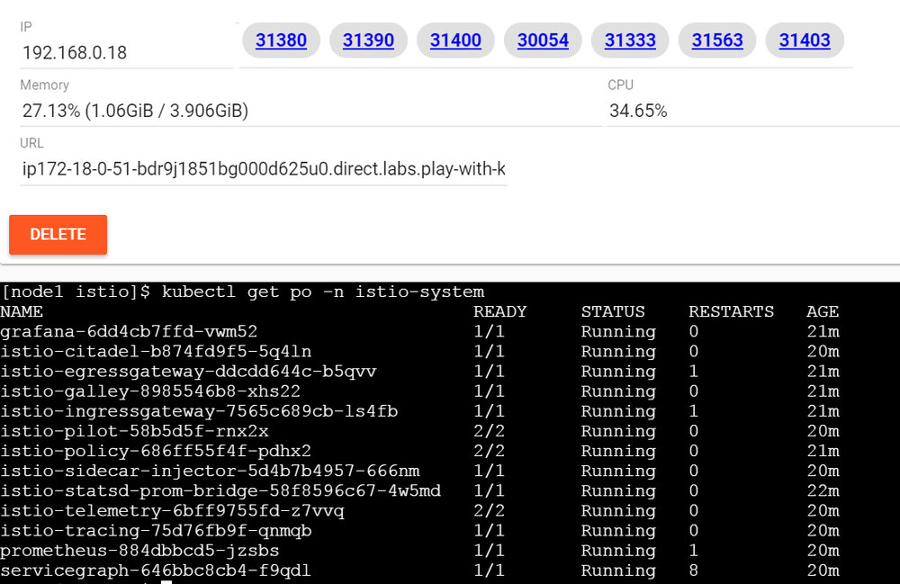


**验证服务**


**暴露服务**

要暴露 Prometheus、Grafana 和 服务图标服务，需要先删除已有的服务，用 NodePort 替换 ClusterIP，用实例页顶端展示的端口访问服务（如下所示）。


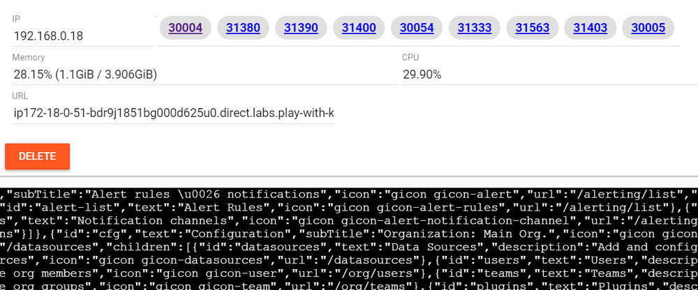

点击 "30004" 访问 Grafana 页，点击 "30003" 访问 Prometheus 页。

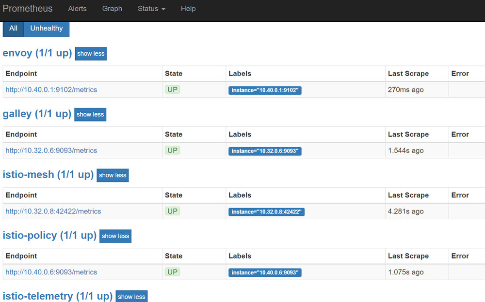

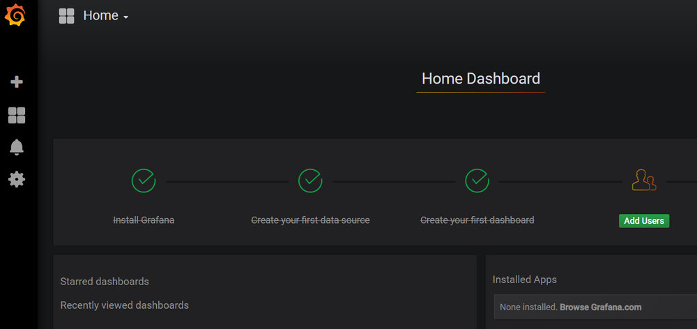

可以如下图所示，选择必要配置查看 Prometheus 度量：

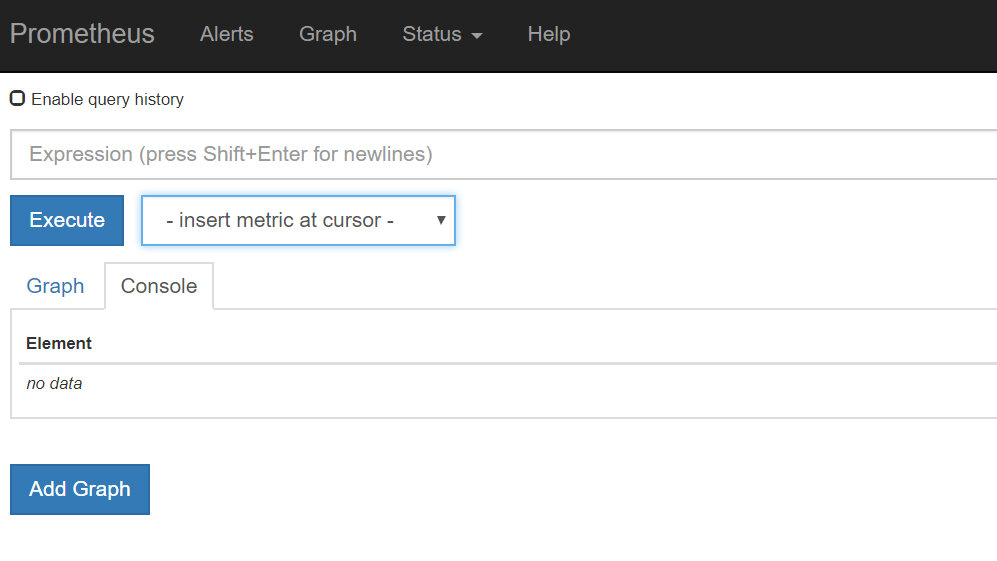

在 Grafana 页，添加 Prometheus 数据源，并确认 Dashboard 已经运行。

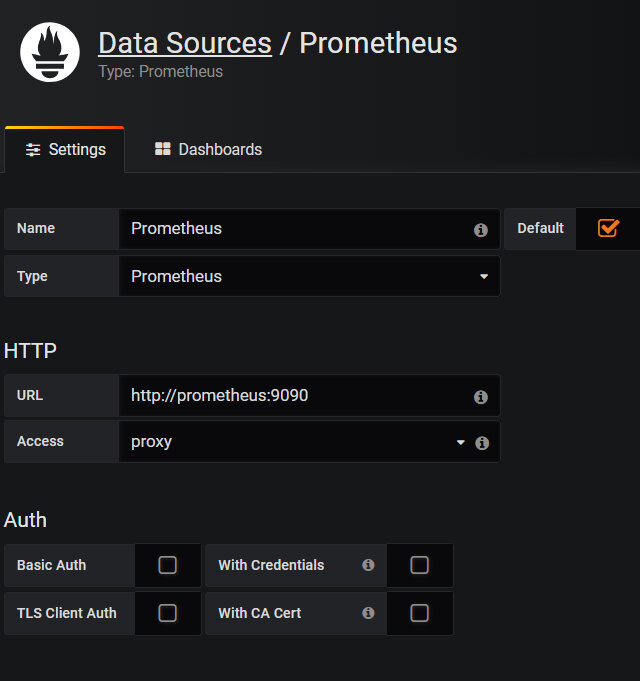

恭喜！你已经将 Istio 部署在 Kubernetes 集群上了，K8S playgroud 上已经安装的服务包括：

- Istio Controllers，以及相关 RBAC 规则
- Istio 定制资源定义
- Prometheus 和 Grafana 监控系统
- Jeager 分布式追踪系统
- Istio Sidecar 注入程序（下一节我们再来仔细看看）

**安装 Istioctl**

Istioctl 是 Istio 的命令行配置工具，可以用来创建、查询、修改和删除 Istio 系统的配置资源。


**部署 BookInfo 应用示例**

Istio 已经安装并验证过了，可以在上面部署示例应用 BookInfo 了，这是一个简单的书店模拟应用，由四个服务组成：网站首页、书籍信息、评论（几个特定的版本有评论服务）和评分，全部由 Istio 管理。

**部署 BookInfo 服务**


**定义入口网关**


**验证 BookInfo 应用**


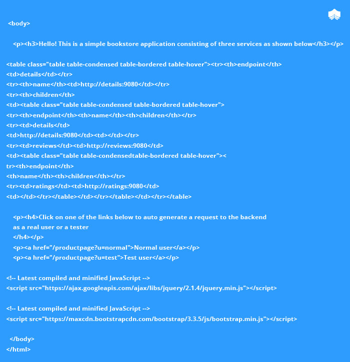

**通过 URL 访问**

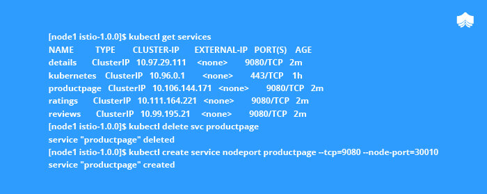

现在应该可以看到 BookInfo 示例了：


希望本部程能帮你顺利的在 Kubernetes 上部署 Istio。下一篇博客，我将深入 Istio 的内部架构、流量控制、权限和遥测等细节。
