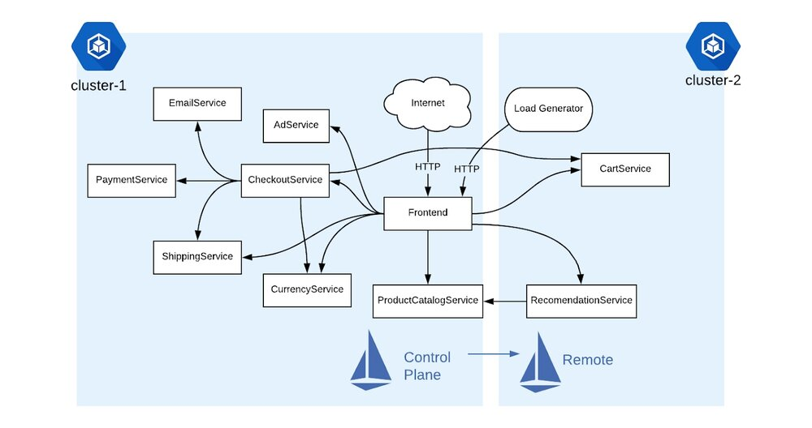
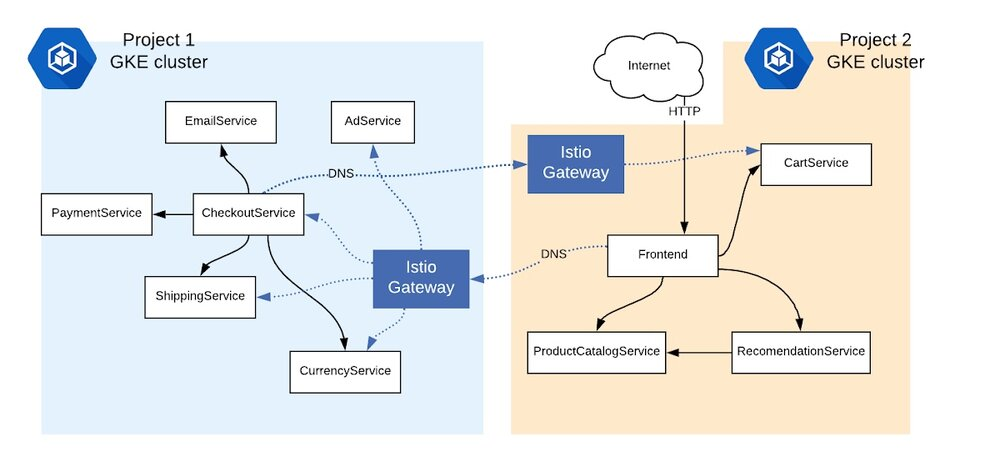
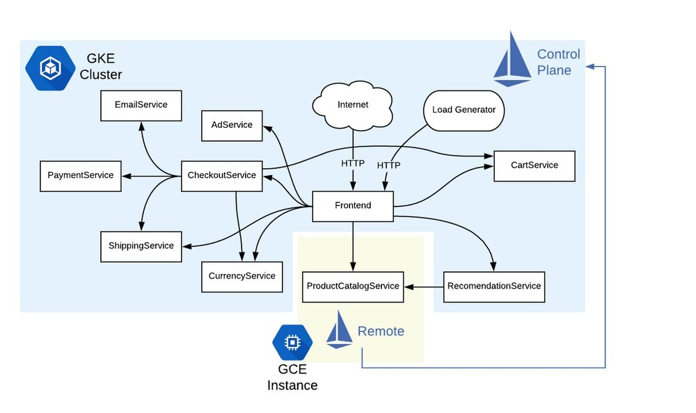

本文为翻译文章，[点击查看原文](https://cloud.google.com/blog/topics/hybrid-cloud/the-service-mesh-era-istios-role-in-the-future-of-hybrid-cloud)。

欢迎回到我们关于 Service Mesh 和 Istio 的博客文章系列。

在之前的帖子中，我们讨论了 Istio 服务网格是什么，以及它为什么如此重要。然后，我们介绍了如何将 Istio 投入生产环境中，包括了如何进行高级应用程序部署和安全功能，到 SRE 监控最佳实践。

今天，在 Google Cloud NEXT '19 之前，我们正在谈论在各种环境中使用 Istio，以及 Istio 如何帮助您释放混合云的强大功能。

## 为什么采用混合云？

混合云可以采用多种形式。通常，混合云指的是跨公共云和私有（内部部署）云运行，而多云意味着跨多个公共云平台运行。

采用混合云或多云架构可以为您的组织带来诸多好处。例如，使用多个云提供商可以帮助您避免供应商锁定，并使得您为实现目标可选择最佳的云服务。使用云和本地环境，您可以同时享受云的优势（灵活性、可扩展性、成本降低）和本地的好处（安全性、低延迟、硬件复用）。如果您是首次迁移到云端，采用混合云步骤可以让您按照自己的节奏，以最适合您业务的方式进行。

根据我们在 Google 的经验以及我们从客户那里得到的信息，我们认为采用混合服务网络是简化云和本地环境中应用程序管理、安全性和可靠性的关键 - 无论您的应用程序是否在容器中运行，或是在虚拟机中运行。让我们来谈谈如何使用 Istio 将混合服务网格变为现实。

## 混合 Istio：跨环境的网格

Istio 的一个关键特性是它为您的工作负载（例如 Pod、Job、基于 VM 的应用程序）提供服务抽象。当您转向混合拓扑时，这种服务抽象变得更加重要，因为现在您不是只需要关注一个环境，而是需要关注若干个环境。

当您在一个 Kubernetes 集群上使用 Istio 时，您可以获得包括可见性、​​细粒度流量策略、统一遥测和安全性在内的微服务的所有管理优势。但是当您在多个环境中使用 Istio 时，您实际上是在为您的应用程序提供了一个新的超级能力。因为 Istio 不仅仅是 Kubernetes 的服务抽象，Istio 也是一种在整个环境中标准化网络的方法。它是一种集中 API 管理并将 JWT 验证与代码分离的方法。它是跨云提供商的安全、零信任网络的快速通道。

那么所有这些魔法是如何发生的呢？混合 Istio 是指一组 Istio Sidecar 代理，每一个 Envoy 代理位于所有服务的旁边，而这些服务可能运行在您的不同环境中的每一个虚拟机、每一个容器中，而且这些 Sidecar 代理之前互相知道如何跨边界交互。这些 Envoy Sidecar 代理可能由一个中央 Istio 控制平面管理，或由每个环境中运行的多个控制平面管理。

我们来看一些例子吧。

## 多集群 Istio，一个控制平面

启用混合 Istio 的一种方法是配置一个远程 Kubernetes 集群，该集群连接到一个集中运行的 Istio 控制平面。如果在同一 GCP 项目中有多个 GKE 集群，则此设置很有用，注意的是两个集群中的 Kubernetes pod 需要相互通信。这种方式常用于以下场景：通过测试集群您可以使用新的功能并使其过渡到生产集群；准备好处理故障转移的备用集群，或跨地域或可用区的冗余集群。

该演示是在同一个 GCP 项目中的两个 GKE 集群，但是跨越了两个不同的可用区（us-central 和 us-east）。我们在一个集群上安装 Istio 控制平面，在另一个集群上安装 Istio 的远程组件（包括 sidecar 代理注入器）。在这两个集群中，我们可以部署跨 Kubernetes 集群的示例应用程序。

关于这种单一控制平面方法的令人兴奋的事情是，我们不必改变任何有关我们的微服务如何相互通信的信息。例如，前端仍然可以使用本地 Kubernetes DNS 名称（cartservice:port）调用 CartService。此 DNS 解析有效，因为同一 GCP 项目中的 GKE pod 属于同一虚拟网络，因此允许跨群集进行直接的 pod-to-pod 通信。

## 多集群 Istio，两个控制平面

现在我们已经看到了一个基本的多集群 Istio 示例，让我们更进一步演示另一种拓扑。

假设您在本地和云中或跨云平台运行应用程序。为了使 Istio 跨越这些不同的环境，两个集群内的 pod 必须能够跨越网络边界。

该演示使用两个 Istio 控制平面 - 每个集群一个 - 形成一个双头逻辑服务网格。两个集群间的流量交互是通过 Istio 的 Ingress 网关，而不是使用 Sidecar 代理直接相互通信。Istio Gateway 也是一个 Envoy 代理，但它专门用于进出集群 Istio 网格的流量。

为使此设置跨网络分区工作，每个 Istio 控制平面都有一个特殊的域名服务器（DNS）配置。在此双控制平面拓扑中，Istio 安装辅助 DNS 服务器（CoreDNS），该服务器解析本地集群的外部服务的域名。对于那些外部服务，流量在 Istio Ingress 网关之间透传，然后转移到相关服务。

在此拓扑的演示中，我们将展示安装的工作原理，然后介绍如何配置跨两个集群运行的微服务能够互相通信。我们通过 Istio ServiceEntry 资源完成此操作。例如，我们将前端（集群 2）的服务条目部署到集群 1 中。这样，集群 1 就知道集群 2 中运行的服务。

与第一个演示不同，这种双控制平面 Istio 设置不需要集群之间的扁平网络。这意味着您的集群之间 pod 可以有重叠的 CIDR。此设置所需要的只是 Istio 网关暴露在 Internet 上。通过这种方式，每个集群内的服务可以在各自的环境中保持安全。

## 将虚拟机添加到 Istio 网格

除了容器之外，许多组织也使用虚拟机（VM）作为补充或者替代来运行其应用程序。如果您正在使用虚拟机，您仍然可以享受 Istio 网格带来的好处。此演示向您展示如何在 GKE 上运行 Istio 时集成 Google Compute Engine 实例。我们像以前一样部署相同的应用程序 但这一次，一个服务（ProductCatalog）被部署在 Kubernetes 集群之外的外部虚拟机上运行。

该 GCE 虚拟机运行一组最小的 Istio 组件，以便能够与中心的 Istio 控制平面通信。然后，我们将 Istio ServiceEntry 对象部署到 GKE 集群，该集群在逻辑上将外部 ProductCatalog 服务添加到网格中。

这个 Istio 配置模型很有用，因为现在，所有其他微服务都可以引用 ProductCatalog，就好像它是在 Kubernetes 集群内部运行一样。从这里，您甚至可以为 ProductCatalog 添加 Istio 策略和规则，就像它在 Kubernetes 中运行一样; 例如，您可以为虚拟机的所有入站流量启用双向 TLS。

请注意，虽然此示例使用 Google Cloud VM 进行演示，但您可以在物理机上或使用本地虚拟机运行相同的示例。通过这种方式，您可以将 Istio 的现代云原生原则带到任何地方运行的虚拟机中。 

## 建立混合型未来

我们希望这些混合 Istio 演示中的一个或多个能够与现在您的组织中运行应用程序的方式产生共鸣。但我们也明白采用像 Istio 这样的服务网格意味着要承担复杂性和安装开销，此外还涉及迁移到微服务和 Kubernetes 相关的任何复杂性。在这种情况下，采用混合服务网格甚至更复杂，因为您正在处理不同的环境，每个环境都有自己的技术规范。

Google Cloud 致力于通过一致、现代化的跨平台设置帮助您简化日常云操作。这就是我们在 GKE 上创建 Istio 的原因，它可以在 Google Kubernetes Engine（GKE）上一键安装 Istio。它是我们在云服务平台（CSP）上工作的推动力。CSP 是一种产品，可以帮助您的组织迁移到（并跨越）云——按照您自己的步调、以最适合您的方式。CSP 依赖于开放的云堆栈——Kubernetes 和 Istio——来强调可移植性。今年我们很高兴 CSP 成为现实。

感谢您加入我们迄今为止的服务网格系列。请继续关注 4 月份 Google Cloud NEXT 上的主题演讲和混合云专题。在 NEXT 之后，我们将继续关于 Istio 操作的一些高级帖子。
