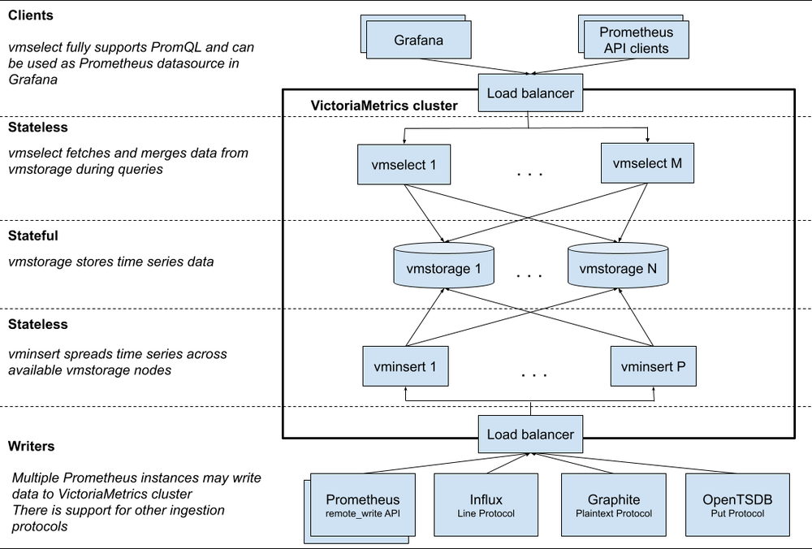
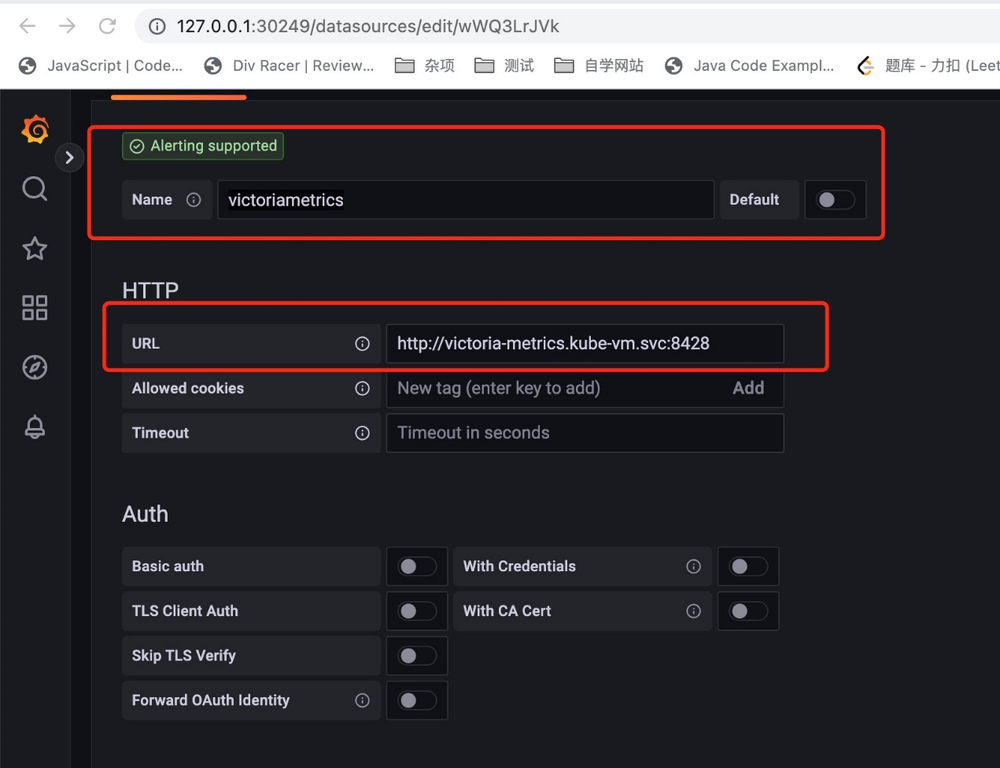
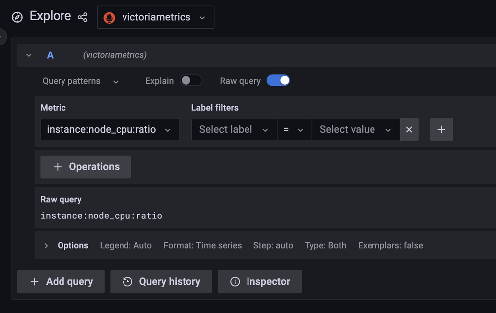
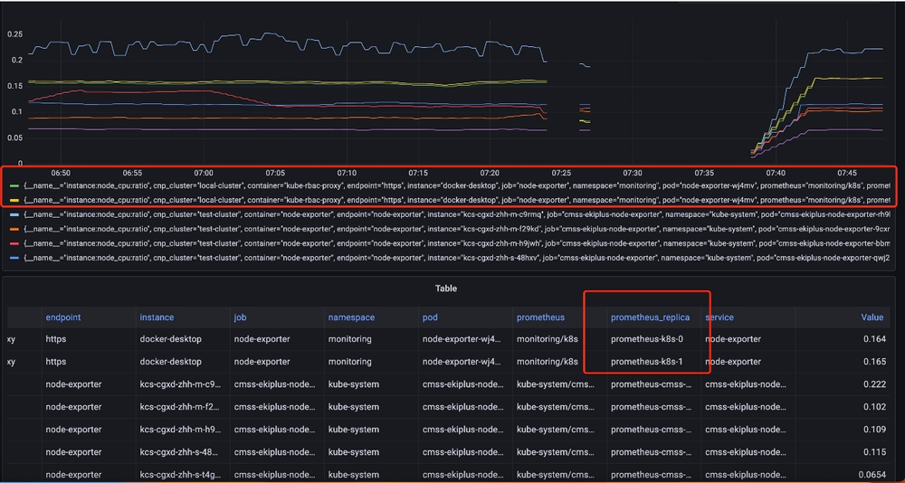

## 前言

本文首先对 VictoriaMetrics 的功能和架构进行介绍。接着，使用一个场景例子演示单集群 VictoriaMetrics 的安装，并验证其对 Prometheus 的兼容性和可替换性。

## VictoriaMetrics 简介

我们知道，若要保证一个系统的稳定运行，那么对于这个系统的监控是不可或缺的环节。当今在云原生领域中，Prometheus 作为已经毕业的 CNCF 项目，已经成为了非常主流的监控和报警工具。但它也存在一些缺点，例如：默认情况下，其数据存储于本地文件的 TSDB 中，不利于容灾和做数据管理，若用于生产一般需要搭配第三方的如 InfulxDB 进行使用。大数据量的场景下，指标的收集和管理性能存在一定的瓶颈。

而我们今天介绍的 VictoriaMetrics 可以认为是 Prometheus 在上述问题上的一个增强版。它不仅能作为时序数据库结合 Prometheus 使用进行指标的长期远程存储，也能单独作为一个监控解决方案对 Prometheus 进行平替。

对比其他一些主流的监控方案、时序数据库，VictoriaMetrics 具有如下优势：

1. 指标数据的收集和查询具有极高的性能和良好的垂直和水平伸缩性，比 InfluxDB 和 TimesscaleDB 的性能高出 20 倍
2. 在处理高技术时间序列时，内存方面做出了优化，比 InfluxDB 少 10x 倍，比 Prometheus、Thanos 或 Cortex 少 7 倍
3. 数据存储的压缩方式更加高效。比 TimescaleDB 少 70 倍，与 Prometheus、Thanos、Cortex 相比，所需存储空间也少 7 倍。
4. 针对高延迟 IO 和低 IOPS 存储进行了优化
5. 单节点的 VictoriaMetrics 即可替代 Thanos、M3DB、Cortex、InfluxDB 或 TimescaleDB 等竞品中等规模的集群
6. 对于 Prometheus 具有良好的兼容性，能够支持 Prometheus 的配置文件、PromQL、各类 API、数据格式，并有一些自己的增强 API。

## VictoriaMetrics 的架构

VictoriaMetrics 分为单节点和集群两个方案。两种方案都提供了二进制文件、docker、helm 以及 operator 等部署方式。对于数据采集点对于 100w/s 的场景，官方推荐使用单节点版，单节点版相当于一个 all-in-one 的包，包含了大部分的功能，但不支持告警，简单好维护。多集群的架构图如图 1 所示：



VictorMetrics 集群部分主要包含了以下几个组件：

* vmstorage：它是一个有状态的组件，主要负责存储原始数据并返回指定标签过滤器在给定时间范围内的查询数据，集群部署的必选组件，默认端口为 8482。
* vminsert：无状态的服务组件，主要负责接收摄取的数据并根据指标名称和标签的哈希值分散从存储到部署了 vmstorage 的节点中去，集群部署的必选组件，默认端口为 8480。
* vmselect：无状态的额服务组件，面向外部终端的查询组件，根据收到的请求去各个 vmstorage 节点中获取数据，集群部署的必选组件，默认端口为 8481。
* vmagent：主要负责数据指标的抓取，并将它们存储在 VictoriaMetrics 或其他支持 remote write 协议的 Prometheus 兼容的存储系统中，会占用本地磁盘缓存。它是一个可选组件，位于图 1 的 Writers 那层 Load balancer 与各个采集源之间，类似于 Prometheus 中 pushgateway 的地位。是一个可选组件，默认占用端口 8429。其组件作用如图 2 所示：


* vmalert：类似于 Prometheus 中的 alertmanager，是一个告警的相关组件，如果不需要告警功能可以不使用该组件，是一个可选组件，默认占用端口为 8880。

集群部署模式下，各个服务可以进行独立的扩展，但部署 vmstorage 节点之间建议互不通信和进行数据共享，单节点模式的二进制文件或镜像已经集成了三个必选组件的功能。

下面我们将使用单集群的方式在 K8S 中对 VictoriaMetrics 进行部署，并验证其对于 Prometheus 的兼容性。

## VictoriaMetrics 单节点的安装和兼容性验证

首先，我们使用 Prometheus-Operator 进行 Prometheus 以及相关诸如 node-exporter、grafana 的快速安装。接着，在 K8S 内部署单节点的 VictoriaMetrics。最后，开启远程写入将 Prometheus 的数据写入 VictoriaMetrics 中，并在 grafana 中浏览 Prometheus 和 VictoriaMetrics 的指标，若结果相同，说明在不使用告警功能的情况下，VictoriaMetrics 可兼容替换 Prometheus 进行使用（单节点版不包含告警功能）。整体的组件图如图 3 所示：


## 使用 kube-prometheus 安装 prometheus 相关组件

首先，我们克隆和使用 kube-prometheus (https://github.com/prometheus-operator/kube-prometheus) 这个项目来进行图 3 中蓝色、黄色以及粉色部分组件的快速安装，该项目和 prometheus-operator 的区别就类似于 Linux 内核和 CentOS/Ubuntu

这些发行版的关系，真正起作用的是 Operator 去实现的，kube-prometheus 项目编写了一系列常用的监控资源清单，更加容易上手安装。不过需要注意 Kubernetes 版本和 kube-prometheus 的兼容，各个版本的兼容关系如图 4 所示：


由于作者本地的 K8s 环境为 1.21 版本，所以我们这里下载使用 release-0.9 的版本到本地，接着进行进行解压并重命名（起始目录为压缩包所在目录），并进入工作目录，命令如下：

* tar -xvf kube-prometheus-0.9.0.tar.gz
* mv kube-prometheus-0.9.0 kube-prometheus 
* cd kube-prometheus

下一步，我们执行命令：

* kubectl create -f manifests/setup

这会帮我们安装创建 prometheus-operator 的命名空间（默认是 monitoring）和所需的 CRD 资源。

接着，执行命令：

* kubectl wait --for condition=Established --all CustomResourceDefinition --namespace=monitoring

这个命令会校验和等待我们所需 CRD 和命名空间的完成。

最后，执行命令：

* kubectl create -f manifests/

它会帮我们安装项目已经定义好的 Prometheus、node-exporter、kube-state-metrics、alertmanager 组件。为了后续方便使用 Prometheus 和 grafana，我们将两个服务对应的 service 设置成 NodePort（默认为 ClusterIP）。命令为：

* kubectl edit svc prometheus-k8s -n monitoring
* kubectl edit svc grafana -n monitoring

完成之后，总体的服务清单如图 5 所示：


我们通过 http://<node-ip>:30246 就可以访问 grafana 了，我们可以看到 kube-prometheus 这个项目的 grafana 已经为我们关联了图 5 中的 prometheus，具体见图 6：


点击面板左侧的 Explore，我们可以进行指标查询，此处我们查询节点的 CPU 使用率指标“instance:node_cpu:ratio”，查询结果如图 7 和图 8 所示（由于作者的 Prometheus 做了联邦配置所以结果样本会偏多，只看 cnp_cluster 为“local-cluster”的样本即可）：


## 在 K8S 中部署 VictoriaMetrics

接下来我们进行 VictoriaMetrics 的部署，由于我们要使用 VictoriaMetrics 作为远程存储，所以在部署时需要为 VictoriaMetrics 服务挂载一个存储，此处我们使用 Local PV 作为其存储（生产环境一般使用 NFS 或者 ceph）。一般来说，Local PV 对应的存储介质应该是一块外挂在宿主机的磁盘或者块设备，我们这里暂时将本机节点的/Users/chris/data/k8s/vm 这个目录看成是一个挂载的独立磁盘，然后我们依次准备 StorageClass、PV 和 PVC 的资源清单，其内容如下代码块所示：

```
apiVersion: storage.k8s.io/v1
kind: StorageClass
metadata:
  name: local-storage
provisioner: kubernetes.io/no-provisioner
volumeBindingMode: WaitForFirstConsumer
```

<center>StorageClass 定义</center>

```
apiVersion: v1
kind: PersistentVolume
metadata:
  name: victoria-metrics-data
spec:
  accessModes:
    - ReadWriteMany
  capacity:
    storage: 10Gi
  storageClassName: local-storage
  local:
    path: /Users/chris/data/k8s/vm-operator
  persistentVolumeReclaimPolicy: Retain
  nodeAffinity:
    required:
      nodeSelectorTerms:
        - matchExpressions:
            - key: project
              operator: In
              values:
                - local-cluster
```

<center>PV 定义</center>

```
apiVersion: v1
kind: PersistentVolumeClaim
metadata:
  name: victoria-metrics-data
  namespace: kube-vm
spec:
  accessModes:
    - ReadWriteOnce
  resources:
    requests:
      storage: 10Gi
  storageClassName: local-storage
```

<center>PVC 定义</center>

PV 定义中我们设置了一个亲和性的 nodeSelector 进行使用，是因为本地存储不能随着 Pod 进行漂移，所以要求 Pod 固定到一个节点上，一旦漂移到其他节点上，另外的节点是没有对应的数据的（project=local-cluster 是我们实现为 node 设置的一个标签对）。并且我们在 StorageClass 定义中创建 StorageClass 的时候设置了延迟绑定，当节点第一次调度的时候才进行 PV 与 PVC 的绑定过程。因为假如我们一开始就绑定了 PV 和 PVC 在 node1 节点，且 PV 的存储卷在 node1 节点，但 Pod 只能运行在 node2 节点，那么就会出现冲突，导致调度失败，延迟调度就是让 K8S 调度器的总和考虑调度规则，再 Pod 被调度时再考虑 PVC 到底应该和哪个 PV 进行绑定。

接着，我们定义 VictoriaMetrics 的 Deployment 和它的 Service，如下代码块所示：

```
apiVersion: apps/v1
kind: Deployment
metadata:
  name: victoria-metrics
  namespace: kube-vm
spec:
  selector:
    matchLabels:
      app: victoria-metrics
  template:
    metadata:
      labels:
        app: victoria-metrics
    spec:
      volumes:
        - name: storage
          persistentVolumeClaim:
            claimName: victoria-metrics-data
      containers:
        - name: vm
          image: victoriametrics/victoria-metrics:v1.79.8
          imagePullPolicy: IfNotPresent
          args:
            - -storageDataPath=/var/lib/victoria-metrics-data
            - -retentionPeriod=1w
          ports:
            - containerPort: 8428
              name: http
          volumeMounts:
            - mountPath: /var/lib/victoria-metrics-data
              name: storage
```
<center>VictoriaMetrics 的 Deployment 清单</center>

```
apiVersion: v1
kind: Service
metadata:
  name: victoria-metrics
  namespace: kube-vm
spec:
  type: NodePort
  ports:
    - port: 8428
  selector:
    app: victoria-metrics
```
<center>VictoriaMetrics 的 Service 清单</center>

Deployment 定义中，我们使用-storageDataPath 参数指定了数据存储目录，-retentionPeriod 参数指定了数据的保留周期为 1 个星期，Service 中使用 NodePort 的方式对服务进行了暴露。

最后，我们先使用命令`kubectl create ns kube-vm`创建命名空间，再依次使用 kubectl apply -f 命令应用上述代码块的资源定义清单即可。部署之后的结果图，如图 9 所示：


依据图 3 的场景，我们需要在 Prometheus 中开启远程写入。我们可以在 kube-promethus 项目下的 manifest 目录下找到 prometheus-prometheus.yaml 文件，在清单的最后添加 VictoriaMetrics 在 K8S 中的 DNS 路径，并重新 apply 即可，如图 10 所示：


## 验证兼容性

我们使用图 5 部署好的 grafana 添加一个新的 prometheus 数据源，数据源地址为图 14 部署的 VictoriaMetrics 的 DNS 地址，并命名数据源为 victoriametrics，最后使用这个数据源进行指标`instance:node_cpu:ratio`的浏览，整个过程的截图如图 11~13 所示：







从图 13 中可以观察到，跟 Promethus 相同，我们同样可以正常的从 VictoriaMetrics 获取该指标的结果数据（图中红框部分，多出一条数据是因为图 5 部署的 Promethus 有两个容器组），如官方所说 VictoriaMetrics 可以兼容 Prometheus，并作为一个及其良好的替换方案。

生产环境中，开启 Prometheus 的 remote_write 功能，会导致 Prometheus 占用主机资源增加，若没有告警的需求，我们可以把图 3 的 Prometheus 进行精简，直接让 VictoriaMetrics 使用之前 Prometheus 的配置，让各个 exporter 直接对接到 VictoriaMetrics。

对于有告警需求的场景，我们可以使用 vmagent 替代图 3 中 Prometheus 的角色，部署完整的 5 个组件进行 Prometheus 告警系统的替换。VictoriaMetrics 官方也提供了类似 kube-prometheus 的项目 vm-operator，它不但能够帮助我们管理 VictoriaMetrics 的相关规则配置，而且能够识别 kube-prometheus 中 servicemonitor、podmonitor 等 CRD 资源。

## 总结

VictoriaMetrics 作为近两年新兴流行的时序数据库和监控解决方案，很好的对 Prometheus 性能和缺点就行了提升和补充，它能够兼容原先 Prometheus 监控方案进行指标的长久存储也能快速替换升级 Prometheus 的监控系统，可作为我们搭建系统监控模块的另一种比较好的选择。

## 参考资料

- [VictoriaMetrics 入门与实战](https://blog.csdn.net/qihoo_tech/article/details/120558834)
- [VictoriaMetircs](https://docs.victoriametrics.com/Single-server-VictoriaMetrics.html)
