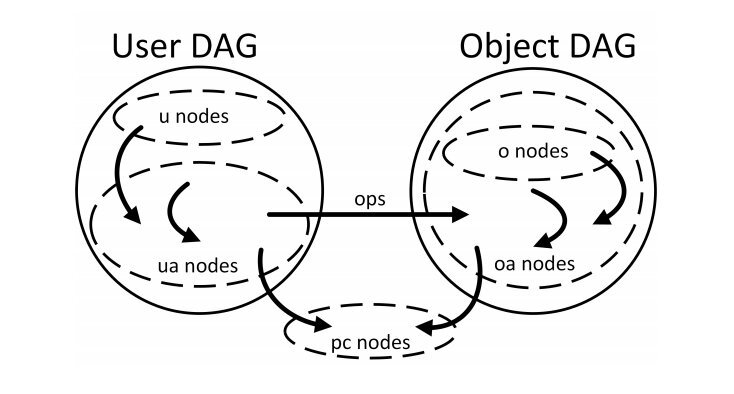
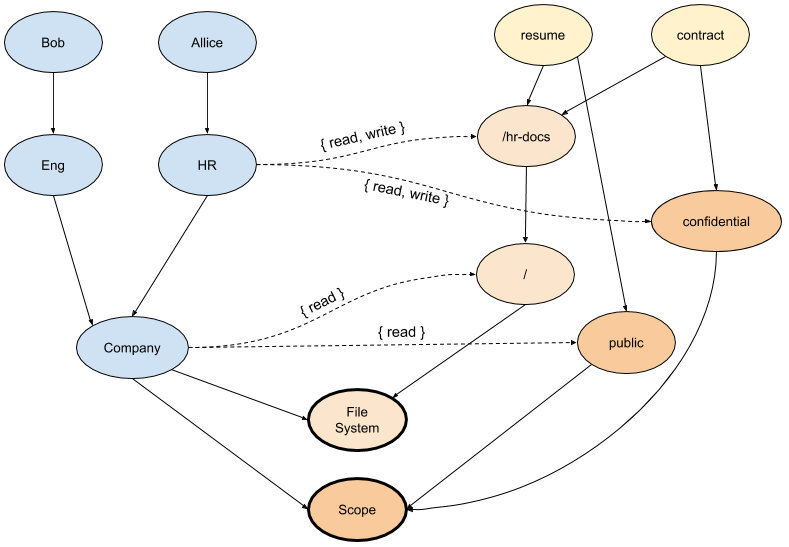

本文为我跟 Ignasi Barrera 共同创作，本文英文版首发于 [TheNewStack](https://thenewstack.io/why-you-should-choose-ngac-as-your-access-control-model/)。

不同的公司或软件供应商已经设计了无数种方法来控制用户对功能或资源的访问，如酌情访问控制（DAC）、强制访问控制（MAC）、基于角色的访问控制（RBAC）和基于属性的访问控制（ABAC）。从本质上讲，无论何种类型的访问控制模型，都可以抽象出三个基本要素：用户、系统 / 应用和策略。

在本文中，我们将介绍 ABAC、RBAC 以及一种新的访问控制模型 —— 下一代访问控制（NGAC），并比较三者之间的异同，以及为什么你应该考虑 NGAC。

## 什么是 RBAC？

RBAC，即基于角色的访问控制，采用的方法是根据用户在组织中的角色授予（或拒绝）对资源的访问。每个角色都被分配了一系列的权限和限制，这很好，因为你不需要跟踪每个系统用户和他们的属性。你只需要更新相应的角色，将角色分配给用户，或者删除分配。但这可能很难管理和扩展。使用 RBAC 静态角色模型的企业经历了角色爆炸：大公司可能有数万个相似但不同的角色或用户，他们的角色会随着时间的推移而改变，因此很难跟踪角色或审计不需要的权限。RBAC 具有固定的访问权限，没有规定短暂的权限，也没有考虑位置、时间或设备等属性。使用 RBAC 的企业很难满足复杂的访问控制要求，以满足其他组织需求的监管要求。

### RBAC 示例

下面是 Kubernetes 中 `default` 命名空间中的一个 Role，可以用来授予 pod 的读取权限。

```yaml
apiVersion: rbac.authorization.k8s.io/v1
kind: Role
metadata:
  namespace: default
  name: pod-reader
rules:
- apiGroups: ["v1"]
  resources: ["pods"]
  verbs: ["get", "watch", "list"]
```

## 什么是 ABAC？

ABAC 是“基于属性的访问控制“的缩写。从高层次上讲，[NIST](https://www.nist.gov/publications/guide-attribute-based-access-control-abac-definition-and-considerations-1) 将 ABAC 定义为一种访问控制方法，“在这种方法中，根据分配的主体属性、环境条件以及用这些属性和条件指定的一组策略，批准或拒绝主体对对象进行操作的请求。”ABAC 是一个细粒度的模型，因为你可以给用户分配任何属性，但同时它也成为一种负担，很难管理：

- 在定义权限的时候，用户和对象之间的关系无法可视化。
- 如果规则设计的有点复杂或者混乱，对于管理员来说，维护和跟踪会很麻烦。

当有大量的权限需要处理时，会造成性能问题。

### ABAC 示例

Kubernetes 最初使用 ABAC 作为访问控制，并通过 JSON 行配置，例如：

Alice 可以只读取命名空间 `foo` 中的 pod。

```json
 {"apiVersion": "abac.authorization.kubernetes.io/v1beta1", "kind": "Policy", "spec": {"user": "alice", "namespace": "foo", "resource": "pods", "readonly": true}}
```

## 什么是 NGAC？

NGAC，即下一代访问控制，采用将访问决定数据建模为图形的方法。NGAC 可以实现系统化、策略一致的访问控制方法，以高精细度授予或拒绝用户管理能力。NGAC 由 [NIST](https://www.nist.gov/)（美国国家标准与技术研究所）开发，目前用于 [Tetrate Q](https://www.tetrate.io/blog/introducing-tetrate-q/) 和 [Tetrate Service Bridge](https://www.tetrate.io/tetrate-service-bridge/)。

有几种类型的实体；它们代表了您要保护的资源、它们之间的关系以及与系统互动的行为者。这些实体是：

- 用户
- 对象
- 用户属性，如组织单位
- 对象属性，如文件夹
- 策略类，如文件系统访问、位置和时间

NIST 的 David Ferraiolo 和 [Tetrate](https://www.tetrate.io/) 的 Ignasi Barrera 在旧金山举行的 2019 年服务网格日（Service Mesh Day 2019）上发表了关于下一代访问控制的 [演讲](https://www.tetrate.io/blog/unpacking-next-generation-access-control-ngac-and-tetrate-q/)，分享了 NGAC 的工作原理。

NGAC 是基于这样一个假设：你可以用一个图来表示你要保护的系统，这个图代表了你要保护的资源和你的组织结构，这个图对你有意义，并且符合你的组织语义。在这个对你的组织非常特殊的模型之上，你可以叠加策略。在资源模型和用户模型之间，定义了权限。这样 NGAC 提供了一种优雅的方式来表示你要保护的资源，系统中的不同角色，以及如何用权限把这两个世界联系在一起。



图片来自于 [Linear Time Algorithms to Restrict Insider Access using Multi-Policy Access Control Systems](https://tsapps.nist.gov/publication/get_pdf.cfm?pub_id=922390)

### NGAC 示例

下面的例子展示了一个简单的 NGAC 图，其中有一个代表组织结构的用户 DAG，一个代表文件系统中的文件和文件夹的对象 DAG，一个文件的分类，以及两个不同的策略 —— 文件系统和范围，可以结合起来做出访问决策。两个 DAG 之间的关联边定义了行为者对目标资源的权限。



在这张图中，我们可以看到 `/hr-docs` 文件夹中的两个文件 `resume` 和 `contract` 的表示，每个文件都链接到一个类别（`public`/`confidential`）。还有两个策略类，`File System` 和 `Scope`，图中的对象被连接在这里 —— 需要满足这些条件才能获得对每个文件的访问权。

在例子中，用户 Allice 对两个文件都有读写访问权限，因为有一个路径将 Allice 链接到每个文件，而且路径授予了两个策略类的权限。但是，用户 Bob 只有对 `resume` 文件的访问权，因为虽然存在一个从 Bob 到 `contract` 文件的路径，该路径满足 `File System` 策略类的“读 " 权限，但没有授予 `Scope` 策略类权限的路径。所以，Bob 对 `contract` 文件的访问被拒绝。

## 为什么选择 NGAC？

在 ABAC 的情况下，需要跟踪所有对象的属性，这造成了可管理性的负担。RBAC 减少了负担，因为我们提取了所有角色的访问信息，但是这种模式存在角色爆炸的问题，也会变得不可管理。有了 NGAC，我们在图中就有了我们所需要的一切 —— 以一种紧凑、集中的方式。

当访问决策很复杂时，ABAC 的处理时间会成倍上升。RBAC 在规模上变得特别难以管理，而 NGAC 则可以线性扩展。

NGAC 真正出彩的地方在于灵活性。它可以被配置为允许或不允许访问，不仅基于对象属性，而且基于其他条件 —— 时间、位置、月相等。

NGAC 的其他关键优势包括能够一致地设置策略（以满足合规性要求）和设置历时性策略的能力。例如，NGAC 可以在中断期间授予开发人员一次性的资源访问权，而不会留下不必要的权限，以免日后导致安全漏洞。NGAC 可以在一个访问决策中评估和组合多个策略，同时保持其线性时间的复杂度。

## 总结

下表从几个方面对 ABAC、RBAC 和 NGAC 进行了比较。

| 权限模型 | 优点                                 | 缺点                                   |
| -------- | ------------------------------------ | -------------------------------------- |
| ABAC     | 灵活                                 | 性能和审计问题                         |
| RBAC     | 简单                                 | 角色爆炸、固定的访问权限、合规需求挑战 |
| NGAC     | 细粒度、利于审计、灵活、组合权限策略 | 复杂                                   |

总而言之：

- RBAC 比较简单，性能好，但在规模上会受到影响。
- ABAC 很灵活，但性能和可审计性是个问题。
- NGAC 通过使用一种新颖、优雅的革命性方法来修复这些差距：在用户提供的现有世界表示之上叠加访问策略。你也可以对 RBAC 和 ABAC 策略进行建模。

## 参考

- [Guide to Attribute-Based Access Control (ABAC) Definition and Considerations](https://nvlpubs.nist.gov/nistpubs/specialpublications/NIST.SP.800-162.pdf)
- [Deploying ABAC policies using RBAC Systems](https://www.ncbi.nlm.nih.gov/pmc/articles/PMC6953980/)
- [RBAC vs. ABAC: What’s the Difference?](https://www.comparitech.com/net-admin/rbac-vs-abac/)
- [Role Explosion: The Unintended Consequence of RBAC](https://www.linkedin.com/pulse/role-explosion-unintended-consequence-rbac-oren-ohayon-harel/)
- [Exploring the Next Generation of Access Control Methodologies](https://www.nist.gov/publications/exploring-next-generation-access-control-methodologies)