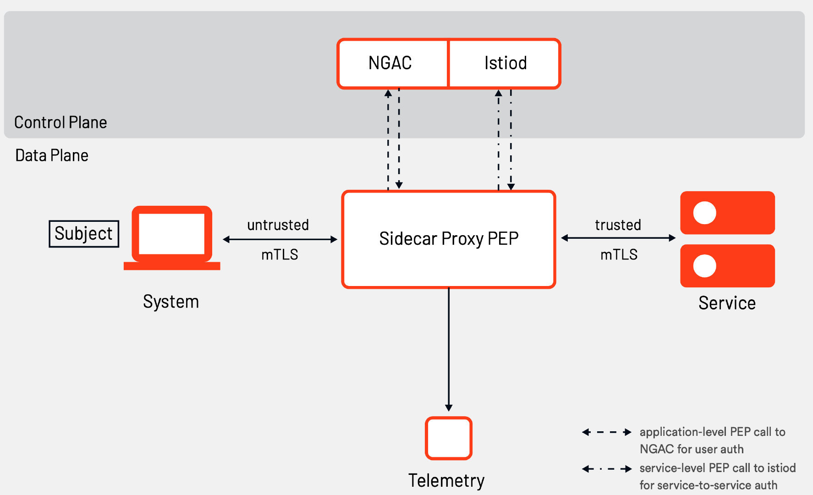

本文译自 Tetrate 发布的[《零信任架构白皮书》](https://www.tetrate.io/white-paper-zero-trust-architecture/)。

## 背景介绍

传统的数据中心网络安全架构试图在一个优美的内部花园周围建立强大的围墙。这种堡垒模型长久以来存在一个固有的弱点，即当（而不是如果）入侵者渗透到周边时，他们就可以控制整个花园。虽然这个弱点早就存在，但随着进入数据中心的入口的增加及工作负载的扩展的趋势增加，这个弱点越发严重。

零信任网络架构提供了一条前进的道路，它解决了基于周界安全的弱点，采取的立场是网络本身就是敌对的；周界背后的安全是一种幻觉，野蛮人已经撞开了大门。

虽然零信任需要对现状进行重大反思，但它远不是一个崇高的、不可实现的目标。现在就有一些工具可以开始实施零信任网络架构。这些工具和实践可以逐步实施，以满足你的需要，而不是要求你全盘重新构建你的整个网络安全基础设施。

## 传统安全模式的弱点

周边安全薄弱的原因与现代军队放弃大规模固定防御的原因类似：一旦被渗透，战斗就会失败；而周边安全最终也会被渗透。

**单纯的周边安全提供了糟糕的控制粒度。**如果周界内的所有流量都是可信的，那么一个漏洞就会使周界内的一切都变得脆弱。当网络服务只有几十种时，这可能是可控的，而且可以通过物理位置严格限制访问，但服务激增到几十万种，而且都是以相同的访问水平相互通信，这使得目前的技术状态无法维持，特别是由于一个被破坏的服务可以转移到许多其他服务。

多年来，业务需求已经削弱了外围的完整性。出于需要，防火墙上被打了很多洞，导致了多个暴露的入口点和难以管理的防火墙规则的扩散，使外围更像是一条马奇诺防线，而不是围墙和城堡。

面对周界几乎消失的情况，为改善周界安全模式所做的新努力，如微分割和软件定义网络，有助于减少服务周围的攻击面。但是，它们也只是部分解决方案，其代价是复杂性的增加和配置规则的爆炸。分割仍然提供了糟糕的粒度。例如，隔离网络服务器和数据库服务器可以减少这些服务周围的攻击面，但网络服务器可能支持许多应用程序，它们各自可能引入的漏洞仍然是不透明的。

## 零信任的信条

"*信任不是理想的状态，信任是你想避免的失败点*"——约翰·金德瓦格

零信任是一种方法，一种对网络安全的思考方式，而不是任何特定的架构或实现。它从一个假设开始，即网络上没有安全的地方。你应该把你的数据中心，不管它是否喜欢，当作它所有的数据和服务都暴露在公共互联网上。

在零信任模式中，与传统的周边安全不同，可及性并不意味着授权。零信任旨在缩小资源周围的隐性信任区域，最好是缩小到零。在一个零信任的网络中，所有对资源的访问都应该是这样的。

- **经过认证和动态授权**：不仅在网络层和服务间层，而且在应用层。网络位置并不意味着信任。在允许任何访问之前，服务身份和终端用户凭证是经过认证和动态授权的。
- **有时间限制**：认证和授权被约束在一个短暂的会话中，之后必须重新建立。
- **在空间上有界限**：一个服务周围的信任周界应该尽可能小。加密，既是为了防止窃听，也是为了确保信息的真实性和未被篡改。
- **可观察**：所以所有资产的完整性和安全态势可以被持续监控，策略的执行可以持续得到保证。另外，从观察中获得的洞察力应该被反馈到改进策略上。

### 为什么它更好？

- 可访问性不是授权——与周边安全不同，对一个服务的访问并不仅仅是因为该服务是可以到达的，它还必须经过明确的认证和授权。

- 经过认证和授权的工作负载受到保护，不受周边漏洞的影响。
- 在时间上的约束限制了凭证受损的风险。
- 在空间上的约束允许策略执行的高颗粒度。
- 动态策略执行确保授权策略是最新的。
- 加密限制了侦查，并提供了通信的真实性。
- 细粒度的可观察性允许实时保证策略的执行，以及对历史上如何执行策略的事后审计，还有用于故障排除和分析的必要数据。

零信任系统的试金石是，部署在该系统中的应用程序在公开曝光时不会有任何变化。如果实施得当，一个零信任的安全架构在公开的互联网上运行时与在防火墙后面运行时一样安全。

### 我什么时候需要它？

虽然每个组织都可能从采用零信任原则中受益，但期望几十年的基础设施和业务流程全盘转变为新模式是不现实的。

特定的压力可能会促使你尽早这样做。当你的基础设施跨越不同的供应商时，例如，分裂的企业内部和云部署或混合云部署，在这些扩展的网络上大规模应用VPN和NAT的复杂性和脆弱性可能使得在短期内对这些部署应用零信任网络原则具有成本效益和风险效率。

## ZTA组件

NIST提出了三个逻辑组件来实现动态授权和认证。

1.    一个策略引擎（Policy Engine，简称 PE），负责确定授权。
2.    一个策略管理员（Policy Aadminstrator，简称 PA），用于根据策略引擎的结果建立和/或关闭通往资源的通信路径。
3.    策略执行点（Policy Enforcement Point，简称 PEP），位于提出请求的主体和目标资源之间，启用、监测和终止它们之间的连接。

在这种模式下，主体要求的所有工作负载必须有一个身份，可以在 PEP 进行认证和授权。策略决策点对这些身份执行策略，并在允许访问之前执行认证和授权。在这里，授权是基于细粒度的策略；可及性不算作授权。数据平面的PEP允许在运行时对系统进行观察，并确保持续的合规性和治理控制。

## 实施

由于零信任不是一个蓝图，而更像是一种设计理念，因此有许多潜在的方法来实现零信任架构。作为服务网格和下一代访问控制（NGAC）技术的创始人和实施者，我们认为服务网格与NGAC相结合，为建立零信任架构网络提供了最佳基础。

服务网格提供了你所需要的重要基元：

- 集中管理的策略授权
- 分布式策略执行点——PEP与资源访问点（RAP共同部署）
- 内置支持基于运行时身份而非网络位置的工作负载身份
- 内置支持终端用户的应用级认证和授权，允许对网状结构中的每个应用进行全局和一致的策略执行
- 对线上数据进行加密
- 内置可观察性

网格提供了操作上的保证，你可以在部署认证和授权系统时使用网格，使它们更安全，更容易管理。我们可以很容易地用服务网格中的组件来重新绘制图一中所代表的NIST的逻辑架构。

服务网格的透明性允许我们逐步采用，而不需要对你的安全基础设施和业务流程全面推倒重建。网格对应用程序、部署和安全问题的解耦意味着你可以开始在现有的基础设施上建立一个零信任的架构，而不扰乱你的业务流程和应用程序交付生命周期。

## 案例研究——美国国防部 Platform One

"老实说，我任务在没有服务网格的情况下无法获得任何有意义的成功；也许在2018年可以，但在2020年和这以后不可能。" ——美国空军首席软件官尼古拉斯·M·查兰（Nicolas M. Chaillan）。

美国国防部在空军首席软件官Nicolas M. Chaillan的主持下，对其开发和运营软件的方式进行了革新。由Chaillan领导的在整个国防部发展DevSecOps实践的团队Platform One，提供了多种企业服务，将 "自动化的软件工具、服务和标准带到国防部的项目中，使作战人员能够在安全、灵活的情况下创建、部署和操作软件应用。

这些服务包括他们的DevSecOps平台（DSOP），这是一个经批准的、符合CNCF标准的Kubernetes发行版的集合，还有Istio、基础设施即代码的手册和加固的容器。

根据Chaillan的说法，"拥有一个集中的、由政府提供的、团队可以来使用的DevSecOps堆栈，这改变了游戏规则。"过去，软件更新周期长达数年，而现在国防部 "每天都在推送代码，一天推送多次......每个项目的初始计划时间每5年平均节省12至18个月。"

Istio是他们架构的一个主要支柱，它提供了服务网格的能力，特别是它实现零信任模型的方式。当被问及为什么他们使用服务网格而不是仅使用入口控制器时，他不仅提到每个应用程序默认都有mTLS传输加密，而且 "一旦你转向微服务和容器，你必须管理东西向流量，这与南北向完全不同……你需要确保横向移动受到限制。你不希望一个坏人获得一个容器的访问权，并能够......横向移动到其他容器。除了SSO和mTLS，Platform One的架构使用Istio来执行东西向白名单，并在容器之间提供策略执行点。

该网格将策略执行从应用堆栈中剥离出来，并将其透明地转移到sidecar代理上。Platform One能够将不同应用团队独立构建的多个 "雪花 "应用级SSO和加密实现整合为一个加固的单点登录和授权库，可供企业范围内所有应用使用。这就减轻了开发团队在每个应用中构建安全的负担。它还通过对单一的、经过严格审查的实施方案进行标准化，大大降低了漏洞风险。

Chaillan说，"如果你不使用服务网格，你最终不得不按语言、按微服务来做。而现在你是紧密耦合的。而且，比方说，在过去如果你想要更新加密位数，你就必须更新所有容器，而现在只需要更新服务网格中的 sidecar，现在你已经解耦了。仅此一点，就值得使用服务网格。”

## 总结

周边安全模式及其渐进式的后继者过于脆弱和复杂，无法满足现代应用开发和部署的需要。现在应用程序的构建方式需要一个动态的、灵活的安全解决方案，一个既能集中管理又能普遍适用于所有应用程序开发团队的解决方案。零信任架构在网络和应用层面提供了急需的安全改进，而服务网格为实现零信任提供了最强大、动态和灵活的方式。

在所有服务和所有应用之间部署全局管理的策略执行点，服务网格提供了插入零信任功能的模拟点，如SSO、mTLS和动态授权。通过在全局范围内将安全责任从单个应用程序抽离到服务网格，企业有可能逐步采用零信任原则，而无需重写应用程序或改变现有流程。